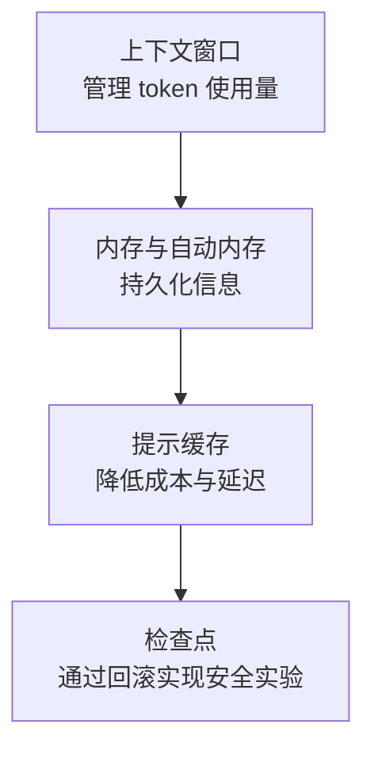

本组讲解 Claude Code 为稳定地持续长时间会话而使用的上下文窗口、内存、提示缓存和检查点。内容面向希望在大规模任务或跨多个会话的开发中减少上下文丢失和成本上升的开发者。


**一句话总结**: 通过管理 token 使用量（上下文窗口）、持久化信息（内存）、降低成本（提示缓存）和安全回滚（检查点）这四条主线，确保长时间任务的稳定性。


## 学习路径

建议按以下顺序阅读：先理解上下文窗口的限制和自动压缩，然后用内存持久化信息，用提示缓存降低重复成本，最后通过检查点搭建一个不必惧怕失败的实验环境。

## 目录

| 文档 | 说明 |
|------|------|
| [上下文窗口](/claude-code/context-memory/context-window) | token、自动压缩、使用量管理 |
| [内存与自动内存](/claude-code/context-memory/memory) | CLAUDE.md 层级与自动内存 |
| [提示缓存](/claude-code/context-memory/prompt-caching) | 通过缓存降低成本与延迟 |
| [检查点](/claude-code/context-memory/checkpointing) | 通过回滚实现安全实验 |

完成本组后，下一组将探讨如何通过工作流和自动化，把这些基础结合到实际的开发流程中。
