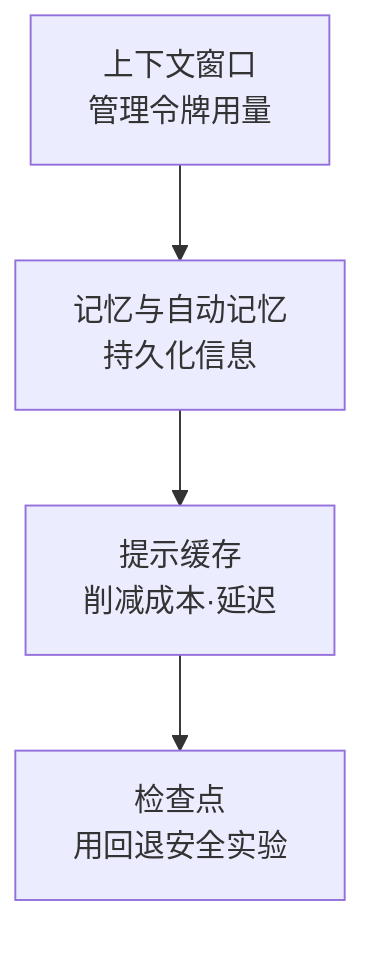

本组讲解 Claude Code 为稳定推进长会话所使用的上下文窗口、记忆、提示缓存与检查点。内容面向希望在大规模任务或跨多个会话的开发中减少上下文丢失与成本上升的开发者。

在智能体开发中，决定成本的不是模型价目表，而是**运用令牌的方式**。往上下文里放什么、放多少，不变的部分是否通过缓存复用，知识是否以文件形式跨会话持久化 —— 这四种机制正是 MoAI-ADK 所说的**代币经济学** (Token Economics) 的技术基础。


**一句话总结**：以管理令牌用量（上下文窗口）、持久化信息（记忆）、削减成本（提示缓存）、安全回退（检查点）四条轴线，同时确保长任务的稳定性与经济性。


## 学习流程

```mermaid
flowchart TD
    A[上下文窗口<br>管理令牌用量] --> B[记忆与自动记忆<br>持久化信息]
    B --> C[提示缓存<br>削减成本·延迟]
    C --> D[检查点<br>用回退安全实验]
```

建议按以下顺序阅读：先理解上下文窗口的上限与自动压缩，再用记忆持久化信息，用提示缓存削减重复成本，最后借助检查点建立不惧失败的实验环境。

## 目录

| 文档 | 说明 |
|------|------|
| [上下文窗口](/claude-code/context-memory/context-window) | 令牌·自动压缩·用量管理 |
| [记忆与自动记忆](/claude-code/context-memory/memory) | CLAUDE.md 层级与自动记忆 |
| [提示缓存](/claude-code/context-memory/prompt-caching) | 用缓存削减成本·延迟 |
| [检查点](/claude-code/context-memory/checkpointing) | 用回退安全实验 |
| [会话管理](/claude-code/context-memory/sessions) | 会话续接·清理与交接 |

完成本组后，请进入下一组[扩展](/claude-code/extensibility)，学习技能·钩子·MCP·插件 —— 搭建挽具的原材料。
