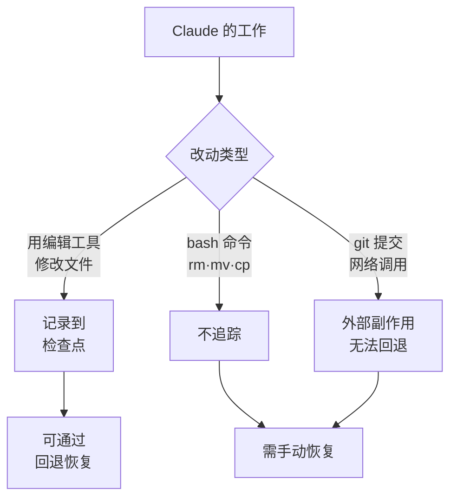

检查点 (checkpointing) 是 Claude Code 在开始编辑前自动为代码状态拍下快照的一种安全网，让你随时都能回到此前的任一节点。


**一句话总结**: 即使工作陷入混乱，连按两次 `Esc` 就能把代码和对话一起回退到此前的状态——这是一张会话级别的"撤销"安全网。


## 检查点概念

检查点会在工作过程中自动捕捉 Claude 编辑文件前一刻的状态。正因如此，即便是针对大型代码库 (large codebase) 的雄心勃勃的工作，也可以在"随时能回到上一状态"这一前提下大胆尝试。

自动追踪 (automatic tracking) 的行为如下。

| 项目 | 行为 |
| --- | --- |
| 生成时机 | 每当用户发送一次提示词时生成一个新的检查点 |
| 追踪对象 | Claude 的文件编辑工具所做的全部改动 |
| 跨会话保留 | 跨会话保存，恢复的对话中同样可以访问 |
| 清理周期 | 随会话在 30 天后自动清理 (可通过设置更改) |

检查点是用于 **会话级别快速恢复** 的机制，并不取代 Git 这类版本控制系统。把检查点理解为"本地撤销"、把 Git 理解为"永久记录"，二者的职责区分就一目了然了。

## 回退 (rewind)

执行 `/rewind` 命令，或在提示词输入框为空的状态下连按两次 `Esc`，即可打开回退菜单。

```text
/rewind
# 或者在输入框为空时
Esc  Esc
```

如果输入框中还残留文本，连按两次 `Esc` 不会打开菜单，而是清空输入内容。不过被清空的文本会保存到输入历史中，因此在完成回退操作后可以用 `Up` 键重新调出。

回退菜单会显示会话期间发送过的提示词列表。选定要回退到的节点后，再从以下动作中选择其一。

| 动作 | 效果 |
| --- | --- |
| 同时恢复代码与对话 | 将代码和对话记录一并回退到所选节点 |
| 仅恢复对话 | 保留当前代码，仅将对话回退到那条消息 |
| 仅恢复代码 | 保留对话，仅回退文件改动 |
| Summarize from here | 将所选消息及其之后的内容压缩为摘要 (腾出上下文窗口) |
| Summarize up to here | 将所选消息之前的内容压缩为摘要 (其后的消息原样保留) |
| Never mind | 不做任何改动，返回消息列表 |

恢复对话或选择 `Summarize from here` 后，所选消息的原始提示词会被复原到输入框，可直接重新发送，也可修改后再发送。

### 恢复与摘要的区别

恢复 (restore) 类操作会 **回退** 状态——撤销代码改动、对话记录，或两者皆撤销。而摘要 (summarize) 类操作不会触碰磁盘上的文件，只把对话的一部分 **压缩** 为 AI 生成的摘要。

- **Summarize from here**: 所选消息之前的内容完整保留，所选消息及其之后的内容被替换为摘要。适合在想丢弃旁枝末节的讨论、同时详细保留前期上下文时使用。
- **Summarize up to here**: 所选消息之前的内容被替换为摘要，所选消息及其之后的内容原样保留。适合在想压缩前期的搭建讨论、同时详细保留近期工作时使用。

两种情况下原始消息都会保存在会话记录 (transcript) 中，必要时 Claude 可以重新参考细节内容。它与 `/compact` 类似，区别在于它不是压缩全部，而是能以所选消息为基准、选择压缩哪一侧。

## 哪些会被恢复，哪些不会

回退仅追踪 **会话内由 Claude 的文件编辑工具所做的改动**。该边界之外的改动不会被恢复。

| 分类 | 是否追踪 | 说明 |
| --- | --- | --- |
| Claude 直接编辑文件 | 追踪 | 由编辑工具所做的改动属于回退对象 |
| bash 命令造成的文件改动 | 不追踪 | 通过 `rm`、`mv`、`cp` 等改动的文件无法回退 |
| 会话外的手动编辑 | 不追踪 | 其他编辑器或并发运行会话的改动不会被捕捉 |
| git 提交·推送 | 不追踪 | 已经创建的提交·推送无法通过回退撤销 |
| 网络调用·外部副作用 | 不追踪 | API 请求、邮件发送等发生在外部的行为无法回退 |



关键在于，回退是 **本地文件状态的回退**。已经反映到外部系统的副作用 (side effect) 不在检查点的职责范围内，因此这类操作需要另行留意。

## 如何用于安全实验

检查点在以下场景中尤其有用。

- **探索替代方案**: 不丢失起点的前提下，自由尝试不同的实现方式。
- **从失误中恢复**: 快速回退引入了 bug 或破坏了功能的改动。
- **迭代功能**: 在"可以回到正常工作状态"的前提下试验各种变形。
- **腾出上下文空间**: 把冗长的调试会话从中间节点起做摘要，在完整保留最初指示的同时清空上下文窗口。

对于实验性重构这类结果不确定的工作，先发送一次提示词建好检查点，再放心推进；如果不满意，就用 `Esc Esc` 把代码和对话一起回退——这样的流程更高效。

从 MoAI-ADK 的视角看，可以把它用作会话内安全网：当 SPEC 单位的工作中代码出现大幅动荡时，快速回到此前的状态。不过永久历史始终应以 Git 提交的形式保留，这是基本原则。

## 限制与注意事项

- **bash 命令的改动不被追踪**: 通过 shell 命令(而非编辑工具)改动的文件无法回退。破坏性的 shell 命令必须谨慎对待。
- **外部·并发改动不被追踪**: 其他会话或外部编辑器的改动，除非恰好动到了同一个文件，否则不会被捕捉。
- **不能取代版本控制**: 检查点用于会话级别的恢复。永久记录与协作必须交由 Git 这类版本控制系统延续。
- **保留期限**: 检查点会随会话在 30 天后自动清理 (可通过设置调整)。
- **摘要与分叉 (fork) 的区别**: 摘要在同一会话内压缩上下文。如果想原样保留原会话、同时尝试其他思路，用 `claude --continue --fork-session` 分叉出一个会话更合适。

## 相关文档

- [上下文窗口](/claude-code/context-memory/context-window)
- [交互模式](/claude-code/foundations/interactive-mode)

## 参考资料

- [Checkpointing — Claude Code Docs](https://code.claude.com/docs/en/checkpointing)


在开始破坏性重构之前，用一次短小的提示词有意建好一个检查点，这样即使实验失败，也能通过一次 `Esc Esc` 干净利落地回到此前的状态。

