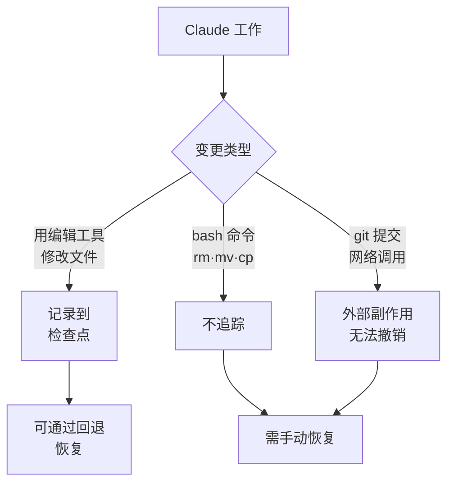

检查点 (checkpointing) 是在 Claude Code 开始编辑之前自动为代码状态拍下快照、让您随时可以回到之前节点的安全网。


**一句话总结**：即使工作搞砸了，按两次 `Esc` 就能把代码与对话一同回退到之前状态 —— 一张会话级的"撤销"安全网。


## 检查点概念

检查点在工作中自动捕捉 Claude 编辑文件之前的状态。因此，即便是针对大型代码库 (large codebase) 的大胆尝试，也可以在"随时能回到上一状态"的前提下放手去做。

自动追踪 (automatic tracking) 的行为如下。

| 项目 | 行为 |
| --- | --- |
| 创建时机 | 用户每发送一条提示词就创建新检查点 |
| 追踪对象 | Claude 的文件编辑工具产生的所有变更 |
| 跨会话保留 | 跨会话保存，在续接的对话中也能访问 |
| 清理周期 | 与会话一起在 30 天后自动清理（可配置更改） |

检查点是为**会话级快速恢复**而设的装置，不能替代 Git 这样的版本管理系统。把检查点当作"本地撤销"、Git 当作"永久记录"，角色划分就很清晰。

## 回退 (rewind)

执行 `/rewind` 命令，或在提示词输入框为空时按两次 `Esc`，即可打开回退菜单。

```text
/rewind
# 或在输入框为空时
Esc  Esc
```

若输入框中留有文本，按两次 `Esc` 会清空输入内容而非打开菜单。不过被清掉的文本会保存到输入历史，完成回退操作后可以按 `Up` 键重新调出。

回退菜单显示会话期间发送的提示词列表。选定回退节点后，选择以下操作之一。

| 操作 | 效果 |
| --- | --- |
| 同时恢复代码与对话 | 把代码与对话记录一起回退到选定节点 |
| 仅恢复对话 | 保留当前代码，只把对话回退到那条消息 |
| 仅恢复代码 | 保留对话，只回退文件变更 |
| Summarize from here | 把选定消息起及其之后压缩为摘要（腾出上下文窗口） |
| Summarize up to here | 把选定消息之前压缩为摘要（之后的消息原样保留） |
| Never mind | 不做任何变更，返回消息列表 |

恢复对话或选择 `Summarize from here` 后，选定消息的原始提示词会恢复到输入框，可以原样重发或修改后发送。

### 恢复与摘要的区别

恢复 (restore) 系列会把状态**回退** —— 取消代码变更、对话记录或两者。而摘要 (summarize) 系列不触碰磁盘上的文件，只把对话的一部分**压缩**为 AI 生成的摘要。

- **Summarize from here**：选定消息之前完整保留，选定消息及其之后被替换为摘要。适合丢弃旁支讨论、但想详细保留早期脉络时使用。
- **Summarize up to here**：选定消息之前被替换为摘要，选定消息及之后原样保留。适合压缩早期铺垫讨论、但想详细保留近期工作时使用。

两种情况原始消息都保存在会话转录中，需要时 Claude 仍能再次参考细节。它与 `/compact` 类似，不同点在于不是整体压缩，而是以选定消息为基准选择压缩哪一侧。

## 什么会被恢复、什么不会

回退只追踪**会话内 Claude 的文件编辑工具产生的变更**。这条边界之外的变更不会被恢复。

| 区分 | 是否追踪 | 说明 |
| --- | --- | --- |
| Claude 的直接文件编辑 | 追踪 | 用编辑工具做出的变更属回退对象 |
| bash 命令的文件变更 | 不追踪 | 被 `rm`、`mv`、`cp` 等改动的文件无法回退 |
| 会话外的手动编辑 | 不追踪 | 其他编辑器或并发会话的变更不会被捕捉 |
| git 提交·推送 | 不追踪 | 已创建的提交·推送不会被回退取消 |
| 网络调用·外部副作用 | 不追踪 | API 请求、发送邮件等发生在外部的事无法撤销 |


```mermaid
flowchart TD
    A[Claude 工作] --> B{变更类型}
    B -->|用编辑工具<br>修改文件| C[记录到<br>检查点]
    B -->|bash 命令<br>rm·mv·cp| D[不追踪]
    B -->|git 提交<br>网络调用| E[外部副作用<br>无法撤销]
    C --> F[可通过回退<br>恢复]
    D --> G[需手动恢复]
    E --> G
```

核心在于回退是**本地文件状态的撤销**。已经反映到外部系统的副作用 (side effect) 不在检查点的责任范围内，这类操作需要另行留意。

## 如何用于安全实验

检查点在以下情形尤其有用。

- **探索备选方案**：在不丢失起点的前提下自由尝试不同实现方式。
- **失误恢复**：快速回退制造 Bug 或搞坏功能的变更。
- **功能迭代**：在"随时能回到可运行状态"的前提下实验各种变体。
- **腾出上下文空间**：把冗长的调试会话从中间节点开始摘要，在保留初始指令完整的同时清空上下文窗口。

对于实验性重构这类结果不确定的工作，高效的做法是：先发送一条提示词生成检查点，然后放心推进；不满意时按 `Esc Esc` 把代码与对话一起回退。

从 MoAI-ADK 的视角看，检查点是让智能体循环得以大胆运转的条件。循环要自主重复"行动 → 验证 → 校正"，就必须能廉价地回退失败的尝试，而检查点把这个回退成本降到几乎为零。可以把它当作 SPEC 级工作中代码大幅波动时快速回到上一状态的会话内安全网，但永久历史始终以 Git 提交留存 —— 这是原则。

## 局限与注意事项

- **不追踪 bash 命令变更**：由 shell 命令而非编辑工具改动的文件无法回退。破坏性 shell 命令须谨慎对待。
- **不追踪外部·并发变更**：其他会话或外部编辑器的变更，除非恰好触碰了同一文件，否则不会被捕捉。
- **不能替代版本管理**：检查点用于会话级恢复。永久记录与协作必须交给 Git 这样的版本管理系统。
- **保存期限**：检查点与会话一起在 30 天后自动清理（可通过配置调整）。
- **摘要与分叉 (fork) 的区别**：摘要在同一会话内压缩上下文。想保留原会话不动、尝试另一种方案时，用 `claude --continue --fork-session` 分叉会话更合适。

## 相关文档

- [上下文窗口](/claude-code/context-memory/context-window)
- [交互模式](/claude-code/foundations/interactive-mode)

## 参考资料

- [Checkpointing — Claude Code Docs](https://code.claude.com/docs/en/checkpointing)


在开始破坏性重构之前，用一条简短提示词有意创建一个检查点 —— 即使实验失败，一次 `Esc Esc` 就能干净利落地回到上一状态。

