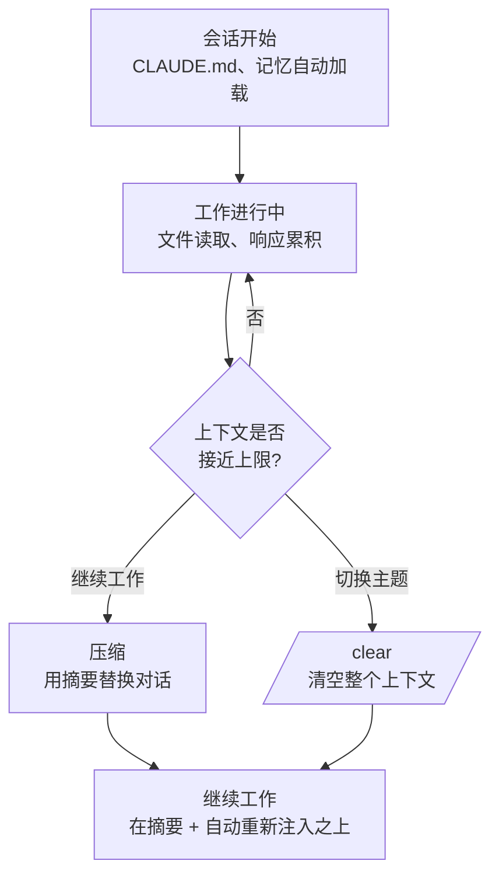

本文整理 Claude Code 在单次会话期间所记住的一切内容所在的空间——上下文窗口 (context window)，以及高效管理它的方法。


**一句话总结**: 上下文窗口是 Claude 的 **工作台**，在工作台被占满之前用自动压缩 (compaction) 和 `/clear` 腾出空间，长任务才能一直顺畅地进行到底。


## 上下文窗口与 token

上下文窗口是 Claude 在单次会话中能同时「看到」的信息总量。其中不仅包含用户输入的提示词，还包含所有不在终端中显示的内容。

| 进入上下文的内容 | 终端是否可见 | 备注 |
|------------------------|-------------------|------|
| 系统提示词 | 不可见 | 行为规则。始终最先加载 |
| CLAUDE.md (全局 + 项目) | 不可见 | 项目规则与构建命令 |
| 自动记忆 (`MEMORY.md`) | 不可见 | 上次会话中留下的笔记 |
| 技能说明 (1 行) + MCP 工具名称 | 不可见 | 实际正文仅在使用时加载 |
| 用户提示词 | 可见 | 实际输入的请求 |
| Claude 读取的文件 | 仅一行摘要 | 文件正文只有 Claude 能看到 |
| Claude 的分析、修改与响应 | 可见 | 直接输出到终端 |

token 是统计这些信息的单位。大致来说，一个英文单词约为 1～2 个 token，而韩语每个字占用更多 token。一个反直觉的事实是，**在会话开始之前就已经填入了相当多的内容**。这是因为 CLAUDE.md、记忆、技能列表和 MCP 工具名称会在第一条提示词之前就被加载。

### 读取文件消耗的上下文最多

Claude 在工作时读取的文件主导着上下文用量。因此，把提示词写得具体（「修复 `auth.ts` 里的 bug」）以减少 Claude 读取的文件数量，是节省 token 的关键。对于像调研这样需要翻阅大量文件的工作，委派给子代理 (subagent) 后，大文件的读取会在单独的上下文窗口中处理，只有结果摘要会返回到本会话。

## 各模型的大小

上下文窗口的大小因模型而异。确切数值取决于所使用的模型，因此下表请按一般情况来理解。

| 大小 (一般情况) | 含义 |
|---------------|------|
| 约 200K token | 众多模型的标准窗口。对于一般的代码工作已经足够 |
| 约 1M token | 部分模型提供的扩展窗口。对大型代码库 (large codebase) 有利 |

窗口越大，一次能容纳的文件和对话越多，但窗口并非无限。无论使用哪个模型，最终接近上限时都需要管理。核心原则是：**与其增大窗口大小，不如把放入的内容保持得少**，这样更稳定。

## 自动压缩与 /clear

会话越长，上下文越接近上限。Claude Code 用两种方式来应对。

### 压缩 (compaction)

压缩通过 **将累积的对话记录替换为单个结构化摘要** 来腾出空间。你可以自己执行 `/compact`，当上下文接近上限时它也会自动发生。摘要会保留以下内容。

- 用户的请求与意图
- 核心技术概念
- 查看或修改过的文件以及重要的代码片段
- 出现的错误及其解决方法
- 剩余工作与当前进度

作为代价，完整的工具输出和中间推理过程会丢失。Claude 可以引用它做过的工作，但不再原样保留之前读取过的代码原文。

压缩后每项信息会发生什么，取决于它的加载方式。

| 机制 | 压缩后的状态 |
|----------|--------------|
| 系统提示词、输出样式 | 原样保留 (不属于消息记录) |
| 项目根目录的 CLAUDE.md、无范围规则 | 从磁盘重新注入 |
| 自动记忆 | 从磁盘重新注入 |
| 带 `paths:` frontmatter 的规则 | 直到再次读取该文件之前都会消失 |
| 子目录中嵌套的 CLAUDE.md | 直到再次读取该目录文件之前都会消失 |
| 调用过的技能正文 | 重新注入 (每个技能 5,000 token，总计上限 25,000 token，从最旧的开始移除) |
| hook | 不适用 (hook 以代码方式执行，不会留在上下文中) |

如果希望某条规则在压缩后仍然存活，请去掉它的 `paths:` frontmatter，或将其移至项目根目录的 CLAUDE.md。技能在被截断时会保留前半部分，因此把重要指令放在 `SKILL.md` 靠上的位置最为稳妥。

### /clear — 完全重置

`/clear` 与压缩不同。它连摘要都不留，将整个对话上下文整体清空，像 **新会话一样** 开始。当你切换到与上一个任务无关的新任务时，这种方式最为干净。可以这样记忆：摘要 (压缩) 用于「要在同一件事上继续工作时」，重置 (`/clear`) 用于「切换主题时」。

## 用量监控

如果不知道当前上下文占了多少，就无法管理。Claude Code 提供了实测工具。

| 命令 / 位置 | 显示的内容 |
|-------------|-------------|
| `/context` | 按类别显示实时上下文使用情况与优化建议 |
| `/cost` | 当前会话的 token 用量与费用 |
| `/memory` | 启动时加载的 CLAUDE.md 与自动记忆文件列表 |
| 状态栏 (status line) | 在会话进行期间始终显示用量 |

养成在进入长任务之前或途中执行一次 `/context`、确认哪些项目占用了上下文的习惯，会带来很大的差别。

## 长任务的管理策略

任务规模越大，上下文就越是首要制约。组合以下策略，就能让单个任务稳定地跨越多个压缩边界持续进行。

- **摘要后继续**: 完成一个阶段后用压缩整理，后续阶段在摘要之上进行。
- **拆分给子代理**: 把需要读取大量文件的探索、调研交给子代理，以保护本会话的上下文。
- **在记忆中留下检查点**: 将重要决策与进度记录到记忆中，使其跨越压缩或 `/clear` 仍然存活。这与检查点机制 (checkpointing) 一起支撑长会话的连续性。
- **CLAUDE.md 瘦身**: 将项目 CLAUDE.md 保持在 200 行以下，把参考性内容移至技能或路径范围规则，使其仅在需要时加载。
- **让提示词更具体**: 收窄要读取的文件范围，减少不必要的文件读取。

其中记忆与检查点直接与 MoAI-ADK 的 SPEC 工作流以及会话交接相互衔接，因此详细的运行方式在下方相关文档中介绍。在这里，只需记住一条最佳实践 (best practices)：「在上下文被占满之前提前腾空，并把重要状态留在磁盘上。」

## 相关文档

- [记忆与自动记忆](/claude-code/context-memory/memory)
- [检查点](/claude-code/context-memory/checkpointing)

## 参考资料

- [Claude Code Docs — Context window](https://code.claude.com/docs/en/context-window)


在开始新任务之前，先执行一次 `/clear`。如果带着上一个任务累积的文件读取与对话直接进入新任务，无关的 token 会占据工作台，导致响应质量和费用都变差。

