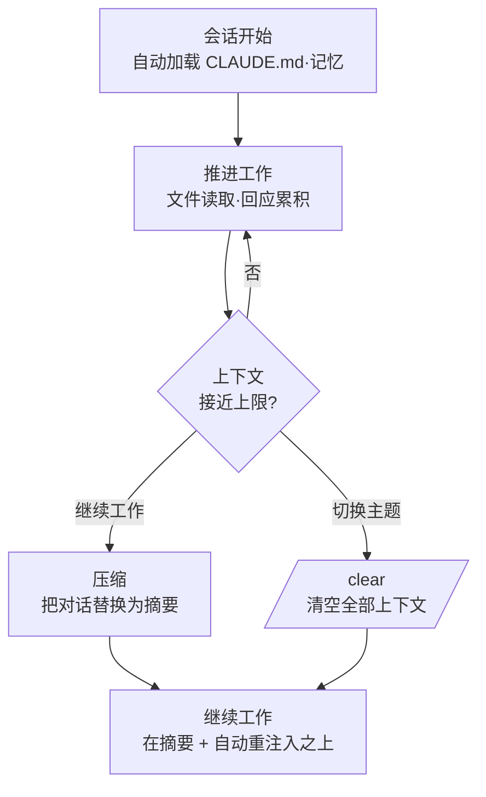

# 上下文窗口

本文整理承载 Claude Code 单个会话中所记忆一切的空间 —— 上下文窗口 (context window)，以及高效管理它的方法。


**一句话总结**：上下文窗口是 Claude 的**工作书桌**，也是产生令牌成本的账本。在书桌被填满之前用自动压缩 (compaction) 和 `/clear` 腾出空间，长任务才能在质量与成本两方面顺畅走到最后。



把上下文窗口想象成**书桌的大小**。你把要处理的文件（文件·对话）摊在桌上工作，但书桌并非无限大。桌子满了，把旧文件**摘要后收进抽屉**就是压缩 (compaction)，把整张桌子清空重新开始就是 `/clear`。桌子再宽，塞满杂物也会挤掉此刻要看的文件，所以与其扩大尺寸，**减少摊在桌上的量**才是关键。


## 上下文窗口与令牌

上下文窗口是 Claude 在一个会话中能同时"看见"的信息总量。其中不仅包含用户输入的提示词，还包括终端上不显示的所有内容。

| 进入上下文的内容 | 终端上可见吗 | 备注 |
|------------------------|-------------------|------|
| 系统提示 | 不可见 | 行为规则。总是最先加载 |
| 自动记忆 (`MEMORY.md`) | 不可见 | 上个会话留下的笔记。仅加载前 200 行或 25KB |
| 环境信息 | 不可见 | 操作系统、shell、工作区路径等 |
| MCP 工具名称（延迟加载） | 不可见 | MCP 工具定义仅在需要时加载，节省上下文 |
| CLAUDE.md（全局 + 项目） | 不可见 | 项目规则与构建命令 |
| 技能描述（1 行） | 不可见 | 正文仅在使用时才加载 |
| 用户提示词 | 可见 | 实际输入的请求 |
| Claude 读取的文件 | 仅一行摘要 | 文件正文只有 Claude 看到 |
| Claude 的分析·修改·回应 | 可见 | 原样输出到终端 |

令牌 (token) 是度量这些信息的单位。大致上一个英文单词占 1~2 个令牌，中文等语言每个字符占用更多令牌。一个反直觉的事实是：**会话还没开始，窗口就已经被填进了相当的量** —— 因为 CLAUDE.md、记忆、技能列表、MCP 工具名称比第一条提示词更早加载。

### 文件读取最消耗上下文

Claude 工作中读取的文件主导着上下文用量。因此把提示词写具体（"修复 `auth.ts` 里的 Bug"）以减少 Claude 读取的文件数，是节省令牌的关键。像调研这类需要翻查大量文件的任务，委派给子智能体 (subagent) 后，大文件读取会在独立的上下文窗口中处理，只有结果摘要返回本会话。

## 各模型的窗口大小

上下文窗口的大小因模型而异。准确数值取决于所用模型，以下按一般规律理解即可。

| 大小（一般而言） | 含义 |
|---------------|------|
| 约 200K 令牌 | 多数模型的标准窗口。足以应付一般代码工作 |
| 约 1M 令牌 | 部分模型提供的扩展窗口。对大型代码库 (large codebase) 有利 |

窗口越大，一次能装下的文件与对话越多，但窗口并非无限。无论用哪个模型，接近上限时都需要管理。核心原则是：**与其扩大窗口，不如让装进去的内容保持精简** —— 后者更稳定。

## 自动压缩与 /clear

会话变长时上下文会逼近上限。Claude Code 用两种方式应对。

### 压缩 (compaction)

压缩把累积的对话记录**替换为一份结构化摘要**以腾出空间。既可以手动执行 `/compact`，当上下文接近上限时也会自动发生。摘要保留以下内容。

- 用户的请求与意图
- 核心技术概念
- 查看或修改过的文件与重要代码片段
- 发生的错误及解决方法
- 剩余工作与当前进度

作为代价，完整的工具输出与中间推理过程会消失。Claude 仍能引用工作内容，但不再原样保留之前读过的代码原文。

压缩之后各类信息的去向取决于其加载方式。

| 机制 | 压缩后状态 |
|----------|--------------|
| 系统提示、输出样式 | 原样保留（不属于消息记录） |
| 项目根 CLAUDE.md、无范围限定的规则 | 从磁盘重新注入 |
| 自动记忆 | 从磁盘重新注入 |
| 带 `paths:` frontmatter 的规则 | 在再次读取对应文件之前消失 |
| 子目录中嵌套的 CLAUDE.md | 在再次读取该目录文件之前消失 |
| 已调用的技能正文 | 重新注入（每技能 5,000 令牌、总计 25,000 令牌上限，从最旧的开始移除） |
| hook | 不适用（hook 以代码执行，不留在上下文中） |

希望某条规则在压缩中存活，就去掉 `paths:` frontmatter 或把它移到项目根 CLAUDE.md。技能被截断时保留开头部分，因此重要指令放在 `SKILL.md` 上方更安全。

### 控制自动压缩时机

若需调整自动压缩的时机，可用环境变量 `CLAUDE_AUTOCOMPACT_PCT_OVERRIDE` 更改阈值（默认值：约占全部上下文的 75~80%）。例如想更早留出余量地压缩，就设一个更低的值。

```bash
export CLAUDE_AUTOCOMPACT_PCT_OVERRIDE=70  # 到 70% 就开始压缩
```

### /clear —— 完全重置

`/clear` 与压缩不同。它连摘要都不留，把对话上下文整个清空，**像新会话一样**开始。切换到与上一项工作无关的新任务时最干净。记住：摘要（压缩）用于"继续接着干"，重置（`/clear`）用于"换主题"。


```mermaid
flowchart TD
    A[会话开始<br>自动加载 CLAUDE.md·记忆] --> B[推进工作<br>文件读取·回应累积]
    B --> C{上下文<br>接近上限?}
    C -->|否| B
    C -->|继续工作| D[压缩<br>把对话替换为摘要]
    C -->|切换主题| E[/clear<br>清空全部上下文/]
    D --> F[继续工作<br>在摘要 + 自动重注入之上]
    E --> F
```

## 用量监控

不知道当前上下文用了多少，就无从管理。Claude Code 提供实测工具。

| 命令 / 位置 | 显示的内容 |
|-------------|-------------|
| `/context` | 按类别的实时上下文使用明细与优化建议 |
| `/cost` | 当前会话的令牌用量与费用 |
| `/memory` | 启动时加载的 CLAUDE.md 与自动记忆文件列表 |
| 状态栏 (status line) | 会话进行中持续显示用量 |

在进入长任务之前或途中执行一次 `/context`，确认哪些条目占据了上下文 —— 这个习惯会带来巨大差异。

## 长任务中的管理策略

任务规模越大，上下文越是首要约束。组合以下策略，可以让一项工作跨越多个压缩边界稳定延续。

- **摘要后继续**：完成一个阶段就用压缩整理，后续阶段在摘要之上推进。
- **用子智能体拆分**：需要大量读取文件的探索·调研交给子智能体，保护本会话的上下文。
- **在记忆中留检查点**：重要决定与进度记入记忆，使其跨越压缩或 `/clear` 存活。这与检查点 (checkpointing) 一起支撑长会话的连续性。
- **给 CLAUDE.md 瘦身**：项目 CLAUDE.md 保持在 200 行以内，参考性内容移到技能或路径范围规则，让它们只在需要时加载。
- **提示词写具体**：收窄要读的文件，减少不必要的文件读取。

其中记忆与检查点直接衔接 MoAI-ADK 的 SPEC 工作流与会话交接。MoAI-ADK 把本页的原理扩展为名为**上下文瘦身** (context diet) 的运营纪律 —— 把常驻加载的指引降到最少，在模型特定阈值（1M 上下文模型为用量 50%，200K 模型为 90%）处把进度状态存盘，然后提供只需粘贴一次即可续接下个会话的会话交接，并在 statusline 上常驻显示上下文使用率 (CW%)，提前预警临界值。在这里只需记住"在上下文填满之前提前腾空，重要状态留在磁盘上"这条最佳实践 (best practices) 即可。

## 相关文档

- [记忆与自动记忆](/claude-code/context-memory/memory)
- [检查点](/claude-code/context-memory/checkpointing)

## 参考资料

- [Claude Code Docs — Context window](https://code.claude.com/docs/en/context-window)


在开始新任务之前执行一次 `/clear`。带着上一项工作累积的文件读取与对话进入新任务，无关的令牌会占据书桌，回应质量与成本都会变差。

