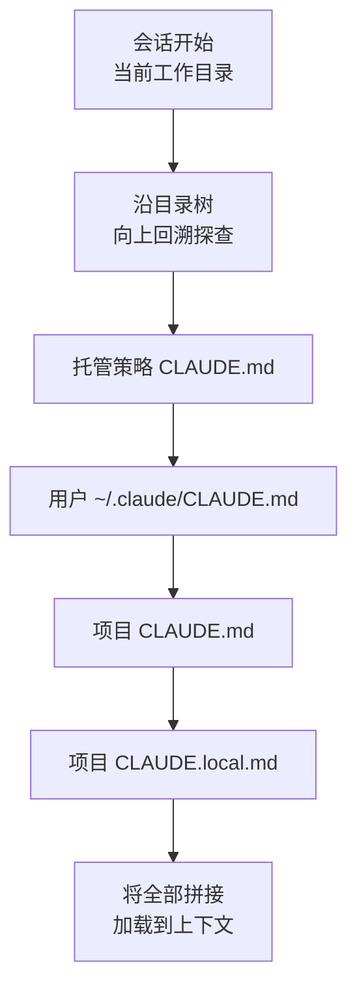
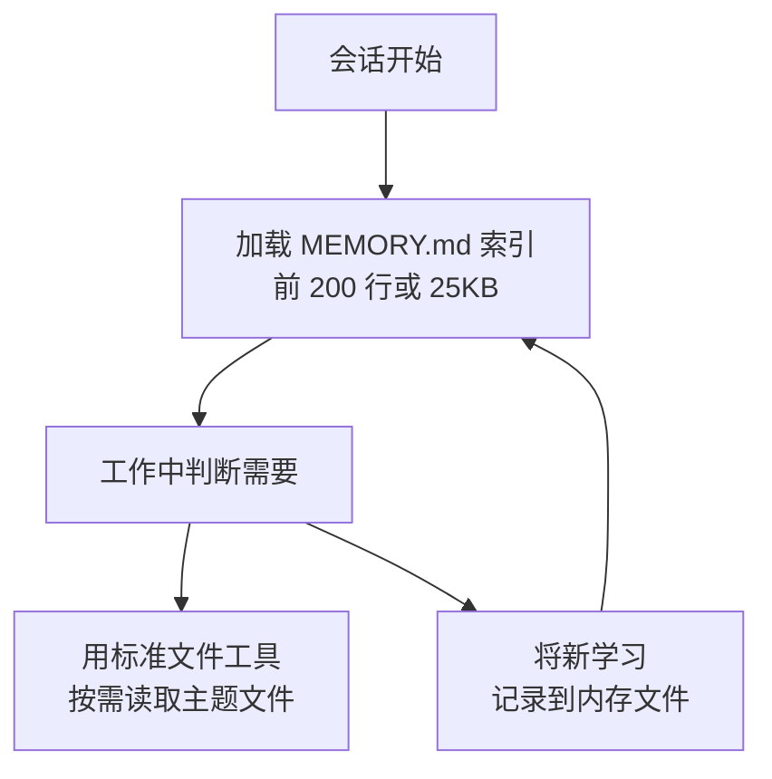

本文介绍两种内存机制，帮助 Claude Code 在每个会话都以全新的上下文窗口 (context window) 启动的同时，不会丢失项目知识。


**一句话总结**：CLAUDE.md 是由人写下的永久指令，自动内存则是 Claude 在工作中自行记录、积累的学习笔记，两者都会在每个会话开始时作为上下文加载。


## 两种内存机制

Claude Code 的每个会话都以空的上下文窗口开始。跨会话传递知识有两种方式。两者互为补充，并在每次对话开始时一同加载。

| 区分 | CLAUDE.md 文件 | 自动内存 (auto memory) |
| :--- | :--- | :--- |
| **编写主体** | 人（直接编写） | Claude（自行编写） |
| **承载内容** | 指令与规则 | 学习与模式 |
| **范围** | 项目 / 用户 / 组织 | 以仓库为单位，跨工作树共享 |
| **加载时机** | 每个会话（全部） | 每个会话（前 200 行或 25KB） |
| **用途** | 编码标准、工作流、架构 | 构建命令、调试洞见、发现的偏好 |

两种内存都是 **上下文，而非强制配置** (context, not enforced configuration)。也就是说，Claude 会读取并尝试遵循它们，但并不无条件保证遵守。若要必定阻止某个特定行为，应使用 `PreToolUse` hook，而不是内存。

## 基于 CLAUDE.md 的内存

CLAUDE.md 是一个 Markdown 文件，承载面向项目、个人工作流以及整个组织的永久指令。由人以纯文本编写，Claude 会在每个会话开始时读取。

### 何时应添加到 CLAUDE.md

它是记录那些你每次都要重新解释的事实的地方。出现以下信号时就应添加。

- 当 Claude 第二次重复同样的错误时
- 当代码评审指出 Claude 本应知道的代码库事项时
- 当你又在输入上一个会话已经输入过的更正时
- 当这是一段需要向新团队成员做同样解释的上下文时

聚焦于需要在每个会话都保持的事实——构建命令、约定、项目布局，以及诸如「总是做 X」这样的规则。如果某件事是多步骤流程，或只适用于代码库的一部分，更适合移到技能或路径限定规则中。

### 内存层级

CLAUDE.md 可放置在多个位置，每个位置的范围不同。下表按加载顺序（从宽范围到窄范围）排列，更具体的指令会更晚进入上下文。

| 范围 | 位置 | 用途 | 共享对象 |
| :--- | :--- | :--- | :--- |
| **托管策略** (managed policy) | macOS：`/Library/Application Support/ClaudeCode/CLAUDE.md`<br>Linux/WSL：`/etc/claude-code/CLAUDE.md`<br>Windows：`C:\Program Files\ClaudeCode\CLAUDE.md` | 组织级指令（由 IT/DevOps 管理） | 组织内全体用户 |
| **用户指令** (user) | `~/.claude/CLAUDE.md` | 适用于所有项目的个人偏好 | 本人（全部项目） |
| **项目指令** (project) | `./CLAUDE.md` 或 `./.claude/CLAUDE.md` | 团队共享的项目指令 | 通过源代码控制与团队成员共享 |
| **本地指令** (local) | `./CLAUDE.local.md` | 个人用的按项目偏好（`.gitignore` 对象） | 本人（当前项目） |

托管策略文件无法用个人设置排除，因此组织指令始终生效。除独立文件外，也可以通过 `managed-settings.json` 的 `claudeMd` 键直接嵌入托管 CLAUDE.md 的内容。

### CLAUDE.md 加载顺序

Claude Code 从当前工作目录沿目录树向上回溯，在每个目录中查找 `CLAUDE.md` 和 `CLAUDE.local.md`。找到的文件不会互相覆盖，而是全部拼接 (concatenate) 后放入上下文。由于顺序是从文件系统根目录向工作目录方向下行，因此越靠近执行位置的指令越晚被读取。



工作目录上层的文件会在启动时全部加载，而子目录中的文件只有在 Claude 读取该目录的文件时才会被纳入。在 monorepo 中拾取到其他团队的文件时，可以用 `claudeMdExcludes` 设置跳过特定文件。

### 用 import 语法包含其他文件

CLAUDE.md 可以用 `@path/to/import` 语法引入其他文件。被 import 的文件会与引用它的 CLAUDE.md 一起在启动时展开，加载到上下文。

```text
See @README for project overview and @package.json for available npm commands.

# Additional Instructions
- git workflow @docs/git-instructions.md
```

- 相对路径和绝对路径都可以使用，相对路径不是相对于工作目录，而是相对于 **包含该 import 的文件** 来解析。
- 被 import 的文件可以再 import 其他文件，最大深度为 **4 hop**。
- 首次遇到外部 import 时会弹出批准对话框。若拒绝，该 import 将保持未启用状态。

若要在多个工作树 (worktree) 间共享个人指令，import 主目录中的文件是一种实用的方式。

```text
# Individual Preferences
- @~/.claude/my-project-instructions.md
```

### 编写有效指令

CLAUDE.md 在每个会话都会加载到上下文窗口，并与对话一同消耗 token。编写方式会直接影响遵守率。

| 原则 | 推荐 | 避免 |
| :--- | :--- | :--- |
| **大小** | 目标为每个文件不超过 200 行 | 越长上下文消耗越大，遵守率越低 |
| **结构** | 用标题和项目符号分组 | 密集的段落 |
| **具体性** | 「使用 2 个空格缩进」 | 「把代码写干净」 |
| **一致性** | 定期清理相互矛盾的规则 | 冲突时由 Claude 任意选择 |

使用 `.claude/rules/` 目录可以将指令按主题拆分为多个文件，并通过 frontmatter 的 `paths` 字段限定到特定文件路径，使其仅在处理匹配文件时才加载。

## 自动内存

自动内存让 Claude 在没有人写任何东西的情况下也能跨会话积累知识。在工作时，它会自行记录构建命令、调试洞见、架构笔记、代码风格偏好、工作流习惯等。它并非每个会话都保存内容，而是判断某项内容是否对未来对话有用，只保留值得记录的部分。

自动内存需要 Claude Code v2.1.59 或更高版本。可用 `claude --version` 查看版本。

### 把什么保存到哪里

每个项目都拥有专属的内存目录。

```text
~/.claude/projects/<project>/memory/
├── MEMORY.md          # 简洁的索引，每个会话加载
├── debugging.md       # 调试模式的详细笔记
├── api-conventions.md # API 设计决策
└── ...                # Claude 创建的其他主题文件
```

`<project>` 路径由 git 仓库推导而来，因此 **同一仓库的所有工作树和子目录共享一个内存目录**（在 git 仓库之外则使用项目根目录）。自动内存是 **机器本地** (machine-local) 的，因此不会与其他机器或云环境共享。

可用 `autoMemoryDirectory` 设置更改存储位置。值必须是绝对路径或以 `~/` 开头。

```json
{
  "autoMemoryDirectory": "~/my-custom-memory-dir"
}
```

### 回忆方式

`MEMORY.md` 充当内存目录的索引。**仅加载前 200 行或 25KB 中先到达的那一处** 在每次对话开始时加载，超出部分在启动时不会加载。因此 Claude 会把详细笔记移到单独的主题文件，让 `MEMORY.md` 保持简洁。



`debugging.md`、`patterns.md` 等主题文件不会在启动时加载，而是在需要相应信息时由 Claude 用标准文件工具直接读取。当你在 Claude Code 界面上看到 "Writing memory" 或 "Recalled memory" 时，说明它正在实际更新或读取内存目录。

这个 200 行/25KB 的上限仅适用于 `MEMORY.md`。CLAUDE.md 文件无论长短都会整体加载（不过越短遵守率越好）。

### 开关与审计

自动内存默认开启。可以打开 `/memory` 来切换，或用 `autoMemoryEnabled` 设置将其关闭，也可以用环境变量 `CLAUDE_CODE_DISABLE_AUTO_MEMORY=1` 来禁用。

```json
{
  "autoMemoryEnabled": false
}
```

`/memory` 命令会列出当前会话中加载的所有 CLAUDE.md、`CLAUDE.local.md` 和规则文件，并提供自动内存的切换开关以及打开内存文件夹的链接。所有自动内存文件都是纯 Markdown，因此随时都可以直接编辑或删除。如果你请求记住诸如 "always use pnpm, not npm" 之类的内容，它会保存到自动内存；如果你说 "add this to CLAUDE.md"，则会添加到 CLAUDE.md。

## 编写内存的最佳实践

好的内存简短且可验证。遵循以下原则可同时提升遵守率与可读性。

- **保持简洁**：将 `MEMORY.md` 保持为索引，把详情分离到主题文件。CLAUDE.md 以每个文件不超过 200 行为目标。
- **一个文件一个事实**：将一个主题集中到一个文件。使用诸如 `testing.md`、`api-design.md` 这样具有描述性的文件名。
- **要具体**：用可验证的句子代替含糊的表述（如「提交前运行 `npm test`」）。
- **清理矛盾**：定期移除相互冲突的指令。若冲突残留，Claude 会任意决定遵循哪一方。
- **需要强制时用 hook**：对于必须在特定时点执行的事情（如每次提交前），应用 hook 而非内存来编写。

## 与 MoAI-ADK 内存系统的关系

MoAI-ADK 运行在上述 Claude Code 内存基础之上。它将项目根目录的 CLAUDE.md 用作编排器的执行指令，并把自动内存的 `MEMORY.md` 索引与主题文件用于 SPEC 工作的会话交接以及教训 (lessons) 的积累。MoAI 特有的内存运营规则与索引管理方式将在另一篇文档中详细讨论。

## 相关文档

- [CLAUDE.md 指南](/advanced/claude-md-guide)

## 参考资料

- [How Claude remembers your project (Claude Code Docs)](https://code.claude.com/docs/en/memory)
- [Auto memory (Claude Code Docs)](https://code.claude.com/docs/en/memory#auto-memory)


如果你想知道现在自动内存里积累了什么，可以在会话中运行 `/memory` 并打开文件夹。它们都是纯 Markdown，可以当场阅读、整理和删除。

