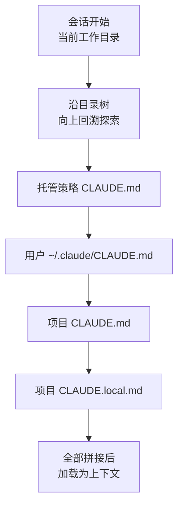
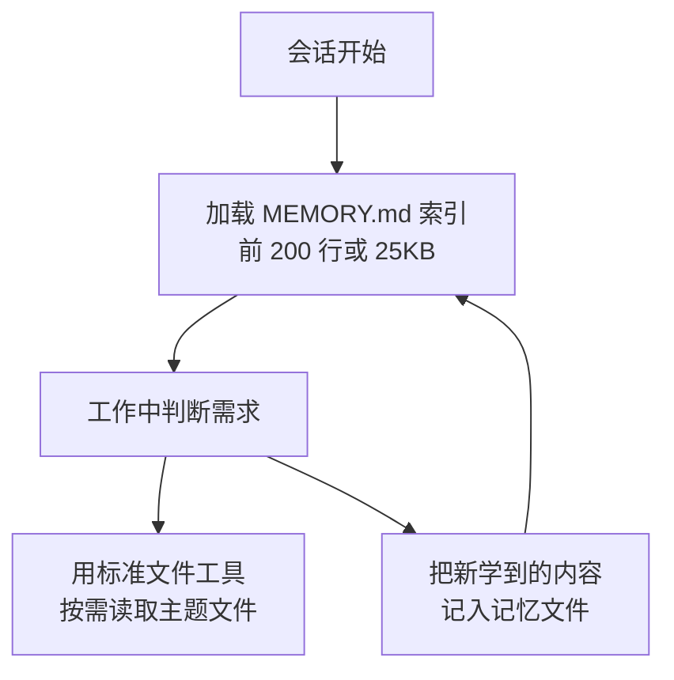

本文考察让 Claude Code 在每个会话都以全新的上下文窗口 (context window) 启动的同时、又不丢失项目知识的两种记忆机制。


**一句话总结**：CLAUDE.md 是人写下的永久指引，自动记忆是 Claude 在工作中自行记录积累的学习笔记，两者都在每次会话开始时加载为上下文。


## 两种记忆机制

Claude Code 的所有会话都从空的上下文窗口开始。跨会话传递知识的方法有两种。它们相互补充，并在每次对话开始时一同加载。

| 区分 | CLAUDE.md 文件 | 自动记忆 (auto memory) |
| :--- | :--- | :--- |
| **书写主体** | 人（亲自撰写） | Claude（自行撰写） |
| **承载内容** | 指引与规则 | 学习与模式 |
| **范围** | 项目 / 用户 / 组织 | 以仓库为单位，工作树共享 |
| **加载时机** | 每次会话（全文） | 每次会话（前 200 行或 25KB） |
| **用途** | 编码标准、工作流、架构 | 构建命令、调试洞见、发现的偏好 |

两种记忆都属于**上下文而非强制配置** (context, not enforced configuration)。也就是说 Claude 会阅读并试图遵循，但不能保证无条件遵守。要绝对阻止某种行为，应使用 `PreToolUse` hook 而非记忆。

## 基于 CLAUDE.md 的记忆

CLAUDE.md 是承载项目、个人工作流、整个组织的永久指引的 Markdown 文件。由人以平文写就，Claude 在每次会话开始时阅读。

### 何时向 CLAUDE.md 添加内容

这里是记录那些每次都得重新说明的事实的地方。出现以下信号时就添加。

- Claude 第二次重复同样的错误时
- 代码评审揪出了 Claude 本应知道的代码库事项时
- 又在输入上个会话已经输入过的纠正时
- 这是需要向新团队成员同样说明的上下文时

聚焦于构建命令、惯例、项目布局、"始终执行 X"这类每个会话都要保持的事实。如果是多步骤流程或仅涉及代码库一部分，移到技能或路径限定规则更合适。

### 记忆层级

CLAUDE.md 可以放在多个位置，每个位置作用范围不同。下表按加载顺序（从宽范围到窄范围）排列，更具体的指引更晚进入上下文。

| 范围 | 位置 | 用途 | 共享对象 |
| :--- | :--- | :--- | :--- |
| **托管策略** (managed policy) | macOS: `/Library/Application Support/ClaudeCode/CLAUDE.md`<br>Linux/WSL: `/etc/claude-code/CLAUDE.md`<br>Windows: `C:\Program Files\ClaudeCode\CLAUDE.md` | 组织级指引（IT/DevOps 管理） | 组织内全部用户 |
| **用户指引** (user) | `~/.claude/CLAUDE.md` | 所有项目共通的个人偏好 | 本人（全部项目） |
| **项目指引** (project) | `./CLAUDE.md` 或 `./.claude/CLAUDE.md` | 团队共享的项目指引 | 通过源码管理与团队成员共享 |
| **本地指引** (local) | `./CLAUDE.local.md` | 个人的项目级偏好（属 `.gitignore` 对象） | 本人（当前项目） |

托管策略文件无法用个人配置排除，组织指引始终生效。也可以不用单独文件，而在 `managed-settings.json` 的 `claudeMd` 键中直接写入托管 CLAUDE.md 的内容。

### CLAUDE.md 的加载顺序

Claude Code 从当前工作目录向上回溯目录树，寻找各目录的 `CLAUDE.md` 与 `CLAUDE.local.md`。找到的文件不会相互覆盖，而是全部拼接 (concatenate) 后放入上下文。顺序是从文件系统根向工作目录方向下行，因此离执行位置越近的指引越晚被读取。


```mermaid
flowchart TD
    A["会话开始<br>当前工作目录"] --> B["沿目录树<br>向上回溯探索"]
    B --> C["托管策略 CLAUDE.md"]
    C --> D["用户 ~/.claude/CLAUDE.md"]
    D --> E["项目 CLAUDE.md"]
    E --> F["项目 CLAUDE.local.md"]
    F --> G["全部拼接后<br>加载为上下文"]
```

工作目录上方各层级的文件在启动时全部加载，但子目录中的文件要等 Claude 读取该目录的文件时才会被纳入。在 monorepo 中误抓到其他团队的文件时，可用 `claudeMdExcludes` 配置跳过特定文件。

### 用 import 语法包含其他文件

CLAUDE.md 可用 `@path/to/import` 语法引入其他文件。被 import 的文件会与引用它的 CLAUDE.md 一起在启动时展开并加载进上下文。

```text
See @README for project overview and @package.json for available npm commands.

# Additional Instructions
- git workflow @docs/git-instructions.md
```

- 相对路径与绝对路径都可以用，相对路径以**包含该 import 的文件**为基准解析，而非工作目录。
- 被 import 的文件可以再 import 其他文件，最大深度为 **4 跳**。
- 首次遇到外部 import 时会弹出批准对话框。拒绝后该 import 保持未激活状态。

要在多个工作树 (worktree) 间共享个人指引，import 主目录下文件的方式很实用。

```text
# Individual Preferences
- @~/.claude/my-project-instructions.md
```

### 撰写有效的指引

CLAUDE.md 在每次会话都加载进上下文窗口，与对话一起消耗令牌。写法直接影响遵守率。

| 原则 | 推荐 | 避免 |
| :--- | :--- | :--- |
| **篇幅** | 目标每文件 200 行以内 | 越长上下文消耗越大、遵守率越低 |
| **结构** | 用标题与项目符号分组 | 密密麻麻的段落 |
| **具体性** | "使用 2 空格缩进" | "把代码写干净" |
| **一致性** | 定期清理相互矛盾的规则 | 冲突时 Claude 会任意选择 |

使用 `.claude/rules/` 目录可以把指引按主题拆分为多个文件，并可用 frontmatter 的 `paths` 字段限定到特定文件路径，仅在处理匹配文件时才加载。

## 自动记忆

自动记忆让 Claude 在人不写任何东西的情况下也能跨会话积累知识。它在工作中自行记录构建命令、调试洞见、架构笔记、代码风格偏好、工作流习惯等。它不会每个会话都存点什么，而是判断对今后对话是否有用，只留下值得记录的内容。

自动记忆需要 Claude Code v2.1.59 以上。可用 `claude --version` 确认版本。

### 存什么、存在哪里

每个项目拥有独立的记忆目录。

```text
~/.claude/projects/<project>/memory/
├── MEMORY.md          # 简洁索引，每次会话加载
├── debugging.md       # 调试模式详细笔记
├── api-conventions.md # API 设计决策
└── ...                # Claude 创建的其他主题文件
```

`<project>` 路径由 git 仓库推导而来，因此**同一仓库的所有工作树与子目录共享同一个记忆目录**（不在 git 仓库中时使用项目根）。自动记忆是**机器本地** (machine-local) 的，不与其他机器或云环境共享。

可用 `autoMemoryDirectory` 配置更改存储位置。值必须是绝对路径或以 `~/` 开头。

```json
{
  "autoMemoryDirectory": "~/my-custom-memory-dir"
}
```

### 回想方式

`MEMORY.md` 扮演记忆目录的索引。它**仅前 200 行或 25KB**（先到者为准）在每次对话开始时加载，超出部分在启动时不加载。因此 Claude 会把详细笔记移到单独的主题文件，保持 `MEMORY.md` 简洁。


```mermaid
flowchart TD
    A["会话开始"] --> B["加载 MEMORY.md 索引<br>前 200 行或 25KB"]
    B --> C["工作中判断需求"]
    C --> D["用标准文件工具<br>按需读取主题文件"]
    C --> E["把新学到的内容<br>记入记忆文件"]
    E --> B
```

`debugging.md`、`patterns.md` 这类主题文件不在启动时加载，而是在需要信息时由 Claude 用标准文件工具直接读取。当 Claude Code 屏幕上出现 "Writing memory" 或 "Recalled memory" 时，说明它正在实际更新或读取记忆目录。

这一 200 行/25KB 上限仅适用于 `MEMORY.md`。CLAUDE.md 文件无论多长都会全文加载（不过越短遵守率越好）。

### 开关与审计

自动记忆默认开启。可打开 `/memory` 进行切换，或用 `autoMemoryEnabled` 配置关闭，也可以通过环境变量 `CLAUDE_CODE_DISABLE_AUTO_MEMORY=1` 禁用。

```json
{
  "autoMemoryEnabled": false
}
```

`/memory` 命令列出当前会话加载的所有 CLAUDE.md、`CLAUDE.local.md`、规则文件，并提供自动记忆开关与打开记忆文件夹的链接。自动记忆文件全是平文 Markdown，随时可以直接编辑或删除。请求"记住 always use pnpm, not npm"会存入自动记忆，说 "add this to CLAUDE.md" 则会添加到 CLAUDE.md。

## 记忆撰写最佳实践

好的记忆短小且可验证。遵循以下原则，遵守率与可读性会一同提升。

- **保持简洁**：`MEMORY.md` 维持为索引，细节拆分到主题文件。CLAUDE.md 以每文件 200 行以内为目标。
- **一个文件一个事实**：一个主题集中在一个文件里。使用 `testing.md`、`api-design.md` 这类描述性文件名。
- **写具体**：用可验证的句子代替含糊表达。（例如"提交前运行 `npm test`"）
- **清理矛盾**：定期删除相互冲突的指引。冲突留存时 Claude 会任意决定遵循哪一边。
- **需要强制就用 hook**：像每次提交前这类必须在特定时点执行的事项，用 hook 而非记忆来实现。

## 与 MoAI-ADK 记忆系统的关系

MoAI-ADK 运行在上述 Claude Code 记忆基础之上。它把项目根的 CLAUDE.md 用作编排器执行指引，并把自动记忆的 `MEMORY.md` 索引与主题文件用于 SPEC 工作的会话交接和教训 (lessons) 积累。

基于文件的持久记忆也是 MoAI-ADK **递归式自我学习**支柱的原料。循环运转中留下的观察 —— 用户纠正、失败模式、路由决策 —— 累积在记忆文件里，挽具再基于这些积累改进技能与智能体指引。"循环积累观察，挽具学习进化指引"这句话的第一环，正是本页的记忆机制。MoAI 特有的记忆运营规则与索引管理方式在单独文档中详述。

## 相关文档

- [CLAUDE.md 指南](/advanced/claude-md-guide)

## 参考资料

- [How Claude remembers your project (Claude Code Docs)](https://code.claude.com/docs/en/memory)
- [Auto memory (Claude Code Docs)](https://code.claude.com/docs/en/memory#auto-memory)


想知道自动记忆里现在积累了什么，就在会话中执行 `/memory` 打开文件夹看看。全是平文 Markdown，可以当场阅读、打磨或删除。

