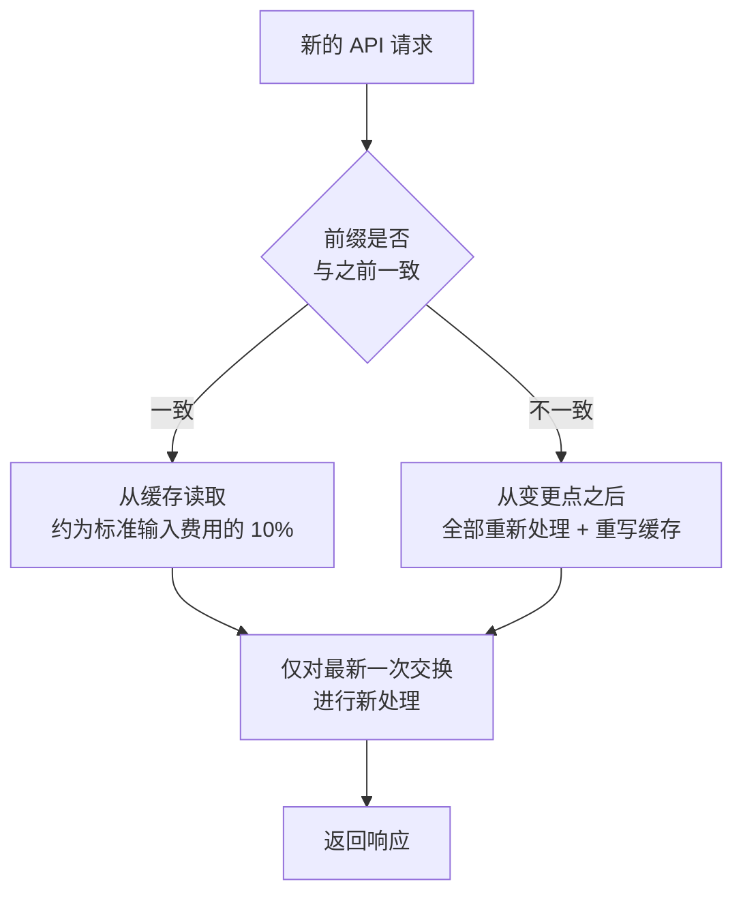

Claude Code 不会在每一轮都重新处理整段对话，而是自动管理提示词缓存 (prompt caching)，复用已经处理过的部分。


**一句话总结**：每次都不变的前面部分（前缀）会直接从缓存中读取，同样的工作不会处理两次，从而大幅降低成本和响应时间。


## 为什么需要提示词缓存

模型在一次请求与下一次请求之间什么都记不住。因此 Claude Code 每次发送消息时都会创建一个新的 API 请求，并重新发送**整个上下文**（系统提示词、项目上下文、所有此前的消息与工具结果，以及新消息）。

关键在于，新内容总是**追加在最末尾**。因此每次请求的大部分内容都与上一次请求相同。提示词缓存正是让这部分"未改变的内容"不必重新处理的机制。

## 缓存如何运作

API 会将每次请求的**开头部分**与最近处理过的内容进行比较。这个开头部分称为**前缀** (prefix)。在常见的一轮中，上一次请求的全部内容都会成为前缀，只有最近交互的那一次交换才是新内容。

匹配采用**精确匹配**方式，因此前缀中任何一处发生变化，其后的内容就会全部重新计算。不存在按文件或按区段的缓存。



### 为缓存设计的三层结构

为了提升前缀匹配效率，Claude Code 会**把几乎不变的内容放在前面**。

| 层级 | 包含内容 | 失效时机 |
|------|----------|----------|
| 系统提示词 | 核心指令、工具定义、输出风格 | MCP 服务器连接/断开、Claude Code 升级 |
| 项目上下文 | `CLAUDE.md`、自动记忆、无作用域规则 | 会话开始，`/clear` 或 `/compact` 之后 |
| 对话 | 用户消息、Claude 响应、工具结果 | 每一轮 |

当只有对话层发生变化时，系统提示词和项目上下文仍保持缓存状态。反之，如果系统提示词发生变化，其后的所有内容都会位于一个不同的前缀之后，因此**整个缓存都会失效**。

还有两项内容虽然不包含在提示词文本中，却是缓存键的一部分。

- **模型**：每个模型的缓存是分开的。用 `/model` 切换模型后，即使内容相同也会全部重新计算。
- **努力级别** (effort level)：即便是同一个模型，每个努力级别的缓存也是各自独立的。用 `/effort` 在会话中途更改会触发整体重新计算，且 Claude Code 会在应用前请求确认。

## 哪些内容会被缓存

被缓存的对象归根结底是**请求前部、不经常变化的大块内容**。

- **系统提示词**：核心指令与输出风格
- **工具定义**：内置工具和 MCP 工具的全部定义
- **项目上下文**：`CLAUDE.md`、自动记忆、规则
- **累积的对话历史**：此前的消息、Claude 响应、工具结果、大型上下文（如读入的大规模代码库文件等）

这些大块内容在一轮中处理一次并写入缓存，此后的各轮只需支付约标准输入费用 10% 的费用，即可原样读取。

## 成本与延迟的削减效果（概念上）

缓存性能通过 API 在每次响应中报告的两个令牌数值体现出来。

| 字段 | 含义 |
|------|------|
| `cache_creation_input_tokens` | 本轮**写入**缓存的令牌，按缓存写入费用计费 |
| `cache_read_input_tokens` | 本轮从缓存**读取**的令牌，按约为标准输入费用 10% 计费 |

- **成本**：读取 (read) 令牌按约为标准输入费用 10% 的水平计费。缓存读取比例越高，处理同样的工作就越便宜。
- **延迟**：由于不会重新处理未改变的前缀，响应会更快。反之，缓存失效的那一轮会一次性变慢、变贵。

**读取与写入 (read-to-creation) 的比例越高**，说明缓存运作得越好。如果写入量每一轮都居高不下，那就是前缀中有内容每次都在变化的信号。

## 会使缓存失效的操作

以下操作会导致下一次请求未命中部分或全部缓存。在出现一次又慢又贵的轮次之后，新的前缀会被重新缓存。

| 操作 | 影响 |
|------|------|
| 切换模型 (`/model`、`opusplan` 切换) | 整体重新计算（每个模型缓存分离） |
| 更改努力级别 (`/effort`) | 整体重新计算，应用前请求确认 |
| MCP 服务器连接/断开 | 系统提示词层失效 |
| 拒绝整个工具（如 `Bash`、`WebFetch` 这类直接用名称的 deny 规则） | 系统提示词层失效 |
| 压缩对话 (`/compact`) | 对话层失效（预期行为） |
| Claude Code 升级 | 系统提示词/工具定义变化 → 整体重建 |

> 像 `Bash(rm *)` 这样的**带作用域**的 deny 规则，以及所有 allow/ask 规则，不会改变 Claude 看到的工具集，因此前缀保持不变。

## 会保留缓存的操作

反之，以下操作只是在对话末尾追加，或根本不触及请求本身，因此缓存仍然有效。

- 编辑仓库中的文件（Claude 再次读取时会追加到对话末尾）
- 在会话中途编辑 `CLAUDE.md`（缓存得以保留，但编辑内容在下一次 `/clear`、`/compact` 或重启之前**不会生效**）
- 更改输出风格（同样在下一次 `/clear` 或重启时生效）
- 更改权限模式（`opusplan` 计划模式除外）
- 调用技能或命令（指令会以用户消息的形式插入）
- 执行 `/recap`、用 `/rewind` 回退

## 在 Claude Code 中的自动运用

提示词缓存**默认开启**，并由 Claude Code 自行管理。无需额外设置即可开启。提升缓存命中率的最佳实践 (best practices) 很简单。

- 模型、努力级别、MCP 服务器要在**会话开始时**确定，作业中途不要更改。
- 在作业与作业之间的自然分界处执行 `/compact`。
- 如果走进了想要放弃的路径，请用 `/rewind` 回到已经缓存的之前某一轮，而不是用 `/compact`。

实际上，缓存的作用域基本是**按单台机器、单个目录**划定的。因为系统提示词包含了工作目录、平台、shell、OS 版本和自动记忆路径。即使是同一个仓库的工作树，由于目录不同，也不会共享彼此的缓存。

### 缓存寿命 (TTL)

缓存的前缀在一段时间内没有活动后会过期。每一次命中缓存的请求都会重置计时器，因此只要持续作业，缓存就会保持温热。

| 认证方式 | 默认 TTL | 调整用环境变量 |
|----------|----------|----------------|
| Claude 订阅 | 1 小时（自动，无额外成本） | 超出额度时自动改为 5 分钟 |
| API 密钥·第三方 | 5 分钟 | 用 `ENABLE_PROMPT_CACHING_1H=1` 切换为 1 小时 |
| （通用强制） | — | 用 `FORCE_PROMPT_CACHING_5M=1` 强制 5 分钟 |

## 监控方法

要查看缓存是否运作良好，请观察上述两个令牌数值（`cache_read_input_tokens`、`cache_creation_input_tokens`）。

- **statusline 脚本**：通过读取 `current_usage` 对象的状态栏脚本，可以在每一轮实时查看。
- **OpenTelemetry 导出器**：当需要全组织范围的可见性时，它会按用户、按会话报告缓存读取/写入令牌。

如果缓存写入令牌每一轮都居高不下，请到"会使缓存失效的操作"表中查找原因。

### 停用缓存

只有在调试特定模型或提供方的行为时，才需要把缓存关掉。平时保持开启即可使用。

```bash
# 对所有模型停用
export DISABLE_PROMPT_CACHING=1

# 仅对特定模型停用
export DISABLE_PROMPT_CACHING_OPUS=1
```

## 在 MoAI-ADK 中更进一步

MoAI-ADK 的设计目标是在基于 SPEC 的工作流中保持稳定的前缀（系统提示词、`CLAUDE.md`、规则），以提升缓存命中率。关于缓存在成本层面究竟何时才划算的**盈亏平衡分析**，将在下面的文档中讨论。

## 相关文档

- [提示词缓存 — 盈亏平衡分析](/cost-optimization/prompt-caching)

## 参考资料

- [How Claude Code uses prompt caching](https://code.claude.com/docs/en/prompt-caching)


实战提示：开始会话时先确定好模型、努力级别和 MCP 服务器，在作业完成前不要更改。中途变更越少，缓存命中率越高，响应也越快。

