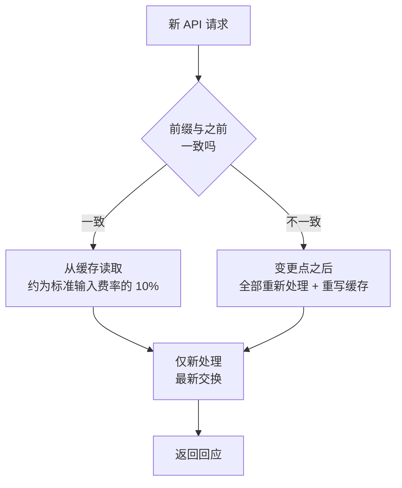

Claude Code 不在每个回合重新处理整个对话，而是自动管理复用已处理部分的提示缓存 (prompt caching)。


**一句话总结**：把每次都不变的前段（前缀）直接从缓存读出，同一份工作不做第二遍，大幅降低成本与响应时间。


## 为什么需要提示缓存

模型在请求与请求之间什么都不记得。因此 Claude Code 每次发送消息都会创建新的 API 请求，重新传输**完整上下文**（系统提示、项目上下文、所有历史消息与工具结果、新消息）。

关键在于新内容总是**追加在最末尾**。因此每个请求的绝大部分与上一个请求相同。提示缓存正是让这"未变的部分"免于重复处理的机制。

## 缓存如何工作

API 会把每个请求的**开头部分**与最近处理过的内容比对。这个开头部分称为**前缀** (prefix)。在一般的回合中，上一个请求的全部内容成为前缀，只有最近一次交换是新内容。

匹配采用**精确一致**方式，前缀中任何位置发生变化，其后的内容全部重新计算。不存在按文件或按区段的缓存。


```mermaid
flowchart TD
    A[新 API 请求] --> B{前缀与之前<br>一致吗}
    B -->|一致| C[从缓存读取<br>约为标准输入费率的 10%]
    B -->|不一致| D[变更点之后<br>全部重新处理 + 重写缓存]
    C --> E[仅新处理<br>最新交换]
    D --> E
    E --> F[返回回应]
```

### 服务于缓存的三层结构

为提高前缀匹配效率，Claude Code 把**几乎不变的内容放在前面**。

| 层 | 包含内容 | 失效时机 |
|------|-----------|-----------------|
| 系统提示 | 核心指令、工具定义、输出样式 | MCP 服务器连接/断开、Claude Code 升级 |
| 项目上下文 | `CLAUDE.md`、自动记忆、无范围限定的规则 | 会话开始、`/clear` 或 `/compact` 之后 |
| 对话 | 用户消息、Claude 回应、工具结果 | 每回合 |

若只有对话层变化，系统提示与项目上下文保持在缓存中。反之，系统提示一变，其后所有内容都排在了不同的前缀之后，因此**整体失效**。

还有两个不包含在提示文本中、却属于缓存键一部分的因素。

- **模型**：每个模型的缓存相互独立。用 `/model` 切换模型后即便内容相同也会整体重算。
- **努力等级** (effort level)：同一模型下不同努力等级的缓存也各自独立。会话中途用 `/effort` 更改会整体重算，Claude Code 会在应用前请求确认。

## 什么会被缓存

被缓存的对象归根结底是**不常变化的、位于请求前部的大块内容**。

- **系统提示**：核心指令与输出样式
- **工具定义**：内置工具与 MCP 工具的完整定义
- **项目上下文**：`CLAUDE.md`、自动记忆、规则
- **累积的对话记录**：历史消息、Claude 回应、工具结果、大块上下文（读入的大型代码库文件等）

这些大块内容在某一回合被处理一次并写入缓存，之后的回合只需支付约为标准输入费率 10% 的费用即可原样读取。

## 成本与延迟的削减效果（概念层面）

缓存性能体现在 API 随每次回应报告的两个令牌数值上。

| 字段 | 含义 |
|------|------|
| `cache_creation_input_tokens` | 本回合**写入**缓存的令牌，按缓存写入费率计费 |
| `cache_read_input_tokens` | 本回合从缓存**读出**的令牌，按约为标准输入费率的 10% 计费 |

- **成本**：读取 (read) 令牌约为标准输入费率的 10%。缓存读取占比越高，同样的工作处理得越便宜。
- **延迟**：未变的前缀无需重新处理，回应因而更快。反之，缓存失效的那一回合会一次性变慢变贵。

**读取相对写入 (read-to-creation) 的比率越高**，说明缓存运转越好。如果写入量每回合都居高不下，就是前缀中有什么在每次变化的信号。

## 使缓存失效的行为

以下行为会让下一个请求错过部分或全部缓存。经历一次又慢又贵的回合后，新前缀会被重新缓存。

| 行为 | 影响 |
|------|------|
| 切换模型（`/model`、`opusplan` 开关） | 整体重算（各模型缓存独立） |
| 更改努力等级（`/effort`） | 整体重算，应用前请求确认 |
| MCP 服务器连接/断开 | 系统提示层失效 |
| 拒绝整个工具（`Bash`、`WebFetch` 这类裸名 deny 规则） | 系统提示层失效 |
| 对话压缩（`/compact`） | 对话层失效（预期行为） |
| 升级 Claude Code | 系统提示/工具定义变更 → 整体重建 |

> `Bash(rm *)` 这类**限定范围**的 deny 规则以及所有 allow/ask 规则不会改变 Claude 看到的工具集合，前缀因此保持不变。

## 保持缓存的行为

相反，以下行为只是追加到对话末尾或根本不触及请求本身，缓存得以存活。

- 编辑仓库中的文件（Claude 重新读取时追加到对话末尾）
- 会话中途编辑 `CLAUDE.md`（缓存保持，但编辑内容在下次 `/clear`·`/compact`·重启之前**不生效**）
- 更改输出样式（同样在下次 `/clear`·重启时生效）
- 更改权限模式（`opusplan` 计划模式除外）
- 调用技能·命令（指令作为用户消息插入）
- 执行 `/recap`、用 `/rewind` 回退

## 在 Claude Code 中的自动运用

提示缓存**默认开启**，由 Claude Code 自动管理，无需任何开启配置。提高缓存命中率的最佳实践 (best practices) 很简单。

- 模型·努力等级·MCP 服务器在**会话开始时**定好，工作中途不更改。
- `/compact` 在任务与任务之间的自然间隙执行。
- 若走进了要放弃的路径，用 `/rewind` 回到已缓存的之前回合，而不是 `/compact`。

缓存实际上以**一台机器·一个目录**为范围。因为系统提示包含工作目录、平台、shell、OS 版本、自动记忆路径。同一仓库的工作树因目录不同也不共享彼此的缓存。

### 缓存寿命 (TTL)

缓存的前缀在一段时间无活动后过期。每次命中缓存的请求都会重置计时器，持续工作期间缓存保持温热。

| 认证方式 | 默认 TTL | 调整用环境变量 |
|-----------|----------|----------------|
| Claude 订阅 | 1 小时（自动，无额外费用） | 超出限额时自动降为 5 分钟 |
| API 密钥·第三方 | 5 分钟 | 用 `ENABLE_PROMPT_CACHING_1H=1` 切换为 1 小时 |
| （通用强制） | — | 用 `FORCE_PROMPT_CACHING_5M=1` 强制 5 分钟 |

## 监控方法

要查看缓存是否运转良好，就观察上述两个令牌数值（`cache_read_input_tokens`、`cache_creation_input_tokens`）。

- **statusline 脚本**：用读取 `current_usage` 对象的状态栏脚本，可每回合实时查看。
- **OpenTelemetry 导出器**：需要组织级可见性时，按用户·会话报告缓存读/写令牌。

如果缓存写入令牌每回合都居高不下，请在"使缓存失效的行为"表中查找原因。

### 禁用缓存

只有在调试特定模型·提供方的行为时才需要临时关闭缓存。平时保持开启使用。

```bash
# 对所有模型禁用
export DISABLE_PROMPT_CACHING=1

# 仅禁用特定模型
export DISABLE_PROMPT_CACHING_OPUS=1
```

## 在 MoAI-ADK 中更进一步 —— 代币经济学中可度量的轴

提示缓存是 MoAI-ADK **代币经济学**支柱中最容易度量的一条轴。MoAI-ADK 从两个方向运用缓存。

- **提高命中率的设计**：在 SPEC 驱动工作流中维持稳定的前缀（系统提示、`CLAUDE.md`、规则），并给常驻加载的上下文瘦身，让缓存得以存活的前段尽可能大而稳定。
- **展示命中率的度量**：在 statusline 上显示缓存命中 (cache hit) 信号，让上下文瘦身的效果在会话中即时可见。在 GLM 后端 (z.ai) 上会自动应用隐式提示缓存。

缓存在成本层面何时真正划算的**盈亏平衡分析**，在下面的文档中讲解。

## 相关文档

- [提示缓存 —— 盈亏平衡分析](/cost-optimization/prompt-caching)

## 参考资料

- [How Claude Code uses prompt caching](https://code.claude.com/docs/en/prompt-caching)


实战提示：会话开始时先敲定模型·努力等级·MCP 服务器，工作结束前不要更改。中途变更越少，缓存命中率越高，回应越快。

