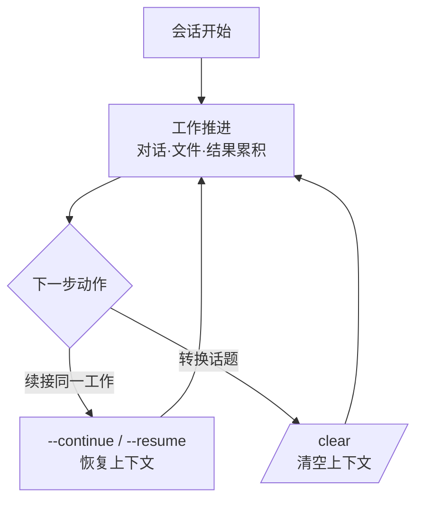

# 会话管理

在 Claude Code 中，一次对话就是一个会话。本页整理如何开始、续接、清理会话，以及会话如何与检查点、交接相互衔接。


**一句话总结**：会话是一个**对话单元**。要接着工作时，重新唤回上一个会话（`--resume` / `--continue`）；话题变了就用 `/clear` 干净地清空。理解会话的流转，就能把长期任务跨越多天而不丢失地延续下去。


## 什么是会话

会话是你与 Claude Code 进行的一次连续对话。其中往来的消息、读过文件的摘要、执行结果都会累积到[上下文窗口](/zh/claude-code/context-memory/context-window)中。关闭会话后记录仍会保留，之后可以重新打开继续。

## 续接与清理

处理会话的核心动作如下。

| 命令 / 标志 | 动作 |
|---------------|------|
| `claude --continue` | 续接最近的会话并开始 |
| `claude --resume` | 从以往会话列表中选择并续接 |
| `/rename` | 给当前会话起一个易识别的名字 |
| `/clear` | 整个清空对话上下文，像新会话一样开始 |

`--continue` 与 `--resume` 用于唤回上一次对话的上下文以延续工作，而 `/clear` 相反，用于丢弃至今的上下文并干净地重新开始。记住：要接着做就用 resume·continue，转向无关的新事务就用 `/clear`。

## 会话与检查点

会话与[检查点](/zh/claude-code/context-memory/checkpointing)处理的是不同层面。

| 概念 | 处理对象 | 回退目标 |
|------|-----------|---------------|
| 会话 | 整段对话的开始·续接·清理 | 对话上下文 |
| 检查点 | 会话内编辑前状态的快照 | 代码 + 对话回到先前时点 |

如果说会话是"打开并续接哪次对话"，那么检查点就是"在这次对话中回退到刚才"。会话内工作出问题时用 `/rewind` 回退到先前检查点的流程，会在检查点文档中详细介绍。

## MoAI-ADK 的会话交接

无论会话延续多久，[上下文窗口](/zh/claude-code/context-memory/context-window)都有上限，总会到必须用 `/clear` 清空的时刻。此时若不想丢失进度，就需要一个跨越会话边界传递状态的机制。

MoAI-ADK 以**会话交接**（session handoff）提供这一能力。当上下文用量逼近各模型的阈值时，编排器会把进度状态保存到磁盘，并生成一条可在下一个会话中直接粘贴续接的粘贴即用续接消息（paste-ready resume message）。`/clear` 之后，仅凭这一条消息，新会话就能自给自足地接续上一段工作。

会话交接的 6 块结构、阈值策略、自动记忆联动等细节在[令牌预算管理](/zh/advanced/token-budget)中介绍。这里只需记住一个原则："会话随时可能被清空，所以重要状态要跨越会话边界写入文件传递"。

## 相关文档

- [上下文窗口](/zh/claude-code/context-memory/context-window)
- [检查点](/zh/claude-code/context-memory/checkpointing)
- [令牌预算管理](/zh/advanced/token-budget)

## 参考资料

- [Claude Code Docs — Sessions](https://code.claude.com/docs/en/sessions)


完成一段长期工作离开时，直接关闭会话即可。之后用 `claude --resume` 从列表中选择续接即可；若要在多个会话之间来回切换，用 `/rename` 起好名字会让重新查找轻松得多。

