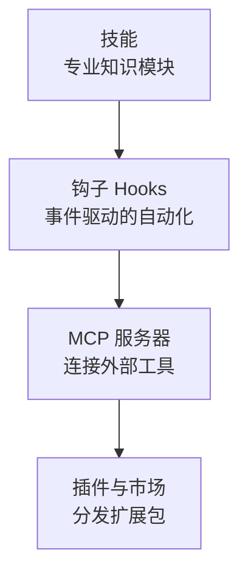

本组介绍了四种超越 Claude Code 内置功能、扩展其行为的方式。我们以概念为中心，说明如何用技能将专业知识模块化、用钩子为事件挂接自动化、用 MCP 连接外部工具，以及用插件将这一切打包为单一包进行分发。本组面向希望让 Claude Code 契合自己工作流的工程师。


**一句话总结**：理解技能·钩子·MCP·插件这四个扩展点后，你就能把 Claude Code 打造成项目专属的工具。


## 学习路径

建议按以下顺序阅读：从最轻量的扩展点技能开始，接着是挂接自动化的钩子，再到连接外部世界的 MCP，最后是将它们打包分发的插件。技能·钩子·MCP 与 MoAI-ADK 进阶文档深度衔接，掌握概念后即可进一步深入。

## 目录

| 文档 | 说明 |
|------|------|
| [技能](/claude-code/extensibility/skills) | 专业知识模块与渐进式披露 |
| [钩子 (Hooks)](/claude-code/extensibility/hooks) | 事件驱动的自动化 |
| [MCP 服务器](/claude-code/extensibility/mcp) | 外部工具连接协议 |
| [插件与市场](/claude-code/extensibility/plugins) | 扩展包与代码智能 |

掌握这四个扩展点后，请前往下一组，了解如何将它们整合进实际的开发工作流。
