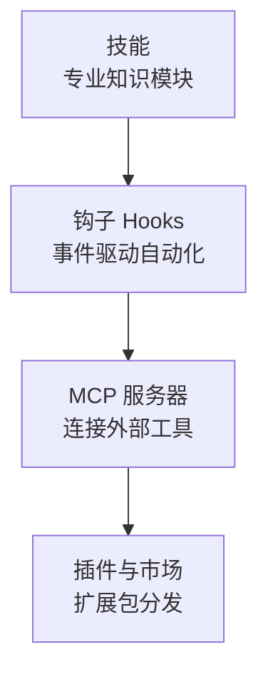

本组讲解超越 Claude Code 基本功能、扩展其行为的四种方法。以概念为中心说明这样一条脉络：用技能把专业知识模块化，用钩子在事件上挂载自动化，用 MCP 连接外部工具，再用插件把这一切打包成一个整体分发。

这四者正是搭建**智能体挽具** (Agentic Harness) 的原材料。在"与其亲手写代码，不如设计让智能体好好工作的环境"这一挽具工程中，技能负责智能体的知识，钩子负责确定性纪律，MCP 负责与外部世界的连接，插件则是这些组合的分发单元。MoAI-ADK 通过一次 `moai init` 部署的，以及 `/moai project` 为项目专门生成的，归根结底都是这些原材料的组合。




**一句话总结**：理解技能·钩子·MCP·插件这四个扩展点，就能把 Claude Code 打造成项目专属的挽具。


## 学习流程

```mermaid
flowchart TD
    A[技能<br/>专业知识模块] --> B[钩子 Hooks<br/>事件驱动自动化]
    B --> C[MCP 服务器<br/>连接外部工具]
    C --> D[插件与市场<br/>扩展包分发]
```

建议从最轻量的扩展点 —— 技能读起，接着是挂载自动化的钩子、连接外部世界的 MCP，最后是把它们捆绑分发的插件。技能·钩子·MCP 与 MoAI-ADK 深入文档紧密相连，先建立概念再深入钻研即可。

## 目录

| 文档 | 说明 |
|------|------|
| [技能](/claude-code/extensibility/skills) | 专业知识模块与渐进式披露 |
| [钩子 (Hooks)](/claude-code/extensibility/hooks) | 事件驱动自动化 |
| [MCP 服务器](/claude-code/extensibility/mcp) | 外部工具连接协议 |
| [插件与市场](/claude-code/extensibility/plugins) | 扩展包与代码智能 |

掌握了这四种原材料之后，请到下一组[智能体与自动化](/claude-code/agentic)，看看如何在用这些原材料搭建的挽具上运转智能体循环。
