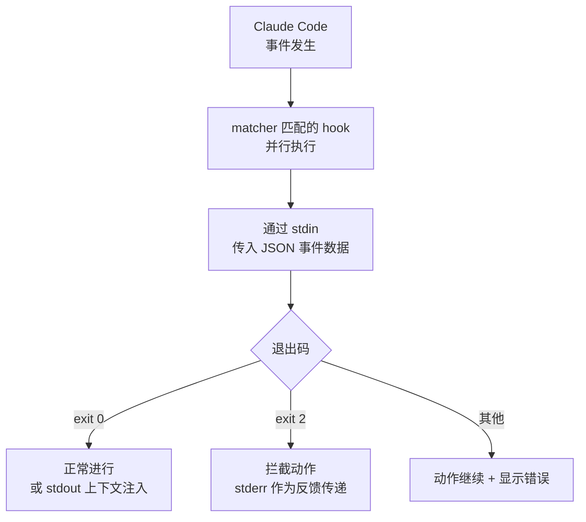

钩子（hook）是在 Claude Code 生命周期的特定节点自动执行的 shell 命令，它不依赖模型的判断，而是确定性地保证那些"必须发生的动作"。


**一句话总结**：hook 是 Claude Code 在每次编辑文件或结束任务时自动触发的"if-this-then-that"脚本，无需人工介入即可强制执行格式化、lint 和安全拦截。



本页面侧重于概念介绍。MoAI-ADK 实际如何注册和运行 hook（shell 包装器模式、各事件的行为、质量门集成）将在更深入的 MoAI-ADK 指南中讲解。可上手的实战内容请参考 [Hooks 指南](/advanced/hooks-guide)和 [Hooks 事件参考](/advanced/hooks-reference)。


## 什么是钩子

钩子是当 Claude Code 调用工具、结束响应或启动会话等**事件** (event) 发生时执行的用户自定义 shell 命令。它无需等待模型判断"该跑一次 lint 了"，而是在相应事件发生时**必定**执行。这种确定性执行正是 hook 的核心价值。

钩子注册在 `settings.json` 的 `hooks` 块中。每个条目定义它对哪个事件作出反应、收窄到哪些工具（`matcher`）、执行什么（`command`）。

```json
{
  "hooks": {
    "PostToolUse": [
      {
        "matcher": "Edit|Write",
        "hooks": [
          { "type": "command", "command": "jq -r '.tool_input.file_path' | xargs npx prettier --write" }
        ]
      }
    ]
  }
}
```

上面的示例会在每次通过 `Edit` 或 `Write` 工具修改文件时自动运行 `prettier`，从而保持格式的一致性。

## 主要事件

钩子可以响应的事件多种多样，以下是最常用的几种。

| 事件 | 触发时机 |
| :--- | :--- |
| `SessionStart` | 会话启动或恢复时（用于注入上下文） |
| `UserPromptSubmit` | 用户提交提示词后、Claude 处理之前 |
| `PreToolUse` | 工具调用执行前（可拦截） |
| `PostToolUse` | 工具调用成功后（用于格式化、lint） |
| `SubagentStop` | 子代理完成任务时 |
| `Stop` | Claude 结束响应时 |
| `PreCompact` | 上下文窗口压缩前 |
| `SessionEnd` | 会话结束时 |

完整的事件列表及各事件的输入 schema 已整理在官方 [Hooks 参考](https://code.claude.com/docs/en/hooks)中。

## 钩子的工作方式

钩子通过标准输入（stdin）、标准输出（stdout）、标准错误（stderr）和退出码（exit code）与 Claude Code 通信。事件发生时，Claude Code 会以 JSON 形式将事件信息传入 stdin，脚本读取该数据并处理后，通过退出码指示下一步动作。



退出码约定如下。

| 退出码 | 含义 |
| :--- | :--- |
| `0` | 无异议。动作正常进行。在 `SessionStart`、`UserPromptSubmit` 等事件中，stdout 内容会注入到 Claude 的上下文 |
| `2` | 拦截动作。写入 stderr 的原因会作为反馈传递给 Claude |
| 其他 | 动作继续进行，但转录记录中会显示 hook 错误 |

如需更精细的控制，可以不用退出码，而是在 stdout 输出结构化的 JSON，从而做出诸如 `permissionDecision`（`allow`/`deny`/`ask`）这样的决策。

## 用在哪里

钩子在自动化以下这类"必须发生"的工作时大放异彩。

- **自动格式化** (auto-format)：用 `PostToolUse` + `Edit|Write` matcher，在编辑后立即运行 `prettier`、`gofmt`
- **自动 lint** (lint)：编辑后运行 linter，即时捕获风格与静态分析的违规
- **安全拦截** (security block)：用 `PreToolUse` 以退出码 `2` 拦截对 `.env`、`.git/` 等受保护文件的编辑，或 `rm -rf`、`drop table` 等危险命令
- **通知** (notification)：用 `Notification` 事件在 Claude 等待输入时发送桌面通知
- **上下文注入** (context injection)：在 `SessionStart` 或压缩后重新注入项目规则与近期工作

钩子的注册位置（`~/.claude/settings.json` 全局、`.claude/settings.json` 项目、插件与技能的 frontmatter）会决定其适用范围。如果不是确定性规则而是需要判断的场景，也可以使用由模型评估的基于提示词（`type: "prompt"`）或基于代理（`type: "agent"`）的 hook。

## MoAI-ADK 与钩子

MoAI-ADK 以 shell 脚本包装器调用 `moai hook <event>` 二进制文件的模式来运行 hook，并通过 hook 强制执行状态转换所有权、sync 阶段质量门、代理团队任务完成验证等。这部分的实战注册方法和各事件的细节行为将在下面更深入的指南中讲解。

## 相关文档

- [Hooks 指南](/advanced/hooks-guide)
- [Hooks 事件参考](/advanced/hooks-reference)

## 参考资料

- [Automate workflows with hooks（官方文档）](https://code.claude.com/docs/en/hooks-guide)
- [Hooks reference（官方文档）](https://code.claude.com/docs/en/hooks)


如果 hook 已注册却没有执行，请先在 Claude Code 中输入 `/hooks`，确认该事件下是否显示了 hook、以及 matcher 是否与工具名称精确（区分大小写）匹配。也别忘了用 `chmod +x` 给脚本赋予执行权限。

