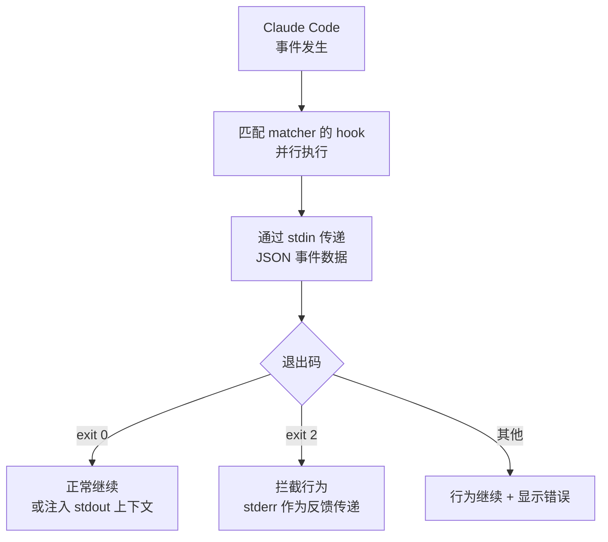

# 钩子 (Hooks)

钩子 (hook) 是在 Claude Code 生命周期的特定节点自动执行的 shell 命令，它不依赖模型的判断，确定性地保证"必须始终发生的行为"。


**一句话总结**：hook 是在 Claude Code 编辑文件或结束工作时自动触发的 "if-this-then-that" 脚本，无需人手即可强制执行格式化·lint·安全拦截。



本页专注于概念介绍。MoAI-ADK 实际如何注册与运营 hook（shell 包装器模式、各事件行为、质量门禁联动）在深入的 MoAI-ADK 指南中讲解。触手可及的实战内容请参考 [Hooks 指南](/advanced/hooks-guide)与 [Hooks 事件参考](/advanced/hooks-reference)。


## 什么是钩子

钩子是在 Claude Code 调用工具、结束回应、启动会话等**事件** (event) 发生时执行的用户定义 shell 命令。与其等待模型判断"该跑一下 lint 了"，hook 在对应事件每次发生时都**必定**执行。这种确定性执行正是 hook 的核心价值。

钩子在 `settings.json` 的 `hooks` 块中注册。每个条目定义响应哪个事件、限定到哪些工具（`matcher`）、执行什么（`command`）。

```json
{
  "hooks": {
    "PostToolUse": [
      {
        "matcher": "Edit|Write",
        "hooks": [
          { "type": "command", "command": "jq -r '.tool_input.file_path' | xargs npx prettier --write" }
        ]
      }
    ]
  }
}
```

上面的示例在每次通过 `Edit` 或 `Write` 工具修改文件时自动运行 `prettier`，保持格式一致。

## 主要事件

钩子可响应的事件超过 30 个，以下是最常用的。

| 事件 | 触发时机 |
| :--- | :--- |
| `SessionStart` | 会话开始或恢复时（用于上下文注入） |
| `Setup` | 以 `/init` 或 `--init` 标志启动 Claude Code 时 |
| `UserPromptSubmit` | 用户提交提示词后、Claude 处理之前 |
| `UserPromptExpansion` | 用户输入的命令被展开为提示词时 |
| `PreToolUse` | 工具调用执行之前（可拦截） |
| `PermissionRequest` | 权限对话框出现时 |
| `PostToolUse` | 工具调用成功之后（用于格式化·lint） |
| `PostToolUseFailure` | 工具调用失败时 |
| `SubagentStart` | 子智能体启动时 |
| `SubagentStop` | 子智能体完成工作时 |
| `TaskCreated` | 任务被创建时 |
| `TaskCompleted` | 任务被标记完成时 |
| `Stop` | Claude 结束回应时 |
| `PreCompact` | 上下文窗口压缩之前 |
| `PostCompact` | 上下文压缩完成之后 |
| `SessionEnd` | 会话结束时 |

完整事件列表与各事件的输入 schema 见官方 [Hooks 参考](https://code.claude.com/docs/en/hooks)。

## 钩子的工作方式

钩子通过标准输入 (stdin)、标准输出 (stdout)、标准错误 (stderr) 与退出码 (exit code) 和 Claude Code 通信。事件发生时 Claude Code 把事件信息以 JSON 传给 stdin，脚本读取并处理该数据后，用退出码指示下一步动作。


```mermaid
flowchart TD
  A[Claude Code<br>事件发生] --> B[匹配 matcher 的 hook<br>并行执行]
  B --> C[通过 stdin 传递<br>JSON 事件数据]
  C --> D{退出码}
  D -->|exit 0| E[正常继续<br>或注入 stdout 上下文]
  D -->|exit 2| F[拦截行为<br>stderr 作为反馈传递]
  D -->|其他| G[行为继续 + 显示错误]
```

退出码约定如下。

| 退出码 | 含义 |
| :--- | :--- |
| `0` | 无异议。行为正常继续。在 `SessionStart`·`UserPromptSubmit` 等事件中，stdout 内容会注入 Claude 上下文 |
| `2` | 拦截行为。写入 stderr 的理由会作为反馈传给 Claude |
| 其他 | 行为继续，但转录中会显示 hook 错误 |

需要更精细的控制时，可以不用退出码，而在 stdout 输出结构化 JSON，做出 `permissionDecision`（`allow`/`deny`/`ask`）之类的决策。

## 用在哪里

钩子在自动化以下"必须发生"的工作时大放异彩。

- **自动格式化** (auto-format)：`PostToolUse` + `Edit|Write` matcher，编辑后立即运行 `prettier`·`gofmt`
- **自动 lint** (lint)：编辑后跑 linter，即时抓住风格·静态分析违规
- **安全拦截** (security block)：用 `PreToolUse` 以退出码 `2` 拦截对 `.env`·`.git/` 等受保护文件的编辑，或 `rm -rf`·`drop table` 这类危险命令
- **通知** (notification)：用 `Notification` 事件在 Claude 等待输入时发送桌面通知
- **上下文注入** (context injection)：在 `SessionStart` 或压缩后重新注入项目规则·近期工作

钩子的注册位置（`~/.claude/settings.json` 全局、`.claude/settings.json` 项目、插件·技能 frontmatter）决定其适用范围。当需要的不是确定性规则而是判断时，也可以使用由模型评估的基于提示（`type: "prompt"`）或基于智能体（`type: "agent"`）的 hook。

## MoAI-ADK 与钩子

MoAI-ADK 以 shell 脚本包装器调用 `moai hook <event>` 二进制的模式运营 hook，并用 hook 强制执行状态迁移所有权、sync 阶段质量门禁、智能体团队任务完成验证等。

从挽具工程的视角看，hook 是"把评估者与权限控制放在智能体判断之外"这一原则的实现。与其指望模型记住规则，不如让运行时执行规则 —— 因此无论自主循环跑多久，质量门禁都确定性地生效。MoAI-ADK 的 `/goal` 自主执行与自我进化挽具之所以安全，也是因为基于 Stop hook 的条件评估与用户批准门禁被 hook 强制在循环之外。实战注册方法与各事件的详细行为在下方的深入指南中讲解。

## 相关文档

- [Hooks 指南](/advanced/hooks-guide)
- [Hooks 事件参考](/advanced/hooks-reference)

## 参考资料

- [Automate workflows with hooks（官方文档）](https://code.claude.com/docs/en/hooks-guide)
- [Hooks reference（官方文档）](https://code.claude.com/docs/en/hooks)


如果 hook 已注册却没有执行，先在 Claude Code 中输入 `/hooks`，确认对应事件下能看到该 hook，以及 matcher 与工具名是否精确（区分大小写）一致。也别忘了用 `chmod +x` 给脚本执行权限。

