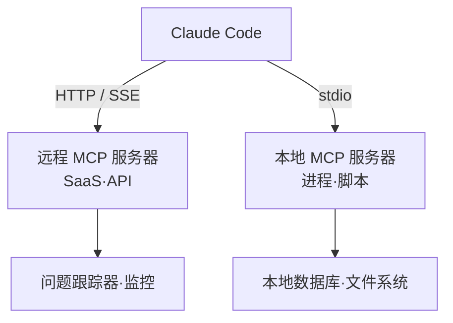

Claude Code 通过 MCP 以标准化的方式连接问题跟踪器、数据库、监控仪表盘等外部系统，从而直接读取和操作它们。


**一句话总结**: MCP 取代了从其他工具复制粘贴数据的做法，让 Claude Code 直接操作外部系统，是"连接 AI 与工具的标准插座"。



本页是概念概述。实际的服务器注册、认证以及在 MoAI-ADK 工作流中的应用方法，将在 [MCP 服务器实战指南](/advanced/mcp-servers) 中以实操为中心详细讲解。


## 什么是 MCP

MCP (Model Context Protocol) 是连接 AI 与外部工具的**开源标准协议**。无论模型厂商或工具类型如何，都以相同的规约进行连接，因此一次创建的 MCP 服务器可以在多个 AI 客户端中复用。

MCP 服务器赋予 Claude Code 访问工具、数据与 API 的权限。连接之后，Claude 会直接处理以下这类工作。

| 场景 | 没有 MCP | 连接 MCP 之后 |
| --- | --- | --- |
| 基于问题的功能实现 | 复制粘贴问题内容 | 从问题跟踪器直接读取并创建 PR |
| 监控分析 | 附上仪表盘截图 | 从 Sentry 等直接查询错误 |
| 数据库查询 | 手动传递查询结果 | 直接查询 PostgreSQL 的结构与数据 |

> 获取外部内容的服务器存在提示注入风险，因此在连接之前务必确认该服务器是否可信。

## 服务器类型 (传输方式)

MCP 服务器按照与 Claude Code 通信的**传输方式**进行划分。一般来说，云服务使用 HTTP，本地工具使用 stdio。

| 传输方式 | 位置 | 适用场景 | 备注 |
| --- | --- | --- | --- |
| HTTP | 远程 | 云端 SaaS 集成 | 推荐，支持 OAuth 2.0 |
| stdio | 本地进程 | 系统访问·自定义脚本 | 无自动重连 |
| SSE | 远程 | 旧版远程连接 | 已弃用，由 HTTP 替代 |
| WebSocket | 远程 | 服务器主动推送事件的场景 | 不支持 OAuth·`--transport` |



### 安装概览

添加服务器通过 `claude mcp add` 系列命令完成。所有选项都放在服务器名称**之前**，对于 stdio 则使用 `--` 来分隔执行命令。

```bash
# 添加远程 HTTP 服务器
claude mcp add --transport http notion https://mcp.notion.com/mcp

# 添加本地 stdio 服务器 (-- 之后为执行命令)
claude mcp add --transport stdio --env API_KEY=YOUR_KEY airtable \
  -- npx -y airtable-mcp-server

# 查看注册情况 / 在会话中查看状态
claude mcp list
```

通过 `--scope` 标志指定配置的保存范围。共有三个层级：`local` (默认，仅自己·当前项目)、`project` (通过 `.mcp.json` 与团队共享)、`user` (所有项目)。若同名配置出现在多处，则按 local > project > user 的顺序优先。

## 服务器对外暴露的内容：工具·资源·提示

MCP 服务器向 Claude Code 提供三类功能。

| 暴露对象 | 作用 | 在 Claude Code 中的使用方式 |
| --- | --- | --- |
| 工具 (tools) | Claude 调用的动作·函数 | 工作过程中自动调用 |
| 资源 (resources) | 可引用的数据·文档 | `@服务器:protocol://路径` 提及 |
| 提示 (prompts) | 预先定义的命令 | `/mcp__服务器名__提示名` |

例如，资源可以像文件一样通过 `@` 提及来引入。

```text
分析 @github:issue://123 并提出修复方案
```

在会话中执行 `/mcp` 命令，即可查看已连接的服务器列表、各服务器的工具数量以及 OAuth 认证状态。需要认证的远程服务器，可在 `/mcp` 中通过浏览器 OAuth 流程登录。

> 工具检索 (Tool Search) 默认启用，因此 MCP 工具定义在需要之前不会载入上下文窗口。即使连接大量服务器，对上下文的负担也很小。

## 在 MoAI-ADK 中的应用

MoAI-ADK 将 `mcp__context7` 这类文档查询 MCP 集成到工作流中使用。服务器注册步骤、认证模式、作用域选择，以及 MoAI 智能体如何调用 MCP 工具等实战内容，整理在另一份进阶指南中。当你通过本页掌握了概念后，建议将那份指南作为下一步进行参考。

## 相关文档

- [MCP 服务器实战指南](/advanced/mcp-servers)

## 参考资料

- [Connect Claude Code to tools via MCP](https://code.claude.com/docs/en/mcp)


建议起步时仅以 `local` 作用域添加 1~2 个可信服务器以确认其工作情况，待验证出与团队共享的价值后，再迁移到 `--scope project` 并将 `.mcp.json` 纳入版本管理。

