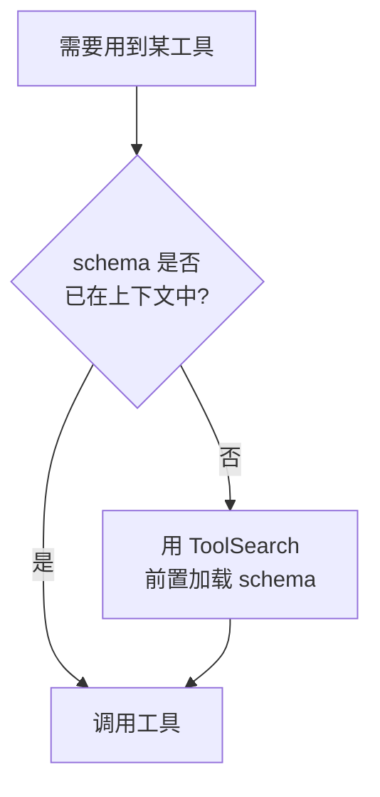

# MCP 集成

MCP（Model Context Protocol）是一套把外部工具与数据源接入 Claude 使用的标准连接器。本页在概览层面整理它的概念与注册方法。


**一句话总结**：MCP 是给 AI 的 **USB 接口**。把数据库、问题跟踪器、浏览器这类各不相同的外部工具用同一套标准规格连接到 Claude，就不必为每个工具单独编写集成代码，可以用同样的方式接入。


## 什么是 MCP

MCP 是一套标准化 AI 应用连接外部系统方式的开放协议。就像用一根 USB-C 取代各设备各不相同的线缆连接多种外设一样，MCP 把互不相同的外部工具用**同一套规格**连接到 Claude。

已连接的 MCP 服务器可以向 Claude 提供三类东西。

| 提供物 | 说明 |
|--------|------|
| 工具（Tools） | Claude 可调用的动作（例如：执行查询、创建问题） |
| 资源（Resources） | Claude 可读取的数据（例如：文件、记录） |
| 提示（Prompts） | 可复用的提示模板 |

有了这套标准，每接一个新工具就不必再重写一遍集成逻辑。 一旦遵循标准，所有支持该标准的工具都从同一扇门进入。

## 服务器注册

MCP 服务器有两种注册方法。

- **CLI**：用 `claude mcp add <名称> <执行命令>` 添加服务器。
- **配置文件**：在项目根目录的 `.mcp.json` 中直接编写服务器定义。

```json
{
  "mcpServers": {
    "example": {
      "command": "npx",
      "args": ["-y", "@example/mcp-server"]
    }
  }
}
```

注册好的服务器状态可在会话中用 `/mcp` 命令查看并认证。

### 作用域

同一个服务器，注册到哪里不同，适用范围也不同。

| 作用域 | 适用范围 |
|--------|-----------|
| `user` | 我的所有项目 |
| `project` | 当前项目（与团队共享，纳入版本管理） |
| `local` | 当前项目中我的本地会话（不共享） |

通常把要与团队共享的服务器放在 `project` 作用域，把需要个人凭据的服务器放在 `local` 作用域。

### 传输类型

MCP 服务器按与 Claude 通信的方式（transport）分类。

| 类型 | 动作概要 |
|------|-----------|
| stdio | 启动本地进程并通过标准输入输出通信 |
| HTTP | 通过网络连接到远程端点 |

本地工具多用 stdio，远程 SaaS 工具多用 HTTP。

## 延迟加载与 Tool Search

连接多个 MCP 服务器，工具定义就会相应增多。若把工具定义全部常驻加载到上下文，在发出第一条提示之前[上下文窗口](/zh/claude-code/context-memory/context-window)就会被占满。

因此 Claude Code **默认延迟加载**（deferred load）工具定义。工具的完整 schema 只在实际需要该工具时才加载，平时上下文里只放一小段元数据。要真正调用这类延迟工具，需要先有一步把 schema 加载进活动上下文的前置动作。

MoAI-ADK 把这一机制提升为 HARD 纪律。在调用延迟工具（例如 `AskUserQuestion`）之前，必须先用 `ToolSearch` 加载 schema；跳过这一前置步骤，工具调用就会因校验错误被拒绝。详细规则定义在 `.claude/rules/moai/core/askuser-protocol.md` 的 ToolSearch Preload 流程中。


```mermaid
flowchart TD
    A[需要用到某工具] --> B{schema 是否<br/>已在上下文中?}
    B -->|否| C[用 ToolSearch<br/>前置加载 schema]
    B -->|是| D[调用工具]
    C --> D
```

## 与缓存的相互作用

连接或断开 MCP 服务器，会改变放在上下文前部（前缀）的工具定义集合。前缀一旦变化，[提示缓存](/zh/claude-code/context-memory/prompt-caching)的复用就从该处开始失效，因此把服务器配置在会话早期定好，对缓存效率更有利。

## MoAI-ADK 的 MCP 运用

MoAI-ADK **默认不预置** MCP 服务器。需要外部资料时，改用内置 `WebSearch` / `WebFetch` 查阅官方文档与最佳实践的回退策略（`.claude/rules/moai/core/agent-common-protocol.md` § MCP Fallback Strategy）。这样设计是为了让架构·分析质量不依赖 MCP 的可用性。

一个例外是后端路由。在 `moai glm` 或 `moai cg` 的 GLM 面板中运行时，网页搜索与网页抓取会路由到 z.ai MCP 工具而非内置工具（`.claude/rules/moai/core/glm-web-tooling.md`）。无论在哪个后端，搜索·抓取能力本身都保留，只是路径不同。

## 相关文档

- [技能](/zh/claude-code/extensibility/skills)
- [钩子（Hooks）](/zh/claude-code/extensibility/hooks)
- [上下文窗口](/zh/claude-code/context-memory/context-window)

## 参考资料

- [Claude Code Docs — MCP](https://code.claude.com/docs/en/mcp)


新的 MCP 服务器请在会话开始时一并定好。会话途中接入或移除服务器会改变工具定义前缀，从该处开始提示缓存失效，之后每一轮都要重新处理前缀。

