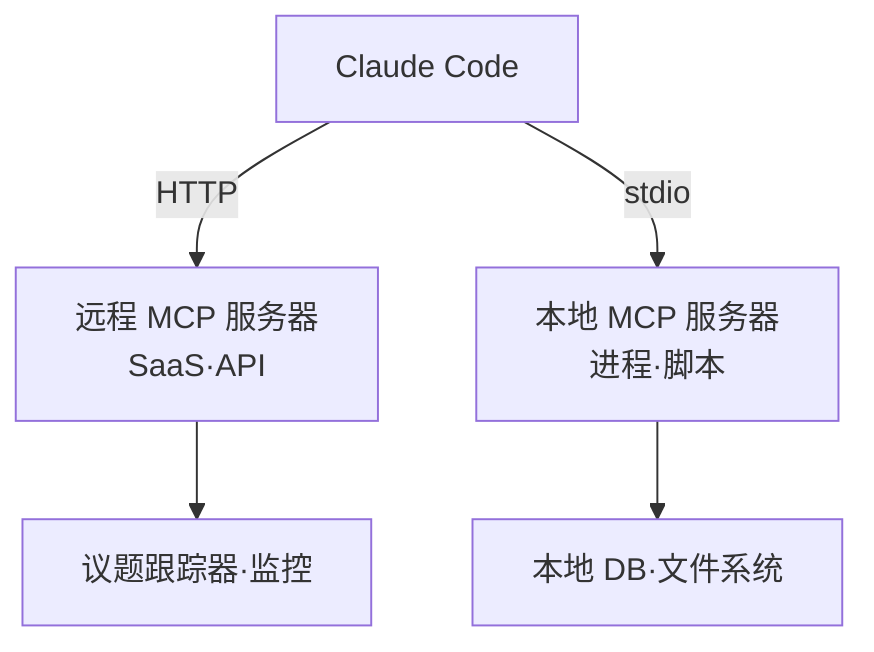

Claude Code 通过 MCP 以标准化方式连接议题跟踪器、数据库、监控看板等外部系统，直接读取与操作它们。


**一句话总结**：MCP 消灭了从其他工具复制粘贴数据的工作，让 Claude Code 直接操作外部系统 —— 它是 "AI 与工具连接的标准插座"。



本页是概念概览。实际的服务器注册、认证及在 MoAI-ADK 工作流中的运用，在 [MCP 服务器运用指南](/advanced/mcp-servers)中以实操为中心详细讲解。


## 什么是 MCP

MCP (Model Context Protocol) 是连接 AI 与外部工具的**开源标准协议**。无论模型厂商或工具种类如何，都以同一规约连接，因此写好一个 MCP 服务器就能在多个 AI 客户端复用。

MCP 服务器向 Claude Code 授予工具·数据·API 访问权限。连接之后，Claude 可以直接处理以下工作。

| 场景 | 没有 MCP 时 | 连接 MCP 后 |
| --- | --- | --- |
| 基于议题实现功能 | 复制粘贴议题内容 | 直接从议题跟踪器读取并创建 PR |
| 监控分析 | 附上看板截图 | 直接从 Sentry 等查询错误 |
| 数据库查询 | 手动传递查询结果 | 直接查询 PostgreSQL 的 schema 与数据 |

> 抓取外部内容的服务器存在提示注入风险，连接前务必确认服务器可信。

## 服务器类型（传输方式）

MCP 服务器按与 Claude Code 通信的**传输方式**划分。推荐 HTTP，旧式 SSE 已停用。

| 传输方式 | 位置 | 适合的用途 | 备注 |
| --- | --- | --- | --- |
| HTTP | 远程 | 云端 SaaS 集成 | 推荐（支持 OAuth 2.0） |
| stdio | 本地进程 | 系统访问·自定义脚本 | 无自动重连 |
| SSE | 远程 | 遗留远程连接 | 已停用，由 HTTP 取代 |
| WebSocket | 远程 | 服务器推送事件的场景 | 优先推荐 HTTP 或 stdio |


```mermaid
flowchart TD
    CC[Claude Code]
    CC -->|HTTP| Remote[远程 MCP 服务器<br>SaaS·API]
    CC -->|stdio| Local[本地 MCP 服务器<br>进程·脚本]
    Remote --> Ext1[议题跟踪器·监控]
    Local --> Ext2[本地 DB·文件系统]
```

### 安装概览

添加服务器用 `claude mcp add` 系列命令。所有选项放在服务器名称**之前**，stdio 场景用 `--` 分隔执行命令。

```bash
# 添加远程 HTTP 服务器（推荐）
claude mcp add --transport http notion https://mcp.notion.com/mcp

# 添加本地 stdio 服务器（-- 之后为执行命令）
claude mcp add --transport stdio --env API_KEY=YOUR_KEY airtable \
  -- npx -y airtable-mcp-server

# 查看注册情况
claude mcp list
```

用 `--scope` 标志指定配置保存范围。有 `local`（默认，仅自己·当前项目）、`project`（以 `.mcp.json` 与团队共享）、`user`（所有项目）三级，同名存在于多处时按 local > project > user 的顺序优先。

## 服务器暴露的内容：工具·资源·提示

MCP 服务器向 Claude Code 提供三类能力。

| 暴露对象 | 角色 | 在 Claude Code 中的用法 |
| --- | --- | --- |
| 工具 (tools) | Claude 调用的动作·函数 | 工作中自动调用 |
| 资源 (resources) | 可引用的数据·文档 | `@服务器:protocol://路径` 提及 |
| 提示 (prompts) | 预定义的命令 | `/mcp__服务器名__提示名` |

例如资源可以像文件一样用 `@` 提及拉入。

```text
请分析 @github:issue://123 并提出修复方案
```

在会话中执行 `/mcp` 命令，可以查看已连接的服务器列表、各服务器的工具数量与 OAuth 认证状态。需要认证的远程服务器在 `/mcp` 中通过浏览器 OAuth 流程登录。

> 工具搜索 (Tool Search) 默认启用，MCP 工具定义在被需要之前不会进入上下文窗口。即使连接许多服务器，上下文负担也很小。

## 在 MoAI-ADK 中的运用

MoAI-ADK 把 `mcp__context7` 这类文档查询 MCP 集成进工作流使用，`/moai project` 的挽具自动构建阶段也包含贴合项目领域的 MCP 供给。

从令牌视角值得关注的是上述工具搜索 (Tool Search) 的延迟加载。MCP 工具定义在上下文中是相当大的块，但只在需要时加载，因此即使连接多个服务器，常驻负担也几乎为零 —— 这是 MoAI-ADK 上下文瘦身所依赖的平台机制之一。服务器注册流程、认证模式、作用域选择，以及 MoAI 智能体如何调用 MCP 工具等实战内容整理在单独的深入指南中。在本页建立概念后，下一步请参考该指南。

## 相关文档

- [MCP 服务器运用指南](/advanced/mcp-servers)

## 参考资料

- [Connect Claude Code to tools via MCP](https://code.claude.com/docs/en/mcp)


建议一开始只以 `local` 作用域添加 1~2 个可信服务器验证效果，确认值得与团队共享后，再用 `--scope project` 迁移并把 `.mcp.json` 纳入版本管理。

