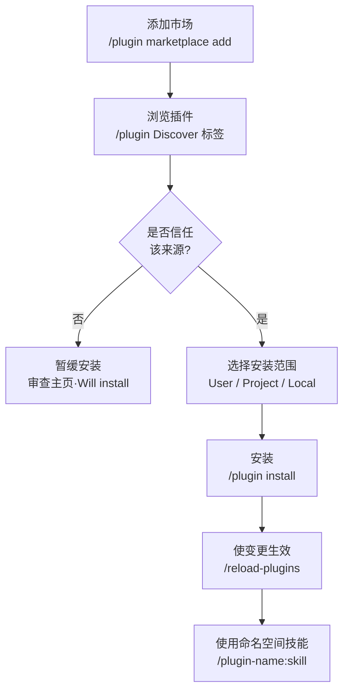

Claude Code 插件是将分散的扩展功能打包成单个包，分发给团队和社区的单位；市场则是发现并安装这些包的目录。


**一句话总结**：插件是把命令、智能体、技能、hook 和 MCP 放进一个文件夹，进行版本管理并分发的"扩展集合"，而市场则是从这些集合中挑选取用的应用商店。


## 什么是插件

插件 (plugin) 是把 Claude Code 的多个扩展元素打包到一个目录中，使其能够 **共享、复用、版本管理** 的包。与直接放在 `.claude/` 目录中的独立配置不同，插件通过清单文件拥有自己的身份标识，并通过市场分发到其他项目和团队。

独立配置与插件的区别非常明确。

| 区分 | 独立配置 (`.claude/`) | 插件 |
|------|------------------------|----------|
| 技能名称 | `/hello` | `/plugin-name:hello`（应用命名空间） |
| 适合场景 | 个人工作流、项目专属实验 | 团队与社区共享、版本发布、多项目复用 |
| 分发 | 手动复制 | 通过 `/plugin install` 安装 |
| 防止冲突 | 无 | 以插件名称自动隔离命名空间 |

插件的核心是 `.claude-plugin/plugin.json` **清单文件**。该文件定义了插件的名称、描述和版本，其中 `name` 字段同时也是技能的命名空间前缀。

```json
{
  "name": "my-first-plugin",
  "description": "A greeting plugin to learn the basics",
  "version": "1.0.0",
  "author": { "name": "Your Name" }
}
```

`version` 是可选值。指定后，只有在提升该值时才会向用户推送更新；若省略并通过 git 分发，则提交 SHA 充当版本号，每次提交都会被视为新版本。

> 开发过程中，可用 `claude --plugin-dir ./my-plugin` 无需安装即可直接加载本地插件进行测试，修改后用 `/reload-plugins` 即可无需重启生效。

## 插件可以包含的内容

插件根目录下按元素分别放置目录。一个常见的错误是把这些目录放进 `.claude-plugin/` 内，而 `.claude-plugin/` 内只应放 `plugin.json`，其余全部都应位于 **插件根目录**。

| 元素 | 位置 | 包含内容 |
|------|------|-----------|
| 技能 (skill) | `skills/<name>/SKILL.md` | 模型根据上下文自动调用的能力 |
| 命令 (command) | `commands/*.md` | 斜杠命令（新插件推荐使用 `skills/`） |
| 智能体 (agent) | `agents/` | 自定义子智能体定义 |
| hook | `hooks/hooks.json` | 事件处理器（PostToolUse 等） |
| MCP 服务器 | `.mcp.json` | 外部工具与服务的连接配置 |
| LSP 服务器 | `.lsp.json` | 代码智能（语言服务器）配置 |
| 监视器 (monitor) | `monitors/monitors.json` | 在后台监视日志与文件的后台 watcher |
| 可执行文件 | `bin/` | 插件激活期间被添加到 Bash 工具 `PATH` 中的可执行文件 |
| 默认设置 | `settings.json` | 激活时应用的默认 settings.json（当前仅支持 `agent` 与 `subagentStatusLine` 键） |

如此，一个插件即可同时包含技能、hook 和 MCP，从而通过一次安装交付"该任务所需的全部扩展"。例如 `commit-commands` 插件将 commit、push、PR 创建技能打包提供，而 `pr-review-toolkit` 则一并分发专用于 PR 审查的智能体。

## 市场：发现、安装、管理

市场 (marketplace) 是收录某人制作的插件列表的目录。使用分为两步。先 **添加** 目录以便浏览，然后 **逐个安装** 想要的插件。可以把注册应用商店与下载单个应用分开来理解。

### 添加市场

可用 `/plugin marketplace add` 注册各种来源。

```bash
# GitHub 仓库 (owner/repo 格式)
/plugin marketplace add anthropics/claude-code

# 其他 Git 主机 (必须带 .git 后缀)
/plugin marketplace add https://gitlab.com/company/plugins.git

# 固定到特定分支·标签
/plugin marketplace add https://gitlab.com/company/plugins.git#v1.0.0

# 本地路径 / 远程 marketplace.json
/plugin marketplace add ./my-marketplace
/plugin marketplace add https://example.com/marketplace.json
```

官方 Anthropic 市场 (`claude-plugins-official`) 在 Claude Code 启动时自动可用。社区市场则需手动添加。

```bash
# 从官方市场安装
/plugin install github@claude-plugins-official

# 添加社区市场后安装
/plugin marketplace add anthropics/claude-plugins-community
/plugin install <plugin-name>@claude-community
```

### 安装与管理

执行 `/plugin` 会打开包含 **Discover / Installed / Marketplaces / Errors** 四个标签页的插件管理器。在 Discover 标签的详情面板中，可以在安装前预先查看上下文成本 (Context cost) 估算值、最近更新日期，以及将要安装的命令、智能体、技能、hook、MCP、LSP 列表。

安装范围 (scope) 有三种。

| 范围 | 适用对象 | 记录位置 |
|------|-----------|-----------|
| User | 我的所有项目 | 用户设置 |
| Project | 此仓库的所有协作者 | `.claude/settings.json` |
| Local | 此仓库中仅我自己 | 不与协作者共享 |

安装、启用、禁用、移除也可通过 CLI 完成。

```bash
/plugin install plugin-name@marketplace-name   # 安装 (默认 user 范围)
/plugin disable plugin-name@marketplace-name    # 禁用 (不移除)
/plugin enable  plugin-name@marketplace-name    # 重新启用
/plugin uninstall plugin-name@marketplace-name  # 完全移除
/reload-plugins                                 # 无需重启即可生效
```

以团队为单位时，若在 `.claude/settings.json` 的 `extraKnownMarketplaces` 键中声明市场，则当协作者信任该仓库文件夹时，Claude Code 会引导其安装相应市场及插件。

## 代码智能插件

代码智能 (code intelligence) 插件通过 LSP (Language Server Protocol) 启用 Claude Code 内置的代码智能工具。这正是支撑 VS Code 代码导航的同一技术。需要安装对应语言的插件，并且系统中需具备该 **语言服务器二进制文件** 才能工作。

| 语言 | 插件 | 所需二进制文件 |
|------|----------|-----------------|
| Go | `gopls-lsp` | `gopls` |
| Python | `pyright-lsp` | `pyright-langserver` |
| TypeScript | `typescript-lsp` | `typescript-language-server` |
| Rust | `rust-analyzer-lsp` | `rust-analyzer` |
| Java | `jdtls-lsp` | `jdtls` |

插件激活后，Claude 将获得两种能力。

- **自动诊断 (diagnostics)**：每当 Claude 编辑文件时，语言服务器都会分析变更，自动报告类型错误、缺失的 import 和语法错误。无需单独运行编译器或 linter，即可在同一轮中察觉错误并立即修复。出现 "diagnostics found" 提示时，按 `Ctrl+O` 即可内联查看。
- **代码导航 (navigation)**：可进行跳转到定义、查找引用、悬停类型信息、符号列表、查找实现、调用层级追踪。相比基于 grep 的搜索，提供更为精确的导航。

> 若 `/plugin` Errors 标签中出现 `Executable not found in $PATH` 错误，安装上表中的语言服务器二进制文件即可。`rust-analyzer`、`pyright` 等在大型代码库 (large codebase) 中可能占用大量内存，如有负担，可禁用相应插件并依赖 Claude 内置搜索。

## 信任与安全

插件与市场是 **需要极高信任度的组成部分**。因为它们可以以用户权限运行任意代码。请仅从可信来源安装。

- Anthropic 不控制插件中包含的 MCP 服务器、文件和软件，也不验证它们是否按预期工作。第三方插件在安装前请亲自审查其主页和 Discover 标签中的 "Will install" 列表。
- 社区市场插件在通过 Anthropic 的自动验证与安全筛查后，会被固定到特定提交 SHA 进行分发。即便如此，最终的信任判断仍由安装者负责。
- 组织可以通过托管设置 (managed settings) 限制用户可添加的市场。

## 插件安装与激活流程



## 相关文档

- [技能](/claude-code/extensibility/skills)
- [钩子 (Hooks)](/claude-code/extensibility/hooks)
- [MCP 服务器](/claude-code/extensibility/mcp)

## 参考资料

- [Create plugins (code.claude.com)](https://code.claude.com/docs/en/plugins)
- [Discover and install plugins (code.claude.com)](https://code.claude.com/docs/en/discover-plugins)
- [What Claude gains from code intelligence plugins](https://code.claude.com/docs/en/discover-plugins#what-claude-gains-from-code-intelligence-plugins)


如果看不到想要安装的插件，可能是市场已过期。请用 `/plugin marketplace update <marketplace-name>` 刷新列表后再尝试安装。

