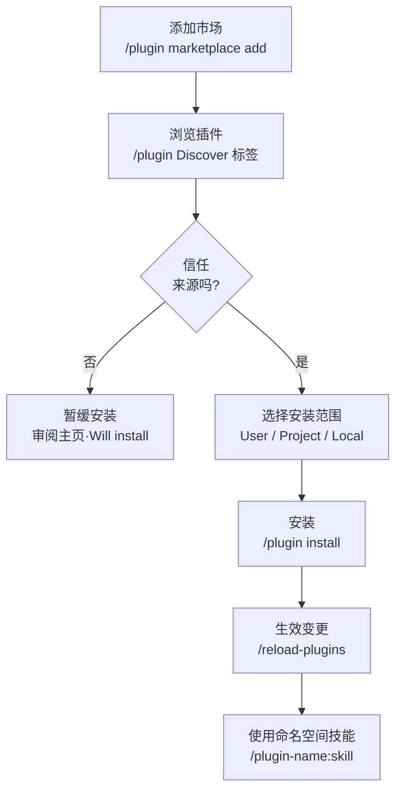

Claude Code 插件是把散落的扩展功能捆绑成一个包、向团队与社区分发的单元，而市场则是发现并安装这些包的目录。从挽具的视角看，它是把前三篇文档所学的技能·钩子·MCP 这些原材料包装成"一块可安装的挽具零件"的分发层。


**一句话总结**：插件是把命令·智能体·技能·hook·MCP 装进一个文件夹、带版本管理地分发的"扩展捆绑包"，市场则是挑选这些捆绑包的应用商店。


## 什么是插件

插件 (plugin) 是把 Claude Code 的多种扩展要素捆绑进一个目录、使其可**共享·复用·版本管理**的包。与直接放在 `.claude/` 目录的独立配置不同，插件通过清单文件拥有身份，并经由市场分发到其他项目与团队。

独立配置与插件的差异很清晰。

| 区分 | 独立配置 (`.claude/`) | 插件 |
|------|------------------------|----------|
| 技能名称 | `/hello` | `/plugin-name:hello`（应用命名空间） |
| 适合的情形 | 个人工作流、项目内实验 | 团队·社区共享、版本发布、跨项目复用 |
| 分发 | 手动复制 | 用 `/plugin install` 安装 |
| 冲突防范 | 无 | 以插件名自动隔离命名空间 |

插件的核心是 `.claude-plugin/plugin.json` **清单** (manifest)。该文件定义插件的名称·描述·版本，`name` 字段直接成为技能的命名空间前缀。清单是可选的 —— 没有它插件也能工作，但有清单时版本管理与市场分发会顺畅得多。

```json
{
  "name": "my-first-plugin",
  "description": "A greeting plugin to learn the basics",
  "version": "1.0.0",
  "author": { "name": "Your Name" }
}
```

`version` 为可选值。指定后，只有提升该值时更新才会推送给用户；若省略并以 git 分发，则提交 SHA 充当版本，每次提交都视为新版本。

> 开发期间用 `claude --plugin-dir ./my-plugin` 无需安装即可直接加载本地插件测试，改动后用 `/reload-plugins` 免重启生效。

## 插件可以装什么

在插件根（指插件目录本身，而非 `.claude-plugin/`）放置各要素的目录。**重要提醒：** `.claude-plugin/` 里**只**放 `plugin.json`，技能·命令·智能体·hook 等所有组成要素都位于插件根。

| 要素 | 位置 | 承载内容 |
|------|------|-----------|
| 技能 (skill) | `skills/<name>/SKILL.md` | 模型按情境自动调用的能力 |
| 命令 (command) | `commands/*.md` | 斜杠命令（新插件推荐用 `skills/`） |
| 智能体 (agent) | `agents/` | 自定义子智能体定义 |
| hook | `hooks/hooks.json` | 事件处理器（PostToolUse 等） |
| MCP 服务器 | `.mcp.json` | 外部工具·服务连接配置 |
| LSP 服务器 | `.lsp.json` | 代码智能（语言服务器）配置 |
| 监视器 (monitor) | `monitors/monitors.json` | 在后台监视日志·文件的后台观察器 |
| 可执行文件 | `bin/` | 插件激活期间加入 Bash 工具 `PATH` 的可执行文件 |
| 默认设置 | `settings.json` | 激活时应用的默认 settings.json（目前仅支持 `agent`·`subagentStatusLine` 键） |

一个插件可以同时装下技能·hook·MCP，一次安装就交付"这项工作所需的全部扩展"。例如 `commit-commands` 插件捆绑提供 commit·push·PR 创建技能，`pr-review-toolkit` 则一并分发 PR 评审专用的智能体。

## 市场：发现·安装·管理

市场 (marketplace) 是收录他人所制插件列表的目录。使用分两步：先**添加**目录使其可浏览，再**逐个安装**想要的插件。可以类比为"登记应用商店"与"下载单个应用"的分离。

### 添加市场

用 `/plugin marketplace add` 可以登记多种来源。

```bash
# GitHub 仓库（owner/repo 格式）
/plugin marketplace add anthropics/claude-plugins-official

# 其他 Git 托管（必须带 .git 后缀）
/plugin marketplace add https://gitlab.com/company/plugins.git

# 固定到特定分支·标签
/plugin marketplace add https://gitlab.com/company/plugins.git#v1.0.0

# 本地路径 / 远程 marketplace.json
/plugin marketplace add ./my-marketplace
/plugin marketplace add https://example.com/marketplace.json
```

官方 Anthropic 市场（`claude-plugins-official`）在 Claude Code 启动时自动可用。社区市场需手动添加。

```bash
# 从官方市场安装
/plugin install hello@claude-plugins-official

# 添加社区市场后安装
/plugin marketplace add anthropics/claude-plugins-community
/plugin install <plugin-name>@claude-plugins-community
```

### 安装与管理

执行 `/plugin` 会打开带 **Discover / Installed / Marketplaces / Errors** 四个标签页的插件管理器。在 Discover 标签的详情面板中，可以在安装之前预览上下文成本 (Context cost) 估计值、最近更新日期，以及将要安装的命令·智能体·技能·hook·MCP·LSP 列表。

安装范围 (scope) 有三种。

| 范围 | 适用对象 | 记录位置 |
|------|-----------|-----------|
| User | 我的所有项目 | 用户配置 |
| Project | 此仓库的所有协作者 | `.claude/settings.json` |
| Local | 此仓库中仅自己 | 不与协作者共享 |

安装·启用·停用·移除也可以用 CLI 完成。

```bash
/plugin install plugin-name@marketplace-name   # 安装（默认 user 范围）
/plugin disable plugin-name@marketplace-name    # 停用（不移除）
/plugin enable  plugin-name@marketplace-name    # 重新启用
/plugin uninstall plugin-name@marketplace-name  # 完全移除
/reload-plugins                                 # 免重启生效变更
```

团队层面，在 `.claude/settings.json` 的 `extraKnownMarketplaces` 键中声明市场后，当协作者信任该仓库文件夹时，Claude Code 会引导其添加该市场并安装插件。

## 代码智能插件

代码智能 (code intelligence) 插件通过 LSP (Language Server Protocol) 启用 Claude Code 内置的代码智能工具 —— 正是支撑 VS Code 代码导航的那项技术。需要安装对应语言的插件，且系统中存在相应的**语言服务器二进制**才能工作。

| 语言 | 插件 | 所需二进制 |
|------|----------|-----------------|
| Go | `gopls-lsp` | `gopls` |
| Python | `pyright-lsp` | `pyright-langserver` |
| TypeScript | `typescript-lsp` | `typescript-language-server` |
| Rust | `rust-analyzer-lsp` | `rust-analyzer` |
| Java | `jdtls-lsp` | `jdtls` |

插件激活后 Claude 获得两种能力。

- **自动诊断 (diagnostics)**：Claude 每次编辑文件时，语言服务器都会分析变更，自动报告类型错误·缺失的 import·语法错误。无需另行运行编译器或 linter，就能在同一回合察觉错误并立即修复。出现 "diagnostics found" 提示时按 `Ctrl+O` 可内联查看。
- **代码导航 (navigation)**：可跳转定义、查找引用、悬停类型信息、符号列表、查找实现、追踪调用层级，比基于 grep 的搜索精确得多。

> 若 `/plugin` 的 Errors 标签中出现 `Executable not found in $PATH` 错误，安装上表中的语言服务器二进制即可。`rust-analyzer`·`pyright` 等在大型代码库 (large codebase) 中可能占用大量内存，若有负担可以停用相应插件，改依赖 Claude 内置搜索。

## 信任与安全

插件与市场是**需要极高信任的组件**，因为它们能以用户权限执行任意代码。请只从可信来源安装。

- Anthropic 不控制插件中包含的 MCP 服务器·文件·软件，也不验证其是否按预期工作。第三方插件请在安装前亲自审阅其主页与 Discover 标签的 "Will install" 列表。
- 社区市场的插件在通过 Anthropic 的自动验证·安全筛查后固定到特定提交 SHA 分发。即便如此，最终的信任判断仍由安装者负责。
- 组织可以通过托管设置 (managed settings) 限制用户可添加的市场。

## 插件安装·激活流程


```mermaid
flowchart TD
    A[添加市场<br>/plugin marketplace add] --> B[浏览插件<br>/plugin Discover 标签]
    B --> C{信任<br>来源吗?}
    C -- 否 --> D[暂缓安装<br>审阅主页·Will install]
    C -- 是 --> E[选择安装范围<br>User / Project / Local]
    E --> F[安装<br>/plugin install]
    F --> G[生效变更<br>/reload-plugins]
    G --> H[使用命名空间技能<br>/plugin-name:skill]
```

## MoAI-ADK 与插件

MoAI-ADK 本身不是插件，而是采用 `moai init` 把挽具资产（技能·智能体·hook·配置）直接部署到 `.claude/` 目录的方式。不过本页的两点对 MoAI-ADK 用户同样直接相关。其一，Discover 标签的**上下文成本** (Context cost) 估计值是原汁原味体现代币经济学直觉的指标 —— 每安装一个扩展，都请看看常驻上下文会增加多少再做判断。其二，代码智能 (LSP) 插件与 MoAI-ADK 各语言质量门禁所利用的诊断信号同属一系，装好所用语言的 LSP 插件后，编辑后同回合捕捉类型错误的循环会紧密得多。

## 相关文档

- [技能](/claude-code/extensibility/skills)
- [钩子 (Hooks)](/claude-code/extensibility/hooks)
- [MCP 服务器](/claude-code/extensibility/mcp)

## 参考资料

- [Create plugins (code.claude.com)](https://code.claude.com/docs/en/plugins)
- [Discover and install plugins (code.claude.com)](https://code.claude.com/docs/en/discover-plugins)
- [What Claude gains from code intelligence plugins](https://code.claude.com/docs/en/discover-plugins#what-claude-gains-from-code-intelligence-plugins)


如果看不到想安装的插件，可能是市场列表过旧。用 `/plugin marketplace update <marketplace-name>` 刷新列表后再次尝试安装。

