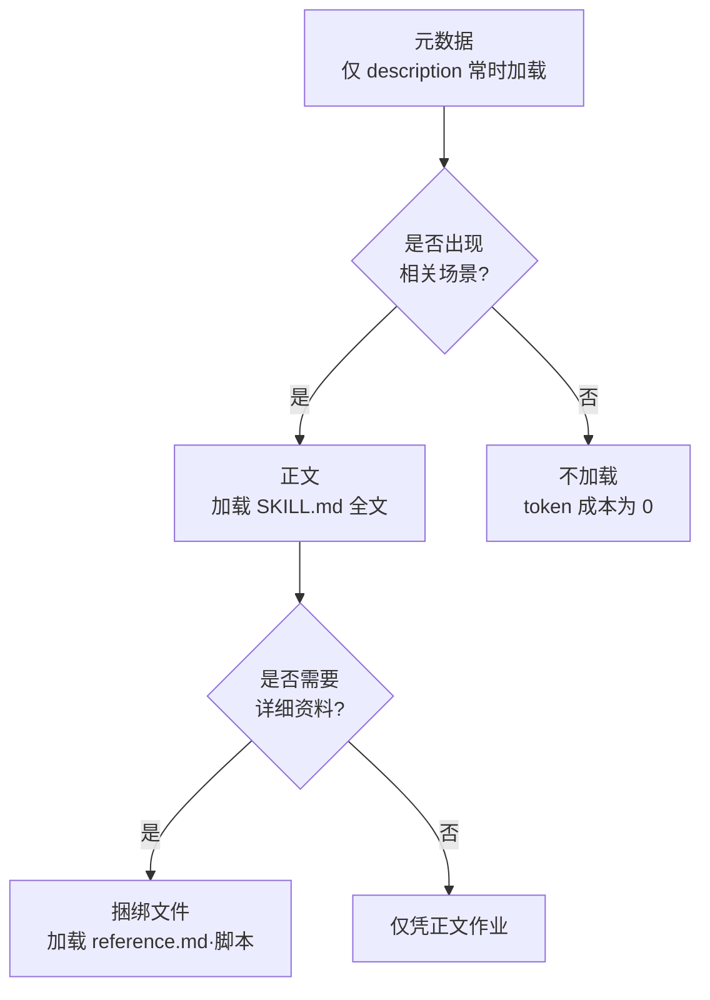

Claude Code 的技能（skill）是一种扩展机制，它将重复的流程或专业知识汇总到一个 `SKILL.md` 文件中，并将其添加到 Claude 的工具箱里。


**一句话总结**: 把每次都要粘贴到聊天里的清单或流程整理成一份 `SKILL.md`，Claude 就会在需要时才取出其中的内容来使用，成为一位"口袋里的专家"。



本文档是 Claude Code 技能的概念概览。在 MoAI-ADK 中直接编写技能并通过构建器智能体自动生成的实战流程，[技能指南](/advanced/skill-guide)和[构建器智能体指南](/advanced/builder-agents)有详细介绍。


## 什么是技能

技能是一个记录了 Claude 应遵循的指引的 `SKILL.md` 文件。只要创建好一个文件，Claude 就能在相关场景下自动调用它，或者由用户以 `/技能名` 的形式直接调用。

以下场景就是创建技能的信号。

- 当你反复把相同的指引或清单粘贴到聊天里时
- 当 CLAUDE.md 中的某个章节不再是"事实信息"，而是膨胀成了"多步骤流程"时

CLAUDE.md 的内容始终驻留在上下文中，而技能正文只在实际被使用时才加载。因此，即便放置篇幅长而详尽的参考资料，在用到之前几乎不会产生 token 成本。另外，用户自定义命令（`.claude/commands/`）已整合进技能，现有的命令文件也能照常运作。

### 技能的结构

每个技能都是以 `SKILL.md` 为入口的目录。正文由 YAML frontmatter 与 Markdown 指引组成，还可以一并放置辅助文件。

```text
my-skill/
├── SKILL.md       # 필수: 지침 + 프론트매터
├── reference.md   # 선택: 상세 참조 (필요할 때 로드)
├── examples.md    # 선택: 예시 출력
└── scripts/
    └── helper.py  # 선택: Claude가 실행하는 스크립트
```

frontmatter 字段全部为可选项，但用于让 Claude 判断何时该使用此技能的 `description` 实际上是必需的。

```yaml
---
name: api-conventions
description: 이 코드베이스의 API 설계 패턴. 엔드포인트를 작성하거나 리뷰할 때 사용.
allowed-tools: Read Grep
---

API 엔드포인트를 작성할 때:
- RESTful 명명 규칙을 따른다
- 일관된 오류 형식을 반환한다
- 요청 검증을 포함한다
```

主要的 frontmatter 字段如下。

| 字段 | 作用 |
| :--- | :--- |
| `description` | 做什么、何时使用。Claude 自动加载的判断依据 |
| `name` | 在技能列表中显示的名称 (默认值: 目录名) |
| `disable-model-invocation` | 为 `true` 时仅用户可调用，阻止 Claude 自动加载 |
| `user-invocable` | 为 `false` 时在 `/` 菜单中隐藏，仅 Claude 使用 |
| `allowed-tools` | 技能启用时无需审批即可使用的工具 |
| `context` | 设置为 `fork` 时在独立的子智能体上下文中执行 |
| `paths` | 仅在处理特定文件模式时才自动加载 |

## Progressive Disclosure

技能的核心设计是只按需逐步揭示的 **渐进式披露**（Progressive Disclosure）。这是一种在节省上下文窗口的同时保管深层知识的方式。



| 阶段 | 加载时机 | 内容 |
| :--- | :--- | :--- |
| 元数据 | 始终 | 仅 `description` 与名称驻留在上下文中 |
| 正文 | 被调用时 | `SKILL.md` 的全部指引进入上下文 |
| 捆绑 | 需要时 | 随时参考参考文档·示例·脚本 |

在普通会话中，所有技能仅 `description` 始终加载，从而让 Claude 知道"有什么"，而实际正文只在被调用的那一刻才进入。辅助文件只要在 `SKILL.md` 中以链接形式指引出来，Claude 就会在需要时才读取。

## 何时自动加载

当用户的请求与技能的 `description`（以及可选的 `when_to_use`）相匹配时，Claude 就会自动调用相应的技能。也就是说，触发器并非额外的配置，而是 **说明文字的关键词匹配**。

- 在 `description` 中纳入越多用户可能自然说出的关键词，触发效果越好。
- 如果触发过于频繁而与意图无关，可将说明缩窄得更具体，或用 `disable-model-invocation: true` 仅允许手动调用。
- 想直接调用时，以 `/技能名` 的形式明确呼出即可。

技能存放的位置决定了它的使用范围。

| 位置 | 路径 | 适用范围 |
| :--- | :--- | :--- |
| 个人 | `~/.claude/skills/<name>/SKILL.md` | 我的所有项目 |
| 项目 | `.claude/skills/<name>/SKILL.md` | 仅此项目 |
| 插件 | `<plugin>/skills/<name>/SKILL.md` | 启用了插件的地方 |

当名称重复时，按 企业 > 个人 > 项目 的顺序优先。插件技能使用 `插件名:技能名` 形式的命名空间，因此不会冲突。

## 小示例

下面是一个汇总未提交变更的技能。`` !`git diff HEAD` `` 语法是一种动态上下文注入：在 Claude 查看之前先行执行命令，并将结果嵌入正文中。

```yaml
---
description: 커밋되지 않은 변경을 요약하고 위험 요소를 표시한다. 무엇이 바뀌었는지 물을 때 사용.
---

## 현재 변경 사항

!`git diff HEAD`

## 지침

위 변경을 두세 개의 불릿으로 요약한 뒤, 누락된 오류 처리나 하드코딩 같은 위험을 나열한다.
```

这个技能会在用户问"我改了些什么？"时自动调用，或者通过 `/summarize-changes` 直接调用。

## MoAI-ADK 中的技能

MoAI-ADK 运行在这套技能机制之上。`moai-foundation-core`、`moai-workflow-spec` 等通用技能承载着 SPEC 工作流与质量门禁的知识，而贴合项目领域的技能则由构建器智能体自动生成。编写规则、命名空间、渐进式披露的 token 预算等实战细节，请参考以下 MoAI-ADK 进阶文档。

## 相关文档

- [技能指南](/advanced/skill-guide)
- [构建器智能体指南](/advanced/builder-agents)

## 参考资料

- [Claude Code 官方文档 — Extend Claude with skills](https://code.claude.com/docs/en/skills)


如果技能没有按预期触发，请用 `/doctor` 检查说明文字的预算是否超额，并核查 `description` 中是否包含了用户实际可能输入的关键词。

