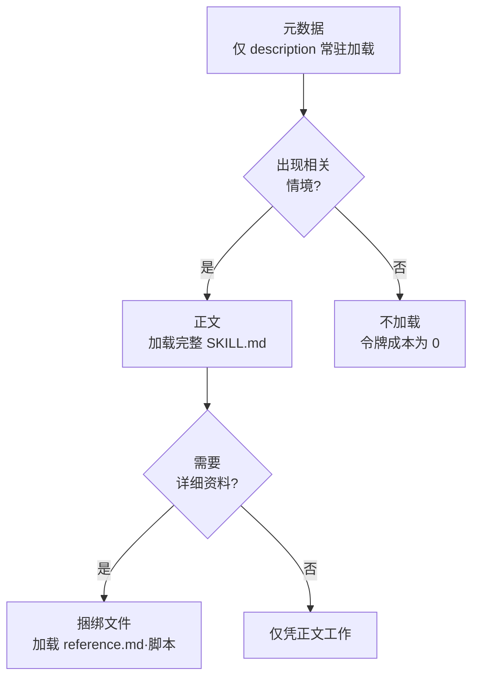

# 技能

Claude Code 的技能 (skill) 是把重复的流程或专业知识汇成一个 `SKILL.md` 文件、加入 Claude 工具箱的扩展机制。


**一句话总结**：把每次都要往聊天里粘贴的清单或流程做成一张 `SKILL.md`，Claude 就有了一位只在需要时才掏出内容的"口袋专家"。



本文是 Claude Code 技能的概念概览。在 MoAI-ADK 中亲手编写技能以及用构建者智能体自动生成的实战流程，详见[技能指南](/advanced/skill-guide)与[构建者智能体指南](/advanced/builder-agents)。


## 什么是技能

技能是承载 Claude 应遵循的指令的 `SKILL.md` 文件。做好一个文件后，Claude 会在相关情境下自动调取使用，用户也可以以 `/技能名` 的形式直接调用。

以下情形是应当创建技能的信号。

- 反复把同一份指令或清单粘贴到聊天里时
- CLAUDE.md 的某个小节从"事实信息"膨胀成"多步骤流程"时

CLAUDE.md 的内容始终常驻上下文，而技能正文只在实际被使用时才加载。因此即使放置又长又详细的参考资料，在被需要之前几乎不产生令牌成本。

### 技能与自定义命令

在技能出现之前，人们习惯把自定义命令放在 `.claude/commands/` 目录。现在**技能已涵盖命令功能**，若 `.claude/commands/deploy.md` 与 `.claude/skills/deploy/SKILL.md` 同时存在，技能优先。既有命令文件照常工作，但新扩展推荐写成技能。

### 技能的结构

每个技能是一个以 `SKILL.md` 为入口的目录。正文由 YAML frontmatter 与 Markdown 指令构成，还可以附带辅助文件。

```text
my-skill/
├── SKILL.md       # 必需：指令 + frontmatter
├── reference.md   # 可选：详细参考（需要时加载）
├── examples.md    # 可选：示例输出
└── scripts/
    └── helper.py  # 可选：Claude 执行的脚本
```

frontmatter 大多为可选项，但供 Claude 判断何时使用该技能的 `description` 事实上是必填的。

```yaml
---
name: api-conventions
description: 本代码库的 API 设计模式。编写或评审端点时使用。
allowed-tools: Read Grep
---

编写 API 端点时：
- 遵循 RESTful 命名规范
- 返回一致的错误格式
- 包含请求校验
```

主要 frontmatter 字段如下。

| 字段 | 角色 |
| :--- | :--- |
| `description` | 做什么、何时用。Claude 自动加载的判断依据 |
| `name` | 技能列表中显示的名称（默认值：目录名） |
| `disable-model-invocation` | 为 `true` 时仅用户可调用，阻止 Claude 自动加载 |
| `user-invocable` | 为 `false` 时从 `/` 菜单隐藏，仅供 Claude 使用 |
| `allowed-tools` | 技能激活时无需批准即可使用的工具 |
| `context` | 设为 `fork` 时在独立的子智能体上下文中执行 |
| `paths` | 仅处理特定文件模式时自动加载 |
| `shell` | 可选：指定执行 shell 命令时使用的 shell |

## Progressive Disclosure

技能的核心设计是按需分阶段呈现的**渐进式披露** (Progressive Disclosure)。这是一种在节省上下文窗口的同时保有深度知识的方式。


```mermaid
flowchart TD
    A[元数据<br/>仅 description 常驻加载] --> B{出现相关<br/>情境?}
    B -->|是| C[正文<br/>加载完整 SKILL.md]
    C --> D{需要<br/>详细资料?}
    D -->|是| E[捆绑文件<br/>加载 reference.md·脚本]
    D -->|否| F[仅凭正文工作]
    B -->|否| G[不加载<br/>令牌成本为 0]
```

| 阶段 | 加载时机 | 内容 |
| :--- | :--- | :--- |
| 元数据 | 始终 | 仅 `description` 与名称常驻上下文 |
| 正文 | 被调用时 | `SKILL.md` 完整指令进入上下文 |
| 捆绑文件 | 需要时 | 参考文档·示例·脚本随用随查 |

在普通会话中，所有技能只有 `description` 常驻加载，让 Claude 知道"有什么可用"，实际正文仅在被调用的瞬间才进入。辅助文件在 `SKILL.md` 中以链接引导，Claude 只在需要时才读取。

## 何时自动加载

当用户的请求与技能的 `description`（以及可选的 `when_to_use`）吻合时，Claude 会自动调取该技能。也就是说，触发依据不是额外配置，而是**说明文的关键词匹配**。

- `description` 中越是包含用户会自然说出的关键词，越容易被触发。
- 若与意图无关地过于频繁触发，就把说明写得更具体收窄，或用 `disable-model-invocation: true` 只允许手动调用。
- 想直接调用时，以 `/技能名` 的形式显式呼出即可。

技能存放的位置决定其使用范围。

| 位置 | 路径 | 适用范围 |
| :--- | :--- | :--- |
| 个人 | `~/.claude/skills/<name>/SKILL.md` | 我的所有项目 |
| 项目 | `.claude/skills/<name>/SKILL.md` | 仅此项目 |
| 插件 | `<plugin>/skills/<name>/SKILL.md` | 插件被启用之处 |

名称重复时按企业 > 个人 > 项目的顺序优先。插件技能使用 `插件名:技能名` 形式的命名空间，因此不会冲突。

## 小示例

以下是总结未提交变更的技能。`` !`git diff HEAD` `` 语法是动态上下文注入 —— 在 Claude 看到之前预先执行命令，把结果嵌入正文。

```yaml
---
description: 总结未提交的变更并标出风险点。被问到改了什么时使用。
---

## 当前变更

!`git diff HEAD`

## 指令

把上述变更总结为两三个要点，然后列出遗漏的错误处理或硬编码等风险。
```

当用户问"我改了什么？"时该技能自动触发，也可以通过 `/summarize-changes` 直接调用。

## MoAI-ADK 中的技能

MoAI-ADK 运行在这套技能机制之上。`moai-foundation-core`、`moai-workflow-spec` 等通用技能承载 SPEC 工作流与质量门禁知识，贴合项目领域的技能则由构建者智能体自动生成。

从 MoAI-ADK 的视角看，技能同时横跨两大支柱。在**代币经济学**层面，渐进式披露就是令牌预算设计 —— 只常驻负担一行说明（约 100 令牌），正文（约 5K 令牌）仅在使用时支付，比把知识常驻在 CLAUDE.md 里经济得多。在**递归式自我学习**层面，技能是挽具进化的编辑对象 —— 挽具基于循环积累的观察升级技能指令，正是 MoAI-ADK 自我进化的核心路径。编写规则·命名空间·渐进式披露令牌预算等实战细节，请参考下方的 MoAI-ADK 深入文档。

## 相关文档

- [技能指南](/advanced/skill-guide)
- [构建者智能体指南](/advanced/builder-agents)

## 参考资料

- [Claude Code 官方文档 — Extend Claude with skills](https://code.claude.com/docs/en/skills)


如果技能没有按预期触发，用 `/doctor` 检查说明文预算是否超标，并核对 `description` 里是否包含用户实际会输入的关键词。

