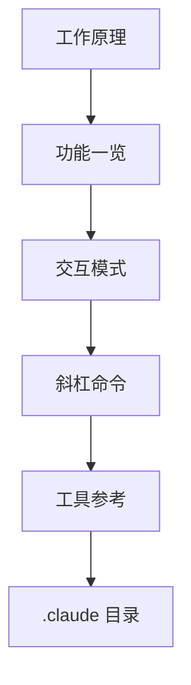

本组文档涵盖在正式使用 Claude Code 之前需要掌握的基础知识。它面向希望循序渐进地学习以下内容的开发者：智能体循环是如何运作的、有哪些功能、在交互模式下如何输入、如何运用斜杠命令和工具，以及配置保存在何处。


**学习目标（一句话总结）**：理解 Claude Code 的工作方式及其核心使用界面，从而打好基础，让你能够顺畅地跟随后续的工作流文档。


## 学习路径

首先通过工作原理把握整体框架，然后浏览功能地图，了解都有哪些工具。接着通过交互模式和斜杠命令掌握实际的输入方法，最后用工具参考和配置目录收尾，了解其行为与环境，基础便告完成。

## 目录

| 文档 | 说明 |
|------|------|
| [工作原理](/claude-code/foundations/how-claude-code-works) | 智能体循环与核心构成要素 |
| [功能一览](/claude-code/foundations/features-overview) | 完整的功能目录与学习路径 |
| [交互模式](/claude-code/foundations/interactive-mode) | REPL、快捷键与权限模式 |
| [斜杠命令](/claude-code/foundations/commands) | 内置命令、自定义命令以及与 /moai 的关系 |
| [工具参考](/claude-code/foundations/tools-reference) | 内置工具与权限 |
| [.claude 目录](/claude-code/foundations/claude-directory) | 配置目录结构与作用域 |

掌握基础之后，下一组文档将带你进入实际的开发工作流以及 MoAI-ADK 的集成使用方法。
