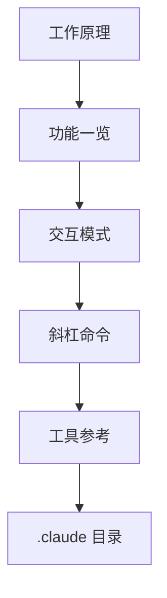

本组涵盖正式使用 Claude Code 之前需要掌握的基本功。您将依次学习智能体循环如何运转、有哪些功能、在交互模式下如何输入、如何运用斜杠命令与工具，以及配置存放在哪里。这里学到的一切 —— 循环、工具、权限、配置目录 —— 正是 MoAI-ADK 在其上搭建挽具的原材料。




**学习目标（一句话总结）**：理解 Claude Code 的工作方式与核心使用界面，为之后顺畅跟进工作流文档与 MoAI-ADK 挽具设计打下基础。


## 学习流程

```mermaid
flowchart TD
    A[工作原理] --> B[功能一览]
    B --> C[交互模式]
    C --> D[斜杠命令]
    D --> E[工具参考]
    E --> F[.claude 目录]
```

先通过工作原理把握全局，再浏览功能地图了解有哪些工具。接着通过交互模式与斜杠命令掌握实际输入方法，最后以工具参考与配置目录收尾，基本功即告完成。

## 目录

| 文档 | 说明 |
|------|------|
| [工作原理](/claude-code/foundations/how-claude-code-works) | 智能体循环与核心组成要素 |
| [功能一览](/claude-code/foundations/features-overview) | 完整功能目录与学习路径 |
| [交互模式](/claude-code/foundations/interactive-mode) | REPL·快捷键·权限模式 |
| [斜杠命令](/claude-code/foundations/commands) | 内置·自定义命令与 /moai 的关系 |
| [工具参考](/claude-code/foundations/tools-reference) | 内置工具与权限 |
| [.claude 目录](/claude-code/foundations/claude-directory) | 配置目录结构与作用域 |

掌握基本功之后，请进入下一组[上下文与记忆](/claude-code/context-memory)，学习管理令牌成本的方法 —— 这是 MoAI-ADK 代币经济学的起点。
