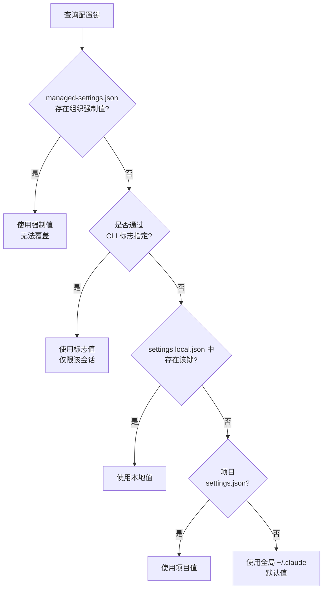

`.claude` 目录是 Claude Code 逐项目读取指令、配置和扩展功能的单一配置根目录。


**一句话总结**: `.claude` 是 Claude Code 在每次会话开始时都会查看的项目专用"操作面板"，其中大部分会提交到 git 与团队共享，仅将个人文件单独隔离。


对大多数用户来说，只需编辑 `CLAUDE.md` 和 `settings.json` 这两个文件就足够了。其余的技能、rules、子智能体可以在需要时逐个添加。

## .claude 目录的作用

Claude Code 从两个位置读取配置。一个是正在处理的项目的 `.claude/` 目录，另一个是主目录下的 `~/.claude/`。项目内的文件会提交到 git 与团队共享，`~/.claude/` 中的文件则保留为适用于所有项目的个人配置。

- **传递项目上下文**: 像 `CLAUDE.md` 这类 Claude "读取并遵循"的指令
- **强制行为**: 像 `settings.json` 的权限 (permissions) 和 hook 这类与 Claude 是否遵守无关、会被"执行"的配置
- **保管扩展功能**: 技能、子智能体、动态工作流等可复用的资产

这里的关键区分是 **指引 (guidance)** 与 **配置 (configuration)**。`CLAUDE.md` 和 rules 是 Claude 参考的说明文档，因此不保证始终被遵守；而 hook 和 permissions 由运行时直接执行，因此是确定性的。如果需要确定的行为，就应该用 hook 或 permissions 来实现，而不是用指引。

## 目录结构

以下是位于项目 `.claude/` 之下的主要条目。`CLAUDE.md`、`.mcp.json`、`.worktreeinclude` 是例外，位于项目根目录。

| 条目 | 位置 | 提交 | 作用 |
| --- | --- | --- | --- |
| `CLAUDE.md` | 项目根目录或 `.claude/` | ✓ | 每次会话作为上下文加载的项目指令 |
| `settings.json` | `.claude/` | ✓ | 权限、hook、环境变量、默认模型等被执行的配置 |
| `settings.local.json` | `.claude/` | - | 个人配置覆盖 (自动 gitignore) |
| `rules/` | `.claude/` | ✓ | 按主题拆分的指令，可按文件路径条件加载 |
| `skills/` | `.claude/` | ✓ | 用 `/name` 调用或由 Claude 自动调用的技能 |
| `commands/` | `.claude/` | ✓ | 单文件提示词 (与技能机制相同) |
| `agents/` | `.claude/` | ✓ | 拥有独立上下文窗口的子智能体定义 |
| `workflows/` | `.claude/` | ✓ | 协调多个子智能体的动态工作流脚本 |
| `hooks/` | `.claude/` | ✓ | hook 执行的脚本 (在 settings.json 中注册) |
| `agent-memory/` | `.claude/` | ✓ | 子智能体专用的持久内存 |
| `.mcp.json` | 项目根目录 | ✓ | 团队共享的 MCP 服务器配置 |

> 官方文档的交互式浏览器中，`hooks/` 目录不会作为独立节点出现。hook 在 `settings.json` 的 `hooks` 键中注册，将要执行的脚本文件放在 `.claude/` 之下，并在配置中指向其路径。

### 指引文件 (Claude 读取的内容)

- **`CLAUDE.md`**: 包含项目的规则、常用命令和架构背景。由于每次会话整个文件都作为上下文加载，建议控制在 200 行以内，过长时拆分到 rules。
- **`rules/*.md`**: 没有 `paths:` frontmatter 时在会话开始时加载，存在 `paths:` glob 时仅在对应文件进入上下文时加载。当 `CLAUDE.md` 接近 200 行时，按主题拆分为 rule 是最佳实践。

### 执行配置 (Claude Code 强制的内容)

- **`settings.json`**: 包含 `permissions` (工具·命令的允许/拒绝)、`hooks` (在事件时点执行脚本)、`statusLine`、`model`、`env`、`outputStyle` 等键。
- **`settings.local.json`**: 模式相同但为个人用，不提交。当需要与团队默认值不同的权限时使用。

### 扩展资产

- **`skills/<name>/SKILL.md`**: 以文件夹为单位的技能，可以将参考文档、模板、脚本一起打包。
- **`commands/*.md`**: 单文件提示词。官方上与技能机制相同，建议将新工作流编写为技能。
- **`agents/*.md`**: 拥有自己的系统提示词和工具访问权限的子智能体。在新的上下文窗口中运行，保持主对话整洁。
- **`workflows/*.js`**: 生成并协调多个子智能体的动态工作流脚本。

## 配置作用域与优先级

同一项配置可能存在于多个位置，越具体的作用域优先级越高。作用域分为企业、用户、项目三个层级。

| 作用域 | 位置 | 适用范围 | 备注 |
| --- | --- | --- | --- |
| 企业 | `managed-settings.json` (各 OS 的系统路径) | 整个组织 | 用户无法覆盖，最高优先级 |
| 用户 (全局) | `~/.claude/` | 所有项目 | 个人默认值，不提交 |
| 项目 | `.claude/` | 当前项目 | 团队共享，提交对象 |
| 项目本地 | `.claude/settings.local.json` | 当前项目，个人 | 用户编辑文件中优先级最高 |

`settings.json` 的优先级按如下方式应用。

- **组织的 managed-settings.json** 压倒一切。
- **CLI 标志** (`--permission-mode`、`--settings` 等) 会覆盖该会话的 `settings.json`。
- **`settings.local.json`** 在用户编辑文件中优先级最高，会覆盖项目的 `settings.json`。
- 项目的 `settings.json` 会覆盖全局的 `~/.claude/settings.json`。

合并方式上有一个重要差异。

- **数组型配置** (如 `permissions.allow`) 会 **合并 (combine)** 所有作用域的值。
- **标量型配置** (如 `model`) 会 **使用** 最具体作用域的 **单个值**。
- `CLAUDE.md` 不是按键合并，而是全局和项目文件 **都加载到上下文** 中，当指令冲突时项目一方优先。

> 在 Windows 上，`~/.claude` 会解析为 `%USERPROFILE%\.claude`。设置 `CLAUDE_CONFIG_DIR` 环境变量后，所有 `~/.claude` 路径都会移到该目录之下。

## 纳入版本管理 vs 排除

`.claude/` 内的文件是否提交，取决于是否与团队共享。团队共同使用的资产要提交，个人用·因机器而异的值则从 git 中排除。

| 文件 | 提交 | 原因 |
| --- | --- | --- |
| `CLAUDE.md`、`rules/`、`settings.json` | ✓ | 团队共享的上下文和策略 |
| `skills/`、`commands/`、`agents/`、`workflows/` | ✓ | 团队共享的扩展资产 |
| `.mcp.json` | ✓ | 团队共享的 MCP 服务器配置 |
| `settings.local.json` | - | 个人覆盖 (自动 gitignore) |
| `~/.claude/` 全部 | - | 适用于所有项目的个人配置，绝不提交 |
| `CLAUDE.local.md` | - | 逐项目的个人指令，手动创建后添加到 `.gitignore` |

Claude Code 首次创建 `settings.local.json` 时，会自动将其添加到 `~/.config/git/ignore`。如果使用自定义的 `core.excludesFile`，或想与团队共享忽略规则，则还需要直接将模式写入项目的 `.gitignore`。

这一点在 MoAI-ADK 中同样重要。MoAI-ADK 将 `settings.local.json` 视为运行时管理的文件，绝不纳入模板，并将因机器而异的令牌·路径·会话状态隔离在此处。详细的逐键行为请参考单独的指南。

## 位于其他位置的相关文件

有些文件不会出现在浏览器中，但与 `.claude` 生态系统密切相关。

| 文件 | 位置 | 作用 |
| --- | --- | --- |
| `managed-settings.json` | 各 OS 的系统路径 | 组织强制的企业配置 |
| `CLAUDE.local.md` | 项目根目录 | 与 `CLAUDE.md` 一起加载的个人指令 |
| 已安装的插件 | `~/.claude/plugins` | 由 `claude plugin` 命令管理的插件数据 |

`~/.claude` 中还会一并存储 Claude Code 在工作过程中记录的数据 (对话转录、提示词历史、文件快照、缓存、日志)。这些数据默认在 30 天 (`cleanupPeriodDays`) 后自动清理。

## 相关文档

- [settings.json 指南](/advanced/settings-json)
- [CLAUDE.md 指南](/advanced/claude-md-guide)
- [Statusline 系统](/advanced/statusline)

## 参考资料

- [Explore the .claude directory (Claude Code 官方文档)](https://code.claude.com/docs/en/claude-directory)


如果是新项目，先只填写 `CLAUDE.md` 和 `settings.json` 这两个文件，把团队权限·hook 放在项目的 `settings.json` 中，把只有自己使用的权限放在 `settings.local.json` 中，就能在没有 git 冲突的情况下干净地起步。

