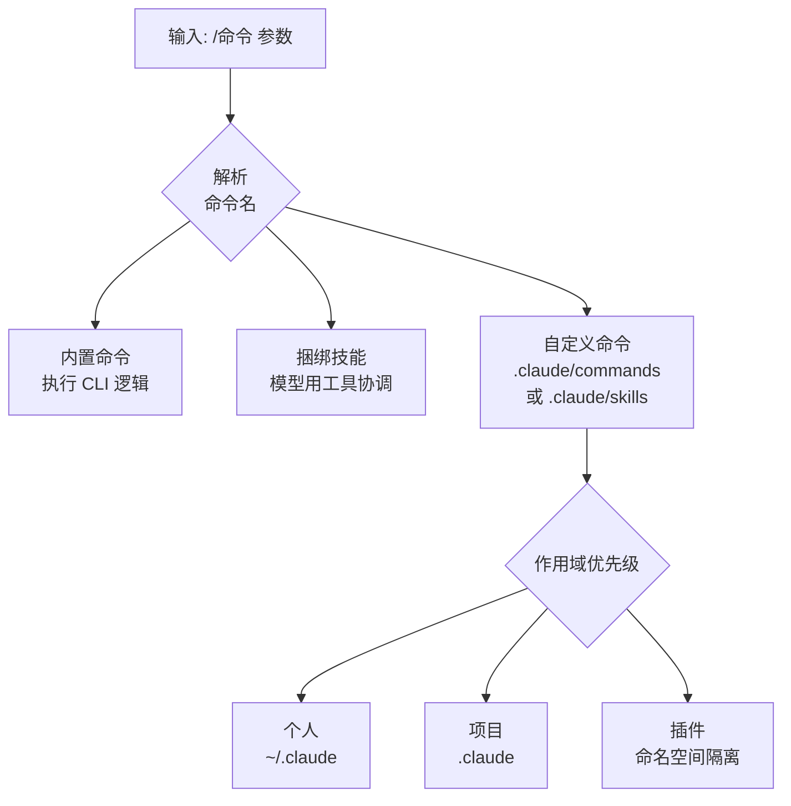

# 斜杠命令

斜杠命令 (slash command) 是在会话中通过以 `/` 开头的一行直接操控 Claude Code 的最快方式。


**一句话总结**：以 `/` 开头的一行输入，从切换模型到整理上下文，再到运行你亲手编写的工作流，让你在指尖掌控整个会话。


## 什么是斜杠命令

斜杠命令在会话内部控制 Claude Code。切换模型、管理权限、清空上下文或运行工作流，都用一行完成。在输入框中输入 `/` 即可列出所有可用命令，在 `/` 后继续输入字符则会进行过滤。

核心规则只有一条。**命令只在消息的最前面**才会被识别。跟在命令名后面的文本会作为参数 (argument) 传递给该命令。

命令大致分为三类。

| 类别 | 定义位置 | 工作方式 |
| :--- | :--- | :--- |
| 内置命令 | 以代码内置于 CLI | 直接执行固定逻辑 |
| 捆绑技能 (bundled skill) | 随 Claude Code 一同附带的技能 | 向模型下达指令，由模型用工具来协调工作 |
| 自定义命令 | `.claude/commands/` 或 `.claude/skills/` | 由用户用 Markdown 直接定义 |

## 内置斜杠命令及技能列表

斜杠命令由三类构成。常用的命令列表如下。完整列表可在输入框中通过 `/` 查看，公式命令参考见 [code.claude.com/docs/en/commands](https://code.claude.com/docs/en/commands)。

### 内置命令 (Built-in)

| 命令 | 用途 | 版本 |
| :--- | :--- | :--- |
| `/goal <condition>` | 设定完成条件并跨多轮自主进行 (Haiku 定期检查) | v2.1.139+ |
| `/workflows` | 动态工作流执行列表管理 UI | v2.1.139+ |
| `/rewind` (别名：`/checkpoint`、`/undo`) | 将代码和对话回退到之前的检查点 | v2.1.191+ |
| `/context [all]` | 分析当前上下文窗口用量 | 基础 |
| `/memory` | 加载·切换 `CLAUDE.md` + 自动内存列表 | v2.1.59+ |
| `/compact` | 在保持同一对话的前提下摘要至今内容以腾出上下文 | 基础 |
| `/clear` (别名：`/reset`、`/new`) | 清空上下文并开始新对话 | 基础 |
| `/agents` | 子智能体管理 UI | v2.1.139+ |
| `/mcp` | MCP 服务器连接及 OAuth 认证管理 | v2.1.186+ |
| `/plugin` | 插件管理 | 基础 |
| `/effort [low\|medium\|high\|xhigh\|max\|ultracode\|auto]` | 设置模型的推理深度或编排方式 | 基础 |
| `/model` | 选择 AI 模型 | 基础 |
| `/background` (别名：`/bg`) | 后台执行 | v2.1.139+ |
| `/fork <directive>` | 继承对话的 fork 子智能体 | v2.1.161+ |
| `/recap` | 会话摘要 | 基础 |
| `/btw` | 旁白提问 | v2.1.187+ |
| `/cd` | 切换会话工作目录，保留提示词缓存 | v2.1.169+ |
| `/schedule` (别名：`/routines`) | 计划任务 | v2.1.72+ |
| `/branch`、`/tasks`、`/plan`、`/doctor`、`/skills`、`/reload-skills`、`/reload-plugins` | 其他管理命令 | 基础 |

### 技能命令 `[Skill]`

| 命令 | 用途 |
| :--- | :--- |
| `/loop` (别名：`/proactive`) | 重复循环执行 (Ralph/间隔 based) |
| `/batch` | 批量执行 |
| `/simplify` | 代码简化 (v2.1.154+) |
| `/code-review` | 代码审查 |

### 工作流命令 `[Workflow]`

| 命令 | 用途 |
| :--- | :--- |
| `/deep-research` | 并行执行网络搜索并交叉验证结果的研究 (需要 WebSearch) |

### 命令可用性说明

- 同一功能往往可以用多个名称调用 (别名)。
- 某些命令会根据平台、计划和环境而有不同的可见性。
- `ultracode` 既是当前工作流触发关键字 (pre-v2.1.160 是 `workflow`) 也是 `/effort` 级别。

## 自定义斜杠命令

你自己编写的命令以 Markdown 文件定义。`.claude/commands/deploy.md` 文件会创建 `/deploy` 命令，同样的工作也可以做成 `.claude/skills/deploy/SKILL.md` 技能。两种方式创建的是同一个命令，行为完全相同。现有的 `.claude/commands/` 文件照常工作，当同名的技能与命令发生冲突时，技能优先。

> 自定义命令已整合进技能。如果要创建新命令，推荐能够将辅助文件一并放置的技能形式，但对于简单的单文件命令，`.claude/commands/` 也已足够。

### frontmatter 字段

通过 Markdown 文件顶部的 YAML frontmatter 来调整行为。所有字段均为可选，但为了让模型判断自动调用的时机，至少推荐填写 `description`。

| 字段 | 说明 |
| :--- | :--- |
| `description` | 命令做什么以及在什么时候使用。用于模型判断是否自动调用 |
| `allowed-tools` | 命令激活期间无需批准即可使用的工具。空格/逗号分隔的字符串或 YAML 列表 |
| `argument-hint` | 自动补全时显示的参数提示。例如：`[issue-number]` |
| `disable-model-invocation` | 为 `true` 时阻止模型自动调用，仅用户可用 `/name` 执行 |
| `model` | 命令运行期间使用的模型 (仅限当前轮次) |

```yaml
---
description: 按照我们的编码标准修复 GitHub 议题
argument-hint: [issue-number]
disable-model-invocation: true
allowed-tools: Bash(git add *) Bash(git commit *)
---

请按照我们的编码标准修复 GitHub 议题 $ARGUMENTS。

1. 阅读议题描述
2. 实现修复
3. 编写测试
4. 创建提交
```

`disable-model-invocation: true` 适用于带有副作用、希望自己掌控时机的工作流，例如部署或提交。它能防止模型仅仅因为代码看起来已就绪就擅自部署。

### $ARGUMENTS 替换

在命令名后输入的文本会替换到 `$ARGUMENTS` 的位置。在上面的例子中，运行 `/fix-issue 123` 时，`$ARGUMENTS` 会变为 `123`。如果命令正文中没有 `$ARGUMENTS`，输入的内容会以 `ARGUMENTS: <输入值>` 的形式追加到正文末尾。

也可以使用按位置的参数。

| 写法 | 含义 |
| :--- | :--- |
| `$ARGUMENTS` | 输入的整个参数字符串 |
| `$ARGUMENTS[N]` | 从 0 开始的第 N 个参数 |
| `$N` | `$ARGUMENTS[N]` 的简写 (`$0` 是第一个) |

例如，正文中写 `将 $0 组件从 $1 迁移到 $2`，运行 `/migrate-component SearchBar React Vue` 时，`$0` 替换为 `SearchBar`、`$1` 替换为 `React`、`$2` 替换为 `Vue`。包含空格的值用引号括起来，作为单个参数传递。

### 动态上下文注入

正文中的 `` !`<命令>` `` 语法会在命令内容传递给模型**之前**执行 shell 命令，并用其输出填充该位置。模型收到的是实际数据，而非命令本身。

```markdown
## 当前变更

!`git diff HEAD`

## 指示

请将上述变更归纳为两三个要点，并列出风险因素。
```

这种内联形式仅在 `!` 位于行首或紧跟空白之后时才会被识别。多行命令使用 `` ```! `` 围栏块。此外，还可以用 `@文件路径` 的形式将文件内容引用进正文。

## 作用域：项目 vs 个人

把命令和技能放在哪里决定了它们的使用范围。

| 作用域 | 路径 | 适用范围 |
| :--- | :--- | :--- |
| 个人 | `~/.claude/commands/` 或 `~/.claude/skills/` | 我的所有项目 |
| 项目 | `.claude/commands/` 或 `.claude/skills/` | 仅该项目 |
| 插件 | `<plugin>/skills/` | 插件启用的地方 |

当同一名称存在于多个级别时，个人会覆盖项目 (若存在组织级的 enterprise 设置，则其最优先)。项目作用域命令的 `allowed-tools` 仅在接受该文件夹的工作区信任 (workspace trust) 对话框之后才生效。不可信仓库中的命令可能给自己授予宽泛的工具权限，因此使用前请先审查。

设置子目录会自然形成命名空间。此外，项目技能会沿着从起始目录到仓库根目录的上级路径搜索所有 `.claude/skills/`，因此即使在子文件夹中启动 Claude Code，也能照常识别根目录的命令。



## 插件提供的命令

插件 (plugin) 可以将命令放入自己的 `skills/` 目录中进行分发。插件技能使用 `插件名:技能名` 的命名空间，因此不会与其他级别的命令发生名称冲突。例如 `my-plugin/skills/review/SKILL.md` 通过 `/my-plugin:review` 调用。插件本身通过 `/plugin` 命令管理。

## 与 MoAI-ADK 的 /moai 命令的关系

MoAI-ADK 提供的 `/moai` 及其子命令 (`/moai plan`、`/moai run`、`/moai sync` 等) 正是以技能的形式实现在这套斜杠命令机制之上。也就是说，MoAI-ADK 直接采用 Claude Code 的自定义命令标准，将基于 SPEC 的工作流以一行命令的形式暴露出来。

| 区分 | Claude Code 斜杠命令 | MoAI-ADK `/moai` 命令 |
| :--- | :--- | :--- |
| 本质 | 会话控制机制 | 用该机制实现的技能集合 |
| 定义位置 | `.claude/commands` 或 `.claude/skills` | MoAI-ADK 分发的技能 |
| 作用 | 切换模型、管理上下文等 | 代理编排工作流 |

`/moai` 命令本身的行为及其子命令在另外的文档中介绍。

## 关联文档

- [/moai 命令](/utility-commands/moai)
- [工作流命令](/workflow-commands)
- [交互模式](/claude-code/foundations/interactive-mode)

## 参考资料

- [Claude Code Commands (官方文档)](https://code.claude.com/docs/en/commands)
- [Extend Claude with skills (官方文档)](https://code.claude.com/docs/en/skills)


对于带有副作用的命令 (部署、提交、向外部发送等)，请加上 `disable-model-invocation: true`，让模型无法擅自执行，并将执行时机牢牢掌握在自己手中。

