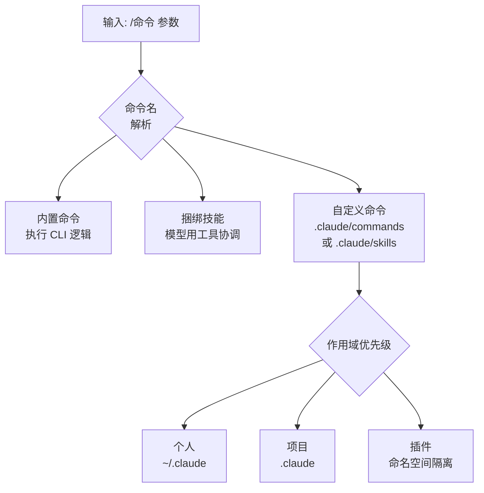

# 斜杠命令

斜杠命令 (slash command) 是在会话内用一行以 `/` 开头的输入直接操控 Claude Code 的最快方式。




**一句话总结**：一行以 `/` 开头的输入，就能在指尖掌控会话 —— 从切换模型、清理上下文，到运行您亲手打造的工作流。


## 什么是斜杠命令

斜杠命令在会话内部控制 Claude Code。切换模型、管理权限、清空上下文、运行工作流，都能用一行完成。在输入框只键入 `/` 即列出所有可用命令，在 `/` 后继续输入字符则进行过滤。

核心规则只有一条：**命令仅在消息最前端**被识别。命令名之后的文本将作为参数 (argument) 传给该命令。

命令大致分为三类。

| 类别 | 定义位置 | 工作方式 |
| :--- | :--- | :--- |
| 内置命令 | 以代码内置于 CLI | 直接执行固定逻辑 |
| 捆绑技能 (bundled skill) | 随 Claude Code 附带的技能 | 向模型传达指令，由模型用工具协调工作 |
| 自定义命令 | `.claude/commands/` 或 `.claude/skills/` | 用户用 Markdown 自行定义 |

## 内置斜杠命令与技能列表

斜杠命令由三种类型构成。常用命令整理如下。完整列表可在输入框键入 `/` 查看，官方命令参考见 [code.claude.com/docs/en/commands](https://code.claude.com/docs/en/commands)。

### 内置命令 (Built-in)

| 命令 | 用途 | 版本 |
| :--- | :--- | :--- |
| `/goal <condition>` | 设定完成条件后跨多回合自主推进（Haiku 定期检查） | v2.1.139+ |
| `/workflows` | 动态工作流执行列表管理 UI | v2.1.139+ |
| `/rewind`（别名：`/checkpoint`、`/undo`） | 把代码与对话回退到之前的检查点 | v2.1.191+ |
| `/context [all]` | 分析当前上下文窗口用量 | 基础 |
| `/memory` | `CLAUDE.md` + 自动记忆加载列表/开关 | v2.1.59+ |
| `/compact` | 保持同一对话，把此前内容摘要以腾出上下文 | 基础 |
| `/clear`（别名：`/reset`、`/new`） | 清空上下文并开始新对话 | 基础 |
| `/agents` | 子智能体管理 UI | v2.1.139+ |
| `/mcp` | MCP 服务器连接及 OAuth 认证管理 | v2.1.186+ |
| `/plugin` | 插件管理 | 基础 |
| `/effort [low\|medium\|high\|xhigh\|max\|ultracode\|auto]` | 设置模型推理强度或编排 | 基础 |
| `/model` | 选择 AI 模型 | 基础 |
| `/background`（别名：`/bg`） | 后台执行 | v2.1.139+ |
| `/fork <directive>` | 继承对话的分叉子智能体 | v2.1.161+ |
| `/recap` | 会话摘要 | 基础 |
| `/btw` | 侧边提问 | v2.1.187+ |
| `/cd` | 更改会话工作目录，保留提示缓存 | v2.1.169+ |
| `/schedule`（别名：`/routines`） | 定时任务 | v2.1.72+ |
| `/branch`、`/tasks`、`/plan`、`/doctor`、`/skills`、`/reload-skills`、`/reload-plugins` | 其他管理命令 | 基础 |

### 技能命令 `[Skill]`

| 命令 | 用途 |
| :--- | :--- |
| `/loop`（别名：`/proactive`） | 运行重复循环（基于 Ralph/interval） |
| `/batch` | 批量执行 |
| `/simplify` | 代码简化 (v2.1.154+) |
| `/code-review` | 代码评审 |

### 工作流命令 `[Workflow]`

| 命令 | 用途 |
| :--- | :--- |
| `/deep-research` | 并行执行网络搜索并交叉验证结果的调研（需 WebSearch） |

### 命令可用性说明

- 同一功能常有多个名称（别名）。
- 部分命令的可见性随平台、套餐、环境而异。
- `ultracode` 目前既是工作流触发关键词（pre-v2.1.160 为 `workflow`），也是一个 `/effort` 等级。

## 自定义斜杠命令

自用命令以 Markdown 文件定义。`.claude/commands/deploy.md` 文件生成 `/deploy` 命令，同样的工作也可以做成 `.claude/skills/deploy/SKILL.md` 技能。两种方式生成同一命令且行为一致。既有的 `.claude/commands/` 文件照常工作，同名技能与命令冲突时技能优先。

> 自定义命令已并入技能体系。新建命令时推荐可附带辅助文件的技能格式，但简单的单文件命令用 `.claude/commands/` 也足够。

### frontmatter 字段

用 Markdown 文件顶部的 YAML frontmatter 调整行为。所有字段均为可选，但为了让模型判断自动调用时机，至少推荐填写 `description`。

| 字段 | 说明 |
| :--- | :--- |
| `description` | 命令做什么及使用时机。用于模型判断是否自动调用 |
| `allowed-tools` | 命令激活期间无需批准即可使用的工具。空格/逗号分隔字符串或 YAML 列表 |
| `argument-hint` | 自动补全时显示的参数提示。例：`[issue-number]` |
| `disable-model-invocation` | 为 `true` 时阻止模型自动调用，仅用户可通过 `/name` 执行 |
| `model` | 命令执行期间使用的模型（仅限当前回合） |

```yaml
---
description: 按我们的编码标准修复 GitHub 议题
argument-hint: [issue-number]
disable-model-invocation: true
allowed-tools: Bash(git add *) Bash(git commit *)
---

请按我们的编码标准修复 GitHub 议题 $ARGUMENTS。

1. 阅读议题描述
2. 实现修复
3. 编写测试
4. 创建提交
```

`disable-model-invocation: true` 适用于部署、提交这类有副作用、需要亲自掌控时机的工作流。它能防止模型仅因代码看似就绪就擅自部署。

### $ARGUMENTS 替换

命令名之后输入的文本会替换到 `$ARGUMENTS` 位置。在上例中执行 `/fix-issue 123` 时，`$ARGUMENTS` 会变成 `123`。若命令正文中没有 `$ARGUMENTS`，输入内容会以 `ARGUMENTS: <输入值>` 形式追加到正文末尾。

也可以使用按位置的参数。

| 写法 | 含义 |
| :--- | :--- |
| `$ARGUMENTS` | 输入的完整参数字符串 |
| `$ARGUMENTS[N]` | 从 0 起算的第 N 个参数 |
| `$N` | `$ARGUMENTS[N]` 的缩写（`$0` 为第一个） |

例如正文写成"把 `$0` 组件从 `$1` 迁移到 `$2`"，执行 `/migrate-component SearchBar React Vue` 后，`$0` 替换为 `SearchBar`，`$1` 为 `React`，`$2` 为 `Vue`。含空格的值请用引号括起来作为一个参数传递。

### 动态上下文注入

正文中的 `` !`<命令>` `` 语法会在命令内容传给模型**之前**执行 shell 命令，并用其输出填充该位置。模型收到的不是命令，而是实际数据。

```markdown
## 当前变更

!`git diff HEAD`

## 指令

请把上述变更总结为两三条要点，并列出风险点。
```

这种内联形式仅当 `!` 位于行首或紧跟空白时才被识别。多行命令请使用 `` ```! `` 围栏块。此外可用 `@文件路径` 的形式把文件内容引用进正文。

## 作用域：项目 vs 个人

命令与技能放在哪里，决定了它的使用范围。

| 作用域 | 路径 | 适用范围 |
| :--- | :--- | :--- |
| 个人 | `~/.claude/commands/` 或 `~/.claude/skills/` | 我的所有项目 |
| 项目 | `.claude/commands/` 或 `.claude/skills/` | 仅该项目 |
| 插件 | `<plugin>/skills/` | 插件被激活之处 |

同名存在于多个层级时，个人覆盖项目（若有组织级 enterprise 配置则其优先级最高）。项目作用域命令的 `allowed-tools` 需在接受该文件夹的工作区信任 (workspace trust) 对话后才生效。不可信仓库的命令可能给自己授予过宽的工具权限，使用前请先审阅。

设置子目录会自然形成命名空间。此外，项目技能会从启动目录到仓库根遍历所有上级路径的 `.claude/skills/`，因此即使在子文件夹启动 Claude Code 也能照常识别根目录的命令。


```mermaid
flowchart TD
    A["输入: /命令 参数"] --> B{"命令名<br/>解析"}
    B --> C["内置命令<br/>执行 CLI 逻辑"]
    B --> D["捆绑技能<br/>模型用工具协调"]
    B --> E["自定义命令<br/>.claude/commands<br/>或 .claude/skills"]
    E --> F{"作用域优先级"}
    F --> G["个人<br/>~/.claude"]
    F --> H["项目<br/>.claude"]
    F --> I["插件<br/>命名空间隔离"]
```

## 插件提供的命令

插件 (plugin) 可在自身的 `skills/` 目录中携带命令进行分发。插件技能使用 `插件名:技能名` 命名空间，因此不会与其他层级的命令重名冲突。例如 `my-plugin/skills/review/SKILL.md` 以 `/my-plugin:review` 调用。插件本身用 `/plugin` 命令管理。

## 与 MoAI-ADK 的 /moai 命令的关系

MoAI-ADK 提供的 `/moai` 及其子命令（`/moai plan`、`/moai run`、`/moai sync` 等）正是作为技能构建在这套斜杠命令机制之上。也就是说，MoAI-ADK 原样采用 Claude Code 的自定义命令标准，把 SPEC 驱动工作流以一行命令的形式暴露出来。不带子命令、用自然语言发出 `/moai "修复登录 Bug"` 这样的请求时，会经过意图分析 (Analyze-First) 路由到合适的工作流 —— 这是与语言无关的语义分类。

| 区分 | Claude Code 斜杠命令 | MoAI-ADK `/moai` 命令 |
| :--- | :--- | :--- |
| 本质 | 会话控制机制 | 用该机制实现的技能集合 |
| 定义位置 | `.claude/commands` 或 `.claude/skills` | MoAI-ADK 分发的技能 |
| 角色 | 切换模型、管理上下文等 | 智能体编排工作流 |

`/moai` 命令本身的行为及其子命令在单独的文档中讲解。

## 相关文档

- [/moai 命令](/utility-commands/moai)
- [工作流命令](/workflow-commands)
- [交互模式](/claude-code/foundations/interactive-mode)

## 参考资料

- [Claude Code Commands（官方文档）](https://code.claude.com/docs/en/commands)
- [Extend Claude with skills（官方文档）](https://code.claude.com/docs/en/skills)


对有副作用的命令（部署、提交、对外发送等）加上 `disable-model-invocation: true`，阻止模型擅自执行，把执行时机牢牢握在自己手中。

