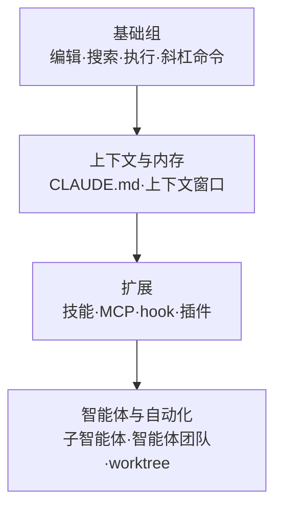

# 功能一览

本页是一个中枢页面，帮助你一目了然地纵览 Claude Code 提供的全部功能，并快速把握每项功能究竟解决了什么问题。


**一句话总结**：Claude Code 是一个对代码进行推理的模型，配备了文件编辑、搜索、执行等内置工具，并在其之上层层叠加上下文、扩展与自动化层。


## 本页的作用

Claude Code 的功能大致分为两条脉络。一条是模型为处理代码而始终使用的**内置工具**(built-in tools)，另一条是用户按需添加的**扩展层**(extension layer)。本页将两条脉络全部铺开，并在每项功能的一行说明旁，指引你前往深入的详细文档。

MoAI-ADK 正是运行在 Claude Code 之上的工作流工具。因此，只要把握这里介绍的功能概念，就能更快地理解 MoAI-ADK 如何编排子智能体、技能与 hook。

## 功能目录

下表以一行说明的形式梳理了 Claude Code 的主要功能。沿着最后一列的链接，即可跳转到各项功能的详细文档。

| 功能 | 一行说明 | 查看详情 |
| --- | --- | --- |
| 代码编辑 | 模型直接读取并修改文件的核心内置功能。 | [基础组](/claude-code/foundations) |
| 搜索 | 在代码库中查找模式、文件、符号的内置工具。 | [基础组](/claude-code/foundations) |
| 命令执行 | 执行 shell 命令以完成构建、测试、git 操作。 | [基础组](/claude-code/foundations) |
| 斜杠命令 | 以 `/` 开头的命令，可立即调用技能或内置行为。 | [基础组](/claude-code/foundations) |
| 交互模式 | 改变权限处理方式或工作风格的会话模式。 | [基础组](/claude-code/foundations) |
| CLAUDE.md / 内存 | 保存每次会话自动加载的持久上下文。 | [上下文与内存](/claude-code/context-memory) |
| 上下文窗口 | 单个会话可容纳的 token 上限及其管理策略。 | [上下文与内存](/claude-code/context-memory) |
| 技能 | 承载可复用知识与工作流的 Markdown 单元。 | [扩展](/claude-code/extensibility) |
| MCP | 将外部服务、工具连接到模型的协议。 | [扩展](/claude-code/extensibility) |
| hook | 在生命周期事件上自动执行脚本、请求、提示词。 | [扩展](/claude-code/extensibility) |
| 结果保存库 | 将 Claude 生成的 HTML、Markdown、代码片段进行结构化和分享。 | [扩展](/claude-code/extensibility) |
| 插件 | 将技能、hook、子智能体、MCP 打包分发的封装单元。 | [扩展](/claude-code/extensibility) |
| 子智能体 | 在隔离上下文中独立执行后仅返回摘要的工作者。 | [智能体与自动化](/claude-code/agentic) |
| 智能体团队 | 多个独立会话共享任务与消息进行协作。 | [智能体与自动化](/claude-code/agentic) |
| worktree | 用分离的工作目录对同一仓库进行并行开发。 | [智能体与自动化](/claude-code/agentic) |
| 检查点 | 在工作过程中保存状态，以便回退。 | [智能体与自动化](/claude-code/agentic) |

### 内置工具系列

内置工具无需额外配置即始终生效，大多数编码任务仅凭这些工具即可处理。

- **代码编辑**：模型打开文件并直接读取、修改的最基础功能。
- **搜索**：在整个代码库中查找文本模式或文件。在类型化语言或大规模代码库 (large codebase) 中，基于语言服务器的代码智能能让符号级别的探索更加准确。
- **命令执行**：执行构建、测试、lint、git 等 shell 命令。
- **斜杠命令**：立即调用像 `/code-review`、`/debug` 这样以捆绑形式提供的命令，或你自行编写的技能。
- **交互模式**：切换自动接受编辑或绕过权限等会话行为方式。

### 上下文与内存系列

- **CLAUDE.md / 内存**：每次会话开始时全部内容自动加载的持久上下文。可在此放置编码规则或「始终执行 X」之类的指引。官方文档建议将 `CLAUDE.md` 保持在 200 行以内，并将不断增多的参考资料分离到技能或 `.claude/rules/` 中。
- **上下文窗口**：单个会话可容纳的输入、输出 token 上限。理解每项功能占用多少上下文，是高效配置的关键。

### 扩展层

扩展层用于增加模型所知的内容、连接外部服务，或自动化工作流。

- **技能** (skill)：承载知识、工作流、指引的 Markdown 文件。可通过 `/<name>` 直接调用，或在关联度高时由模型自动加载。是扩展中最灵活的手段。
- **MCP**：像数据库查询、Slack 发帖、浏览器控制那样，将外部服务与数据连接到模型的协议。
- **hook**：在 `PostToolUse`、`SessionStart` 等生命周期事件上执行脚本、HTTP 请求、提示词、子智能体。适合每次都应以相同方式发生的自动化 (例如编辑后 lint)。
- **插件** (plugin)：将技能、hook、子智能体、MCP 服务器打包为单一安装单元。在多个仓库间复用同一配置，或向他人分发时使用。

### 智能体与自动化系列

- **子智能体**：在自己的上下文窗口中处理任务后，仅将摘要结果返回主对话。在像读取数十个文件的调查任务那样、中间产物不应扰乱主上下文时非常有用。
- **智能体团队** (agent team)：彼此独立的多个 Claude Code 会话通过共享任务列表与消息进行协作。适合验证相互竞争假设的调查或并行代码评审，属于实验性功能，默认处于禁用状态。
- **worktree**：将同一仓库置于分离的工作目录，使多个分支的工作能够无冲突地并行推进。
- **检查点**：记录工作进行中的状态，以便回退变更或返回到安全节点。

## 技能与子智能体的区别

来厘清扩展功能中最常被混淆的两者。核心在于**上下文**(context)的处理方式。

| 区分 | 技能 | 子智能体 |
| --- | --- | --- |
| 本质 | 可复用的指引、知识、工作流 | 拥有自身上下文的隔离工作者 |
| 优势 | 在任何上下文中共享 | 任务被隔离，仅返回摘要 |
| 上下文影响 | 叠加到主窗口 | 使用独立窗口 |
| 适合的工作 | 参考资料、调用型工作流 | 读取大量文件、并行与专项任务 |

技能既可以是调用型行为 (`/deploy`)，也可以是参考知识 (API 风格指南)。当上下文窗口逐渐填满，或无需展示中间工作时，子智能体更为合适。两者也可结合，子智能体可预先加载特定技能，技能也可在隔离上下文中执行。

## 从何处开始读

本节的文档按照学习顺序归为四组。沿着下面的流程，便能顺畅地把握全貌。

| 顺序 | 组 | 能获得什么 |
| --- | --- | --- |
| 1 | [基础组](/claude-code/foundations) | 编辑、搜索、执行等每天都用的核心动作 |
| 2 | [上下文与内存](/claude-code/context-memory) | 用 CLAUDE.md 固定规则并节省上下文的方法 |
| 3 | [扩展](/claude-code/extensibility) | 用技能、MCP、hook、插件增强能力的方法 |
| 4 | [智能体与自动化](/claude-code/agentic) | 用子智能体、智能体团队并行化工作的方法 |

官方文档所推荐的**最佳实践**(best practice)是不要一开始就配置所有功能。其流程是：同样的错误犯第二次时就向 CLAUDE.md 添加一条规则，重复相同的提示词时就存为技能，出现每次都应自动发生的行为时就编写 hook——随着需求逐渐显现，按此方式一项一项地积累起来。

## 关联文档

- [基础组](/claude-code/foundations)
- [上下文与内存](/claude-code/context-memory)
- [扩展](/claude-code/extensibility)
- [智能体与自动化](/claude-code/agentic)
- [快速开始](/getting-started/quickstart)

## 参考资料

- [Extend Claude Code — Features overview](https://code.claude.com/docs/en/features-overview)


若你是第一次使用 Claude Code，请不要一次性打开所有功能。先从基础组掌握起，然后在实际工作中每当意识到「又在重复这件事了」的时刻，按 CLAUDE.md → 技能 → hook 的顺序一项一项地添加。

