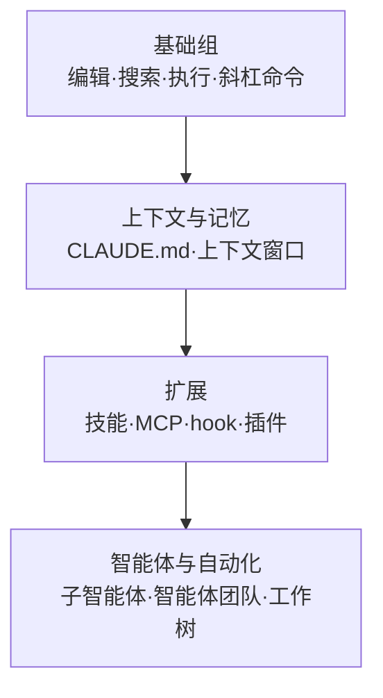

# 功能一览

本页是一站式纵览 Claude Code 全部功能、帮助您快速把握每项功能究竟解决什么问题的中枢。


**一句话总结**：Claude Code 的结构是——在推理代码的模型上挂载文件编辑·搜索·执行等内置工具，再在其上层层叠加上下文·扩展·自动化层。


## 本页的作用

Claude Code 的功能大致分为两条脉络。一条是模型操作代码时时刻使用的**内置工具** (built-in tools)，另一条是用户按需添加的**扩展层** (extension layer)。本页把两条脉络全部铺开，为每项功能附上一句话说明，并指引通往深入的详细文档。

MoAI-ADK 正是运行在这个 Claude Code 之上的智能体开发套件。此处列出的功能同时也是 MoAI-ADK 三大支柱的原材料 —— 上下文窗口与缓存对应**代币经济学**，子智能体·团队·工作树对应**智能体循环工程**，技能·钩子·MCP·插件对应**智能体挽具**。先在这里建立概念，就能更快理解 MoAI-ADK 如何编排它们。

## 功能目录

下表以一句话说明整理了 Claude Code 的主要功能。沿最后一列的链接可前往各功能的详细文档。

| 功能 | 一句话说明 | 详细了解 |
| --- | --- | --- |
| 代码编辑 | 模型直接读取并修改文件的核心内置功能。 | [基础组](/claude-code/foundations) |
| 搜索 | 在代码库中查找模式·文件·符号的内置工具。 | [基础组](/claude-code/foundations) |
| 命令执行 | 执行 shell 命令，完成构建·测试·git 操作。 | [基础组](/claude-code/foundations) |
| 斜杠命令 | 以 `/` 开头的命令，即时调用技能或内置动作。 | [基础组](/claude-code/foundations) |
| 交互模式 | 切换权限处理方式或工作风格的会话模式。 | [基础组](/claude-code/foundations) |
| CLAUDE.md / 记忆 | 保存每个会话自动加载的持久上下文。 | [上下文与记忆](/claude-code/context-memory) |
| 上下文窗口 | 单个会话可容纳的令牌上限及其管理策略。 | [上下文与记忆](/claude-code/context-memory) |
| 技能 | 承载可复用知识·工作流的 Markdown 单元。 | [扩展](/claude-code/extensibility) |
| MCP | 把外部服务·工具连接到模型的协议。 | [扩展](/claude-code/extensibility) |
| hook | 在生命周期事件上自动执行脚本·请求·提示。 | [扩展](/claude-code/extensibility) |
| 产出物仓库 | 结构化并共享 Claude 生成的 HTML·Markdown·代码片段。 | [扩展](/claude-code/extensibility) |
| 插件 | 把技能·hook·子智能体·MCP 打包分发的单元。 | [扩展](/claude-code/extensibility) |
| 子智能体 | 在隔离上下文中独立执行后只返回摘要的工作者。 | [智能体与自动化](/claude-code/agentic) |
| 智能体团队 | 多个独立会话共享任务与消息协同工作。 | [智能体与自动化](/claude-code/agentic) |
| 工作树 | 将同一仓库以隔离的工作目录并行开发。 | [智能体与自动化](/claude-code/agentic) |
| 检查点 | 在工作中途保存状态以便回退。 | [智能体与自动化](/claude-code/agentic) |

### 内置工具系列

内置工具无需额外配置即可始终工作，大多数编码任务仅靠这些工具便能完成。

- **代码编辑**：模型打开文件直接读取和修改的最基本功能。
- **搜索**：在整个代码库中查找文本模式或文件。在类型化语言或大型代码库 (large codebase) 中，基于语言服务器的代码智能能让符号级探索更精准。
- **命令执行**：运行构建·测试·lint·git 等 shell 命令。
- **斜杠命令**：即时调用 `/code-review`、`/debug` 这类捆绑提供的命令或您自建的技能。
- **交互模式**：切换自动接受编辑或绕过权限等会话行为方式。

### 上下文与记忆系列

- **CLAUDE.md / 记忆**：每个会话启动时全文自动加载的持久上下文。用于放置编码规则或"始终执行 X"这类指令。官方文档建议把 `CLAUDE.md` 保持在 200 行以内，把不断膨胀的参考资料拆分到技能或 `.claude/rules/`。
- **上下文窗口**：单个会话可容纳的输入·输出令牌上限。理解每项功能占用多少上下文，是高效配置的关键。

### 扩展层

扩展层用于增加模型的知识、连接外部服务或将工作流自动化。

- **技能** (skill)：承载知识·工作流·指令的 Markdown 文件。可用 `/<name>` 直接调用，相关性高时模型也会自动加载。它是扩展手段中最灵活的一种。
- **MCP**：把数据库查询、Slack 发帖、浏览器控制等外部服务与数据连接到模型的协议。
- **hook**：在 `PostToolUse`、`SessionStart` 等生命周期事件上执行脚本·HTTP 请求·提示·子智能体。适合每次都必须一致发生的自动化（例如编辑后 lint）。
- **插件** (plugin)：把技能·hook·子智能体·MCP 服务器捆绑成一个安装单元。用于在多个仓库间复用同一配置或分发给他人。

### 智能体与自动化系列

- **子智能体**：在自己的上下文窗口中处理任务后，只把摘要结果返回主对话。适合读取数十个文件的调研这类中间产物不应扰乱主上下文的场景。
- **智能体团队** (agent team)：多个相互独立的 Claude Code 会话通过共享任务列表与消息协作。适合验证竞争性假设的调研或并行代码评审，属实验性功能，默认关闭。
- **工作树**：把同一仓库放进隔离的工作目录，让多个分支的工作无冲突地并行推进。
- **检查点**：在工作进行中记录状态，以便撤销变更或回到安全点。

## 技能与子智能体的区别

先厘清扩展功能中最容易混淆的两者。关键在于**上下文** (context) 的处理方式。

| 区分 | 技能 | 子智能体 |
| --- | --- | --- |
| 本质 | 可复用的指令·知识·工作流 | 拥有自身上下文的隔离工作者 |
| 强项 | 可在任何上下文中共享 | 任务被隔离且只返回摘要 |
| 上下文影响 | 叠加到主窗口 | 使用独立窗口 |
| 适合的工作 | 参考资料、调用式工作流 | 大量文件读取、并行·专业任务 |

技能既可以是调用式动作（`/deploy`），也可以是参考知识（API 风格指南）。当上下文窗口渐满或无需展示中间过程时，子智能体更合适。两者也能结合 —— 子智能体可以预加载某个技能，技能也可以在隔离上下文中运行。

## 从哪里读起

本节文档按学习顺序分为四组。沿以下流程推进即可顺畅把握全貌。

```mermaid
flowchart TD
    A[基础组<br>编辑·搜索·执行·斜杠命令] --> B[上下文与记忆<br>CLAUDE.md·上下文窗口]
    B --> C[扩展<br>技能·MCP·hook·插件]
    C --> D[智能体与自动化<br>子智能体·智能体团队·工作树]
```

| 顺序 | 组 | 收获什么 |
| --- | --- | --- |
| 1 | [基础组](/claude-code/foundations) | 编辑·搜索·执行等每日使用的核心操作 |
| 2 | [上下文与记忆](/claude-code/context-memory) | 用 CLAUDE.md 固定规则、节省上下文的方法 |
| 3 | [扩展](/claude-code/extensibility) | 用技能·MCP·hook·插件增强能力的方法 |
| 4 | [智能体与自动化](/claude-code/agentic) | 用子智能体·智能体团队并行化工作的方法 |

官方文档推荐的**最佳实践** (best practice) 是不要一开始就配置所有功能。同一个错误犯两次就往 CLAUDE.md 加规则，反复输入同一提示就存成技能，出现每次都必须自动发生的动作就写 hook —— 随着需求显现逐一累积。这条"需要时再加一个"的原则在令牌视角下同样正确 —— 用不上的扩展只会占据上下文，而上下文就是成本。

## 相关文档

- [基础组](/claude-code/foundations)
- [上下文与记忆](/claude-code/context-memory)
- [扩展](/claude-code/extensibility)
- [智能体与自动化](/claude-code/agentic)
- [快速开始](/getting-started/quickstart)

## 参考资料

- [Extend Claude Code — Features overview](https://code.claude.com/docs/en/features-overview)


初次接触 Claude Code 时不要一次性打开所有功能：先熟悉基础组，然后在实际工作中每逢"又在重复这件事"的瞬间，按 CLAUDE.md → 技能 → hook 的顺序逐一添加。

