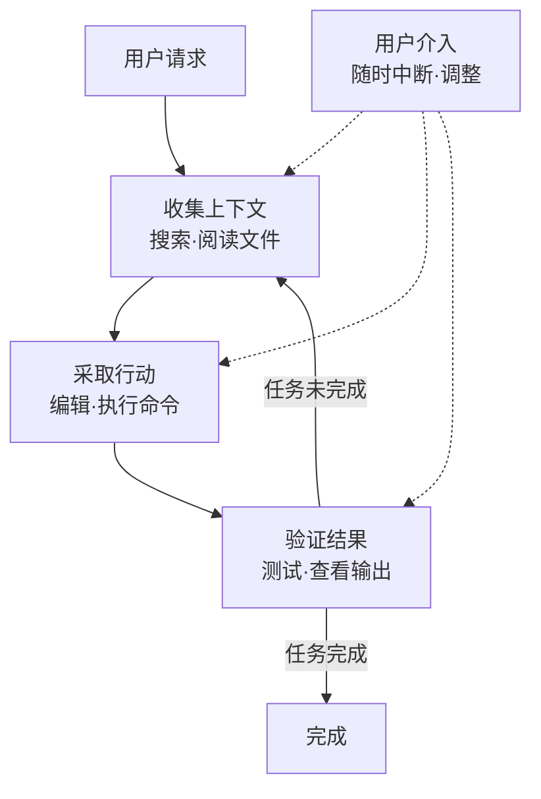

# 工作原理

本文讲解 Claude Code 在理解代码并直接执行工具以完成任务时，其智能体循环的工作原理。


**一句话总结**: Claude Code 是一款终端原生的编码智能体，它将负责推理的模型与负责行动的工具结合起来，自主反复执行"收集上下文 → 采取行动 → 验证结果"。


## 什么是 Claude Code

Claude Code 是一款在 **终端** (terminal) 中运行的智能体助手。它尤其擅长编码，但凡是命令行能做的事，从撰写文档、运行构建、搜索文件到调研主题，它都能广泛地提供帮助。

核心概念是 **智能体框架** (agentic harness)。Claude Code 包裹住模型 Claude，为其提供工具、上下文管理和执行环境。换言之，它是一层外壳，将原本只能生成文本的语言模型，转变为真正能驾驭代码库的得力编码智能体。

## 智能体循环

当你把任务交给 Claude 时，它会经历三个阶段。这些阶段与其说是泾渭分明，不如说是彼此交织、连贯流转。

```text
请求 → 收集上下文(gather context) → 采取行动(take action) → 验证结果(verify results) → 重复
```

| 阶段 | 所做的事 |
|------|----------|
| **收集上下文** (gather context) | 搜索并阅读文件，了解代码结构 |
| **采取行动** (take action) | 修改文件或执行命令以做出变更 |
| **验证结果** (verify results) | 运行测试或查看输出，检验工作是否正确 |

循环会根据请求的性质进行调整。关于代码库的提问可能仅靠收集上下文便可结束，修复缺陷会多次循环这三个阶段，而重构则可能在验证上投入大量比重。Claude 会根据上一阶段所学决定下一步行动，将数十个动作串联起来，并自行修正方向。



用户也是这一循环的一部分。你随时可以中断工作 (`Esc`)，或者不停止它而发送修正消息 (`Enter`) 来改变方向。Claude 在自主工作的同时，会持续响应你的输入。

## 核心组成要素

智能体循环依靠 **负责推理的模型** (model) 与 **负责行动的工具** (tools) 这两条轴运转。在此之上，还有承载对话与文件的上下文，以及掌控行动的权限。

### 模型

Claude Code 借助 Claude 模型来理解代码、推理任务。它能阅读任何语言的代码，把握各组成部分如何相互连接，并将复杂任务拆分为多个步骤来执行。

| 模型 | 特点 |
|------|------|
| Sonnet | 从容处理大多数编码任务 |
| Opus | 为复杂的架构决策提供强劲的推理能力 |

会话中可用 `/model` 命令切换模型，启动时可用 `claude --model <name>` 切换。

### 工具

正是有了工具，Claude 才能超越文本回复、真正采取行动。内置工具大致分为五个类别。

| 类别 | Claude 能做的事 |
|------|-----------------|
| **文件操作** (file operations) | 读取文件、编辑代码、新建文件、重命名与重组 |
| **搜索** (search) | 按模式查找文件、用正则表达式搜索内容、探索代码库 |
| **执行** (execution) | 运行 Shell 命令、启动服务器、运行测试、使用 git |
| **网络** (web) | 网络搜索、获取文档、查询错误信息 |
| **代码智能** (code intelligence) | 编辑后检查类型错误与警告、跳转到定义、查找引用 |

此外，还有诸如生成子智能体、向用户提问之类的编排工具。每次使用工具都会返回新信息，而这些信息引出下一步决策，这正是智能体循环。

### 上下文

当你在某个目录中运行 `claude` 的那一刻，Claude 即可访问以下内容。

- **项目**: 当前目录及其子目录中的文件 (若有权限，亦可访问之外的文件)
- **终端**: 构建工具、git、包管理器等命令行能完成的一切操作
- **git 状态**: 当前分支、未提交的变更、最近的提交历史
- **`CLAUDE.md`**: 一个 Markdown 文件，存放每次会话都需知晓的项目专属规则与约定
- **自动记忆** (auto memory): 自动保存工作中习得的模式与偏好 (`MEMORY.md` 的开头部分会在会话开始时加载)
- **扩展功能**: 已配置的 MCP 服务器、技能、子智能体等

### 权限

掌控行动的权限模型将在下方的 [权限模型](#权限模型) 一节中讲解。

## 运行位置与界面

无论在哪里使用，智能体循环、工具与功能都是一致的。所改变的，是 **代码运行的位置** 与 **交互的方式**。

### 执行环境

| 环境 | 代码运行位置 | 用途 |
|------|--------------|------|
| **本地** (local) | 自己的电脑 | 默认值。完全访问文件、工具与环境 |
| **云端** (cloud) | Anthropic 托管的 VM | 委派任务，处理本地没有的仓库 |
| **远程控制** (remote control) | 自己的电脑，从浏览器控制 | 使用 Web UI，同时将一切保留在本地 |

### 界面

你可以通过终端、桌面应用、IDE 扩展 (VS Code·JetBrains)、`claude.ai/code` 网页、远程控制、Slack 以及 CI/CD 流水线来访问。界面只是改变查看与操作的方式，其底层的智能体循环始终如一。

## 会话与上下文窗口

工作期间，Claude Code 会将对话以 JSONL 文件形式本地保存在 `~/.claude/projects/` 之下。借此，你可以倒回 (rewind)、续接 (resume) 或分叉 (fork) 会话。

- **会话相互独立**: 新会话以空的上下文窗口开始，不会带入此前的对话历史。若要跨会话保留，请使用自动记忆与 `CLAUDE.md`。
- **续接·分叉**: `claude --continue` 与 `claude --resume` 以相同的会话 ID 续接，而 `--fork-session` 与 `/branch` 则将历史复制到一个新的会话 ID。

**上下文窗口** (context window) 容纳着对话历史、文件内容、命令输出、`CLAUDE.md`、自动记忆、已加载的技能以及系统指令。随着工作推进、上下文逐渐充满，Claude 会自动进行压缩 (compaction)，此时早期的指令可能会丢失。请把始终须遵守的规则放在 `CLAUDE.md` 中而非对话历史里，并用 `/context` 查看是什么在占用空间。

## 检查点与权限

Claude 有两道安全保障：一是用于撤销文件变更的检查点，二是用于界定无需询问即可执行的行动范围的权限。

### 用检查点撤销

**任何文件编辑都可以撤销。** Claude 在编辑文件之前，会将当前内容保存为快照。一旦出现问题，按两次 `Esc` 即可倒回到先前状态，或请求 Claude 还原。

检查点仅限于会话之内，与 git 相互独立，且只处理文件变更。像数据库、API、部署这类会影响远端的行动无法撤销，因此 Claude 在执行带有外部副作用的命令之前会先行询问。

### 权限模型

按 `Shift+Tab` 在各权限模式之间循环切换。

| 模式 | 行为 |
|------|------|
| **默认** (default) | 每次文件编辑与 Shell 命令前都进行确认 |
| **自动接受编辑** (auto-accept edits) | 对 `mkdir`·`mv` 等常见文件命令及编辑不经询问直接执行，其余命令则进行确认 |
| **计划** (plan mode) | 仅使用只读工具，并在执行前撰写一份待批准的计划 |
| **自动** (auto mode) | 配合后台安全检查，对所有行动进行评估 (研究预览) |

若在 `.claude/settings.json` 中预先允许特定命令，便不会每次都被询问。这对 `npm test` 或 `git status` 这类受信任的命令很有用，且设置的范围可从组织全局策略一直到个人偏好。

## 与其他工具的区别

Claude Code 与内联代码助手的区别有两点。

- **终端原生** (terminal-native): 它直接驾驭命令行能完成的一切操作，即构建、测试、git 与包管理器。
- **对大型代码库的整体认知**: 它看到的不仅是当前文件，而是整个项目。当你说"修一下认证缺陷"，它会搜索相关文件，阅读多个文件以把握上下文，做出跨文件的一致编辑，再用测试验证，若你提出要求还会一并提交。

## 相关文档

- [功能一览](/claude-code/foundations/features-overview)
- [什么是 MoAI-ADK?](/core-concepts/what-is-moai-adk)

## 参考资料

- [How Claude Code works](https://code.claude.com/docs/en/how-claude-code-works)
- [Extend Claude Code (Features overview)](https://code.claude.com/docs/en/features-overview)


对于复杂任务，与其径直开始写代码，不如按两次 `Shift+Tab` 进入计划模式，让它先分析代码库。审阅并打磨计划后再让它实现，从第一次尝试起便能获得更准确的结果。

