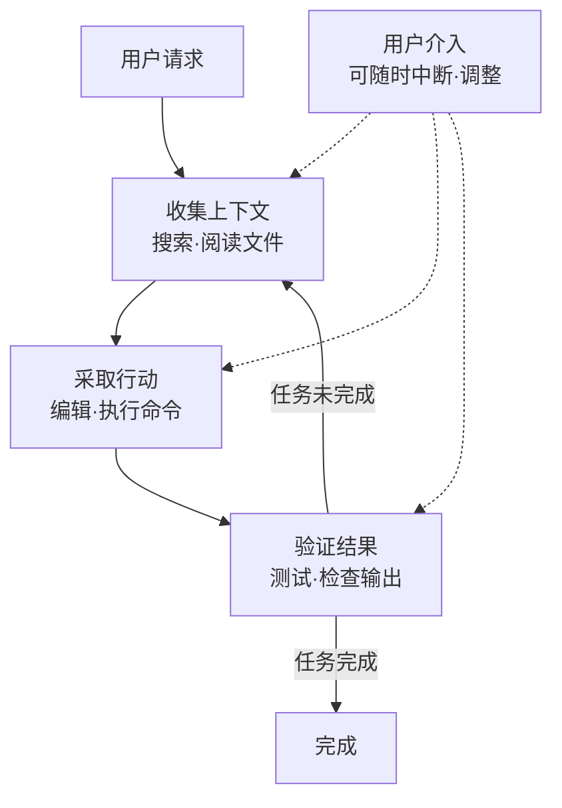

# 工作原理

本文讲解 Claude Code 理解代码、直接执行工具并完成任务的智能体循环的工作原理。


**一句话总结**：Claude Code 是把负责推理的模型与负责行动的工具绑在一起、自主重复"收集上下文 → 采取行动 → 验证结果"的终端原生编码智能体，MoAI-ADK 的三大支柱全部建立在这一循环之上。


## Claude Code 是什么

Claude Code 是在**终端** (terminal) 中运行的智能体助手。它尤其擅长编码，但凡是命令行能做的事 —— 撰写文档、执行构建、搜索文件、调研主题 —— 它都能广泛提供帮助。

核心概念是**智能体挽具** (agentic harness)。挽具是环绕基础模型、协调其执行的系统 —— 决定模型如何思考与规划、调用哪些工具、如何管理上下文、产出物存放在哪里、结果如何评估的那一层。Claude Code 包裹模型 Claude，为其提供工具、上下文管理与执行环境，从而把只会生成文本的语言模型变成真正能操作代码库的能干编码智能体。MoAI-ADK 所说的"与其亲手写代码，不如设计让智能体好好工作的环境"这一挽具工程，正是该概念的延伸。

## 智能体循环

接到任务后，Claude 会经历三个阶段。这些阶段并非泾渭分明，而是彼此交织流转。

```text
请求 → 收集上下文(gather context) → 采取行动(take action) → 验证结果(verify results) → 重复
```

| 阶段 | 做的事 |
|------|---------|
| **收集上下文** (gather context) | 搜索并阅读文件，掌握代码结构 |
| **采取行动** (take action) | 修改文件或执行命令，施加变更 |
| **验证结果** (verify results) | 运行测试或检查输出，确认工作是否正确 |

循环会根据请求性质自我调整。关于代码库的提问可能只需收集上下文即可结束，修复 Bug 会在三个阶段间多次循环，而重构则可能把重心放在验证上。Claude 基于上一步学到的内容决定下一步行动，将数十个动作串联起来并自我校正方向。


```mermaid
flowchart TD
    A[用户请求] --> B[收集上下文<br/>搜索·阅读文件]
    B --> C[采取行动<br/>编辑·执行命令]
    C --> D[验证结果<br/>测试·检查输出]
    D -->|任务未完成| B
    D -->|任务完成| E[完成]
    F[用户介入<br/>可随时中断·调整] -.-> B
    F -.-> C
    F -.-> D
```

用户也是这个循环的一部分。您可以随时中断任务（`Esc`），或在不停止的情况下发送纠正消息（`Enter`）改变方向。Claude 在自主工作的同时会持续响应您的输入。

## 核心组成要素

智能体循环靠**负责推理的模型** (model) 与**负责行动的工具** (tools) 两条轴运转。此外还有承载对话与文件的上下文，以及管控行为的权限。

### 模型

Claude Code 用 Claude 模型理解代码并对任务进行推理。它能阅读任何语言的代码、掌握各组成部分如何关联，并把复杂任务拆成步骤执行。

| 模型 | 特点 |
|------|------|
| Sonnet | 顺畅处理大多数编码任务 |
| Opus | 为复杂架构决策提供强推理能力 |

会话中可用 `/model` 命令切换模型，启动时可用 `claude --model <name>`。

### 工具

有了工具，Claude 才能超越文本回复真正采取行动。基础工具大致分为五类。

| 类别 | Claude 能做的事 |
|------|------------------------|
| **文件操作** (file operations) | 读取文件、编辑代码、创建新文件、重命名与重组 |
| **搜索** (search) | 按模式查找文件、用正则搜索内容、探索代码库 |
| **执行** (execution) | 运行 shell 命令、启动服务器、运行测试、使用 git |
| **网络** (web) | 网络搜索、抓取文档、查询错误信息 |
| **代码智能** (code intelligence) | 编辑后检查类型错误与警告、跳转定义、查找引用 |

此外还有创建子智能体、向用户提问等编排类工具。每次工具使用都会返回新信息，而这些信息又引出下一个决策 —— 这正是智能体循环。

### 上下文

在目录中运行 `claude` 的那一刻，Claude 即可访问以下内容。

- **项目**：当前目录及其子目录中的文件（获得权限后也可访问其他文件）
- **终端**：构建工具、git、包管理器等命令行能做的一切
- **git 状态**：当前分支、未提交的变更、最近提交历史
- **`CLAUDE.md`**：存放每个会话都应知晓的项目规则与惯例的 Markdown 文件
- **自动记忆** (auto memory)：自动保存工作中学到的模式与偏好（`MEMORY.md` 的开头部分在会话启动时加载）
- **扩展功能**：已配置的 MCP 服务器、技能、子智能体等

当上下文窗口被填满时，Claude 会自动压缩上下文。压缩时先清理早期的工具调用结果，再对剩余信息进行摘要。此外，MCP 工具定义会延迟到被显式请求时才加载，做到按需加载所需工具。

### 权限

管控行为的权限模型见下文[权限模型](#权限模型)一节。

## 运行位置与界面

无论在哪里使用，智能体循环、工具与功能都完全相同。变化的是**代码运行的位置**和**交互的方式**。

### 运行环境

| 环境 | 代码运行位置 | 用途 |
|------|----------------|------|
| **本地** (local) | 我的电脑 | 默认值。可完全访问文件·工具·环境 |
| **云端** (cloud) | Anthropic 托管的 VM | 委派任务、操作本地没有的仓库 |
| **远程控制** (remote control) | 我的电脑，由浏览器控制 | 使用 Web UI 但一切保留在本地 |

### 界面

可通过终端、桌面应用、IDE 扩展（VS Code·JetBrains）、`claude.ai/code` 网页、远程控制、Slack、CI/CD 流水线访问。界面只改变查看与操作的方式，底层的智能体循环完全一样。

## 会话与上下文窗口

Claude Code 会在工作期间把对话以 JSONL 文件形式本地存储在 `~/.claude/projects/` 下。因此可以回退 (rewind)、续接 (resume) 或分叉 (fork) 会话。

- **会话相互独立**：新会话以空的上下文窗口开始，不会带入之前的对话历史。要跨会话保留内容，请使用自动记忆和 `CLAUDE.md`。
- **续接·分叉**：`claude --continue` 或 `claude --resume` 以相同会话 ID 续接，`--fork-session` 或 `/branch` 则把历史复制到新的会话 ID。

**上下文窗口** (context window) 中装有对话历史、文件内容、命令输出、`CLAUDE.md`、自动记忆、已加载技能与系统指令。随着工作推进上下文逐渐填满时，Claude 会自动压缩 (compaction)，此时早期指令可能丢失。务必遵守的规则应放在 `CLAUDE.md` 而非对话历史中，并用 `/context` 查看是什么占据了空间。

## 检查点与权限

Claude 有两道安全防线：可回退文件变更的检查点，以及界定无需询问即可执行的行为范围的权限。

### 用检查点回退

**所有文件编辑都可以撤销。** Claude 在编辑文件前会将当前内容保存为快照。出现问题时，按两次 `Esc` 回退到之前的状态，或直接请求恢复即可。

检查点仅限于会话，与 git 无关，且只处理文件变更。数据库、API、部署这类影响远端的行为无法撤销，因此 Claude 在执行有外部副作用的命令前会先询问。

### 权限模型

按 `Shift+Tab` 循环切换权限模式。

| 模式 | 行为 |
|------|------|
| **默认** (default) | 文件编辑与 shell 命令执行前每次确认 |
| **自动接受编辑** (auto-accept edits) | `mkdir`·`mv` 等常见文件命令与编辑不询问直接执行，其余命令需确认 |
| **计划** (plan mode) | 仅使用只读工具，在执行前撰写待批准的计划 |
| **自动** (auto mode) | 配合后台安全检查评估所有行为（研究预览） |

在 `.claude/settings.json` 中预先允许特定命令，就不必每次询问。这对 `npm test`、`git status` 这类可信命令很有用，配置范围可从组织级策略到个人偏好。

## 与其他工具的差异

Claude Code 与内联代码助手的不同之处有两点。

- **终端原生** (terminal-native)：直接操作命令行能做的一切，即构建·测试·git·包管理器。
- **对大型代码库的整体感知**：它看到的不只是当前文件，而是整个项目。当您说"修复这个认证 Bug"时，它会搜索相关文件、阅读多个文件掌握上下文、跨文件做出一致的编辑、用测试验证，并在您要求时完成提交。

## 与 MoAI-ADK 的关联 —— 建立在循环之上的三大支柱

本页所见的智能体循环是 MoAI-ADK 三大支柱的共同基础。

- **代币经济学**：循环每转一圈都会消耗上下文与令牌。MoAI-ADK 为每个工作阶段分配合适的模型与推理深度、精简上下文、让系统守住预算，从而以更低成本运转同一循环。
- **智能体循环工程**：与其让人每次盯着"收集上下文 → 采取行动 → 验证结果"的重复，不如通过完成条件（`/goal`）与诊断循环（`/moai loop`）把循环本身变成设计对象。
- **智能体挽具**：权限模型、CLAUDE.md、工具配置这些本页要素正是挽具的零件。MoAI-ADK 在这些零件之上叠加 SPEC 工作流与智能体目录。

## 相关文档

- [功能一览](/claude-code/foundations/features-overview)
- [什么是 MoAI-ADK？](/core-concepts/what-is-moai-adk)

## 参考资料

- [How Claude Code works](https://code.claude.com/docs/en/how-claude-code-works)
- [Extend Claude Code (Features overview)](https://code.claude.com/docs/en/features-overview)


面对复杂任务时，与其直接动手写代码，不如按两次 `Shift+Tab` 进入计划模式，让 Claude 先分析代码库。审阅并打磨计划后再让它实现，第一次尝试就能得到更精准的结果。

