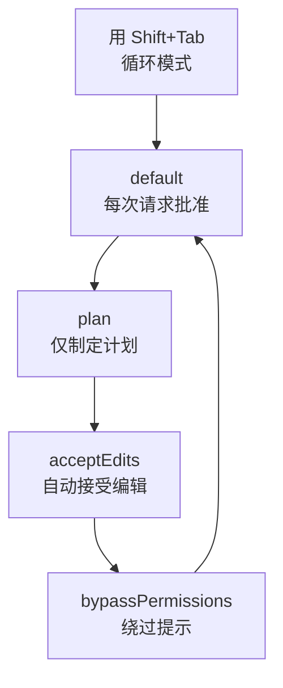

# 交互模式

本文整理在终端运行 Claude Code 时进入的交互式会话（REPL）的输入方式、快捷键和权限模式。


**一句话总结**：交互模式是 Claude Code 的 **驾驶舱**，从一行提示词到 `/` 命令、`!` bash 执行、`@` 文件引用，再到粘贴图片，所有输入都汇聚于此。


## 交互式会话（REPL）的基本流程

运行 `claude` 命令会打开一个交互式 REPL（Read-Eval-Print Loop）。在这里你用自然语言发送请求，Claude 会读取和修改代码、执行命令并作出响应。一次请求与响应称为一个 **回合（turn）**，只要会话还在运行，对话上下文就会持续累积。

基本流程很简单。

```text
1. 运行 claude → 启动交互式会话
2. 输入提示词 → 用 Enter 提交
3. Claude 响应（工具调用 + 结果）
4. 重复后续请求 → 上下文累积
5. /clear 开启新会话，Ctrl+D 退出
```

会话进行期间会按工作目录保存输入历史，对于复杂的多步骤任务，Claude 会创建任务清单来跟踪进度。

## 五种输入方式

交互式会话的输入框不是简单的文本输入器。其行为会根据首个字符而变化。

| 输入方式 | 触发条件 | 说明 |
|-----------|--------|------|
| **普通提示词** | 直接输入 | 自然语言请求。Claude 会进行解析并开展工作。 |
| **斜杠命令** | 以 `/` 开头 | 调用内置命令、技能、插件/MCP 命令。 |
| **bash 执行** | 以 `!` 开头 | 不经过 Claude，直接执行 shell 命令。 |
| **文件引用** | 输入 `@` | 弹出文件路径自动补全，将特定文件添加到上下文。 |
| **粘贴图片** | `Ctrl+V`（粘贴） | 将剪贴板图片以 `[Image #N]` 标签形式插入。 |

### 斜杠命令 (/)

在输入框最前面键入 `/`，会弹出所有可用命令的菜单。不仅有内置命令，捆绑技能、用户编写的技能，以及插件和 MCP 服务器贡献的命令都会汇聚在这一个菜单中。在 `/` 后继续输入字符，候选项会实时缩小范围。详细列表请参阅 [斜杠命令](/claude-code/foundations/commands) 文档。

### bash 执行 (!)

以 `!` 开头会切换到 shell 模式，命令会在不经过 Claude 解析的情况下立即执行。

```bash
! npm test
! git status
! ls -la
```

shell 模式会将命令及其输出添加到对话上下文，因此你既能进行快速的 shell 操作，又能让 Claude 知晓结果。耗时较长的命令可以用 `Ctrl+B` 发送到后台，在输入为空时用 `Escape` 或 `Backspace` 退出 shell 模式。

### 文件引用 (@)

输入 `@` 会弹出文件路径自动补全。选择想要的文件后，该文件会被拉入 Claude 的上下文，让你能够准确地发送诸如“帮我修改这个文件”之类的请求。

### 粘贴图片

用 `Ctrl+V` 粘贴截图或设计稿，会在光标位置插入一个 `[Image #N]` 标签。你可以在提示词中按位置引用该标签，从而把文本和图片混合在一起进行说明。

| 环境 | 粘贴图片按键 |
|------|---------------------|
| 默认 | `Ctrl+V` |
| iTerm2 (macOS) | `Cmd+V` |
| Windows / WSL | `Alt+V` |

## 键盘快捷键

以下是交互式会话的核心快捷键。部分行为可能因平台和终端而异。

| 快捷键 | 动作 |
|--------|------|
| `Esc` | 中断 Claude 的响应（中途停止并转换方向，工作成果保留） |
| `Esc` `Esc` | 若有输入则清空草稿，若为空则打开回退菜单 |
| `Ctrl+C` | 中断执行或清空输入（按两次退出） |
| `Ctrl+D` | 结束会话（EOF） |
| `Shift+Tab` | 循环切换权限模式 |
| `Ctrl+R` | 反向搜索命令历史 |
| `Ctrl+O` | 切换记录查看器（工具使用详情视图） |
| `Ctrl+T` | 切换任务清单 |
| `Ctrl+B` | 将正在运行的任务转入后台 |
| `Ctrl+L` | 重绘屏幕（恢复错乱的输出） |
| `Up` / `Down` | 移动光标，到达末尾后浏览历史 |

### 回退 (Esc Esc)

当输入框为空时，连按两次 `Esc` 会打开 **回退菜单（rewind menu）**。这一功能可以将代码和对话恢复到先前的时间点或进行摘要，详细内容在 [检查点](/claude-code/context-memory/checkpointing) 文档中讲解。

### 历史搜索 (Ctrl+R)

用 `Ctrl+R` 以交互方式搜索先前的命令。输入搜索词后，匹配部分会被高亮，再次按 `Ctrl+R` 会移动到更早的匹配项。用 `Ctrl+S` 切换搜索范围（本会话 / 本项目 / 所有项目），用 `Tab` 或 `Esc` 接受后再编辑，用 `Enter` 立即执行。

### macOS 上的 Option 键注意事项

`Alt+B`、`Alt+F`、`Alt+P` 这类 Option 键组合，在 macOS 上需要将终端的 Option 设置为 Meta 才能生效。iTerm2 需在 Keys 设置中将 Option 设为 “Esc+”，Apple Terminal 需开启 “Use Option as Meta Key”。

## 权限模式

Claude Code 通过 **权限模式（permission mode）** 来调节文件修改和命令执行在多大程度上自动放行。可以用 `Shift+Tab` 循环切换模式。

| 模式 | 行为 | 适用场景 |
|------|------|-------------|
| **default** | 每个操作都向用户请求批准 | 谨慎的日常工作 |
| **plan** | 不修改代码，仅制定计划 | 在变更前审查方案 |
| **acceptEdits** | 自动接受文件编辑 | 可信赖的重复编辑 |
| **bypassPermissions** | 绕过权限提示 | 限定使用，例如隔离的沙箱环境 |



bypass 模式会跳过权限确认，因此仅在可信赖的隔离环境中使用才更安全。MoAI-ADK 也会配合工作流阶段来运用这些模式，尤其是 plan 模式与计划审查门控配合得很好。

## 多行输入、vim 模式与输出风格

### 多行输入

在一条提示词中输入多行的方法因终端而异。

| 方法 | 快捷键 | 备注 |
|------|--------|------|
| 快速换行 | `\` + `Enter` | 在所有终端中均可使用 |
| Shift+Enter | `Shift+Enter` | iTerm2、WezTerm、Ghostty、Kitty、Warp 等默认支持 |
| 控制序列 | `Ctrl+J` | 无需配置，处处可用 |
| 粘贴模式 | 直接粘贴 | 适合代码块、日志 |

如果在 VS Code、Cursor、Windsurf、Zed 等中需要 `Shift+Enter` 绑定，运行 `/terminal-setup` 即可。

### vim 模式

可以在 `/config` 的 Editor mode 中开启 vim 风格编辑。用 `Esc` 和 `i`/`a` 在 NORMAL 模式与 INSERT 模式之间切换，并能照常使用熟悉的 vim 操作：`h`/`j`/`k`/`l` 移动、`dd`/`yy`/`p` 编辑，乃至 `iw`/`a"` 这类文本对象。不过，`Ctrl+V` 块可视模式不受支持。

### 输出风格与附加功能

在 `/config` 中调整主题、显示选项、会话回顾（Session recap）等设置。此外常用的附加功能如下。

- **`/btw`**：在不污染对话历史的情况下，就当前任务快速提问。回答仅以临时浮层形式显示。
- **`/recap`**：生成会话摘要（session recap）。默认在进行超过 3 分钟或 3 轮以上的会话中自动激活。
- **任务清单**：用 `Ctrl+T` 展开或折叠 Claude 在多步骤任务中创建的任务清单。
- **扩展思考切换**：用 `Option+T`（macOS）或 `Alt+T` 开启和关闭扩展思考模式。

## 相关文档

- [斜杠命令](/claude-code/foundations/commands)
- [检查点](/claude-code/context-memory/checkpointing)
- [快速开始](/getting-started/quickstart)

## 参考资料

- [Claude Code Interactive mode（官方文档）](https://code.claude.com/docs/en/interactive-mode)


最安全也最快速的流程是：先用 `Shift+Tab` 从 plan 模式开始，确认 Claude 的方案，待信任建立后再切换到 acceptEdits。

