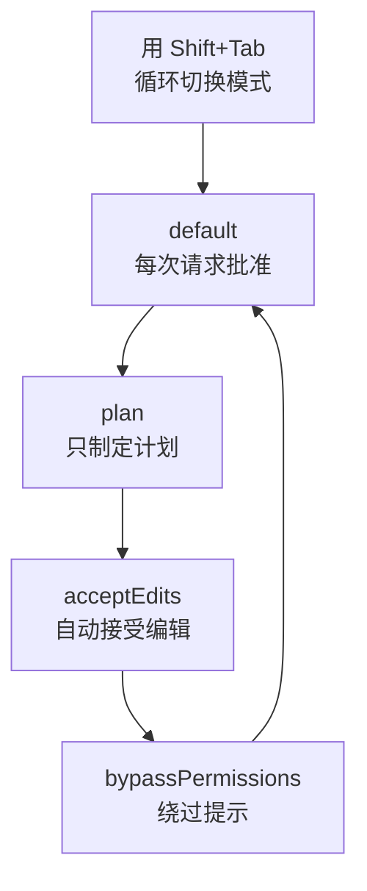

# 交互模式

本文整理在终端中运行 Claude Code 时遇到的交互式会话 (REPL) 的输入方式、快捷键与权限模式。


**一句话总结**：交互模式是 Claude Code 的**驾驶舱**，从一行提示词到 `/` 命令、`!` bash 执行、`@` 文件引用、粘贴图片，所有输入都汇聚于此。


## 交互式会话 (REPL) 的基本流程

运行 `claude` 命令即打开交互式 REPL (Read-Eval-Print Loop)。在这里您以自然语言发送请求，Claude 读取和修改代码、执行命令并给出回应。一次请求与回应称为一个**回合** (turn)，会话存续期间对话上下文不断累积。

基本流程很简单。

```text
1. 运行 claude → 交互式会话开始
2. 输入提示词 → 按 Enter 提交
3. Claude 回应（工具调用 + 结果）
4. 重复后续请求 → 上下文累积
5. /clear 开新会话，Ctrl+D 退出
```

会话进行期间，输入历史按工作目录保存；在复杂的多步任务中，Claude 会创建任务列表跟踪进度。

## 五种输入方式

交互式会话的输入框并非单纯的文本输入器。行为随首个字符而变。

| 输入方式 | 触发 | 说明 |
|-----------|--------|------|
| **普通提示词** | 直接输入 | 自然语言请求。Claude 解读并执行。 |
| **斜杠命令** | 以 `/` 开头 | 调用内置命令、技能、插件/MCP 命令。 |
| **bash 执行** | 以 `!` 开头 | 不经 Claude 直接执行 shell 命令。 |
| **文件引用** | 输入 `@` | 弹出文件路径自动补全，把指定文件加入上下文。 |
| **粘贴图片** | `Ctrl+V`（粘贴） | 把剪贴板图片以 `[Image #N]` 芯片形式插入。 |

### 斜杠命令 (/)

在输入框最前面键入 `/` 会弹出所有可用命令菜单。不只是内置命令，捆绑技能、用户编写的技能、插件与 MCP 服务器贡献的命令都汇集在同一菜单中。在 `/` 后继续输入字符可实时收窄候选。详细列表见[斜杠命令](/claude-code/foundations/commands)文档。

### bash 执行 (!)

以 `!` 开头会切换到 shell 模式，命令不经 Claude 解读直接执行。

```bash
! npm test
! git status
! ls -la
```

shell 模式会把命令及其输出加入对话上下文，让您在快速执行 shell 操作的同时 Claude 也能知晓结果。长命令可用 `Ctrl+B` 转入后台，在空输入下按 `Escape` 或 `Backspace` 可退出 shell 模式。

### 文件引用 (@)

输入 `@` 会弹出文件路径自动补全。选中想要的文件即可把它拉入 Claude 的上下文，从而精准发出"修复这个文件"这类请求。

### 粘贴图片

用 `Ctrl+V` 粘贴截图或设计稿时，光标位置会插入 `[Image #N]` 芯片。芯片可在提示词中按位置引用，让文本与图片混合叙述。

| 环境 | 粘贴图片按键 |
|------|---------------------|
| 默认 | `Ctrl+V` |
| iTerm2 (macOS) | `Cmd+V` |
| Windows / WSL | `Alt+V` |

## 键盘快捷键

交互式会话的核心快捷键如下。部分行为可能因平台与终端而异。

| 快捷键 | 行为 |
|--------|------|
| `Esc` | 中断 Claude 的回应（中途停止并转向，已产出内容保留） |
| `Esc` `Esc` | 有输入则清空草稿，为空则打开回退菜单 |
| `Ctrl+C` | 中断执行或清空输入（按两次退出） |
| `Ctrl+D` | 结束会话 (EOF) |
| `Shift+Tab` 或 `Alt+M` | 循环切换权限模式 |
| `Ctrl+R` | 命令历史反向搜索 |
| `Ctrl+B` | 把执行中的任务转入后台 |
| `Ctrl+T` | 切换任务列表 |
| `Ctrl+O` | 切换转录查看器（查看工具使用详情） |
| `Ctrl+X` `Ctrl+K` | 中断所有后台子智能体 |
| `Ctrl+L` | 重绘屏幕（修复错乱输出） |
| `Opt+P` | 切换模型 |
| `Opt+T` | 切换扩展思考 (extended thinking) 模式 |
| `Opt+O` | 快速模式切换 |
| `Up` / `Down` | 移动光标，到达末尾后浏览历史 |

### 回退 (Esc Esc)

输入框为空时按两次 `Esc` 会打开**回退菜单** (rewind menu)。它可以把代码与对话恢复到之前的时间点或进行摘要，详见[检查点](/claude-code/context-memory/checkpointing)文档。

### 历史搜索 (Ctrl+R)

用 `Ctrl+R` 交互式搜索之前的命令。输入搜索词后匹配部分会高亮，再按一次 `Ctrl+R` 会跳到更早的匹配项。用 `Ctrl+S` 切换搜索范围（本会话 / 本项目 / 所有项目），按 `Tab` 或 `Esc` 接受后编辑，按 `Enter` 立即执行。

### macOS 上的 Option 键注意事项

`Alt+B`、`Alt+F`、`Alt+P` 这类 Option 组合键在 macOS 上需要把终端的 Option 设为 Meta 才能生效。iTerm2 需在 Keys 设置中把 Option 设为 "Esc+"，Apple Terminal 需开启 "Use Option as Meta Key"。

## 权限模式

Claude Code 通过**权限模式** (permission mode) 调节文件修改与命令执行的自动允许程度。可用 `Shift+Tab` 循环切换模式。

| 模式 | 行为 | 适合的情形 |
|------|------|-------------|
| **default** | 每次操作都向用户请求批准 | 谨慎的日常工作 |
| **plan** | 不修改代码，只制定计划 | 变更前审阅方案 |
| **acceptEdits** | 自动接受文件编辑 | 可信任的重复性编辑 |
| **bypassPermissions** | 绕过权限提示 | 仅限隔离沙箱环境等有限场景 |


```mermaid
flowchart TD
    A[用 Shift+Tab<br>循环切换模式] --> B[default<br>每次请求批准]
    B --> C[plan<br>只制定计划]
    C --> D[acceptEdits<br>自动接受编辑]
    D --> E[bypassPermissions<br>绕过提示]
    E --> B
```

bypass 模式跳过权限确认，因此只在可信任的隔离环境中使用才安全。MoAI-ADK 也会按工作流阶段运用这些模式。尤其 plan 模式与 MoAI-ADK "计划要深入审阅、实现在批准后启动"的实现启动批准门（plan→run 人工门禁）建立在完全相同的哲学之上 —— 在进入昂贵的实现回合之前，先用廉价的只读回合敲定方向，这从令牌角度看也最经济。

## 多行输入、vim 模式与输出样式

### 多行输入

在一条提示词中输入多行的方法因终端而异。

| 方法 | 快捷键 | 备注 |
|------|--------|------|
| 快速换行 | `\` + `Enter` | 在所有终端可用 |
| Shift+Enter | `Shift+Enter` | iTerm2、WezTerm、Ghostty、Kitty、Warp 等默认支持 |
| 控制序列 | `Ctrl+J` | 无需配置随处可用 |
| 粘贴模式 | 直接粘贴 | 适合代码块、日志 |

在 VS Code、Cursor、Windsurf、Zed 等环境需要 `Shift+Enter` 绑定时，运行 `/terminal-setup` 即可。

### vim 模式

可在 `/config` 的 Editor mode 中开启 vim 风格编辑。用 `Esc` 与 `i`/`a` 在 NORMAL 与 INSERT 模式间切换，`h`/`j`/`k`/`l` 移动、`dd`/`yy`/`p` 编辑，乃至 `iw`/`a"` 这类文本对象，熟悉的 vim 操作都可照常使用。但不支持 `Ctrl+V` 块可视模式。

### 输出样式与附加功能

在 `/config` 中调整主题、显示选项和会话摘要 (Session recap) 等设置。其他常用附加功能如下。

- **`/btw`**：在不污染对话历史的前提下就当前工作快速提问。回答仅以临时叠加层显示。
- **`/recap`**：生成会话摘要 (session recap)。在进行 3 分钟以上或 3 回合以上的会话中会自动启用。
- **任务列表**：在多步任务中用 `Ctrl+T` 展开或收起 Claude 创建的任务列表。任务列表在上下文压缩期间也会保留。
- **扩展思考开关**：用 `Option+T` (macOS) 或 `Alt+T` 开关扩展思考模式。

## 相关文档

- [斜杠命令](/claude-code/foundations/commands)
- [检查点](/claude-code/context-memory/checkpointing)
- [快速开始](/getting-started/quickstart)

## 参考资料

- [Claude Code Interactive mode（官方文档）](https://code.claude.com/docs/en/interactive-mode)


建议一开始用 `Shift+Tab` 从 plan 模式起步，确认 Claude 的方案后，随着信任积累再切到 acceptEdits —— 这条路径最安全也最快。

