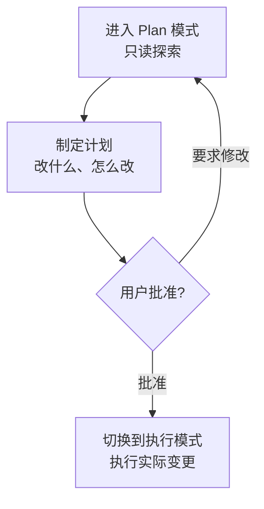

# 权限与 Plan 模式

Claude Code 在每次调用工具时都设有一个门卫，询问是否允许。本页整理这套权限系统，以及在执行前先获得计划批准的 Plan 模式。


**一句话总结**：权限系统是楼宇入口的**门卫**。它确认谁（哪个工具）要做什么，据此决定放行·询问·拦截。Plan 模式则是动工前**先获得报价单批准**的流程——只读地制定计划，得到用户批准后才进入实际变更。


## 权限系统

当 Claude 要使用修改文件、执行命令等有副作用的工具时，权限系统都会拦截该调用并决定如何处理。决定用三种规则类型表达。

| 规则 | 动作 |
|------|------|
| allow | 不询问直接允许 |
| ask | 以提示向用户确认 |
| deny | 始终拦截 |

这些规则以工具·模式为单位声明在 `settings.json` 的 `permissions` 块中。

```json
{
  "permissions": {
    "allow": ["Read", "Grep", "Bash(go test:*)"],
    "ask": ["Bash"],
    "deny": ["Read(./.env)"]
  }
}
```

把经常重复的安全只读命令预先登记到 `allow`，可以大幅减少提示频率。 反过来，把敏感文件或危险命令用 `deny` 牢牢挡住。

## 权限模式

整个会话的默认姿态由权限模式决定。共有四种模式，在交互式会话中可用 `Shift+Tab` 循环切换。

| 模式 | 动作 |
|------|------|
| `default` | 对每个有副作用的工具都确认（最安全的默认值） |
| `acceptEdits` | 文件编辑自动接受，其他危险动作仍会确认 |
| `plan` | 只读。不做变更，只进行探索·制定计划 |
| `bypassPermissions` | 跳过所有确认 |


`bypassPermissions` 会省略所有确认，因此只在可信的隔离环境中使用。它可能让未经验证的代码或提示在无确认下执行危险命令。


子代理也可用 `permissionMode` 字段声明自己的默认权限姿态（具体取值参见[子代理](/zh/claude-code/agentic/sub-agents)）。

## Plan 模式

Plan 模式是上表中 `plan` 权限模式所形成的工作流程。Claude 先**仅以只读方式**探索代码库，制定要改什么、怎么改的计划，并把计划呈现给用户。只有用户批准后，才进入实际变更。



这就像先获得施工报价单的批准再动工。变更越大，在动代码之前用眼睛确认计划的这一步，越能大幅减少失误。

## MoAI-ADK 的实现启动批准

MoAI-ADK 把这种"先批准计划"的文化作为显式门刻进工作流。即使 Plan 阶段产物已通过审计，在进入 Run 阶段（实际实现）之前，编排器也必须停下自主流程，向用户取得**实现启动批准**（Implementation Kickoff Approval）。

这道门是把 Claude Code 的 Plan 模式批准文化落实到 SPEC 生命周期层面的产物，是一个与计划审计分数无关、单独确认用户推进意愿的流程。也就是说，如果 Plan 模式在会话层面提供"改代码前先批准计划"的原则，那么 MoAI-ADK 就把同一原则扩展为 plan→run 边界上的必经人类门。

## 相关文档

- [交互式模式](/zh/claude-code/foundations/interactive-mode)
- [工具参考](/zh/claude-code/foundations/tools-reference)
- [.claude 目录](/zh/claude-code/foundations/claude-directory)

## 参考资料

- [Claude Code Docs — Permissions](https://code.claude.com/docs/en/permissions)
- [Claude Code Docs — Permission modes](https://code.claude.com/docs/en/permission-modes)


把大变更交出去时，先用 `Shift+Tab` 进入 Plan 模式拿到计划。读一遍计划，方向对了再批准，就能避免动了代码之后才发现问题的昂贵回退。

