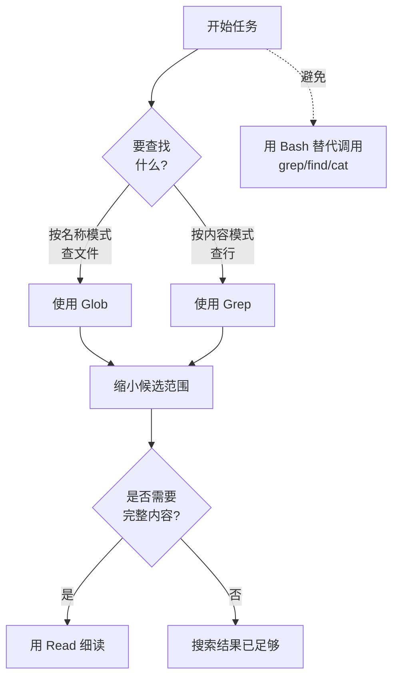

整理 Claude Code 在理解和修改代码库时使用的内置工具，以及权限如何与各工具关联。


**一句话总结**：工具名称是在权限规则、子智能体工具列表、hook 匹配器中原样使用的标识符。一旦了解工具的读取/写入性质和权限行为，你就能亲自设计 Claude Code 的安全边界。


## 内置工具与权限的关系

Claude Code 默认自带一组用于读取和修改代码的 **内置工具** (built-in tools)。这里的关键在于：工具名称本身就是标识符。`Read`、`Bash`、`Edit` 这样的精确字符串在以下三处被同样使用。

- 权限规则 (`settings.json` 中的 `permissions.allow` / `permissions.deny`)
- 子智能体定义中的 `tools` / `disallowedTools` 项
- hook 匹配器 (matcher)

工具大致分为 **不需要权限的** 与 **需要权限的** 两类。一般而言，只读 (read-only) 工具无需权限即可运行，而创建、修改文件或执行命令的工具则需经过权限确认。若要完全禁用某个工具，将其名称加入 `deny` 数组即可。

## 主要内置工具一览

下面是日常编码工作中最常用的工具，一并整理了读取/写入区分与是否需要权限。

| 工具 | 用途 | 性质 | 是否需要权限 |
| :--- | :--- | :--- | :--- |
| `Read` | 带行号读取文件内容 (含图片、PDF、笔记本) | 读取 | - |
| `Write` | 创建新文件或整体覆盖 | 写入 | 需要 |
| `Edit` | 对现有文件进行精确字符串替换 | 写入 | 需要 |
| `Bash` | 执行 shell 命令 | 执行 | 需要 |
| `Glob` | 按名称模式查找文件 | 读取 | - |
| `Grep` | 在文件内容中搜索模式 (基于 ripgrep) | 读取 | - |
| `WebFetch` | 获取 URL 并转换为 Markdown 后提取 | 读取 (外部) | 需要 |
| `WebSearch` | 进行网络搜索后返回标题和 URL | 读取 (外部) | 需要 |
| `Agent` | 生成拥有独立上下文窗口的子智能体 | 委派 | - |
| `TaskCreate` / `TaskUpdate` / `TaskList` / `TaskGet` | 管理会话任务列表 | 管理 | - |
| `LSP` | 基于语言服务器的代码智能 (跳转到定义、查找引用、报告类型错误) | 读取 | - |
| `Skill` | 在主对话中执行技能 | 执行 | 需要 |

`TodoWrite` 自 v2.1.142 起默认禁用，其职责由 `TaskCreate` 系列工具接替。若要重新启用，设置 `CLAUDE_CODE_ENABLE_TASKS=0`。

### 读取工具的细微差异

即便同为读取工具，行为上也有微妙差异。

- `Glob` 默认不忽略 `.gitignore`，因此也会一并查找未被跟踪的文件。结果按修改时间排序，并在 100 条处截断。
- `Grep` 则相反，会尊重 `.gitignore` 而跳过被忽略的文件。它有三种输出模式：`files_with_matches` (默认)、`content`、`count`。
- `Read` 始终被指引接收绝对路径，对于超过 token 上限的大文件，会通过 `offset`、`limit` 分页读取。

## 权限配置：allow / deny / ask

工具权限在 `settings.json` 的 `permissions` 项、`/permissions` 界面，以及 CLI 标志 (`--allowedTools`、`--disallowedTools`) 中以相同的规则格式处理。规则格式为 `ToolName(specifier)`。

```json
{
  "permissions": {
    "allow": [
      "Read(~/project/**)",
      "Bash(npm run *)",
      "WebFetch(domain:docs.example.com)"
    ],
    "deny": [
      "Read(~/.ssh/**)",
      "Bash(rm -rf *)"
    ]
  }
}
```

指定符 (specifier) 因工具类别而异，多个工具共享同一格式。

| 规则格式 | 适用工具 | 说明 |
| :--- | :--- | :--- |
| `Bash(npm run *)` | Bash, Monitor | 命令模式匹配 |
| `Read(~/secrets/**)` | Read, Grep, Glob, LSP | 路径模式匹配 |
| `Edit(/src/**)` | Edit, Write, NotebookEdit | 路径模式匹配 |
| `WebFetch(domain:example.com)` | WebFetch | 域名匹配 |
| `WebSearch` | WebSearch | 无指定符，整体允许/拒绝该工具 |
| `Agent(Explore)` | Agent | 子智能体类型匹配 |

关于规则，有两个值得记住的实用行为。

- `Edit(...)` 允许规则会同时为同一路径授予读取权限，因此无需另设成对的 `Read(...)` 规则。
- `WebFetch` 在默认与 `acceptEdits` 模式下首次访问新域名时会询问一次。事先设置好 `WebFetch(domain:...)` 规则，便会在不询问的情况下允许。

`ask` 行为并非独立的键，而是表现为：当某情形既不匹配允许规则也不匹配拒绝规则时，向用户询问的默认流程。换言之，若某次工具调用既非 `allow` 也非 `deny`，则会向用户请求确认。

## 工具选择最佳实践

Claude 通常会自行挑选合适的工具，但达成同一目的存在更精确、更高效的路径。下面的流程是搜索任务中推荐的优先级。



核心原则如下。

- **按名称查找文件** 用 `Glob`，**按内容查找行** 用 `Grep`。这两个工具拥有专用索引和安全的输出格式。
- **避免用 `Bash` 替代调用 `grep`、`find`、`cat`。** Bash 会经过权限确认，输出越长越会挤占上下文，并丢失专用工具所提供的排序、截断、行号等结构。
- 修改文件时，相比整体覆盖的 `Write`，优先使用只发送变更部分的 `Edit`。`Edit` 以先读取后修改的规则，防止意外覆盖。
- 像把握代码库结构这样范围较广的探索，用 `Agent` 委派给子智能体，以保留主上下文。

## 内置工具 vs MCP 工具

两类工具在来源和注册方式上有所不同。

| 区分 | 内置工具 | MCP 工具 |
| :--- | :--- | :--- |
| 来源 | Claude Code 默认提供 | 通过连接外部 MCP 服务器添加 |
| 名称格式 | `Read`、`Bash` 等固定名称 | 服务器所暴露的工具名称 |
| 添加方法 | 无需另行安装 | 连接 MCP 服务器 |
| 确认方法 | 询问“我能用哪些工具?” | 用 `/mcp` 命令确认确切名称 |

需要新工具时，连接 MCP 服务器。反之，若需要可复用的基于提示的工作流，则编写技能——技能并不添加新的工具项，而是通过现有的 `Skill` 工具运行。

会话中实际加载的工具集合会因所用的提供方、平台和配置而异。若想了解当前会话的工具，直接问 Claude；MCP 工具的确切名称用 `/mcp` 确认。

## 相关文档

- [钩子 (Hooks)](/claude-code/extensibility/hooks)
- [.claude 目录](/claude-code/foundations/claude-directory)

## 参考资料

- [Claude Code Tools reference](https://code.claude.com/docs/en/tools-reference)


如果搜索的权限提示频繁出现，可将常用的只读命令预先注册到 `settings.json` 的 `permissions.allow` 中，让流程不被打断。不过，务必将 `Bash(rm -rf *)` 这类破坏性模式放入 `deny`，以明确安全边界。

