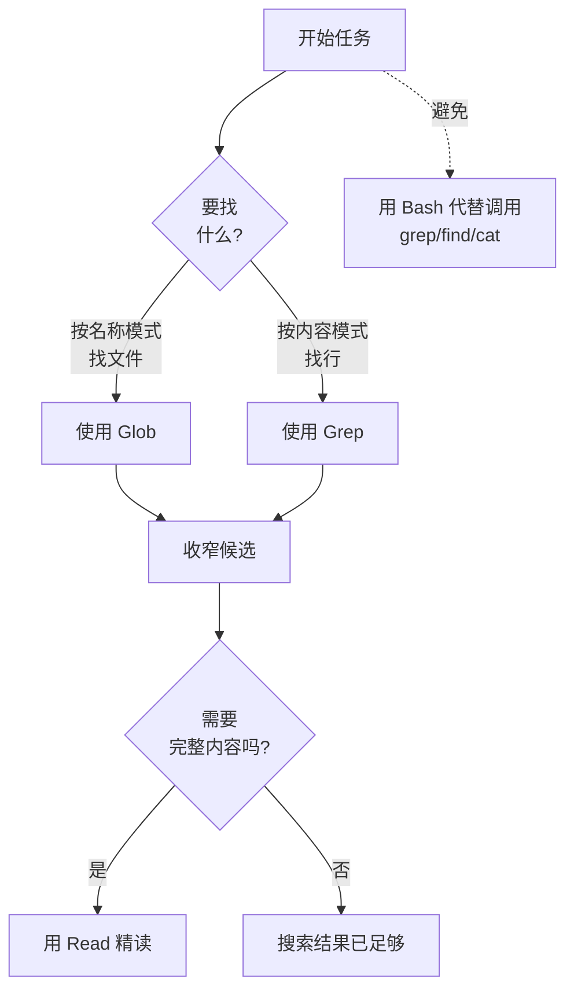

# 工具参考

本文整理 Claude Code 理解与修改代码库时使用的内置工具，以及各工具与权限如何关联。


**一句话总结**：工具名称是在权限规则、子智能体工具列表、hook 匹配器中原样使用的标识符，因此了解工具的读/写性质与权限行为，就能亲手设计 Claude Code 的安全边界。


## 内置工具与权限的关系

Claude Code 默认自带一套用于读取和修改代码的**内置工具** (built-in tools)。关键在于工具名称本身就是标识符。`Read`、`Bash`、`Edit` 这些精确字符串在以下三处以同一形式使用。

- 权限规则（`settings.json` 中的 `permissions.allow` / `permissions.deny`）
- 子智能体定义的 `tools` / `disallowedTools` 项
- hook 匹配器 (matcher)

工具大致分为**无需权限的**与**需要权限的**两类。总体上只读 (read-only) 工具无需权限即可工作，而创建、修改文件或执行命令的工具需要经过权限确认。要完全禁用某个工具，把它的名字加入 `deny` 数组即可。

## 主要内置工具表

以下是日常编码工作中最常用的工具，同时标注了读/写区分与是否需要权限。

| 工具 | 用途 | 性质 | 需要权限 |
| :--- | :--- | :--- | :--- |
| `Read` | 带行号读取文件内容（含图片·PDF·笔记本） | 读取 | - |
| `Write` | 创建新文件或整体覆盖 | 写入 | 需要 |
| `Edit` | 对既有文件做精确字符串替换 | 写入 | 需要 |
| `Bash` | 执行 shell 命令 | 执行 | 需要 |
| `Glob` | 按名称模式查找文件 | 读取 | - |
| `Grep` | 在文件内容中搜索模式（基于 ripgrep） | 读取 | - |
| `WebFetch` | 抓取 URL 并转换为 Markdown 后提取 | 读取（外部） | 需要 |
| `WebSearch` | 网络搜索后返回标题·URL | 读取（外部） | 需要 |
| `Agent` | 创建拥有独立上下文窗口的子智能体 | 委派 | - |
| `TaskCreate` / `TaskUpdate` / `TaskList` / `TaskGet` | 管理会话任务列表 | 管理 | - |
| `LSP` | 基于语言服务器的代码智能（跳转定义、查找引用、报告类型错误） | 读取 | - |
| `Skill` | 在主对话内执行技能 | 执行 | 需要 |

`TodoWrite` 自 v2.1.142 起默认禁用，取而代之的是 `TaskCreate`/`TaskUpdate`/`TaskList`/`TaskGet` 系列工具。

### 读取工具的细微差异

即便同为读取工具，行为上也有微妙差别。

- `Glob` 默认不忽略 `.gitignore`，未被追踪的文件也会一并找到。结果按修改时间排序，超过 100 个会被截断。
- `Grep` 则相反，会尊重 `.gitignore`，跳过被忽略的文件。输出模式有 `files_with_matches`（默认）、`content`、`count` 三种。
- `Read` 始终要求绝对路径，超过令牌上限的大文件可用 `offset`·`limit` 分页读取。

## 权限配置：allow / deny / ask

工具权限在 `settings.json` 的 `permissions` 项、`/permissions` 界面和 CLI 标志（`--allowedTools`、`--disallowedTools`）中使用同一规则格式。规则格式为 `ToolName(specifier)`。

```json
{
  "permissions": {
    "allow": [
      "Read(~/project/**)",
      "Bash(npm run *)",
      "WebFetch(domain:docs.example.com)"
    ],
    "deny": [
      "Read(~/.ssh/**)",
      "Bash(rm -rf *)"
    ]
  }
}
```

指定符 (specifier) 因工具类型而异，多个工具共享同一格式。

| 规则格式 | 适用工具 | 说明 |
| :--- | :--- | :--- |
| `Bash(npm run *)` | Bash、Monitor | 命令模式匹配 |
| `Read(~/secrets/**)` | Read、Grep、Glob、LSP | 路径模式匹配 |
| `Edit(/src/**)` | Edit、Write、NotebookEdit | 路径模式匹配 |
| `WebFetch(domain:example.com)` | WebFetch | 域名匹配 |
| `WebSearch` | WebSearch | 无指定符，对整个工具允许/拒绝 |
| `Agent(Explore)` | Agent | 子智能体类型匹配 |

规则中有两个实用行为值得记住。

- `Edit(...)` 允许规则会同时授予相同路径的读取权限，无需再单独配对 `Read(...)` 规则。
- `WebFetch` 在默认与 `acceptEdits` 模式下首次访问新域名时会询问一次。预先设置 `WebFetch(domain:...)` 规则则不再询问直接放行。

`ask` 行为并非单独的键，而是当调用不匹配任何允许/拒绝规则时向用户询问的默认流程。也就是说，既非 `allow` 也非 `deny` 的工具调用会请求用户确认。

## 工具选择最佳实践

Claude 大多能自行选出合适的工具，但达成同一目的往往存在更精确高效的路径。以下流程是搜索类工作的推荐优先级。


```mermaid
flowchart TD
    A[开始任务] --> B{要找<br>什么?}
    B -->|按名称模式<br>找文件| C[使用 Glob]
    B -->|按内容模式<br>找行| D[使用 Grep]
    C --> E[收窄候选]
    D --> E
    E --> F{需要<br>完整内容吗?}
    F -->|是| G[用 Read 精读]
    F -->|否| H[搜索结果已足够]
    A -.避免.-> I[用 Bash 代替调用<br>grep/find/cat]
```

核心原则如下。

- **按名称找文件**用 `Glob`，**按内容找行**用 `Grep`。这两个工具拥有专用索引与安全的输出格式。
- **避免用 `Bash` 代替调用 `grep`·`find`·`cat`**。Bash 要经过权限确认，输出越长越挤压上下文，还会失去专用工具提供的排序·截断·行号等结构。
- 修改文件时优先使用只发送变更部分的 `Edit`，而非整体覆盖的 `Write`。`Edit` 的先读后改规则可防止意外覆盖。
- 像掌握代码库结构这类范围宽泛的探索，用 `Agent` 委派给子智能体，以保全主上下文。

## 内置工具 vs MCP 工具

两种工具的来源与注册方式不同。

| 区分 | 内置工具 | MCP 工具 |
| :--- | :--- | :--- |
| 来源 | Claude Code 默认提供 | 通过连接外部 MCP 服务器添加 |
| 名称格式 | `Read`、`Bash` 等固定名称 | 服务器暴露的工具名称 |
| 添加方法 | 无需额外安装 | 连接 MCP 服务器 |
| 查看方法 | 提问"你能用哪些工具？" | 用 `/mcp` 命令确认准确名称 |

需要新工具时连接 MCP 服务器。反之，需要可复用的提示词式工作流时编写技能 —— 技能不会新增工具条目，而是通过既有的 `Skill` 工具执行。

会话中实际加载的工具集合取决于所用的提供方、平台与配置。想了解当前会话的工具就直接问 Claude，MCP 工具的准确名称用 `/mcp` 确认。

## MoAI-ADK 与工具边界

工具名称即权限规则、子智能体工具列表、hook 匹配器的标识符 —— 这一事实是挽具设计的出发点。MoAI-ADK 用这套机制划定安全边界 —— 只读探索智能体仅允许 `Read`/`Grep`/`Glob`，可写的实现智能体绝不同时运行两个以上，破坏性 Bash 模式用 deny 规则拦截。此外，"专用工具优先"原则（用 `Grep` 代替 Bash `grep`、用 `Read` 代替 `cat`）不仅关乎安全，也关乎令牌 —— 专用工具的结构化输出（排序·截断·行号）比 shell 命令的原始输出占用的上下文少得多。

## 相关文档

- [钩子 (Hooks)](/claude-code/extensibility/hooks)
- [.claude 目录](/claude-code/foundations/claude-directory)

## 参考资料

- [Claude Code Tools reference](https://code.claude.com/docs/en/tools-reference)


如果搜索权限提示频繁出现，先把常用的只读命令登记到 `settings.json` 的 `permissions.allow`，工作流就不会被打断。但 `Bash(rm -rf *)` 这类破坏性模式务必放进 `deny`，明确标出安全边界。

