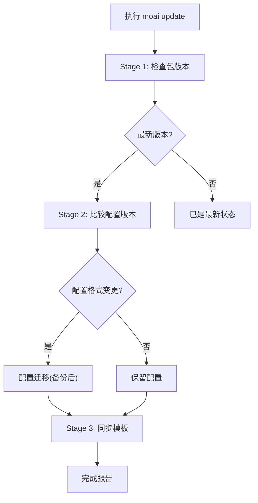
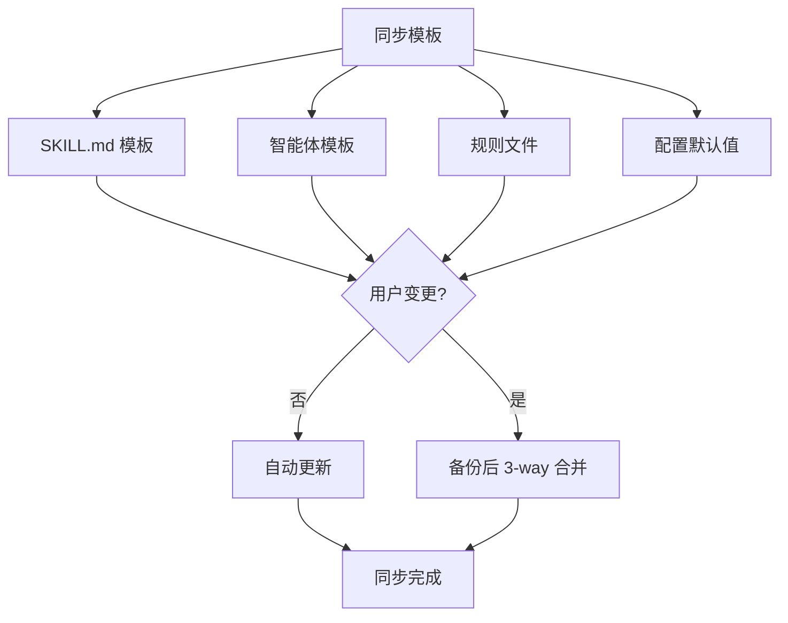

介绍将 MoAI-ADK 保持在最新版本的方法。仅用 `moai update` 一条命令即可一并更新二进制与模板,而用户创建的自定义资产会自动保留。

## 更新命令

不带标志运行时会同时更新二进制与模板 —— 这是默认行为。

```bash
moai update
```

### 三阶段智能更新



### Stage 1: 检查包版本

比较当前安装的版本与 GitHub Releases 上的最新版本。

```bash
# 确认当前版本
moai --version

# 仅确认可用更新(不实际更新)
moai update --check
```

### 强制校验和验证(Mandatory Checksum Verification) {#checksum-verification}

`moai update` 的二进制下载 **无法绕过校验和验证**。若 release 的 `checksums.txt` 下载失败或解析失败,则会 **abort** 更新流程 —— 不会尝试下载二进制。

#### Retry 策略

`checksums.txt` 下载以指数退避尝试 **3 次 retry**:

| 尝试 | 等待时间 |
|------|-----------|
| 第 1 次(立即) | 0s |
| 第 2 次 retry | 等待 2s |
| 第 3 次 retry | 等待 4s |
| 无额外 retry | 合计 ~6s 等待后失败 |

所有 retry 都失败时,会输出如下消息:

```
error: checksum unavailable: persistent retry failure after 3 attempts
```

**不存在 `--skip-checksum` 之类的绕过选项**(CWE-345 有意的策略)。

#### 失败时的恢复流程

1. **确认网络连接**:
   ```bash
   curl -I https://github.com/modu-ai/moai-adk/releases/latest
   ```
2. **确认 Proxy / firewall** —— 是否允许 GitHub release asset 域名(`github.com`, `objects.githubusercontent.com`)
3. **可能是临时性 GitHub CDN 故障** —— 稍后重试
4. **手动安装二进制**(永久阻断时):
   ```bash
   curl -fsSL https://raw.githubusercontent.com/modu-ai/moai-adk/main/install.sh | bash
   ```
   手动安装时建议另行确认 GitHub Release 的 `checksums.txt`。

详细的威胁模型请参阅[安全笔记 — CWE-345](/zh/advanced/security-notes/#cwe-345)。

### Stage 2: 比较配置版本

检查配置文件的格式与兼容性。格式发生变更时会自动备份后迁移。

**检查文件:**

- `.moai/config/sections/` 下的 YAML 文件


配置迁移前始终会备份 `.moai/config/` 目录。


### Stage 3: 同步模板

将项目模板与默认文件同步到最新版本。用户修改过的文件会被保留,与新版本冲突时会备份后合并。



## 标志参考

| 标志 | 说明 |
|--------|------|
| `--check` | 仅确认是否有新版本(不更新) |
| `-c, --config` | 重新运行设置向导(不同步模板) |
| `--force` | 强制更新(跳过版本一致检查、强制 备份+合并) |
| `--yes` | 自动批准所有确认(CI/CD 模式) |
| `--templates-only` | 跳过二进制更新,仅同步模板 |
| `--binary` | 跳过模板同步,仅更新二进制 |
| `--dry-run` | 不改动文件系统,仅显示计划的操作 |
| `--no-hooks` | 跳过 Git 钩子安装 |
| `--verbose` | 显示所有警告(诊断模式) |
| `--shell-env` | 为 Claude Code 配置 shell 环境变量 |
| `--plan-type <api\|subscription>` | 覆盖计费套餐类型 |

### 工作方式

| 命令 | 二进制更新 | 模板同步 |
|--------|-------------------|---------------|
| `moai update` |  |  |
| `moai update --binary` |  |  |
| `moai update --templates-only` |  |  |
| `moai update --check` |  | (仅确认版本) |

### 仅二进制更新

只更新二进制而不同步模板:

```bash
moai update --binary
```

### 仅模板同步

只同步模板而不更新二进制:

```bash
moai update --templates-only
```

### 重新运行设置向导

重新运行设置向导来更改项目配置(不执行模板同步):

```bash
moai update -c
# 或
moai update --config
```

### Dry Run

不做实际变更,预先确认计划的归档与安装操作:

```bash
moai update --dry-run
```

### CI/CD 模式

自动批准所有确认:

```bash
moai update --yes
```

## 更新后流程

### 第 1 步:确认版本

```bash
moai --version
```

### 第 2 步:验证配置

```bash
moai doctor
```

### 第 3 步:确认新功能

```bash
moai --help
```

## 个人设置管理

MoAI-ADK 更新时,**CLAUDE.md** 与 `settings.json` 会同步到新版本。请将个人的修改内容保存到单独的文件。

| 文件 | 位置 | 更新影响 |
|------|------|--------------|
| `CLAUDE.md` | 项目根 |  更新时会变更(MoAI-ADK 管理) |
| `settings.json` | `.claude/` |  更新时会变更(MoAI-ADK 管理) |
| `CLAUDE.local.md` | 项目根 |  无影响(个人设置) |
| `.claude/settings.local.json` | 项目 |  无影响(个人设置) |


**设置优先级:** Local > Project > User > Enterprise<br />
`settings.local.json` 会覆盖项目设置。


### moai 文件夹结构

MoAI-ADK 仅在以下文件夹中管理文件:

```
.claude/
├── agents/
│   ├── moai/                # MoAI-ADK 智能体(更新对象)
│   └── harness/             # 用户 harness 智能体(排除更新,保留)
│
├── hooks/
│   └── moai/                # MoAI-ADK 钩子脚本(更新对象)
│
├── skills/
│   ├── moai-*               # MoAI-ADK 技能(moai- 前缀,更新对象)
│   └── hns-*                # 用户生成的技能(排除更新,保留)
│
└── rules/
    └── moai/                # 规则文件(moai 管理)
```

| 类型 | 位置 | 更新影响 |
|------|------|--------------|
| **智能体** | `agents/moai/` |  更新时会变更 |
| **钩子** | `hooks/moai/` |  更新时会变更 |
| **技能** | `skills/moai-*` |  更新时会变更 |
| **规则** | `rules/moai/` |  更新时会变更 |
| **用户智能体** | `agents/harness/` |  无更新影响(保留) |
| **用户技能** | `skills/hns-*`(含遗留 `harness-*`, `my-*`) |  无更新影响(保留) |


**重要:** 带 <code>moai-*</code> 前缀的技能由 MoAI-ADK 管理,更新时会被覆盖。自己创建的技能请使用 <code>hns-*</code> 前缀(用户所有的命名空间),智能体请使用 <code>.claude/agents/harness/</code> 目录。


## 回滚

更新后出现问题时,可回滚到之前的版本:

```bash
# 通过手动重新安装恢复特定版本
curl -fsSL https://raw.githubusercontent.com/modu-ai/moai-adk/main/install.sh | bash -s -- --version <release-tag>

# 从备份恢复配置
cp -r .moai/config.bak .moai/config
```


回滚前请提交当前工作。


## 问题解决

### 更新失败

```bash
# 确认网络
curl -I https://github.com/modu-ai/moai-adk/releases/latest

# 手动重新安装
curl -fsSL https://raw.githubusercontent.com/modu-ai/moai-adk/main/install.sh | bash
```

### 配置迁移错误

```bash
# 从备份恢复
cp -r .moai/config.bak .moai/config

# 验证配置
moai doctor
```

### 模板冲突

用户修改过的模板文件会自动备份后 3-way 合并。发生冲突时,请用 `--verbose` 确认详细警告:

```bash
moai update --verbose
```

要强制覆盖请使用 `--force`(既有的用户变更会备份到 `.moai/archive/`):

```bash
moai update --force
```

## 下一步

1. **[确认变更日志](https://github.com/modu-ai/moai-adk/releases)** —— 学习新功能
2. **[核心概念](/zh/core-concepts/what-is-moai-adk)** —— 掌握新的智能体与功能
3. **[快速开始](./quickstart)** —— 将新功能应用到项目
