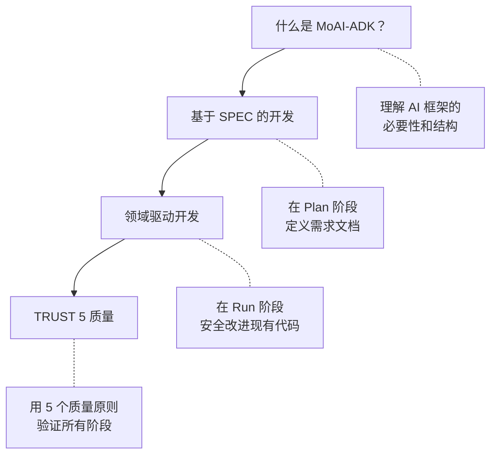

介绍理解 MoAI-ADK 的 4 个核心概念。


新手吗？从上到下阅读，自然理解 MoAI-ADK 的全貌。


## 学习顺序

| 顺序 | 文档 | 核心问题 |
|-------|----------|--------------|
| 1 | [什么是 MoAI-ADK？](/core-concepts/what-is-moai-adk) | 为什么需要 AI 开发工具，它是如何构建的？ |
| 2 | [基于 SPEC 的开发](/core-concepts/spec-based-dev) | 如何明确定义和管理需求？ |
| 3 | [领域驱动开发](/core-concepts/ddd) | 如何在不破坏现有功能的情况下改进代码？ |
| 4 | [TRUST 5 质量](/core-concepts/trust-5) | 什么标准确保代码质量？ |


每个文档都可以独立阅读，但按顺序阅读可以自然连接 MoAI-ADK 的开发理念。用 **SPEC** 定义**内容**，用 **DDD** 安全实现，用 **TRUST 5** 验证质量。

