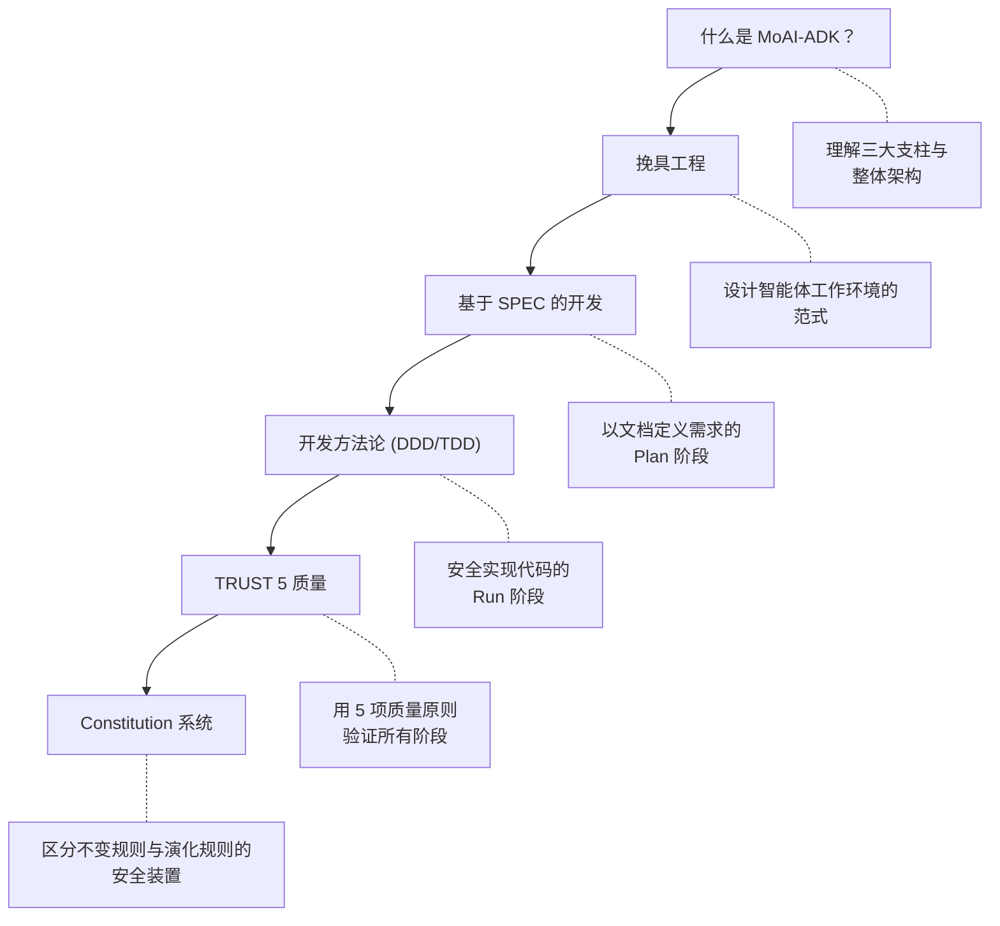

本节介绍理解 MoAI-ADK v3.0 所需的核心概念。v3.0 的价值可以概括为三大支柱 — **代币经济学** (Token Economics)、**智能体循环工程** (Agentic Loop Engineering)，以及 **智能体挽具** (Agentic Harness)。本节的文档将逐一展开这三大支柱在实际开发流程中的运作方式。


初次接触吗？从上到下按顺序阅读，MoAI-ADK 的全貌会自然浮现。每篇文档也都可以独立阅读。


## 三大支柱

| 支柱 | 核心问题 | 代表文档 |
|------|----------|----------|
| **代币经济学** | 如何用更少的 token 获得同等质量？ | [什么是 MoAI-ADK？](/zh/core-concepts/what-is-moai-adk) |
| **智能体循环工程** | 循环如何自主工作并学习？ | [挽具工程](/zh/core-concepts/harness-engineering) |
| **智能体挽具** | 如何设计让智能体高效工作的环境？ | [基于 SPEC 的开发](/zh/core-concepts/spec-based-dev) · [TRUST 5](/zh/core-concepts/trust-5) |

```mermaid
flowchart TD
    A["什么是 MoAI-ADK？"] --> B["挽具工程"]
    B --> C["基于 SPEC 的开发"]
    C --> D["开发方法论 (DDD/TDD)"]
    D --> E["TRUST 5 质量"]
    E --> F["Constitution 系统"]

    A -.- A1["理解三大支柱与\n整体架构"]
    B -.- B1["设计智能体工作环境的\n范式"]
    C -.- C1["以文档定义需求的\nPlan 阶段"]
    D -.- D1["安全实现代码的\nRun 阶段"]
    E -.- E1["用 5 项质量原则\n验证所有阶段"]
    F -.- F1["区分不变规则与演化规则的\n安全装置"]
```

## 学习顺序

| 顺序 | 文档 | 核心问题 |
|------|------|----------|
| 1 | [什么是 MoAI-ADK？](/zh/core-concepts/what-is-moai-adk) | MoAI-ADK 是什么，为什么以代币经济学为目标？ |
| 2 | [挽具工程](/zh/core-concepts/harness-engineering) | 不直接写代码而去设计环境，究竟是什么意思？ |
| 3 | [基于 SPEC 的开发](/zh/core-concepts/spec-based-dev) | 如何明确定义和管理需求？ |
| 4 | [开发方法论 (DDD/TDD)](/zh/core-concepts/ddd) | 如何在不破坏现有代码的情况下改进？ |
| 5 | [TRUST 5 质量](/zh/core-concepts/trust-5) | 以什么标准保证代码质量？ |
| 6 | [Constitution 系统](/zh/core-concepts/constitution) | 挽具自我演化时，由什么来管控这种演化？ |


用流程概括就是：用 **SPEC** 确定要做什么，用 **DDD/TDD** 安全地实现，用 **TRUST 5** 验证质量。包裹这整个循环的是 **挽具** (Harness)，循环转得越多，挽具学到的越多，指令随之演化 — 而管控这种演化的安全装置就是 **Constitution**。

