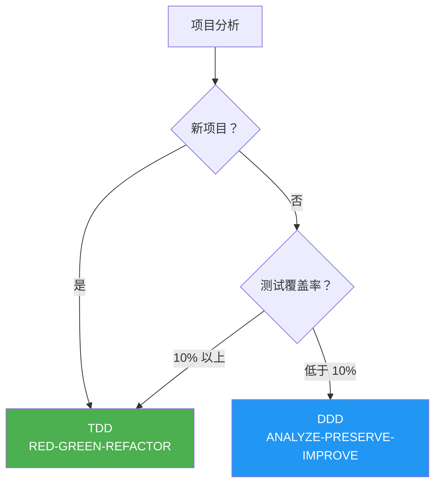
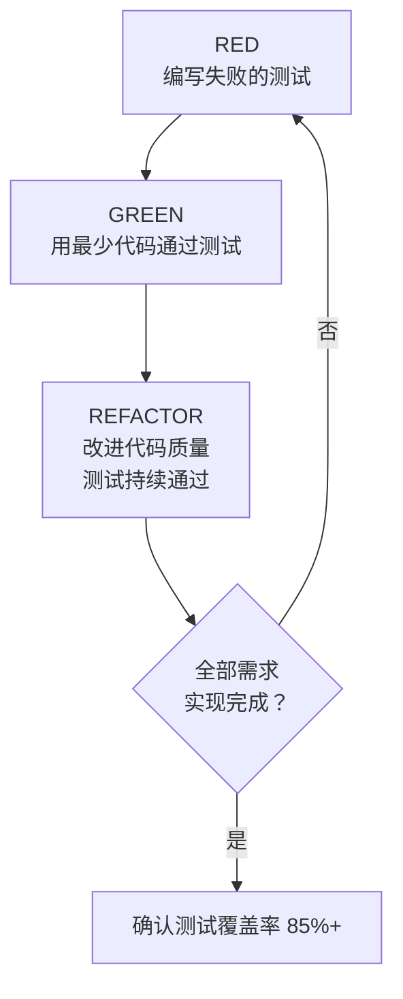
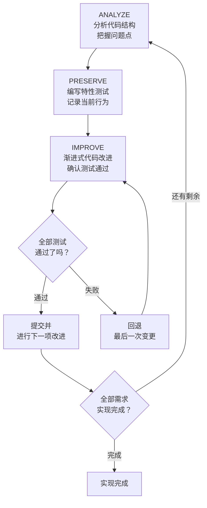
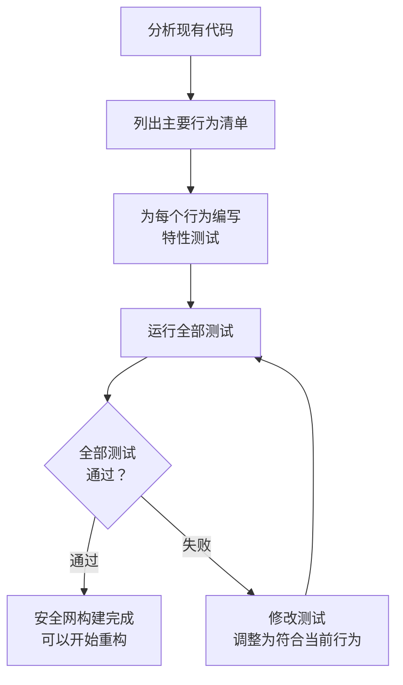
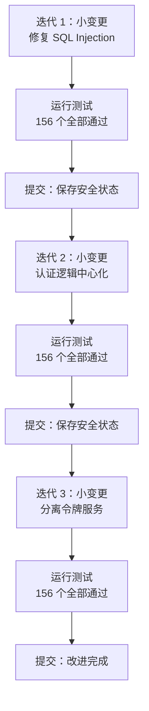
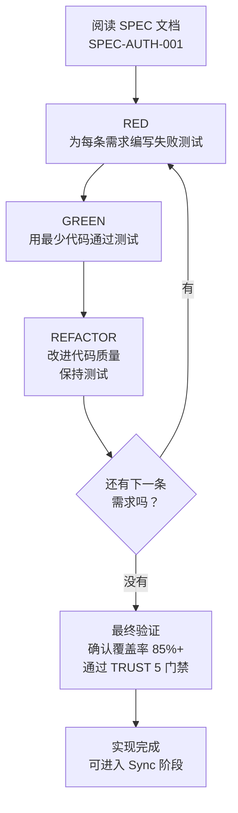
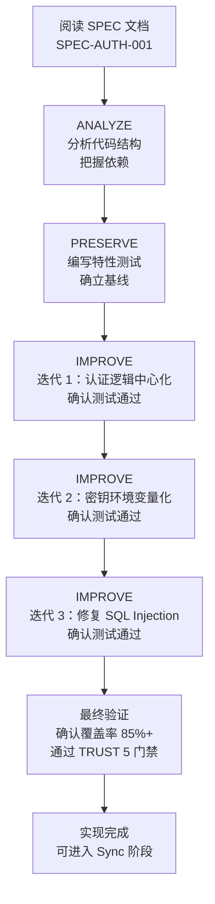

本文详细介绍 MoAI-ADK 的开发方法论。它是 Run 阶段智能体实现代码时遵循的纪律，根据项目状态选用 TDD 或 DDD。方法论明确了，智能体就不会迷路 — 测试本身就是完成条件，循环自行收敛，不在无谓的重试上浪费 token。


  **一句话总结：** 新项目使用 **TDD**（RED-GREEN-REFACTOR），几乎没有测试的现有项目使用 **DDD**（ANALYZE-PRESERVE-IMPROVE）。也可以在 `quality.yaml` 中手动选择。


## 方法论概览

MoAI-ADK 会根据项目状态自动选择最优开发方法论。



| 项目类型 | 方法论 | 循环 | 说明 |
| ---------------------------------- | ------- | ------------------------- | ---------------------------------------- |
| **新项目** | **TDD** | RED-GREEN-REFACTOR | 先写测试再实现 |
| **现有项目**（覆盖率 ≥ 10%） | **TDD** | RED-GREEN-REFACTOR | 基于部分测试扩展 TDD |
| **现有项目**（覆盖率 < 10%） | **DDD** | ANALYZE-PRESERVE-IMPROVE | 用特性测试安全地渐进改进 |


  **方法论可以手动选择：** 在 `.moai/config/sections/quality.yaml` 中把 `development_mode` 设为 `tdd` 或 `ddd`，即可忽略自动选择，使用想要的方法论。


## 什么是 TDD？

**TDD** (Test-Driven Development) 是**先写测试，再实现通过该测试的最少代码**的开发方法论。它是 MoAI-ADK 的默认方法论，大多数项目都在使用。

### RED-GREEN-REFACTOR 循环

TDD 以重复三个阶段的循环推进。



### 第 1 步：RED（编写失败的测试）

**先写**要实现功能的测试。代码还不存在，测试必然失败。

**核心原则：**

- 一次只写一个测试
- 用 Given-When-Then 明确描述要实现的行为
- 确认测试失败（不失败的测试没有意义）

### 第 2 步：GREEN（用最少代码通过测试）

编写通过测试的**最简单代码**。

**核心原则：**

- 不提前优化或抽象
- 专注正确性，优雅留到之后
- 测试通过就停手

### 第 3 步：REFACTOR（改进代码质量）

在保持测试通过的状态下整理代码。

**核心原则：**

- 消除重复代码
- 改进变量名、函数名
- 应用 SOLID 原则
- 测试必须持续通过

### TDD 实战示例

```python
# RED: 先编写失败的测试
def test_user_registration():
    """
    GIVEN: 有一份有效的用户信息
    WHEN: 进行注册
    THEN: 应创建用户并发送欢迎邮件
    """
    user_service = UserService()
    result = user_service.register(
        email="newuser@example.com",
        password="SecurePass123!"
    )

    assert result.success is True
    assert result.user.id is not None
    assert email_service.welcome_email_sent("newuser@example.com") is True

# 运行测试（预期失败——尚未实现）
# > pytest test_user_service.py - test_user_registration FAILED

# ====================================

# GREEN: 用最少代码通过测试
class UserService:
    def register(self, email: str, password: str) -> RegistrationResult:
        user = User.create(email, password)
        user_repository.save(user)
        email_service.send_welcome(email)
        return RegistrationResult.success(user)

# 运行测试（通过）
# > pytest test_user_service.py - test_user_registration PASSED

# ====================================

# REFACTOR: 改进代码质量（测试持续通过）
class UserService:
    def __init__(
        self,
        user_repo: UserRepository,
        email_service: EmailService,
        password_validator: PasswordValidator
    ):
        self.user_repo = user_repo
        self.email_service = email_service
        self.password_validator = password_validator

    def register(self, email: str, password: str) -> RegistrationResult:
        if not self.password_validator.validate(password):
            return RegistrationResult.failure("密码无效")

        user = User.create(email, password)
        self.user_repo.save(user)
        self.email_service.send_welcome(email)
        return RegistrationResult.success(user)

# 运行测试（仍然通过）
# > pytest test_user_service.py - test_user_registration PASSED
```

### 在现有项目中使用 TDD (Brownfield Enhancement)

在已有代码的项目中使用 TDD 时，会增加 **Pre-RED 阶段**：

1. **(Pre-RED)** 阅读目标区域的现有代码，理解当前行为
2. **RED：** 基于对现有代码的理解编写失败的测试
3. **GREEN：** 用最少代码让测试通过
4. **REFACTOR：** 保持测试通过的同时改进代码


  即使已有代码，只要测试覆盖率在 10% 以上就可以使用 TDD。因为在 Pre-RED 阶段先把握现有行为再写测试，所以可以在安全保存既有功能的同时添加新功能。


## 什么是 DDD？

**DDD** (Domain-Driven Development) 是**安全改进代码的方法**，一种尊重现有代码、渐进式改进的方式。用于几乎没有测试（低于 10%）的现有项目。

### 房屋改造比喻

为初次接触 DDD 的读者，用**房屋改造**来打比方。想象你要改造一栋住了 10 年的房子。

| 房屋改造阶段 | DDD 阶段 | 做的事 | 为什么重要 |
| --------------------- | --------------------- | ---------------------------------- | ----------------------------------------------------------- |
| 检查房子 | **ANALYZE**（分析） | 确认墙上的裂缝、管道状况 | 不知道哪里有问题就无从修起 |
| 给现状拍照 | **PRESERVE**（保存） | 给所有房间拍照存档 | 之后疑惑"原来这里有堵墙吗？"时可以核对 |
| 一间一间改造 | **IMPROVE**（改进） | 一次只施工一个房间，每次都验收 | 一下子全拆了，就不知道问题出在哪 |

**错误的方法 vs 正确的方法：**

```
错误的方法："我要一次性把全部代码都改掉！"
  --> 现有功能被改坏的风险很高
  --> 一旦出问题，很难找出哪里错了

正确的方法："先用测试记录当前行为，再一点一点地改！"
  --> 现有功能一被改坏，测试立刻就会报警
  --> 出问题时只需回退最后一次变更即可
```

### ANALYZE-PRESERVE-IMPROVE 循环

MoAI-ADK 的 DDD 以重复三个阶段的循环推进。



### 第 1 步：ANALYZE（分析）

彻底分析现有代码的结构，就像医生给病人诊察。

**分析项目：**

| 分析对象 | 确认内容 | 比喻 |
| ---------- | ---------------------------------- | ------------------ |
| 文件结构 | 有哪些文件、如何关联 | 核对房屋图纸 |
| 依赖 | 哪个模块依赖哪个模块 | 检查管道与电气布线 |
| 测试现状 | 现有测试有多少 | 核对已有保险 |
| 问题点 | 重复代码、安全漏洞、性能瓶颈 | 检查裂缝的墙、漏水 |

**manager-develop 生成的分析报告示例：**

```markdown
## 代码分析报告

- 对象: src/auth/（认证模块）
- 文件: 8 个 Python 文件
- 代码行数: 1,850 行
- 测试覆盖率: 5%

## 发现的问题
1. 重复的认证逻辑（3 处重复着相同代码）
2. 硬编码的密钥（直接写在 config.py 中）
3. SQL Injection 漏洞（user_repository.py）
4. 测试不足（5%，目标 85%）
```

### 第 2 步：PRESERVE（保存）

为保存现有行为构建**安全网**。这一阶段的核心是编写**特性测试** (Characterization Tests)。


  **特性测试是什么？**

  就像房屋改造前**给现状拍照存档**。

  一般的测试确认"这是否正确地工作？"。而特性测试记录的是"这现在是如何工作的？"。

  也就是说，不是判断对错，而是**记录"原本就是这样工作的"这一事实**。之后修改代码时测试若失败，就能立即知道既有行为被改变了。


**特性测试示例：**

```python
class TestExistingLoginBehavior:
    """记录既有登录函数当前行为的特性测试"""

    def test_valid_login_returns_token(self):
        """
        GIVEN: 有一个已注册的用户
        WHEN: 用正确的密码登录
        THEN: 原样记录当前实现返回的响应
        """
        user = create_test_user(
            email="test@example.com",
            password="password123"
        )

        result = login_service.login("test@example.com", "password123")

        # 原样记录当前行为（不判断对错）
        assert result["status"] == "success"
        assert result["token"] is not None
        assert result["expires_in"] == 3600  # 当前的过期时间

    def test_wrong_password_returns_error(self):
        """记录用错误密码登录时的当前行为"""
        create_test_user(email="test@example.com", password="password123")

        result = login_service.login("test@example.com", "wrongpassword")

        assert result["status"] == "error"
        assert result["code"] == 401
```

**测试编写策略：**



### 第 3 步：IMPROVE（改进）

特性测试构建完成后，就可以安全地改进代码了。核心原则是**拆成小步骤地变更**。

**改进过程：**

```python
# BEFORE: 改进前的代码
def login(email, password):
    # SQL Injection 漏洞
    user = db.query("SELECT * FROM users WHERE email = '" + email + "'")
    if user and check_password(user.password, password):
        token = generate_token(user.id)
        return {"status": "success", "token": token}
    return {"status": "error", "code": 401}

# ====================================

# AFTER: 改进后的代码（经过 3 次迭代完成）
def login(email: str, password: str) -> LoginResult:
    """处理用户登录。"""
    # 迭代 1: 用参数化查询防止 SQL Injection
    user = user_repository.find_by_email(email)

    if not user:
        return LoginResult.failure("凭证无效")

    # 迭代 2: 认证逻辑中心化
    if not auth_service.verify_password(user, password):
        return LoginResult.failure("凭证无效")

    # 迭代 3: 分离令牌服务
    token = token_service.generate(user.id)
    return LoginResult.success(token)
```

**渐进式改进步骤：**




  **核心原则：** 每次变更后必须运行测试。测试失败时只需回退最后一次变更。这就是"小步骤"的力量。一次改动太多，就很难找出问题出在哪。


## 方法论对比

| 视角 | TDD | DDD |
| ----------------- | --------------------------- | ---------------------------- |
| **测试时机** | 编写代码前 (RED) | 分析后 (PRESERVE) |
| **覆盖率取向** | 每次提交严格标准 | 渐进式改进 |
| **最佳场景** | 新项目、10%+ 覆盖率 | 覆盖率低于 10% 的遗留代码 |
| **风险水平** | 中（需要纪律） | 低（保存行为） |
| **覆盖率例外** | 不允许 | 允许 |
| **Run Phase 循环** | RED-GREEN-REFACTOR | ANALYZE-PRESERVE-IMPROVE |


  **方法论选择指南：**

  - **新项目**（绿地）：TDD（默认值）
  - **现有项目**（覆盖率 50% 以上）：TDD
  - **现有项目**（覆盖率 10-49%）：TDD（利用 Pre-RED 阶段）
  - **现有项目**（覆盖率低于 10%）：DDD（渐进式特性测试）


## 什么是特性测试？

特性测试是 DDD 的核心工具。让我们更详细地了解一下。

### 与一般测试的区别

| 类别 | 一般测试 | 特性测试 |
| ------------- | ------------------------------- | ------------------------------ |
| **目的** | "这是否正确地工作？" | "这现在是如何工作的？" |
| **编写时机** | 编写新代码前/后 | 重构现有代码前 |
| **标准** | 需求（设计书） | 当前的实际行为 |
| **比喻** | 确认是否按图纸建造 | 用照片记录房屋现状 |

### 编写原则

1. **只记录不评判**：即使当前代码有 bug，也照原样记录其行为
2. **包含边界情况**：不仅记录正常情况，也记录全部异常情况
3. **可重现**：测试运行多少次都应得到同样的结果
4. **要快**：特性测试必须跑得快，才能在每次变更后立即验证

## 执行方法

### 执行 TDD

SPEC 文档准备好后，用以下命令执行 TDD 循环。

```bash
# 执行 TDD（当 development_mode: tdd 时）
> /moai run SPEC-AUTH-001
```

执行该命令后，**manager-develop 智能体**会自动执行 RED-GREEN-REFACTOR 循环：



### 执行 DDD

```bash
# 执行 DDD（当 development_mode: ddd 时）
> /moai run SPEC-AUTH-001
```

执行该命令后，**manager-develop 智能体**会自动执行 ANALYZE-PRESERVE-IMPROVE 循环：



## 方法论设置

在 `.moai/config/sections/quality.yaml` 文件中设置开发方法论。

### TDD 设置（默认值）

```yaml
constitution:
  development_mode: tdd  # 使用 TDD 方法论

  tdd_settings:
    test_first_required: true         # 实现前必须先写测试
    red_green_refactor: true          # 遵循 RED-GREEN-REFACTOR 循环
    min_coverage_per_commit: 80       # 每次提交的最低覆盖率
    mutation_testing_enabled: false   # 变异测试（可选）

  test_coverage_target: 85            # 整体覆盖率目标
```

### DDD 设置

```yaml
constitution:
  development_mode: ddd  # 使用 DDD 方法论

  ddd_settings:
    require_existing_tests: true      # 重构前需要既有测试
    characterization_tests: true      # 自动生成特性测试
    behavior_snapshots: true          # 使用快照测试
    max_transformation_size: small    # 限制变更规模
    preserve_before_improve: true     # 必须先保存再改进

  test_coverage_target: 85            # 整体覆盖率目标
```

**DDD max_transformation_size 选项：**

| 值 | 变更范围 | 推荐场景 |
| -------- | ------------------------ | -------------------------------- |
| `small` | 1-2 个文件，简单重构 | 一般的代码改进（推荐） |
| `medium` | 3-5 个文件，中等复杂度 | 模块结构变更 |
| `large` | 10 个以上文件 | 架构变更（需谨慎） |


  将 `max_transformation_size` 设为 `large` 会一次变更很多文件，出问题时难以定位原因。建议尽量保持 `small`。


## 实战示例：重构遗留代码

这是一个重构 3 年前编写的认证模块的场景。测试覆盖率只有 5%，非常低，因此使用 DDD 方法论。

### 现状

```
问题点:
- SQL Injection 漏洞 2 处
- 硬编码的密钥
- 重复的认证逻辑 3 处
- 测试覆盖率 5%
- 代码复杂度高
```

### 执行过程

```bash
# 第 1 步: 生成 SPEC (Plan)
> /moai plan "重构遗留认证系统。修复 SQL Injection、密钥环境变量化、认证逻辑中心化"

# manager-spec 生成 SPEC-AUTH-REFACTOR-001
```

```bash
# 第 2 步: 执行 DDD (Run)
> /moai run SPEC-AUTH-REFACTOR-001

# manager-develop 执行 ANALYZE-PRESERVE-IMPROVE 循环
# ANALYZE: 分析代码，生成问题清单
# PRESERVE: 编写 156 个特性测试
# IMPROVE: 通过 3 次迭代渐进改进
```

```bash
# 第 3 步: 文档同步 (Sync)
> /moai sync SPEC-AUTH-REFACTOR-001

# manager-docs 更新 API 文档、生成重构报告
```

### 结果

| 指标 | Before | After | 变化 |
| ------------------ | ------ | -------- | -------------- |
| 测试覆盖率 | 5% | 87% | +82% |
| SQL Injection 漏洞 | 2 处 | 0 处 | 清除完成 |
| 硬编码密钥 | 有 | 无 | 环境变量化 |
| 重复代码 | 3 处 | 0 处 | 中心化完成 |
| 代码复杂度 | 高 | 降低 35% | 结构改进 |


  **核心要点：** 重构过程中，既有行为没有发生任何一处改变。156 个特性测试在每次迭代中全部通过，因此在不影响现有用户的前提下大幅提升了代码质量。


## 相关文档

- [基于 SPEC 的开发](/zh/core-concepts/spec-based-dev) -- 执行开发方法论之前需要 SPEC 文档
- [TRUST 5 质量](/zh/core-concepts/trust-5) -- 确认实现完成后的质量验证标准
