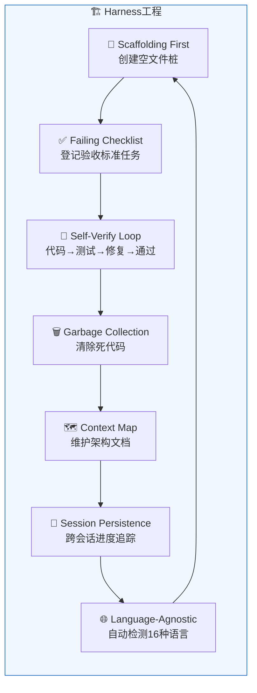
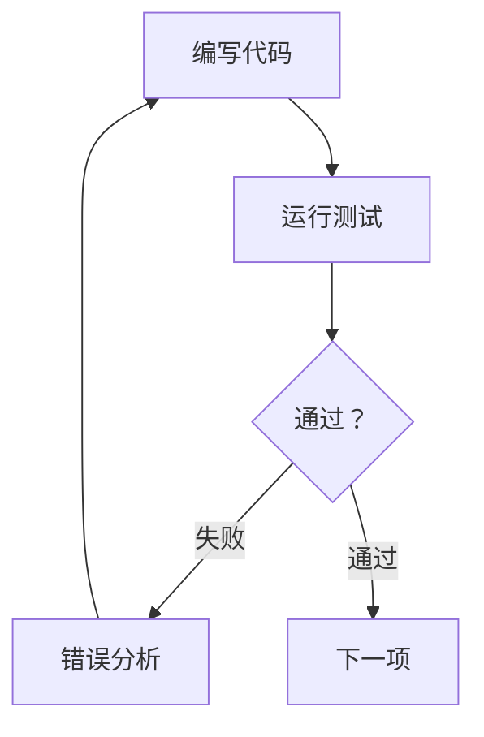

# Harness工程


## 什么是Harness工程？

MoAI-ADK实现了 **Harness工程（Harness Engineering）** 范式。这是一种不由开发者直接编写代码，而是**设计一个能让AI代理生产最优代码的环境（harness）**的开发方式。

> "Human steers, agents execute."（人类掌舵，代理执行。）
> — 工程师的角色从编写代码转变为设计harness：SPEC、质量门禁、反馈循环。

传统的vibe coding让AI自由生成代码，然后由人工审查结果。Harness工程则相反 — 通过**规范（SPEC）、自动验证、持续反馈循环**引导AI代理，从而生产出质量一致的代码。

## 7个核心组件



每个组件都映射到MoAI的特定命令：

| 组件 | 说明 | 命令 |
|----------|------|--------|
| **Self-Verify Loop** | 代理自主重复编写代码 → 测试 → 失败 → 修复 → 通过的循环 | [`/moai loop`](/zh/utility-commands/moai-loop) |
| **Context Map** | 始终向代理提供代码库架构图与文档 | [`/moai codemaps`](/zh/quality-commands/moai-codemaps) |
| **Session Persistence** | `progress.md` 跨会话追踪已完成步骤，自动恢复中断的工作 | [`/moai run SPEC-XXX`](/zh/workflow-commands/moai-run) |
| **Failing Checklist** | 执行开始时将所有验收标准登记为待处理任务，实现完成后逐项勾选 | [`/moai run SPEC-XXX`](/zh/workflow-commands/moai-run) |
| **Language-Agnostic** | 支持16种语言：自动检测语言并选择正确的LSP/linter/测试/覆盖率工具 | 所有工作流 |
| **Garbage Collection** | 定期扫描并清除死代码、AI slop（AI生成的冗余代码）、未使用的import | [`/moai clean`](/zh/utility-commands/moai-clean) |
| **Scaffolding First** | 实现前先创建空文件桩，防止代码熵增 | [`/moai run SPEC-XXX`](/zh/workflow-commands/moai-run) |

## 工作原理

### 1. Scaffolding First（脚手架优先）

`/moai run` 启动后，代理会在编写代码之前先创建所需的文件结构：

```
src/
├── auth/
│   ├── handler.go      ← 空桩
│   ├── handler_test.go  ← 空测试
│   ├── service.go       ← 空桩
│   └── service_test.go  ← 空测试
└── middleware/
    └── jwt.go           ← 空桩
```

此方式可防止代理无序创建文件，保持项目结构的一致性。

### 2. Failing Checklist（失败检查清单）

SPEC的验收标准会自动登记到任务列表：

```
- [ ] JWT令牌生成端点
- [ ] 令牌验证中间件
- [ ] 刷新令牌逻辑
- [ ] 过期令牌处理
- [ ] 85%+测试覆盖率
```

每个条目在实现并通过测试后会被勾选。所有条目均勾选后，任务才算完成。

### 3. Self-Verify Loop（自我验证循环）

代理自主执行的核心循环：



此循环在 `/moai loop` 中最多重复100次，并包含收敛检测（同一错误反复出现时应用替代策略）。

### 4. Context Map（上下文地图）

`/moai codemaps` 生成的架构文档向代理提供代码库的整体结构。借此，代理可以：

- 选择不与现有代码冲突的实现方式
- 遵循恰当的模式与规则
- 理解依赖关系并把握影响范围

### 5. Session Persistence（会话持久性）

即使Claude Code会话中断，`progress.md` 也会记录已完成的步骤：

```markdown
## Progress
- [x] Phase 1: 分析完成
- [x] Phase 2: 处理器实现
- [ ] Phase 3: 编写测试 ← 从此处恢复
- [ ] Phase 4: 重构
```

使用 `/moai run --resume SPEC-XXX` 会自动从中断点恢复。

## 传统开发 vs Harness工程

| 视角 | 传统开发 | Harness工程 |
|------|-----------|-----------------|
| **开发者角色** | 代码编写者 | 环境设计者 |
| **代码生产** | 手动编写 | AI代理自动生产 |
| **质量保证** | 事后审查 | 内建的自动验证循环 |
| **会话连续性** | 手动记录 | 自动进度追踪 |
| **代码清理** | 技术债累积 | 自动垃圾回收 |
| **文档化** | 独立工作 | 自动生成架构图 |

## 框架(harness)命名空间策略 (template-managed vs user-owned)

当你编写自己的自定义技能或代理时，需要了解 `moai update` 会覆盖(overwrite)哪些资产、保留(preserve)哪些资产。MoAI-ADK 将命名空间明确分为 **"包分发(template-managed)"** 和 **"用户创建(user-owned)"**。

| 类别 | 命名空间 / 路径 | 来源 | `moai update` 行为 |
| --- | --- | --- | --- |
| **template-managed** | `moai-*` 技能(包括 `moai-foundation-*`、`moai-workflow-*`、`moai-domain-*`、`moai-ref-*`、`moai-meta-*`)、`moai-harness-*` 技能、`moai-meta-harness` | MoAI-ADK 包 (template) | **覆盖** — 同步时删除后重新安装 |
| **user-owned** | `harness-*` 技能、`.claude/agents/harness/` 代理 | 用户项目 | **保留** — `moai update` 绝不删除或修改(备份后保留) |

### template-managed (覆盖对象)

`moai-*` prefix 技能以及 `moai-harness-*` / `moai-meta-harness` 是 **MoAI-ADK 包提供的通用资产**。它们会分发到每个用户项目，并在运行 `moai update` 时被最新 template **覆盖**。因此，如果直接修改这些资产，更改会在下次更新时丢失。

### user-owned (保留对象)

`harness-*` prefix 技能和 `.claude/agents/harness/` 目录由 **用户项目拥有**。`moai update` **绝不删除或修改它们** — 在更新前会先备份并原样保留。

### 对自定义技能作者的启示

为确保你自己创建的领域特定技能或代理在 `moai update` 之后仍然保留，**请务必使用 `harness-*` prefix**(代理放在 `.claude/agents/harness/`)。如果使用 `moai-*` 或 `moai-harness-*` prefix 创建，会被视为 template-managed 并在下次更新时被覆盖。

> 此命名空间分离策略源自 `SPEC-V3R6-HARNESS-NAMESPACE-V2-001` (已完成)。

## 下一步

- [基于SPEC的开发](/zh/core-concepts/spec-based-dev) — 编写作为harness输入的SPEC文档的方法
- [TRUST 5质量](/zh/core-concepts/trust-5) — harness验证的5项质量标准
