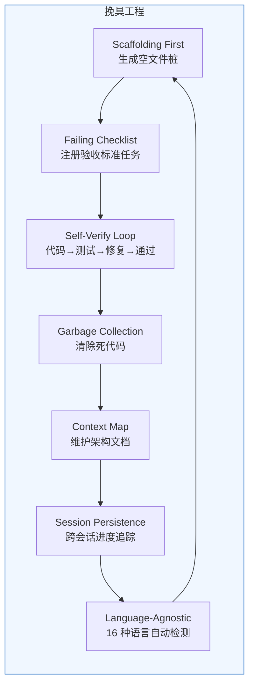
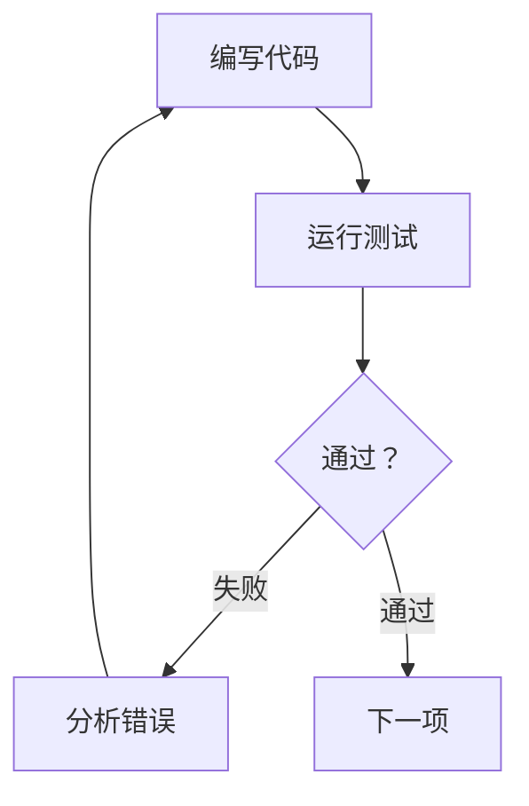

# 挽具工程

## 什么是挽具工程？

MoAI-ADK 实现了 **挽具工程** (Harness Engineering) 范式。开发者不再直接编写代码，而是**设计一个让 AI 智能体能够产出最优代码的环境（挽具）**。

> "Human steers, agents execute."
> — 工程师的角色从编写代码转向设计挽具：SPEC、质量门禁、反馈循环。

传统的氛围编程 (Vibe Coding) 让 AI 自由生成代码，然后人工审查结果。挽具工程恰恰相反 — 用**规格 (SPEC)、自动验证、持续反馈循环**引导 AI 智能体，产出质量稳定一致的代码。

那么挽具究竟是什么？它是围绕基础模型、编排其执行的整个系统 — 决定模型如何思考与规划、如何调用工具、如何感知和管理上下文、产物存放在哪里、结果如何评估的那一层。MoAI-ADK 正是架在 Claude Code 之上的这套挽具。

## 三大支柱与挽具

挽具工程是 v3.0 三大支柱交汇的地方。

| 支柱 | 在挽具中的角色 |
|------|------------------|
| **代币经济学** | 挽具为每项任务分配模型·推理深度，并守住 token 预算 |
| **智能体循环工程** | 循环（`/moai loop`、goal 引擎）运转并积累观察，挽具依据这些观察进行学习 |
| **智能体挽具** | 11 个智能体目录、3-phase 工作流、TRUST 5 门禁构成执行环境 |

其中第二根支柱是核心创新。AI 递归式自我改进 (RSI) 的现实短期路径不是直接修改模型权重，而是**改进围绕模型的挽具**。MoAI-ADK 走的正是这条路 — 递归改进的不是模型，而是挽具（技能·智能体指令）。

## 7 大核心组件


```mermaid
graph TB
    subgraph Harness["挽具工程"]
        direction TB
        SF["Scaffolding First<br/>生成空文件桩"] --> FC["Failing Checklist<br/>注册验收标准任务"]
        FC --> SV["Self-Verify Loop<br/>代码→测试→修复→通过"]
        SV --> GC["Garbage Collection<br/>清除死代码"]
        GC --> CM["Context Map<br/>维护架构文档"]
        CM --> SP["Session Persistence<br/>跨会话进度追踪"]
        SP --> LA["Language-Agnostic<br/>16 种语言自动检测"]
        LA --> SF
    end

    style Harness fill:#f0f7ff,stroke:#1565C0
```

每个组件都映射到 MoAI 的特定命令：

| 组件 | 说明 | 命令 |
|----------|------|--------|
| **Self-Verify Loop** | 智能体自主重复编码 → 测试 → 失败 → 修复 → 通过的循环 | [`/moai loop`](/zh/utility-commands/moai-loop) |
| **Context Map** | 始终向智能体提供代码库架构图与文档 | [`/moai codemaps`](/zh/utility-commands/moai-codemaps) |
| **Session Persistence** | `progress.md` 跨会话追踪已完成步骤，自动恢复中断的工作 | [`/moai run SPEC-XXX`](/zh/workflow-commands/moai-run) |
| **Failing Checklist** | 执行开始时将所有验收标准注册为待办任务，实现完成后逐项勾选 | [`/moai run SPEC-XXX`](/zh/workflow-commands/moai-run) |
| **Language-Agnostic** | 支持 16 种语言：自动检测语言并选择正确的 LSP/lint/测试/覆盖率工具 | 所有工作流 |
| **Garbage Collection** | 定期扫描并清除死代码、AI slop、未使用的 import | [`/moai clean`](/zh/utility-commands/moai-clean) |
| **Scaffolding First** | 实现前先生成空文件桩，防止代码熵增 | [`/moai run SPEC-XXX`](/zh/workflow-commands/moai-run) |

## 工作原理

### 1. Scaffolding First (脚手架优先)

`/moai run` 启动后，智能体在编写代码之前先创建所需的文件结构：

```
src/
├── auth/
│   ├── handler.go      ← 空桩
│   ├── handler_test.go  ← 空测试
│   ├── service.go       ← 空桩
│   └── service_test.go  ← 空测试
└── middleware/
    └── jwt.go           ← 空桩
```

这种方式防止智能体无序地创建文件，保持项目结构一致。

### 2. Failing Checklist (失败清单)

SPEC 的验收标准会自动注册到任务列表中：

```
- [ ] JWT 令牌生成端点
- [ ] 令牌校验中间件
- [ ] 刷新令牌逻辑
- [ ] 过期令牌处理
- [ ] 85%+ 测试覆盖率
```

每一项在实现并通过测试后被勾选。所有条目全部勾选，工作才算完成。

### 3. Self-Verify Loop (自我验证循环)

智能体自主执行的核心循环：


```mermaid
graph TD
    A["编写代码"] --> B["运行测试"]
    B --> C{"通过？"}
    C -->|"失败"| D["分析错误"]
    D --> A
    C -->|"通过"| E["下一项"]
```

该循环在 `/moai loop` 中最多重复 100 次，并包含收敛检测（同一错误重复出现时切换替代策略）。如果想直接声明完成条件，可使用 goal 引擎（`/moai goal "<条件>"`）— 会话会自主工作，直到条件满足或达到轮次上限。

### 4. Context Map (上下文地图)

`/moai codemaps` 生成的架构文档为智能体提供代码库的整体结构。借助它，智能体可以：

- 选择不与现有代码冲突的实现方式
- 遵循恰当的模式与规范
- 理解依赖关系并把握影响范围

### 5. Session Persistence (会话持久化)

即使 Claude Code 会话中断，`progress.md` 也会记录已完成的步骤：

```markdown
## Progress
- [x] Phase 1: 分析完成
- [x] Phase 2: 处理器实现
- [ ] Phase 3: 编写测试 ← 从这里恢复
- [ ] Phase 4: 重构
```

用 `/moai run --resume SPEC-XXX` 即可从中断点自动恢复。

## 自我演化挽具 — 循环养大挽具

挽具不是固定不变的环境。循环转得越多，观察积累越多，挽具依据这些观察进行学习，自行改进指令。

```
运行循环 → 积累观察 → 学习模式 → 演化指令（批准门禁）
```

### 4 层学习阶梯

| Tier | 观察数 | 行为 |
|------|---------|------|
| **观察** (Observation) | ≥1 | 简单记录 |
| **启发式** (Heuristic) | ≥3 | 模式识别 |
| **规则** (Rule) | ≥5 | 形成规则 |
| **自动更新** (AutoUpdate) | ≥10 | 自动修改指令 — **必须经用户批准** |

### 安全装置

自动演化绝不会在没有人类监督的封闭循环中运转。评估者与权限控制被放在演化循环的**外部**：

- **5 层安全流水线** — 通过快照与回滚（`moai harness rollback`）可随时恢复
- **用户批准门禁** — Tier-4 自动更新必须经过用户批准
- **Constitution 系统** — 不变规则 (FROZEN) 被排除在演化对象之外（参见 [Constitution 系统](/zh/core-concepts/constitution)）

```bash
moai harness status      # 查看学习状态（观察数、模式、提案）
moai harness apply       # 应用提案（需通过用户批准门禁）
moai harness rollback    # 回退上一次应用
moai harness disable     # 停用学习
```

## 传统开发 vs 挽具工程

| 视角 | 传统开发 | 挽具工程 |
|------|-----------|-----------------|
| **开发者角色** | 代码编写者 | 环境设计者 |
| **代码产出** | 手动编写 | AI 智能体自动产出 |
| **质量保证** | 事后审查 | 内置自动验证循环 |
| **会话连续性** | 手动记录 | 自动进度追踪 |
| **代码清理** | 技术债累积 | 自动垃圾回收 |
| **文档化** | 单独作业 | 自动生成架构地图 |
| **改进方向** | 工具固定，人来适应 | 循环积累观察，挽具随之演化 |

## 挽具命名空间策略 (template-managed vs user-owned)

当你亲自创建自定义技能或智能体时，需要了解 `moai update` 会覆盖 (overwrite) 哪些资产、保留 (preserve) 哪些资产。MoAI-ADK 将命名空间明确划分为 **"通用分发 (template-managed)"** 与 **"用户创建 (user-owned)"**。

| 类别 | 命名空间 / 路径 | 来源 | `moai update` 行为 |
| --- | --- | --- | --- |
| **template-managed** | `moai-*` 技能（含 `moai-foundation-*`、`moai-workflow-*`、`moai-domain-*`、`moai-ref-*`、`moai-meta-*`）、`moai-harness-*` 技能 | MoAI-ADK 包 (template) | **覆盖** — 同步时删除后重新安装 |
| **user-owned** | `hns-*` 技能（正式）+ 旧版 `harness-*` / `my-harness-*` 技能、`.claude/agents/harness/` 智能体 | 用户项目 | **保留** — `moai update` 绝不删除·修改（备份后保留） |

### template-managed (覆盖对象)

`moai-*` 前缀技能与 `moai-harness-*` 是 **MoAI-ADK 包提供的通用资产**。它们分发到所有用户项目，执行 `moai update` 时会被最新 template **覆盖**。因此直接修改这些资产，改动会在下次更新时丢失。

### user-owned (保留对象)

`hns-*` 前缀技能（Harness v4 Builder 生成的正式命名空间）与 `.claude/agents/harness/` 目录归**用户项目所有**。上一代前缀 `harness-*` / `my-harness-*` 也同样被识别。`moai update` **绝不删除或修改**它们，更新前先备份并原样保留。

### 对自定义技能作者的启示

要让自己创建的领域特化技能或智能体在 `moai update` 后依然存活，**务必使用 `hns-*` 前缀**（智能体放在 `.claude/agents/harness/`）。若以 `moai-*` 或 `moai-harness-*` 前缀创建，会被视为 template-managed，在下次更新时被覆盖。通过 `/moai harness "自然语言请求"` 创建挽具时，Builder 会自动分配符合此规则的名称。

## 下一步

- [基于 SPEC 的开发](/zh/core-concepts/spec-based-dev) — 编写作为挽具输入的 SPEC 文档
- [TRUST 5 质量](/zh/core-concepts/trust-5) — 挽具所验证的 5 项质量标准
- [Constitution 系统](/zh/core-concepts/constitution) — 管控挽具演化的不变规则
