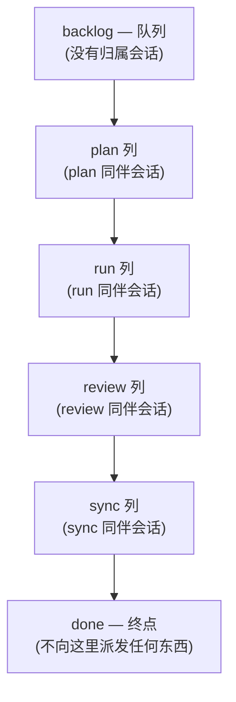
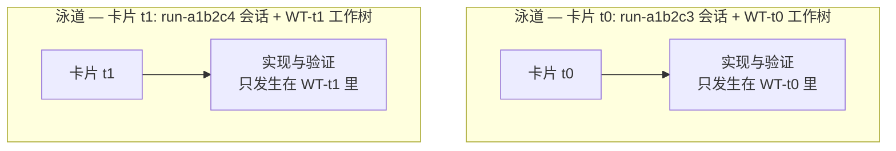

# 看板术语

介绍看板模式的文档与运维备忘共用一套九个词的词汇表 — 无论打开看板、链还是会话启动器的指南，出现的都是同一批词。本页把这些词集中在一处定义。每个条目是一行定义加一个示例；其余文档都以这些含义为前提。

先从最容易绊住人的地方说起：**泳道** (lane) 和**列** (column) 是两个不同的词。二者的区别在下面单独一节展开。

## 看板的样子

看板固定为六列：

`backlog` 和 `done` 刻意不设归属会话。中间四列各自对应一个同伴角色，这让派发变成一次查表而不是一个决定 — 卡片在哪一列，就决定了它发给谁。

## 九个词

| 词 | 含义 | 示例 |
|---|---|---|
| **泳道** (lane) | 把一张卡片从头送到尾的一条并行工作流：一个会话配一个工作树。就像实体看板上的泳道一样，每条流各走各的车道，绝不共享工作树。"泳道内验证" (lane-local verification) 指该泳道只跑自己的改动可能影响的测试。 | `run-a1b2c3` 会话在工作树 `WT-t0` 里干活，这就是一条泳道 |
| **卡片** (card) | 看板上的一个工作单元。运维者用 `/moai todo "<描述>"` 投入，以短ID相称。一张卡片拥有一个工作树、一份进度记录和它的完成证据。 | `t0` — 一行修复的卡片 |
| **列** (column) | 看板上的一个阶段，顺序固定：`backlog → plan → run → review → sync → done`。中间四列各自对应一个同伴角色。 | `/moai run <SPEC-ID>` 发生在 `run` 列 |
| **待办** (backlog) | 看板的入口队列。刻意不设归属会话 — 工作只有运维者亲手投入才会进入看板。 | `/moai todo "rename hint is stale"` 向待办追加一张卡片 |
| **主控** (lead) | 唯一的协调会话 (`moai cc -k`)。只凭自己读到的证据把卡片移入下一列，在阶段之间请运维者对相应会话执行 `/clear`，并且从不亲自写代码。 | 把一张卡片连同工作树指示一起派发出去的那个会话 |
| **同伴会话** (companion) | 由人亲手、一次一个终端启动的工作会话 (`moai cc -k --name <role>-<run-id>`)，一次承担一列的工作。 | `plan-a1b2c3`、`run-a1b2c3`、`review-a1b2c3`、`sync-a1b2c3` |
| **运行ID** (run-id) | 主控启动时给出的短标识符，为该链所有同伴会话的名字所共享。用于区分同一台机器上并发的多条链。 | `run-a1b2c3` 里的 `a1b2c3` |
| **工作树** (worktree) | 卡片工作发生的隔离检出。通过启动器进入 (`moai cc -w <name>` / `EnterWorktree`) — 绝不用 raw `git worktree add` 创建。分支名为 `WT-<card-id>`。工作树比阶段活得久：一棵树从run贯穿到sync。 | 分支 `WT-t0` 上的 `.claude/worktrees/t0` |
| **派发** (dispatch) | 主控发给某个同伴会话的指示。不是工作的副本而是指针 — 卡片ID、SPEC ID、阶段命令、完成信号。用运维者的对话语言书写。 | "card: t0 — wt: EnterWorktree(t0) … evidence: .moai/reports/t0/" |

## 泳道和列 — 最容易混淆的一对

**列** (column) 指工作的一个阶段；**泳道** (lane) 指载着一张卡片穿过这些阶段的主体。一个是看板上的停靠站，另一个是穿过停靠站的路线。

两条泳道可以同时流向同一块看板，并且从头到尾不进入彼此的工作树。这正是并行得以安全的原因 — 任何泳道的提交都不会漏进另一条泳道的工作树。

## 一张卡片的旅程

一个每个词都出现一次的真实流程：

1. 运维者用 `/moai todo "rename hint is stale"` 把**卡片** `t0` 放进**待办**。
2. **主控**从队列里选出 `t0`，把它**派发**给 plan 同伴会话。
3. `plan-a1b2c3` **同伴会话**写好SPEC后，主控亲自读证据，把卡片移入下一**列**。
4. `run-a1b2c3` 在**工作树** `WT-t0` 里实现 — 这个会话与工作树的对子就是**泳道**，验证也在泳道内进行（只跑改动可能影响的测试）。所有会话名共享的 `a1b2c3` 就是**运行ID**。
5. review 和 sync 两列照同样方式通过；sync 开出PR后，卡片抵达done。

在这整个过程中，卡片的工作只发生在 `WT-t0` 里，从头到尾不与并行泳道的工作树相混。

## 相关文档

- [看板模式](/zh/advanced/kanban-mode) — 进入条件、Origin-Trail Chain 设计、链的阶段
- [`/moai todo`](/zh/utility-commands/moai-todo) — 把卡片放上看板的待办队列
- [Harness 工程学](/zh/core-concepts/harness-engineering) — 阶段链与观测如何架在 Harness 设计之上
