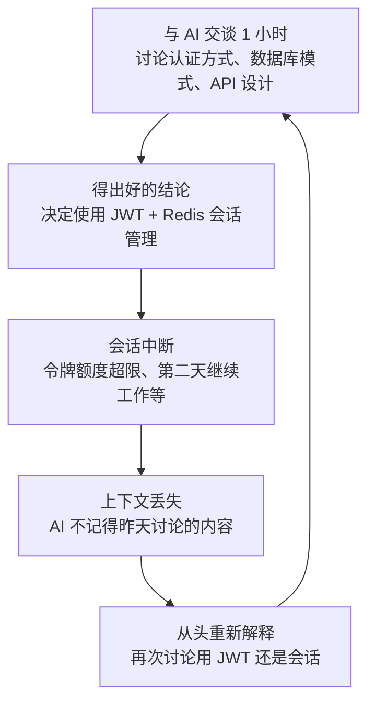
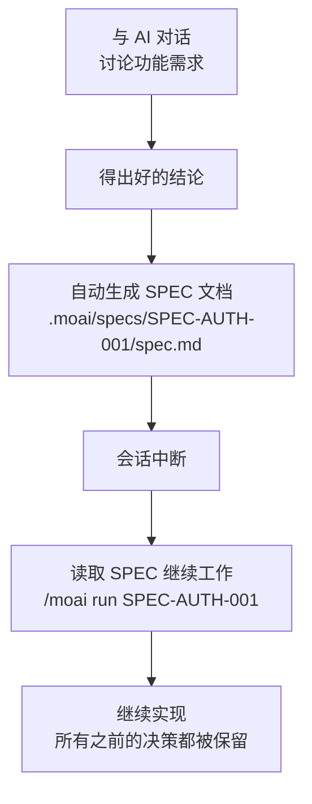
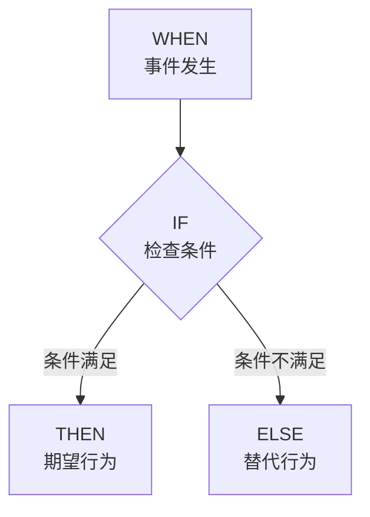
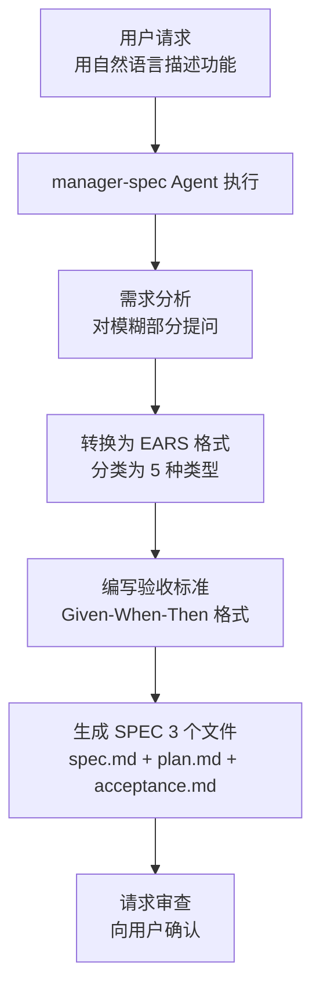
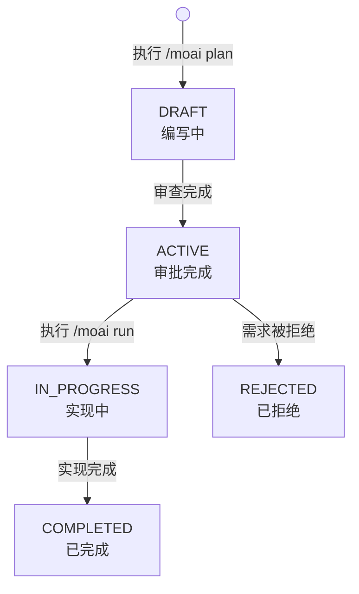

详细介绍 MoAI-ADK 的基于 SPEC 的开发方法论。


  **一句话总结：** SPEC 是"将与 AI 的对话记录为文档"。即使会话中断，只要有 SPEC 就能随时继续工作。



  **SPEC 是为 Agent 服务的：** SPEC 不是让开发者背诵或学习的。它是 Agent 执行工作时参考的文档。只需概念性地理解 SPEC 的原理和使用方式就足够了。



  **SPEC 由 3 个文件组成：** 执行 `/moai plan` 时，会同时生成 `spec.md` (EARS 需求)、`plan.md` (实现计划)、`acceptance.md` (验收标准) 3 个文件。


## 什么是 SPEC？

**SPEC** (Specification) 是以结构化格式定义项目需求的文档。

用日常生活来比喻，SPEC 就像 **烹饪食谱**。做菜时如果只靠记忆，容易遗漏食材或忘记顺序。但如果写下食谱，任何人都能准确地做出同样的菜。

| 烹饪食谱                       | SPEC 文档              | 共同点                           |
| ------------------------------ | ---------------------- | -------------------------------- |
| 所需食材清单                   | 需求清单               | 定义需要什么                     |
| 烹饪顺序                       | 实现顺序               | 定义按什么顺序进行               |
| 完成品照片                     | 验收标准               | 定义完成后的样子                 |
| 没有"少许盐"这样的模糊表达     | 用 EARS 格式明确表达   | 消除歧义                         |

## 为什么需要 SPEC？

### 氛围编程 (Vibe Coding) 的上下文丢失问题

与 AI 对话编写代码时，最大的问题是 **上下文丢失**。



**发生上下文丢失的具体场景：**

| 场景              | 发生了什么                           | 结果                   |
| ----------------- | ------------------------------------ | ---------------------- |
| 会话超时          | 一段时间后之前的对话内容消失         | 讨论过的决策丢失       |
| 执行 `/clear`     | 为节省令牌而初始化上下文             | 之前的上下文全部清除   |
| 令牌额度超限      | 对话过长时旧内容被截断               | 早期决策丢失           |
| 第二天继续工作    | 新会话不知道昨天的对话               | 所有内容需要重新解释   |

### 用 SPEC 解决问题

SPEC 通过将对话内容 **保存为文件** 从根本上解决了这个问题。



**有无 SPEC 的差异：**


**没有 SPEC 时：**

假设昨天您与 AI 讨论了"用户认证功能"一个小时。用 JWT 还是会话、令牌过期时间设多久、刷新令牌存在哪里……这一切都要重新讨论。

**有 SPEC 时：**

只需下面一行命令，就能按照昨天决定的内容直接开始实现。

```bash
> /moai run SPEC-AUTH-001
```



## EARS 格式

**EARS** (Easy Approach to Requirements Syntax) 是一种清晰编写需求的方法。它消除了自然语言的歧义，将需求转换为可测试验证的格式。

EARS 提供 5 种需求模式。

### 1. Ubiquitous (始终为真)

系统必须 **始终** 遵守的需求。无条件始终适用。

**格式：** "系统应当~"

**示例：**

```yaml
- id: REQ-001
  type: ubiquitous
  priority: HIGH
  text: "系统应当验证所有用户输入"
  acceptance_criteria:
    - "对所有输入值执行类型验证"
    - "使用参数化查询防止 SQL 注入"
    - "对输出进行转义以防止 XSS"
```

**日常比喻：** 就像"开车时必须始终系安全带"。没有特殊条件，始终遵守。

### 2. Event-driven (事件驱动)

定义特定事件发生时系统应如何响应。

**格式：** "WHEN ~时, IF ~则, THEN 应当~"



**示例：**

```yaml
- id: REQ-002
  type: event-driven
  priority: HIGH
  text: |
    WHEN 用户点击登录按钮时,
    IF 邮箱和密码有效,
    THEN 应当签发 JWT 令牌并重定向到仪表盘
  acceptance_criteria:
    - given: "存在已注册的用户账户"
      when: "使用正确的邮箱和密码登录"
      then: "返回 200 响应并签发 JWT 令牌"
      and: "令牌过期时间为 1 小时"
```

**日常比喻：** 就像"门铃响了 (WHEN)，通过监控确认是认识的人 (IF)，就开门 (THEN)"。

### 3. State-driven (状态驱动)

定义在维持特定状态期间系统应如何运行。

**格式：** "WHILE ~期间, 应当~"

**示例：**

```yaml
- id: REQ-003
  type: state-driven
  priority: MEDIUM
  text: |
    WHILE 用户处于登录状态期间,
    系统应当每 5 分钟刷新一次会话
  acceptance_criteria:
    - "距上次活动 5 分钟后自动刷新"
    - "会话过期前 5 分钟显示通知"
    - "30 分钟无活动后自动注销"
```

**日常比喻：** 就像"空调运行期间 (WHILE)，应当将室内温度保持在 25 度"。

### 4. Unwanted (禁止事项)

定义系统 **绝对不能做** 的事情。主要用于安全相关需求。

**格式：** "系统不得~"

**示例：**

```yaml
- id: REQ-004
  type: unwanted
  priority: CRITICAL
  text: "系统不得以明文存储密码"
  acceptance_criteria:
    - "密码使用 bcrypt 哈希 (cost factor 12)"
    - "日志中不包含未哈希的密码"
    - "数据库中不能存储明文密码"

- id: REQ-005
  type: unwanted
  priority: CRITICAL
  text: "系统不得使用硬编码的密钥"
  acceptance_criteria:
    - "所有密钥使用环境变量或密钥管理器"
    - "代码中不包含密钥"
    - "防止 Git 提交中包含密钥"
```

**日常比喻：** 就像"不能把钥匙放在门垫下面"。明确指出不能做的事情。

### 5. Optional (可选功能)

推荐实现但非必须的功能。

**格式：** "如果可能, 应当~"

**示例：**

```yaml
- id: REQ-006
  type: optional
  priority: LOW
  text: "如果可能, 系统应当在登录时发送邮件通知"
  acceptance_criteria:
    - "仅在配置了邮件服务器时才生效"
    - "提供禁用通知的选项"
```

**日常比喻：** 就像"有时间的话也做个甜点就好了"。有最好，没有也没关系。

### EARS 一览

| 类型             | 格式                          | 用途               | 优先级           |
| ---------------- | ----------------------------- | ------------------ | ---------------- |
| **Ubiquitous**   | "系统应当~"                   | 始终适用的规则     | 通常 HIGH        |
| **Event-driven** | "WHEN ~时, THEN 应当~"        | 事件响应定义       | 因功能而异       |
| **State-driven** | "WHILE ~期间, 应当~"          | 状态维持行为       | 通常 MEDIUM      |
| **Unwanted**     | "系统不得~"                   | 禁止事项 (安全)    | 通常 CRITICAL    |
| **Optional**     | "如果可能, 应当~"             | 可选功能           | 通常 LOW         |

## SPEC 文档结构

SPEC 文档由 **manager-spec Agent** 自动生成。开发者无需记住 EARS 格式，用自然语言请求即可由 Agent 转换。

执行 `/moai plan` 时，在一个 SPEC 目录下会同时生成 **3 个文件**：

| 文件 | 角色 | 内容 |
| --- | --- | --- |
| `spec.md` | EARS 需求定义 | YAML 前言、需求 (5 种 EARS 类型)、约束条件、依赖项 |
| `plan.md` | 实现计划 | 任务分解、技术栈说明、风险分析及缓解策略 |
| `acceptance.md` | 验收标准 | Given/When/Then 场景、边缘情况、性能及质量门禁 |

### spec.md -- EARS 需求

```yaml
---
id: SPEC-AUTH-001               # 唯一标识符
title: 用户认证系统               # 清晰简洁的标题
priority: HIGH                  # HIGH, MEDIUM, LOW
status: ACTIVE                  # DRAFT, ACTIVE, IN_PROGRESS, COMPLETED
created: 2025-01-12             # 创建日期
updated: 2025-01-12             # 最后修改日期
author: 开发团队                  # 作者
version: 1.0.0                  # 文档版本
---

# 用户认证系统

## 概述
实现基于 JWT 的用户认证系统

## 需求
### Ubiquitous
- 系统应当要求对所有 API 请求进行认证

### Event-driven
- WHEN 用户登录时, THEN 应当签发 JWT

### Unwanted
- 系统不得以明文存储密码

## 约束条件
- API 响应时间 500ms 以内
- 密码 bcrypt 哈希 (cost factor 12)

## 依赖项
- Redis (会话管理)
- PostgreSQL (用户数据)
```

### plan.md -- 实现计划

```markdown
# 实现计划

## 任务分解
1. 创建用户模型及数据库迁移
2. 实现 JWT 令牌签发/验证工具
3. 实现登录/注册 API 端点
4. 实现认证中间件
5. 实现 Refresh Token 刷新逻辑

## 技术栈
- Go 1.23 + Fiber v2
- PostgreSQL 16 + GORM
- Redis 7 (会话/令牌存储)

## 风险分析
| 风险 | 影响 | 缓解策略 |
| --- | --- | --- |
| 令牌窃取 | HIGH | Refresh Token 轮换, HttpOnly Cookie |
| 暴力破解 | MEDIUM | Rate Limiting, 账户锁定 |
```

### acceptance.md -- 验收标准

```markdown
# 验收标准

## 场景

### AC-01: 正常登录
- **Given** 存在已注册的用户账户
- **When** 使用正确的邮箱和密码登录
- **Then** 返回 200 响应和 JWT 令牌集

### AC-02: 错误的凭据
- **Given** 存在已注册的用户账户
- **When** 使用错误的密码登录
- **Then** 返回 401 响应和通用错误消息

## 边缘情况
- 使用过期的 Refresh Token 刷新时返回 401 响应
- 超过同时登录限制时，最旧的会话过期

## 质量门禁
- API 响应时间: 500ms 以内 (P95)
- 测试覆盖率: 85% 以上
```

## SPEC 工作流

SPEC 创建只需一条 `/moai plan` 命令即可开始。



**执行方法：**

```bash
# SPEC 生成命令
> /moai plan "实现用户认证功能"
```

执行该命令后会自动进行以下步骤：

1. **需求分析：** manager-spec 分析"用户认证功能"的含义
2. **澄清提问：** 如有模糊之处会向用户提问 (例如："您偏好 JWT 还是会话方式？")
3. **EARS 转换：** 将自然语言自动分类为 5 种 EARS 类型
4. **生成 3 个文件：** 在 `.moai/specs/SPEC-AUTH-001/` 目录下同时生成 `spec.md`、`plan.md`、`acceptance.md` 3 个文件
5. **请求审查：** 将生成的 SPEC 展示给用户并请求确认


  **重要：** Agent 生成的 SPEC 文档务必至少审查一次。AI 可能会误解或遗漏需求。尤其要确认验收标准是否可测试、优先级是否合适。


## SPEC 文件位置与管理

### 文件结构

```
.moai/
└── specs/
    ├── SPEC-AUTH-001/
    │   ├── spec.md          # EARS 需求
    │   ├── plan.md          # 实现计划
    │   └── acceptance.md    # 验收标准
    ├── SPEC-PAYMENT-001/
    │   ├── spec.md
    │   ├── plan.md
    │   └── acceptance.md
    └── SPEC-SEARCH-001/
        ├── spec.md
        ├── plan.md
        └── acceptance.md
```

### SPEC 状态管理

每个 SPEC 根据生命周期变更状态。



| 状态          | 含义                       | 下一个可能的状态    |
| ------------- | -------------------------- | ------------------- |
| `DRAFT`       | 编写中，需要审查           | ACTIVE, REJECTED    |
| `ACTIVE`      | 审批完成，准备实现         | IN_PROGRESS, REJECTED |
| `IN_PROGRESS` | 实现进行中                 | COMPLETED, REJECTED |
| `COMPLETED`   | 满足所有验收标准，已完成   | (最终状态)          |
| `REJECTED`    | 需求被拒绝，需要重写       | (最终状态)          |

## 实战示例：JWT 认证 SPEC

这是实际执行 `/moai plan` 后生成的 SPEC 示例。

```bash
# 生成 SPEC
> /moai plan "基于 JWT 的用户认证系统。包含登录、注册、令牌刷新功能"
```

以下 3 个文件会生成在 `.moai/specs/SPEC-AUTH-001/` 目录下。

**spec.md -- EARS 需求：**

```yaml
---
id: SPEC-AUTH-001
title: 基于 JWT 的用户认证系统
priority: HIGH
status: ACTIVE
created: 2025-01-15
version: 1.0.0
---

# 基于 JWT 的用户认证系统

## 概述
使用 JWT 令牌的用户认证系统。
实现登录、注册、令牌刷新功能。

## 需求

### Ubiquitous
- REQ-U01: 系统应当仅通过 HTTPS 传输所有认证令牌
- REQ-U02: 系统应当验证所有用户输入

### Event-driven
- REQ-E01: WHEN 用户提交注册表单时,
  IF 邮箱未重复,
  THEN 应当创建账户并发送欢迎邮件
- REQ-E02: WHEN 用户登录时,
  IF 凭据有效,
  THEN 应当签发 Access Token (1小时) 和 Refresh Token (7天)

### Unwanted
- REQ-N01: 系统不得以明文存储密码
- REQ-N02: 系统不得用过期的 Refresh Token 签发新令牌

### Optional
- REQ-O01: 如果可能, 应当支持社交登录 (Google, GitHub)

## 约束条件
- 密码: bcrypt (cost factor 12)
- Access Token 过期时间: 1 小时
- Refresh Token 过期时间: 7 天
- API 响应时间: 500ms 以内 (P95)
```

**plan.md -- 实现计划：**

```markdown
# 实现计划

## 任务分解
1. 创建用户模型及数据库迁移
2. 实现密码哈希工具
3. 实现 JWT 令牌签发/验证工具
4. 实现注册 API 端点
5. 实现登录 API 端点
6. 实现认证中间件
7. 实现 Refresh Token 刷新逻辑

## 技术栈
- Go 1.23 + Fiber v2
- PostgreSQL 16 + GORM
- Redis 7 (Refresh Token 存储)

## 风险分析
| 风险 | 影响 | 缓解策略 |
| --- | --- | --- |
| 令牌窃取 | HIGH | Refresh Token 轮换, HttpOnly Cookie |
| 暴力破解 | MEDIUM | Rate Limiting, 账户锁定 |
```

**acceptance.md -- 验收标准：**

```markdown
# 验收标准

## 场景

### AC-01: 正常登录
- **Given** 存在已注册的用户账户
- **When** 使用正确的邮箱和密码登录
- **Then** 返回 200 响应和 JWT 令牌集 (Access + Refresh)

### AC-02: 错误的密码
- **Given** 存在已注册的用户账户
- **When** 使用错误的密码登录
- **Then** 返回 401 响应

### AC-03: 重复注册
- **Given** 已存在已注册的邮箱
- **When** 使用相同邮箱注册
- **Then** 返回 409 响应

### AC-04: 令牌刷新
- **Given** 存在有效的 Refresh Token
- **When** 请求令牌刷新
- **Then** 返回新的 Access Token

## 质量门禁
- API 响应时间: 500ms 以内 (P95)
- 测试覆盖率: 85% 以上
```

**使用此 SPEC 开始实现：**

```bash
# 确认 SPEC 后开始实现
> /moai run SPEC-AUTH-001
```

只需这一条命令，即可根据设定的开发方法论 (DDD 或 TDD) 自动实现 SPEC 中的所有需求。新项目使用 **TDD** (RED-GREEN-REFACTOR)，已有项目使用 **DDD** (ANALYZE-PRESERVE-IMPROVE) 周期。

## SPEC 编写技巧

### 从自然语言转换为 EARS

比较如何将日常请求转换为 EARS 格式。

| 自然语言请求             | EARS 格式                                                                |
| ---------------------- | ------------------------------------------------------------------------ |
| "帮我做个登录功能"       | WHEN 用户提供有效凭据时, THEN 应当签发认证令牌                           |
| "密码要安全"             | 系统不得以明文存储密码 (Unwanted)                                        |
| "要快"                   | 登录响应时间应在 500ms 以内 (Ubiquitous)                                 |
| "做好错误处理"           | WHEN 发生错误时, THEN 应当向用户显示清晰的消息                           |
| "能做到就好了"           | 如果可能, 系统应当支持实时通知 (Optional)                                |


  无需直接编写 EARS 格式。只需用自然语言向 `/moai plan` 发出请求，**manager-spec Agent 就会自动转换为 EARS 格式**。上表仅供理解转换方式参考。


## 相关文档

- [什么是 MoAI-ADK？](/core-concepts/what-is-moai-adk) -- 了解 MoAI-ADK 的整体结构
- [开发方法论 (DDD/TDD)](/core-concepts/ddd) -- 学习基于 SPEC 安全地实现代码的 DDD/TDD 方法论
- [TRUST 5 质量](/core-concepts/trust-5) -- 学习验证实现代码质量的标准
