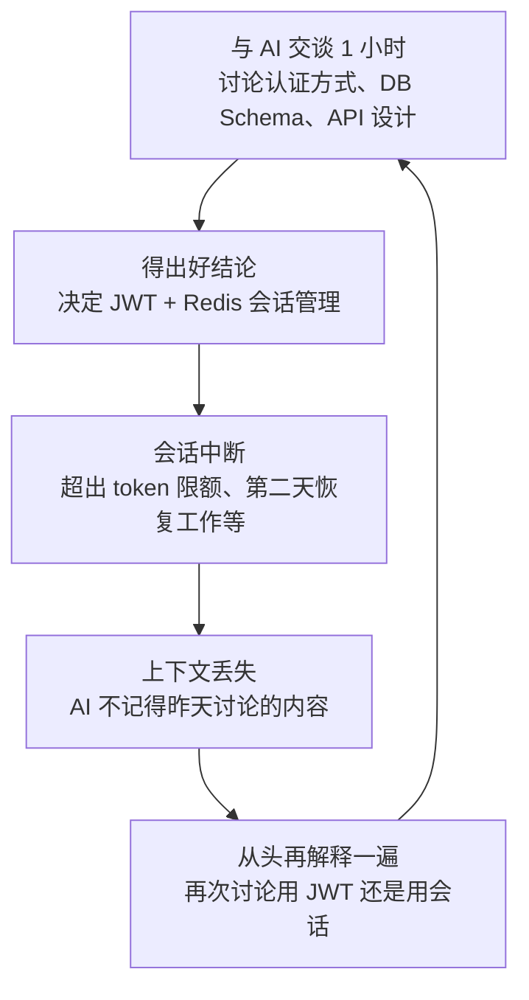
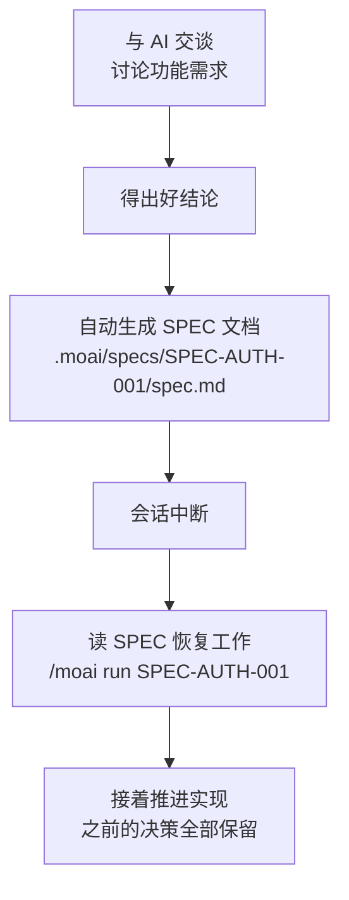
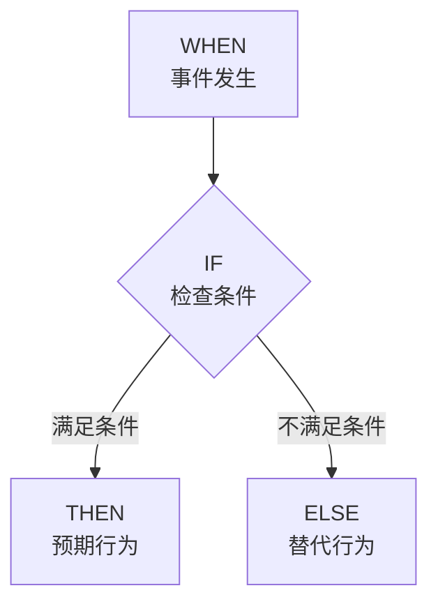
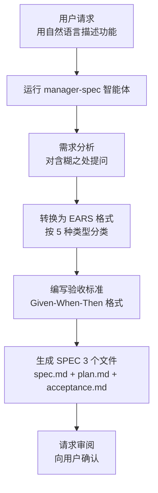
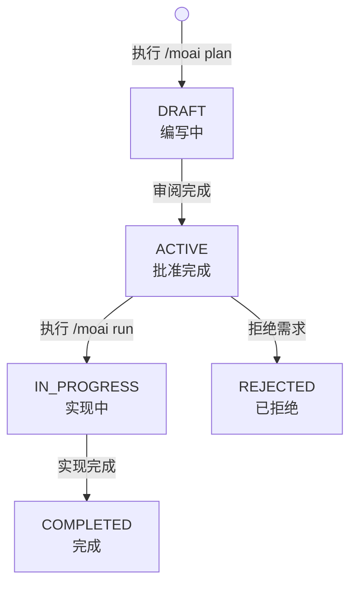

本文详细介绍 MoAI-ADK 基于 SPEC 的开发方法论。SPEC 既是智能体挽具的输入，也是代币经济学的隐藏工具 — 需求留在文件里，即使断开会话、用 `/clear` 清空上下文，也能凭 SPEC 一行接着干，不必重复同样的解释、白白烧掉 token。


  **一句话总结：** SPEC 就是"把与 AI 的对话留成文档"。即使会话中断，只要有 SPEC，随时都能接着干。



  **SPEC 是给 Agent 用的：** SPEC 不是让开发者背诵或学习的东西，而是 Agent 执行任务时参考的文档。对 SPEC 的原理与使用方式有概念性的理解就足够了。



  **SPEC 由 3 个文件构成：** 执行 `/moai plan` 时会同时生成 `spec.md`（EARS 需求）、`plan.md`（实现计划）、`acceptance.md`（验收标准）3 个文件。


## 什么是 SPEC？

**SPEC** (Specification) 是以结构化格式定义项目需求的文档。

用日常比喻来说，SPEC 就像**菜谱**。做菜时只靠脑子记，很容易漏掉食材或忘记顺序。但把菜谱写下来，任何人都能准确做出同一道菜。

| 菜谱 | SPEC 文档 | 共同点 |
| --------------------------------- | ---------------------- | -------------------------------- |
| 所需食材清单 | 需求清单 | 定义需要什么 |
| 烹饪顺序 | 实现顺序 | 定义按什么顺序进行 |
| 成品照片 | 验收标准 | 定义完成后的样子 |
| 没有"盐少许"这种含糊表达 | 用 EARS 格式明确表达 | 消除歧义 |

## 为什么需要 SPEC？

### 氛围编程的上下文丢失问题

与 AI 边聊边写代码时，最大的问题是**上下文丢失**。


```mermaid
flowchart TD
    A["与 AI 交谈 1 小时\n讨论认证方式、DB Schema、API 设计"] --> B["得出好结论\n决定 JWT + Redis 会话管理"]
    B --> C["会话中断\n超出 token 限额、第二天恢复工作等"]
    C --> D["上下文丢失\nAI 不记得昨天讨论的内容"]
    D --> E["从头再解释一遍\n再次讨论用 JWT 还是用会话"]
    E --> A
```

**发生上下文丢失的具体情况：**

| 情况 | 发生了什么 | 结果 |
| ----------------- | ------------------------------------ | ---------------------- |
| 会话超时 | 一段时间后之前的对话内容消失 | 讨论过的决策丢失 |
| 执行 `/clear` | 为节省 token 而重置上下文 | 之前的全部上下文被清空 |
| 超出 token 限额 | 对话变长后从旧内容开始被截断 | 早期决策丢失 |
| 第二天恢复工作 | 新会话不知道昨天的对话 | 需要重新解释全部内容 |

### 用 SPEC 解决问题

SPEC 通过把对话内容**保存为文件**从根本上解决这个问题。留在文件里的决策与上下文窗口无关地存活下来 — 这是挽具工程所说的 "durable state in files"（存放在文件中的持久状态）的典型例子。


```mermaid
flowchart TD
    A["与 AI 交谈\n讨论功能需求"] --> B["得出好结论"]
    B --> C["自动生成 SPEC 文档\n.moai/specs/SPEC-AUTH-001/spec.md"]
    C --> D["会话中断"]
    D --> E["读 SPEC 恢复工作\n/moai run SPEC-AUTH-001"]
    E --> F["接着推进实现\n之前的决策全部保留"]
```

**有无 SPEC 的差别：**


**没有 SPEC 的情况：**

假设昨天就"用户认证功能"与 AI 讨论了 1 小时。用 JWT 还是用会话、令牌过期时间设多久、刷新令牌存在哪里……这一切都得重新讨论。

**有 SPEC 的情况：**

下面一行就能按昨天的决定直接开始实现。

```bash
> /moai run SPEC-AUTH-001
```



## EARS 格式

**EARS** (Easy Approach to Requirements Syntax) 是把需求写清楚的方法。它消除自然语言的歧义，将需求转换为可用测试验证的格式。

EARS 提供 5 种需求模式。

### 1. Ubiquitous（永远成立）

系统必须**始终**遵守的需求，无条件地一直适用。

**格式：** "系统必须~"

**示例：**

```yaml
- id: REQ-001
  type: ubiquitous
  priority: HIGH
  text: "시스템은 모든 사용자 입력을 검증해야 한다"
  acceptance_criteria:
    - "모든 입력값에 대해 타입 검증 수행"
    - "SQL Injection 방지를 위한 파라미터화된 쿼리 사용"
    - "XSS 방지를 위한 출력 이스케이프"
```

**日常比喻：** 就像"开车时必须始终系安全带"，没有特别条件，一直要遵守。

### 2. Event-driven（事件驱动）

定义特定事件发生时系统应如何响应。

**格式：** "WHEN ~时，IF ~则，THEN 必须~"


```mermaid
flowchart TD
    A["WHEN\n事件发生"] --> B{"IF\n检查条件"}
    B -->|满足条件| C["THEN\n预期行为"]
    B -->|不满足条件| D["ELSE\n替代行为"]
```

**示例：**

```yaml
- id: REQ-002
  type: event-driven
  priority: HIGH
  text: |
    WHEN 사용자가 로그인 버튼을 클릭하면,
    IF 이메일과 비밀번호가 유효하면,
    THEN JWT 토큰을 발급하고 대시보드로 리다이렉트해야 한다
  acceptance_criteria:
    - given: "등록된 사용자 계정이 있고"
      when: "올바른 이메일과 비밀번호로 로그인하면"
      then: "200 응답과 함께 JWT 토큰 발급"
      and: "토큰 만료 시간은 1시간"
```

**日常比喻：** 就像"门铃响了 (WHEN)，用监控确认是认识的人 (IF)，就开门 (THEN)"。

### 3. State-driven（状态驱动）

定义特定状态持续期间系统应如何工作。

**格式：** "WHILE ~期间，必须~"

**示例：**

```yaml
- id: REQ-003
  type: state-driven
  priority: MEDIUM
  text: |
    WHILE 사용자가 로그인된 상태인 동안,
    시스템은 세션을 5분마다 갱신해야 한다
  acceptance_criteria:
    - "마지막 활동으로부터 5분 경과 시 자동 갱신"
    - "세션 만료 5분 전 알림 표시"
    - "30분 무활동 시 자동 로그아웃"
```

**日常比喻：** 就像"空调开着的期间 (WHILE)，必须把室温维持在 25 度"。

### 4. Unwanted（禁止事项）

定义系统**绝对不能做**的事情，主要用于安全相关需求。

**格式：** "系统不得~"

**示例：**

```yaml
- id: REQ-004
  type: unwanted
  priority: CRITICAL
  text: "시스템은 비밀번호를 평문으로 저장하면 안 된다"
  acceptance_criteria:
    - "비밀번호는 bcrypt로 해싱 (cost factor 12)"
    - "해싱되지 않은 비밀번호가 로그에 포함되지 않음"
    - "데이터베이스에 평문 비밀번호 저장 불가"

- id: REQ-005
  type: unwanted
  priority: CRITICAL
  text: "시스템은 하드코딩된 비밀키를 사용하면 안 된다"
  acceptance_criteria:
    - "모든 비밀키는 환경 변수 또는 비밀 관리자 사용"
    - "코드에 비밀키 포함되지 않음"
    - "Git 커밋에 비밀키 포함 방지"
```

**日常比喻：** 就像"不能把钥匙放在门口地垫下面"，明示不该做的事。

### 5. Optional（可选功能）

推荐实现但非必需的功能。

**格式：** "如果可能，必须~"

**示例：**

```yaml
- id: REQ-006
  type: optional
  priority: LOW
  text: "가능하다면, 시스템은 로그인 시 이메일 알림을 발송해야 한다"
  acceptance_criteria:
    - "이메일 서버가 구성된 경우에만 동작"
    - "알림 비활성화 옵션 제공"
```

**日常比喻：** 就像"有时间的话再做个甜点就好了"，有更好，没有也无妨。

### EARS 一览

| 类型 | 格式 | 用途 | 优先级 |
| ---------------- | ----------------------------- | ------------------ | ---------------- |
| **Ubiquitous** | "系统必须~" | 始终适用的规则 | 通常 HIGH |
| **Event-driven** | "WHEN ~时，THEN 必须~" | 定义事件响应 | 因功能而异 |
| **State-driven** | "WHILE ~期间，必须~" | 状态持续行为 | 通常 MEDIUM |
| **Unwanted** | "系统不得~" | 禁止事项（安全） | 通常 CRITICAL |
| **Optional** | "如果可能，必须~" | 可选功能 | 通常 LOW |

## SPEC 文档结构

SPEC 文档由 **manager-spec 智能体**自动生成。开发者无需背 EARS 格式，用自然语言发出请求，智能体会自动转换。

执行 `/moai plan` 时，一个 SPEC 目录中会同时生成 **3 个文件**：

| 文件 | 角色 | 内容 |
| --- | --- | --- |
| `spec.md` | EARS 需求定义 | YAML frontmatter、需求（5 种 EARS 类型）、约束条件、依赖 |
| `plan.md` | 实现计划 | 任务分解、技术栈说明、风险分析与缓解策略 |
| `acceptance.md` | 验收标准 | Given/When/Then 场景、边界情况、性能与质量门禁 |

### spec.md -- EARS 需求

```yaml
---
id: SPEC-AUTH-001               # 고유 식별자
title: 사용자 인증 시스템         # 명확하고 간결한 제목
priority: HIGH                  # HIGH, MEDIUM, LOW
status: ACTIVE                  # DRAFT, ACTIVE, IN_PROGRESS, COMPLETED
created: 2025-01-12             # 생성일
updated: 2025-01-12             # 최종 수정일
author: 개발팀                   # 작성자
version: 1.0.0                  # 문서 버전
---

# 사용자 인증 시스템

## 개요
JWT 기반 사용자 인증 시스템 구현

## 요구사항
### Ubiquitous
- 시스템은 모든 API 요청에 인증을 요구해야 한다

### Event-driven
- WHEN 사용자가 로그인하면, THEN JWT를 발급해야 한다

### Unwanted
- 시스템은 비밀번호를 평문으로 저장하면 안 된다

## 제약 조건
- API 응답 시간 500ms 이내
- 비밀번호 bcrypt 해싱 (cost factor 12)

## 의존성
- Redis (세션 관리)
- PostgreSQL (사용자 데이터)
```

### plan.md -- 实现计划

```markdown
# 구현 계획

## 작업 분해
1. 사용자 모델 및 마이그레이션 생성
2. JWT 토큰 발급/검증 유틸리티 구현
3. 로그인/회원가입 API 엔드포인트 구현
4. 인증 미들웨어 구현
5. Refresh Token 갱신 로직 구현

## 기술 스택
- Go 1.23 + Fiber v2
- PostgreSQL 16 + GORM
- Redis 7 (세션/토큰 저장)

## 위험 분석
| 위험 | 영향 | 완화 전략 |
| --- | --- | --- |
| 토큰 탈취 | HIGH | Refresh Token 회전, HttpOnly 쿠키 |
| 무차별 대입 | MEDIUM | Rate Limiting, 계정 잠금 |
```

### acceptance.md -- 验收标准

```markdown
# 인수 기준

## 시나리오

### AC-01: 정상 로그인
- **Given** 등록된 사용자 계정이 있고
- **When** 올바른 이메일과 비밀번호로 로그인하면
- **Then** 200 응답과 JWT 토큰 세트 반환

### AC-02: 잘못된 자격증명
- **Given** 등록된 사용자 계정이 있고
- **When** 잘못된 비밀번호로 로그인하면
- **Then** 401 응답과 일반적인 오류 메시지 반환

## 엣지 케이스
- 만료된 Refresh Token으로 갱신 시 401 응답
- 동시 로그인 제한 초과 시 가장 오래된 세션 만료

## 품질 게이트
- API 응답 시간: 500ms 이내 (P95)
- 테스트 커버리지: 85% 이상
```

## SPEC 工作流

SPEC 的创建从一条 `/moai plan` 命令开始。


```mermaid
flowchart TD
    A["用户请求\n用自然语言描述功能"] --> B["运行 manager-spec 智能体"]
    B --> C["需求分析\n对含糊之处提问"]
    C --> D["转换为 EARS 格式\n按 5 种类型分类"]
    D --> E["编写验收标准\nGiven-When-Then 格式"]
    E --> F["生成 SPEC 3 个文件\nspec.md + plan.md + acceptance.md"]
    F --> G["请求审阅\n向用户确认"]
```

**执行方法：**

```bash
# SPEC 생성 명령어
> /moai plan "사용자 인증 기능 구현"
```

执行该命令后，以下步骤自动进行：

1. **需求分析：** manager-spec 分析"用户认证功能"意味着什么
2. **澄清提问：** 有含糊之处时向用户提问（例："您偏好 JWT 还是会话方式？"）
3. **EARS 转换：** 自动把自然语言分类为 5 种 EARS 类型
4. **生成 3 个文件：** 在 `.moai/specs/SPEC-AUTH-001/` 目录中同时生成 `spec.md`、`plan.md`、`acceptance.md` 3 个文件
5. **请求审阅：** 把生成的 SPEC 展示给用户并请求确认


  **重要：** 智能体生成的 SPEC 文档务必审阅一遍。AI 可能误解或遗漏需求。尤其应确认验收标准是否可测试、优先级是否恰当。


## SPEC 文件位置与管理

### 文件结构

```
.moai/
└── specs/
    ├── SPEC-AUTH-001/
    │   ├── spec.md          # EARS 요구사항
    │   ├── plan.md          # 구현 계획
    │   └── acceptance.md    # 인수 기준
    ├── SPEC-PAYMENT-001/
    │   ├── spec.md
    │   ├── plan.md
    │   └── acceptance.md
    └── SPEC-SEARCH-001/
        ├── spec.md
        ├── plan.md
        └── acceptance.md
```

### SPEC 状态管理

每个 SPEC 随生命周期变更状态。


```mermaid
flowchart TD
    Start(( )) -->|"执行 /moai plan"| DRAFT["DRAFT\n编写中"]
    DRAFT -->|"审阅完成"| ACTIVE["ACTIVE\n批准完成"]
    ACTIVE -->|"执行 /moai run"| IN_PROGRESS["IN_PROGRESS\n实现中"]
    IN_PROGRESS -->|"实现完成"| COMPLETED["COMPLETED\n完成"]
    ACTIVE -->|"拒绝需求"| REJECTED["REJECTED\n已拒绝"]
```

| 状态 | 含义 | 下一个可能状态 |
| ------------- | -------------------------- | --------------------- |
| `DRAFT` | 编写中，需要审阅 | ACTIVE、REJECTED |
| `ACTIVE` | 批准完成，实现就绪 | IN_PROGRESS、REJECTED |
| `IN_PROGRESS` | 实现进行中 | COMPLETED、REJECTED |
| `COMPLETED` | 满足全部验收标准，完成 | （最终状态） |
| `REJECTED` | 需求被拒，需要重写 | （最终状态） |

## 实战示例：JWT 认证 SPEC

以下是实际执行 `/moai plan` 生成的 SPEC 示例。

```bash
# SPEC 생성
> /moai plan "JWT 기반 사용자 인증 시스템. 로그인, 회원가입, 토큰 갱신 기능 포함"
```

如下，在 `.moai/specs/SPEC-AUTH-001/` 目录中生成 3 个文件。

**spec.md -- EARS 需求：**

```yaml
---
id: SPEC-AUTH-001
title: JWT 기반 사용자 인증 시스템
priority: HIGH
status: ACTIVE
created: 2025-01-15
version: 1.0.0
---

# JWT 기반 사용자 인증 시스템

## 개요
JWT 토큰을 사용한 사용자 인증 시스템.
로그인, 회원가입, 토큰 갱신 기능을 구현한다.

## 요구사항

### Ubiquitous
- REQ-U01: 시스템은 모든 인증 토큰을 HTTPS로만 전송해야 한다
- REQ-U02: 시스템은 모든 사용자 입력을 검증해야 한다

### Event-driven
- REQ-E01: WHEN 사용자가 회원가입 폼을 제출하면,
  IF 이메일이 중복되지 않으면,
  THEN 계정을 생성하고 환영 이메일을 발송해야 한다
- REQ-E02: WHEN 사용자가 로그인하면,
  IF 자격증명이 유효하면,
  THEN Access Token (1시간)과 Refresh Token (7일)을 발급해야 한다

### Unwanted
- REQ-N01: 시스템은 비밀번호를 평문으로 저장하면 안 된다
- REQ-N02: 시스템은 만료된 Refresh Token으로 새 토큰을 발급하면 안 된다

### Optional
- REQ-O01: 가능하다면, 소셜 로그인 (Google, GitHub)을 지원해야 한다

## 제약 조건
- 비밀번호: bcrypt (cost factor 12)
- Access Token 만료: 1시간
- Refresh Token 만료: 7일
- API 응답 시간: 500ms 이내 (P95)
```

**plan.md -- 实现计划：**

```markdown
# 구현 계획

## 작업 분해
1. 사용자 모델 및 DB 마이그레이션 생성
2. 비밀번호 해싱 유틸리티 구현
3. JWT 토큰 발급/검증 유틸리티 구현
4. 회원가입 API 엔드포인트 구현
5. 로그인 API 엔드포인트 구현
6. 인증 미들웨어 구현
7. Refresh Token 갱신 로직 구현

## 기술 스택
- Go 1.23 + Fiber v2
- PostgreSQL 16 + GORM
- Redis 7 (Refresh Token 저장)

## 위험 분석
| 위험 | 영향 | 완화 전략 |
| --- | --- | --- |
| 토큰 탈취 | HIGH | Refresh Token 회전, HttpOnly 쿠키 |
| 무차별 대입 | MEDIUM | Rate Limiting, 계정 잠금 |
```

**acceptance.md -- 验收标准：**

```markdown
# 인수 기준

## 시나리오

### AC-01: 정상 로그인
- **Given** 등록된 사용자 계정이 있고
- **When** 올바른 이메일과 비밀번호로 로그인하면
- **Then** 200 응답과 JWT 토큰 세트 (Access + Refresh) 반환

### AC-02: 잘못된 비밀번호
- **Given** 등록된 사용자 계정이 있고
- **When** 잘못된 비밀번호로 로그인하면
- **Then** 401 응답

### AC-03: 중복 회원가입
- **Given** 이미 등록된 이메일이 있고
- **When** 같은 이메일로 회원가입하면
- **Then** 409 응답

### AC-04: 토큰 갱신
- **Given** 유효한 Refresh Token이 있고
- **When** 토큰 갱신을 요청하면
- **Then** 새로운 Access Token 반환

## 품질 게이트
- API 응답 시간: 500ms 이내 (P95)
- 테스트 커버리지: 85% 이상
```

**用这个 SPEC 开始实现：**

```bash
# SPEC 확인 후 구현 시작
> /moai run SPEC-AUTH-001
```

这一条命令就会按设定的开发方法论（DDD 或 TDD）自动实现 SPEC 的全部需求。新项目使用 **TDD**（RED-GREEN-REFACTOR），现有项目使用 **DDD**（ANALYZE-PRESERVE-IMPROVE）循环。

## SPEC 编写技巧

### 从自然语言转换为 EARS

对比日常请求如何转换为 EARS 格式。

| 自然语言请求 | EARS 格式 |
| ---------------------- | ------------------------------------------------------------------------ |
| "给我做个登录功能" | WHEN 用户出示有效凭据时，THEN 必须签发认证令牌 |
| "密码要安全" | 系统不得以明文存储密码 (Unwanted) |
| "得快" | 登录响应时间必须在 500ms 以内 (Ubiquitous) |
| "错误处理做好点" | WHEN 发生错误时，THEN 必须向用户显示清晰的消息 |
| "有的话就好了" | 如果可能，系统应支持实时通知 (Optional) |


  不需要亲自编写 EARS 格式。向 `/moai plan` 用自然语言发出请求，**manager-spec 智能体会自动转换为 EARS 格式**。上表是帮助理解转换方式的参考资料。


## SPEC 生命周期与 Era 分类

SPEC 不是写一次就完事的文档，而是遵循**计划 (plan) → 实现 (run) → 同步 (sync)** 的生命周期。MoAI-ADK 会自动分类每个 SPEC 是按哪个时代 (era) 的规约编写的，并只对遵循现代规约的 SPEC 应用漂移（drift，规约偏离）检查。

### 3 阶段收尾（plan → run → sync）

所有 V3R6 SPEC 以 **3 个阶段**完结。过去存在的第 4 阶段（Mx-phase）已经**废止** — MX 标签验证不是独立阶段，而是在 sync 阶段处理的横切关注点 (cross-cutting concern)。

| 阶段 | 命令 | 做的事 | 记录位置 |
| --- | --- | --- | --- |
| **plan** | `/moai plan` | 编写 SPEC 产物（spec/plan/acceptance） | `progress.md` §E.1 |
| **run** | `/moai run` | 按方法论（DDD/TDD）实现 | `progress.md` §E.2 / §E.3 |
| **sync** | `/moai sync` | 文档同步 + 完成提交 | `progress.md` §E.4 |

sync 阶段结束后，该提交的 SHA 会以 **`sync_commit_sha`** 字段记录在 `progress.md` 的 **`§E.4 Sync-phase Audit-Ready Signal`** 一节中。该字段是否存在，是判定 SPEC 是否完整遵循现代规约 (V3R6) 的核心信号。


  **Mx-phase 废止：** 旧版本在 plan/run/sync 之后有名为 `Mx-phase` 的第 4 阶段与 `mx_commit_sha` 字段。现已废止，整合为 3 阶段。MX 代码注释（@MX 标签）管理在 sync 阶段内一并执行。


### 5 种 Era 分类

所有 SPEC 都按编写时期的规约被精确分类到一个 era 桶中。

| Era | 时期 | 生命周期标准 |
| --- | --- | --- |
| **V2.x** | 2026-02 之前 | 无 `progress.md`；直接提交实现 |
| **V3R2-R4** | 2026-02 ~ 2026-03 | 引入 `progress.md`；无 `sync_commit_sha` |
| **V3R5** | 2026-03 ~ 2026-04 | sync 章节出现；`sync_commit_sha` 未强制 |
| **V3R6** | 2026-04 ~ 现在 | 3 阶段现代标准（plan/run/sync）；`sync_commit_sha` 必需 |
| **unclassified** | — | 无法自动分类（不匹配任何启发式规则） |

era 分类通过自动检查 `spec.md` frontmatter 的 `created:` 日期与 `progress.md` 的章节结构来决定。边界模糊时，可以在 frontmatter 中添加 `era: V3R6` 这样的显式字段来直接指定。

### Grandfather 条款 (grandfather clause)

被分类为 **V2.x · V3R2-R4 · V3R5** 的 SPEC 受 **grandfather 条款保护**。这三个 era 在编写当时的规约是正当的，因此不追溯适用现代 V3R6 规约。

- grandfather SPEC 在审计结果中标记为 `era_final: true`。
- 章节缺失、提交 SHA 缺失等任何模式都**不会报告为漂移缺陷**。
- 因为把历史 SPEC 按现代规约批量规范化在运维上不可行、也无实际收益。

### 漂移检查仅限 V3R6

生命周期漂移检查（`moai spec audit`）**只**适用于 V3R6 SPEC。

- 现代 era 边界基准日为 **`2026-04-01`**。只有此日期之后编写并具备 V3R6 信号的 SPEC 才是漂移检查对象。
- 内部的 `IsModern()` 判定**只在 V3R6 时返回真 (true)**。
- 也就是说，grandfather era（V2.x/V3R2-R4/V3R5）始终被排除在漂移检查之外，不会被分类为缺陷。

得益于这一分类体系，可以在不对老 SPEC 产生误报 (false positive) 的情况下，精确验证正在编写的 SPEC 的规约遵循情况。

## 相关文档

- [什么是 MoAI-ADK？](/zh/core-concepts/what-is-moai-adk) -- 理解 MoAI-ADK 的整体结构
- [开发方法论 (DDD/TDD)](/zh/core-concepts/ddd) -- 学习基于 SPEC 安全实现代码的 DDD/TDD 方法论
- [TRUST 5 质量](/zh/core-concepts/trust-5) -- 学习验证已实现代码质量的标准
