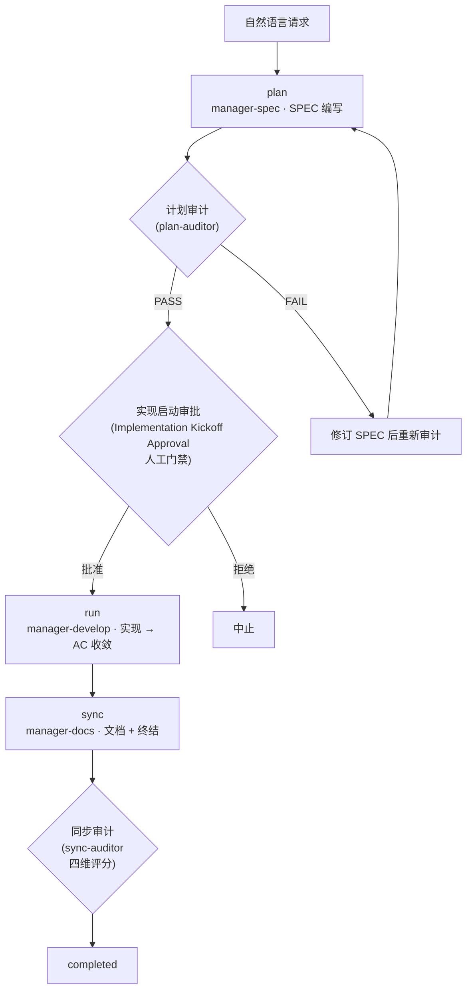



# SPEC 生命周期 (SPEC Lifecycle)

所有 MoAI 工作都遵循 **plan → run → sync** 的三阶段生命周期。本页讲这条生命周期**如何流动** —— 每个阶段投入什么、产出什么，阶段之间的三道门禁各自守着什么，工作的规模如何定出层级与路由。


 **分工**: [基于 SPEC 的开发](/zh/core-concepts/spec-based-dev) 讲的是 SPEC 文档<strong>是什么</strong>（GEARS 需求格式、3 个文件的构成、Era 分类与漂移检查）。本页讲生命周期<strong>如何流动</strong> —— 两页互不重复，以链接相接。


## 3 个阶段

| 阶段 | 命令 | 所属智能体 | token 预算 | 做什么 |
|--------|--------|---------------|-----------|---------|
| **plan** | `/moai plan` | manager-spec | 30K | 编写 SPEC 文档（GEARS 需求 + 实现计划 + 验收标准） |
| **run** | `/moai run` | manager-develop | 180K | 以 DDD / TDD 方法论实现 —— 直到 AC 收敛 |
| **sync** | `/moai sync` | manager-docs | 40K | 文档同步 + 变更日志 + 终结（PR） |

各阶段由不同智能体所有。`manager-spec` 编写 SPEC，`manager-develop` 实现它，`manager-docs` 把结果整理成文档并终结 —— 每个阶段换一次主人，不让任何智能体审查自己的输出。

### 各阶段的产出物

| 阶段 | 输入 | 输出 |
|--------|------|------|
| **plan** | 自然语言请求 + 代码库调查 | `.moai/specs/SPEC-XXX/` 的产出物组合（按层级 —— 见下表）—— spec.md、plan.md、acceptance.md（+ Tier L 再加 design.md、research.md） |
| **run** | SPEC 产出物组合 | 实现提交 + 测试。全部验收标准 (AC) 通过才能进入下一阶段 |
| **sync** | run 留下的工作树 + 进度记录 | 更新后的文档（README·CHANGELOG·API 文档）+ Pull Request。`completed` 状态转换与 `sync_commit_sha` 记录 |

想知道 SPEC 文档的文件构成与格式，看[基于 SPEC 的开发](/zh/core-concepts/spec-based-dev)；想知道 run 的方法论循环，看[开发方法论 (DDD/TDD)](/zh/core-concepts/ddd)。

## 3 道门禁

阶段之间立着三道门禁，各自守的东西不同。

### 实现启动审批 (Implementation Kickoff Approval)

plan → run 边界上的**人工门禁**。这是未经审查的计划流入实现之前的最后一道人的确认，由编排器以 `AskUserQuestion` 请求批准。

- **它是必需的，且与分数无关。** 计划审计即便 PASS、分数再高，这道门也不会被自动跳过。
- 通过门禁后，可以在同一处选择**自主 / 半自主的推进模式** —— 这个选择只决定批准之后发生什么，不会放宽门禁本身，也不会替它放行。

### 计划审计 (plan-audit)

每次 `/moai run` 开始时 —— 实现开始之前 —— **plan-auditor** 子智能体都会对 SPEC 计划产出物做整体独立审查。任何挽具级别（包括 `minimal`）都关不掉它。

| 判定 | 含义 |
|------|------|
| `PASS` | 满足全部必需标准 —— 进入下一阶段 |
| `FAIL` | 未达必需标准 —— 拦下，展示报告后询问用户 |
| `BYPASSED` | 经 `--skip-audit` 或环境变量绕过 —— 记录绕过事实后继续 |
| `INCONCLUSIVE` | 审计者遭遇超时、错误、非典型输出 —— 拦下后让用户选择重试 / 继续 / 中止 |

PASS 的判定标准是按层级划定的通过分数 —— **Tier S 0.75 · Tier M 0.80 · Tier L 0.85**（见下面层级表）。上一次判定为 PASS、分数超过层级标准且产出物哈希未变时，可以跳过审计的重新执行，但这个省略涵盖的**只是审计的重新执行** —— 它绝不会替实现启动审批这道人工门禁放行。

### 同步审计 (sync-auditor)

对 sync 质量的独立审查。**sync-auditor** 在一个对刚写完的代码没有眷恋的全新上下文里，按 4 个维度 —— **Functionality / Security / Craft / Consistency** —— 评分。各维度分别打分，整体判定遵循维度分数的调和平均，所以一个维度塌了，靠拉高平均是逃不掉的。

## 复杂度层级 S/M/L

每个 SPEC 在 plan 阶段被归入三个层级之一。层级决定产出物组合与计划审计的通过分数 —— 让小工作背上大仪式的过度形式化，正是这个分类存在的理由。

| 层级 | 规模基准 | 影响文件 | 产出物组合 | 审计通过分数 |
|------|-------------|-----------|-------------|----------------|
| **S** (Simple) | 300 LOC 以下 | 少于 5 个 | **2 个**: spec.md + plan.md（AC 内联在 spec.md §3） | 0.75 |
| **M** (Medium) | 300 – 1000 LOC | 5 – 15 个 | **3 个**: spec.md + plan.md + acceptance.md | 0.80 |
| **L** (Large) | 超过 1000 LOC 或涉及 constitution | 超过 15 个 | **5 个**: spec.md + plan.md + acceptance.md + design.md + research.md | 0.85 |

层级也定需求与验收标准的预算 —— **S 最多 8 个、M 最多 16 个、L 最多 25 个**。这两个上限**分别独立**作用于需求数和验收标准数（不是合计）。哪一边超了上限，都不是去扩预算的信号，而是该升层级、或把 SPEC 拆开的信号。

## 路由 A 与路由 B

阶段之间的转换由什么事件触发，取决于 SPEC 走哪条路由。**路由 A —— 混合主干（直推 `main`）** 是默认（Tier S/M），每个阶段直接向 `main` 提交并推送，转换由提交·推送事件和变绿的 CI 触发。**路由 B —— PR 路由** 用于 Tier L 或显式 `--pr`，由 `manager-git` 每阶段建分支、开 PR，转换由 PR 合并触发。哪条路由都不改变阶段顺序（plan → run → sync）与产出物组合 —— 变化的只有驱动转换的事件的词汇。

## /clear 策略

每个阶段结束时清空会话上下文是原则：

- **`/moai plan` 刚完成时 —— 必需。** 不把计划编写花掉的 token 载去实现。这一次 `/clear` 能给实现多腾出 45–50K token。
- 上下文超过 150K 时。
- 主要阶段转换之前。

即使切断会话，SPEC 也留在文件里 —— 这正是基于 SPEC 的开发的出发点 —— 下一个会话用一行（`/moai run SPEC-XXX`）就能接上。安全切断并接续会话的完整流程，参见[代币预算管理与正常停止](/zh/advanced/token-budget)。

## 相关文档

- [基于 SPEC 的开发](/zh/core-concepts/spec-based-dev) — SPEC 文档是什么: GEARS 格式、3 个文件的构成、Era 分类与漂移检查
- [`/moai plan`](/zh/workflow-commands/moai-plan) · [`/moai run`](/zh/workflow-commands/moai-run) · [`/moai sync`](/zh/workflow-commands/moai-sync) — 各阶段命令的执行细节
- [开发方法论 (DDD/TDD)](/zh/core-concepts/ddd) — run 阶段遵循的两种方法论循环
- [TRUST 5 质量框架](/zh/core-concepts/trust-5) — run 产出物必须通过的质量框架
- [看板模式](/zh/advanced/kanban-mode) — 把这条生命周期放到多会话看板上滚动的形态
