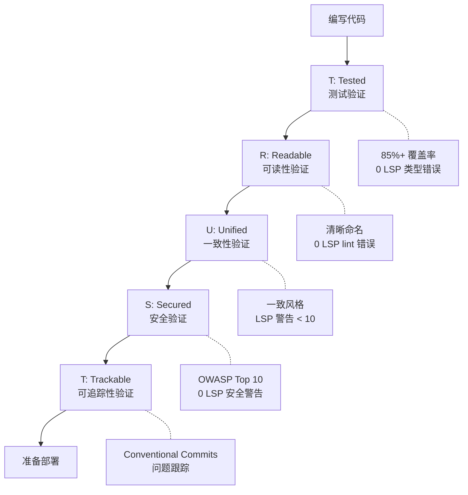
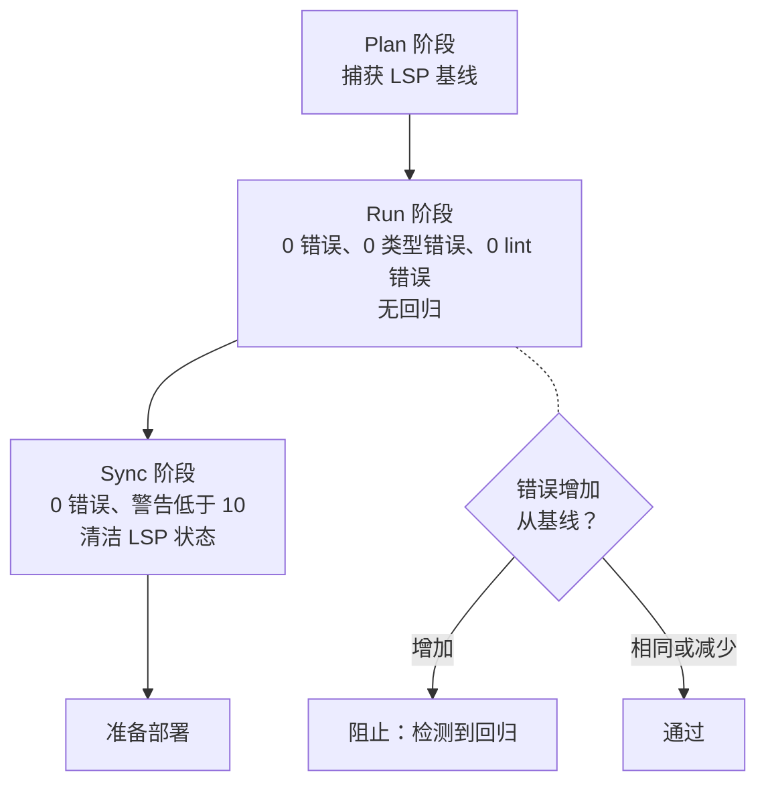
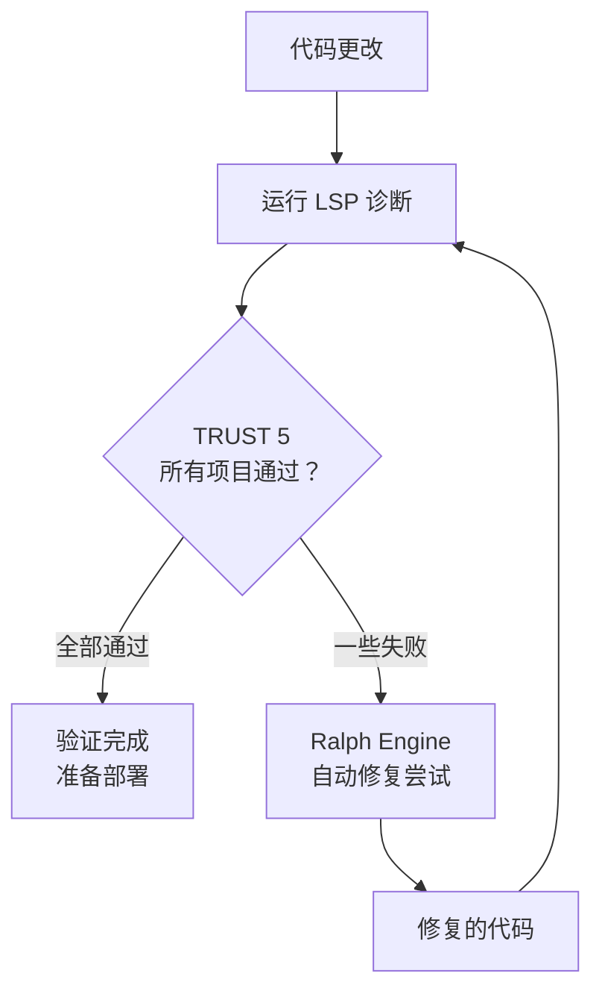

所有 MoAI-ADK 代码必须通过的 5 个质量原则详细指南。


  **一句话总结：** TRUST 5 是一个自动质量门，验证"代码是否经过测试、可读、一致、安全和可追踪？"


## 什么是 TRUST 5？

TRUST 5 是 MoAI-ADK 应用于所有代码的**5 个质量原则**。AI 生成和人工编写的代码都必须通过这些标准。

用日常生活的类比，它就像建筑的建筑检查。你必须检查结构安全、电路、管道、消防安全和建筑许可文件才能入住。代码也是一样。

| 建筑检查 | TRUST 5 | 检查内容 |
|---------------------|---------|----------------|
| 结构安全 | **T** (Tested) 已测试 | 用测试验证代码正常工作 |
| 电路/管道蓝图 | **R** (Readable) 可读 | 其他开发者能否理解代码 |
| 建筑规范合规 | **U** (Unified) 统一 | 符合项目编码标准 |
| 消防/安防系统 | **S** (Secured) 安全 | 无安全漏洞 |
| 许可文件 | **T** (Trackable) 可追踪 | 清楚记录更改历史 |



## T - Tested（已测试）

**核心：** 所有代码必须通过测试验证。

### 检查项目

| 检查项 | 标准 | 描述 |
|------------|----------|-------------|
| 测试覆盖率 | 85% 或以上 | 85% 以上的所有代码必须通过测试验证 |
| 特征测试 | 保护现有代码 | 在重构期间保留现有行为的测试 |
| LSP 类型错误 | 0 | 无类型检查错误 |
| LSP 诊断错误 | 0 | 无语言服务器诊断错误 |

### 为什么是 85%？

我们不要求 100% 是有原因的。

| 覆盖率 | 实际意义 |
|----------|-------------------|
| 低于 60% | 主要功能可能未测试 |
| 60-84% | 基本功能已测试，但边缘情况可能缺失 |
| **85-95%** | **核心逻辑和大多数边缘情况已验证（推荐）** |
| 95-100% | 测试维护成本开始超过收益 |

### 最佳实践

```python
def calculate_discount(price: float, discount_rate: float) -> float:
    """计算折后价格。

    Args:
        price: 原价（0 或以上）
        discount_rate: 折扣率（0.0 ~ 1.0）

    Returns:
        折后价格

    Raises:
        ValueError: 对于无效输入值
    """
    if price < 0:
        raise ValueError("价格不能低于 0")
    if not 0 <= discount_rate <= 1:
        raise ValueError("折扣率必须在 0.0 和 1.0 之间")
    return price * (1 - discount_rate)

# 测试验证正常和异常情况
def test_calculate_discount_normal():
    assert calculate_discount(10000, 0.1) == 9000
    assert calculate_discount(5000, 0.5) == 2500
    assert calculate_discount(0, 0.5) == 0

def test_calculate_discount_invalid_price():
    with pytest.raises(ValueError, match="价格不能"):
        calculate_discount(-1000, 0.1)

def test_calculate_discount_invalid_rate():
    with pytest.raises(ValueError, match="折扣率"):
        calculate_discount(10000, 1.5)
```

---

## R - Readable（可读）

**核心：** 代码必须清晰易懂。

### 检查项目

| 检查项 | 标准 | 描述 |
|------------|----------|-------------|
| 命名规则 | 揭示意图 | 变量、函数、类名必须清晰 |
| 代码注释 | 解释复杂逻辑 | 注释解释"为什么"（不是"什么"） |
| LSP Lint 错误 | 0 | 通过所有 linter 规则 |
| 函数长度 | 适当大小 | 函数不应太长 |

### 最佳实践

```python
# 差：从名称无法看出它做什么
def calc(d, r):
    return d * (1 - r)

# 好：只需阅读名称就能理解
def calculate_discounted_price(original_price: float, discount_rate: float) -> float:
    """从 original_price 计算由 discount_rate 折扣的价格。"""
    return original_price * (1 - discount_rate)
```


  **可读性提示：** 问自己"6 个月后我能理解这个吗？"如果不能，重命名或添加注释。


---

## U - Unified（统一）

**核心：** 在整个项目中保持一致的代码风格。

### 检查项目

| 检查项 | 标准 | 描述 |
|------------|----------|-------------|
| 代码格式 | 应用自动格式化程序 | Python: ruff/black, JS: prettier |
| 命名规则 | 遵循项目标准 | 不混合 snake_case、camelCase 等 |
| 错误处理 | 一致模式 | 在任何地方使用相同的错误处理方法 |
| LSP 警告 | 低于 10 | 语言服务器警告低于阈值 |

### 最佳实践

```python
# 统一的错误处理模式
class AppError(Exception):
    """应用程序基础错误"""
    def __init__(self, message: str, code: int = 500):
        self.message = message
        self.code = code

class NotFoundError(AppError):
    """未找到资源"""
    def __init__(self, resource: str, id: str):
        super().__init__(f"{resource} '{id}' 未找到", code=404)

class ValidationError(AppError):
    """输入验证失败"""
    def __init__(self, field: str, reason: str):
        super().__init__(f"'{field}' 验证失败: {reason}", code=400)

# 在所有服务中使用相同模式
def get_user(user_id: str) -> User:
    user = user_repository.find_by_id(user_id)
    if not user:
        raise NotFoundError("User", user_id)
    return user
```

---

## S - Secured（安全）

**核心：** 所有代码必须通过安全验证。

### 检查项目

| 检查项 | 标准 | 描述 |
|------------|----------|-------------|
| OWASP Top 10 | 完全合规 | 防止最常见的 Web 安全漏洞 |
| 依赖扫描 | 无易受攻击的包 | 不使用具有已知漏洞的库 |
| 加密策略 | 保护敏感数据 | 密码、令牌必须加密 |
| LSP 安全警告 | 0 | 无安全相关警告 |

### 主要安全检查

| 漏洞 | 防止方法 | 示例 |
|---------------|-------------------|---------|
| **SQL 注入** | 参数化查询 | `db.execute("SELECT * FROM users WHERE id = %s", (id,))` |
| **XSS** | 输出转义 | 自动转义 HTML 输出 |
| **密码泄露** | bcrypt 哈希 | `bcrypt.hashpw(password, salt)` |
| **硬编码密钥** | 环境变量 | `os.environ["SECRET_KEY"]` |
| **CSRF** | 令牌验证 | 在所有状态更改请求中包含 CSRF 令牌 |

### 最佳实践

```python
# 差：SQL 注入漏洞
def get_user(username: str) -> dict:
    query = f"SELECT * FROM users WHERE username = '{username}'"
    return db.execute(query)

# 好：使用参数化查询安全
def get_user(username: str) -> dict:
    query = "SELECT * FROM users WHERE username = %s"
    return db.execute(query, (username,))
```

---

## T - Trackable（可追踪）

**核心：** 所有更改必须清楚可追踪。

### 检查项目

| 检查项 | 标准 | 描述 |
|------------|----------|-------------|
| 提交消息 | Conventional Commits | `feat:`、`fix:`、`refactor:` 等标准格式 |
| 问题链接 | GitHub Issues 引用 | 在提交中包含相关问题编号 |
| CHANGELOG | 维护更改日志 | 记录向用户展示的更改 |
| LSP 状态跟踪 | 记录诊断历史 | 跟踪 LSP 状态变化以检测回归 |

### Conventional Commits 格式

```bash
# 结构: <type>(<scope>): <description>
# 示例:

# 添加新功能
$ git commit -m "feat(auth): 添加 JWT 登录 API"

# 修复 Bug
$ git commit -m "fix(auth): 修复令牌过期时间计算错误"

# 重构
$ git commit -m "refactor(auth): 将认证逻辑分离到 AuthService"

# 安全改进
$ git commit -m "security(db): 使用参数化查询防止 SQL 注入"
```

**提交类型：**

| 类型 | 描述 | 示例 |
|------|-------------|---------|
| `feat` | 新功能 | `feat(api): 添加用户列表 API` |
| `fix` | Bug 修复 | `fix(auth): 修复登录错误消息` |
| `refactor` | 代码改进（无行为变化） | `refactor(db): 优化查询` |
| `security` | 安全改进 | `security(auth): 密钥环境变量` |
| `docs` | 文档更改 | `docs(readme): 更新安装指南` |
| `test` | 测试添加/修改 | `test(auth): 添加登录测试用例` |

---

## LSP 质量门

MoAI-ADK 使用 **LSP**（Language Server Protocol）实时验证代码质量。LSP 是在 IDE 中用红色下划线显示错误的系统。

### 逐阶段 LSP 阈值

Plan、Run 和 Sync 阶段应用不同的 LSP 标准。

| 阶段 | 错误允许 | 类型错误允许 | Lint 错误允许 | 警告允许 | 回归允许 |
|-------|-----------------|---------------------|---------------------|------------------|---------------------|
| **Plan** | 捕获基线 | 捕获基线 | 捕获基线 | - | - |
| **Run** | 0 | 0 | 0 | - | 不允许 |
| **Sync** | 0 | - | - | 最多 10 | 不允许 |

**每个阶段的含义：**

- **Plan 阶段**：在阶段开始时捕获当前代码的 LSP 状态作为"基线"。这成为参考。
- **Run 阶段**：实现完成时 LSP 错误必须为 0。错误不应从基线增加（无回归）。
- **Sync 阶段**：在文档创建和 PR 之前 LSP 必须干净。警告最多允许 10 个。



## Ralph Engine 集成

**Ralph Engine** 是 MoAI-ADK 的自主质量验证循环。基于 LSP 诊断结果自动检测和修复代码问题。



**工作原理：**

1. 代码更改时，LSP 运行诊断
2. 如果项目不符合 TRUST 5 标准，Ralph Engine 尝试自动修复
3. 修复后再次运行 LSP 诊断以验证通过
4. 重复直到通过（最多 3 次重试）

**相关命令：**

```bash
# 运行自动修复
> /moai fix

# 重复自动修复直到完成
> /moai loop
```

## quality.yaml 配置

在 `.moai/config/sections/quality.yaml` 文件中管理 TRUST 5 相关设置。

### 关键设置

```yaml
constitution:
  # 启用 TRUST 5 质量验证
  enforce_quality: true

  # 目标测试覆盖率
  test_coverage_target: 85

  # LSP 质量门设置
  lsp_quality_gates:
    enabled: true

    plan:
      require_baseline: true # 在 Plan 开始时捕获基线

    run:
      max_errors: 0 # Run 阶段错误允许：0
      max_type_errors: 0 # 类型错误允许：0
      max_lint_errors: 0 # Lint 错误允许：0
      allow_regression: false # 不允许从基线回归

    sync:
      max_errors: 0 # Sync 阶段错误允许：0
      max_warnings: 10 # 警告允许：最多 10
      require_clean_lsp: true # 要求清洁的 LSP 状态

    cache_ttl_seconds: 5 # LSP 诊断缓存时间
    timeout_seconds: 3 # LSP 诊断超时
```

### 配置自定义建议

| 情况 | 调整方法 |
| ------------------------------------ | ---------------------------------------------------------- |
| 项目初期，几乎没有测试时 | 将 `test_coverage_target` 降至 70，然后逐步提高 |
| 存在大量遗留代码时 | 临时将 `allow_regression` 设置为 true |
| 需要严格安全性时 | 将 `max_warnings` 设置为 0 |

## 实战应用：通过质量门的场景

让我们看看 TRUST 5 在实际开发中是如何应用的。

### 场景：实现用户搜索 API

```bash
# 1. Plan：创建 SPEC（捕获 LSP 基线）
> /moai plan "实现用户搜索 API"
```

```bash
# 2. Run：使用 DDD 实现（TRUST 5 验证）
> /moai run SPEC-SEARCH-001
```

**Run 阶段的 TRUST 5 验证：**

| 项目 | 验证内容 | 结果 |
| ----------------- | ------------------------------------ | ---- |
| **T** (Tested) | 测试覆盖率 85%，类型错误 0 个 | 通过 |
| **R** (Readable) | Lint 错误 0 个，使用清晰的函数名 | 通过 |
| **U** (Unified) | 应用 ruff/black 格式化，LSP 警告 3 个 | 通过 |
| **S** (Secured) | 防止 SQL 注入，输入值验证 | 通过 |
| **T** (Trackable) | Conventional Commit 格式，引用 SPEC | 通过 |

```bash
# 3. Sync：生成文档及 PR（最终 LSP 清洁确认）
> /moai sync SPEC-SEARCH-001
```

**Sync 阶段最终确认：**

```
LSP 诊断结果：
- 错误：0 个
- 类型错误：0 个
- Lint 错误：0 个
- 警告：3 个（低于阈值 10）
- 安全警告：0 个

TRUST 5 全部通过：可以部署
```

## TRUST 5 一览

| 原则 | 核心问题 | 自动验证工具 | 标准 |
| ----------------- | --------------------------- | ---------------------- | -------------------------- |
| **T** (Tested) | 是否通过测试验证？ | pytest, LSP 类型检查 | 85%+ 覆盖率，0 类型错误 |
| **R** (Readable) | 其他人能阅读吗？ | ruff, eslint, LSP lint | 0 lint 错误，清晰命名 |
| **U** (Unified) | 符合项目规范吗？ | black, prettier, LSP | 一致格式，警告低于 10 |
| **S** (Secured) | 没有安全漏洞吗？ | bandit, semgrep, LSP | 符合 OWASP，0 安全警告 |
| **T** (Trackable) | 变更历史可追踪吗？ | commitlint, git | Conventional Commits |

## 相关文档

- [什么是 MoAI-ADK？](/core-concepts/what-is-moai-adk) -- 了解 MoAI-ADK 的整体结构
- [基于 SPEC 的开发](/core-concepts/spec-based-dev) -- 了解应用 TRUST 5 的 Plan 阶段
- [领域驱动开发](/core-concepts/ddd) -- 了解应用 TRUST 5 的 Run 阶段
