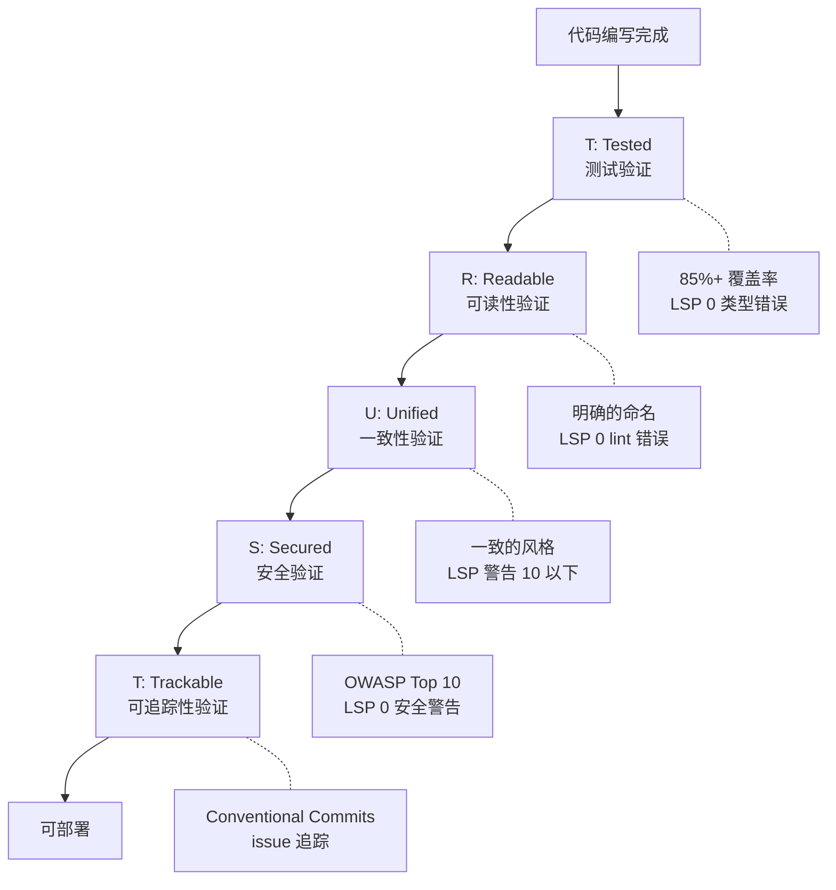
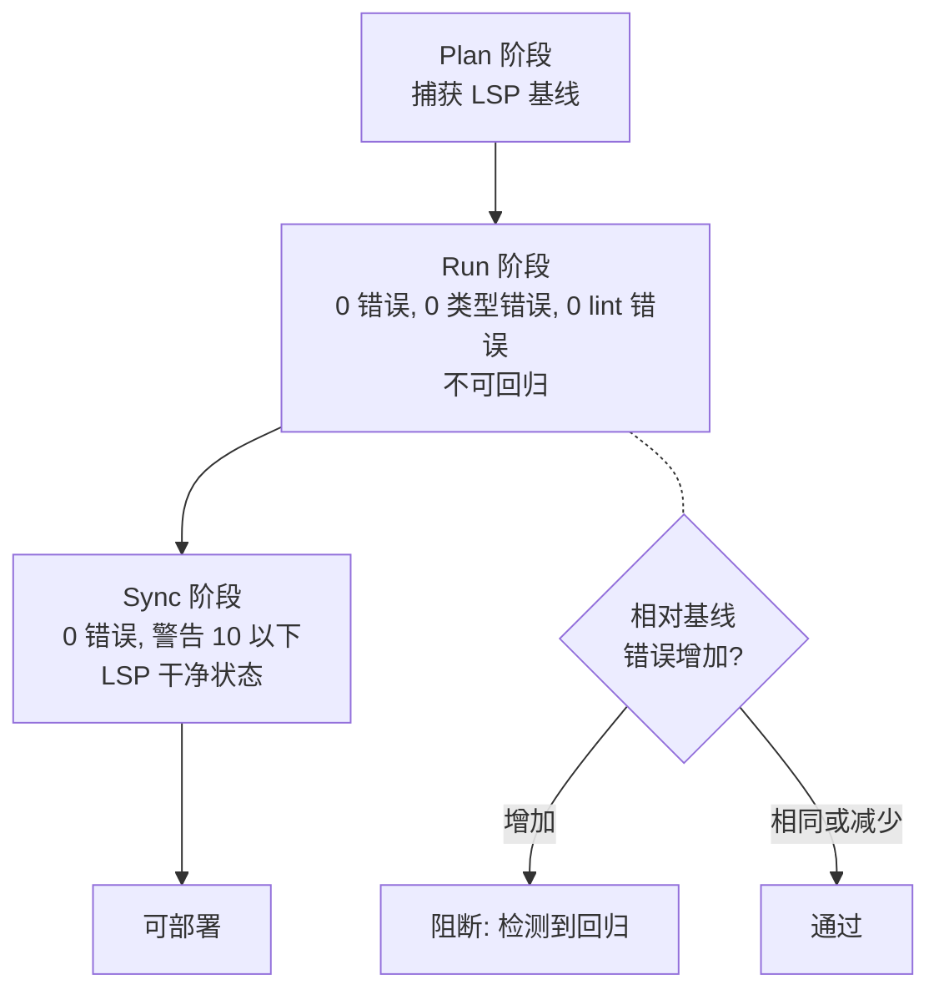
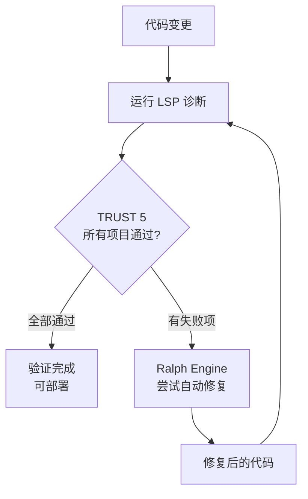

详细介绍 MoAI-ADK 所有代码都必须通过的 5 项质量原则。TRUST 5 是
智能体 harness 的质量门禁 —— 无论智能体生产代码有多快,若不能通过这道
门禁,就不被认定为完成。




  **一句话概括:** TRUST 5 是验证"代码是否已测试、是否易读、是否一致、
  是否安全、是否可追踪"的自动化质量门禁。


### harness 级别(3 级)

TRUST 5 质量门禁依 SPEC 范围以 3 级深度应用。复杂度估算器
(Complexity Estimator)基于 SPEC 范围自动决定 harness 级别。

| 级别        | 名称 | 验证范围                                              |
| ----------- | ---- | ----------------------------------------------------- |
| `minimal`   | 最小 | 快速验证 —— 仅通过核心门禁                             |
| `standard`  | 标准 | 基本验证 —— 运行基本质量门禁(默认)                  |
| `thorough`  | 深入 | 完整验证 —— sync-auditor 独立评估 + 应用全部 TRUST 5 |

## 什么是 TRUST 5?

TRUST 5 是 MoAI-ADK 对所有代码应用的 **5 项质量原则**。AI 生成的
代码,以及人编写的代码,都必须通过这些标准。

用日常比喻来说,就像建楼时做竣工检查。结构安全性、
电气布线、给排水管道、消防设备、建筑许可文件都要确认才能入住。
代码也一样。

| 建筑检查        | TRUST 5           | 确认内容                              |
| ---------------- | ----------------- | -------------------------------------- |
| 结构安全性      | **T** (Tested)    | 用测试验证代码是否正常工作 |
| 电气/给排水设计图 | **R** (Readable)  | 其他开发者是否能理解代码  |
| 遵守建筑规范   | **U** (Unified)   | 是否符合项目的编码规则          |
| 消防/安全设备   | **S** (Secured)   | 是否没有安全漏洞                   |
| 许可文件      | **T** (Trackable) | 变更历史是否清晰记录        |


```mermaid
flowchart TD
    Code["代码编写完成"] --> T1["T: Tested\n测试验证"]
    T1 --> R["R: Readable\n可读性验证"]
    R --> U["U: Unified\n一致性验证"]
    U --> S["S: Secured\n安全验证"]
    S --> T2["T: Trackable\n可追踪性验证"]
    T2 --> Deploy["可部署"]

    T1 -.- T1D["85%+ 覆盖率\nLSP 0 类型错误"]
    R -.- RD["明确的命名\nLSP 0 lint 错误"]
    U -.- UD["一致的风格\nLSP 警告 10 以下"]
    S -.- SD["OWASP Top 10\nLSP 0 安全警告"]
    T2 -.- T2D["Conventional Commits\nissue 追踪"]
```

## T - Tested(已测试)

**核心:** 所有代码都必须用测试验证。

### 确认什么

| 验证项目       | 标准           | 说明                                                    |
| --------------- | -------------- | ------------------------------------------------------- |
| 测试覆盖率 | 85% 以上       | 全部代码的 85% 以上必须用测试验证       |
| 特性化测试   | 保护既有代码 | 重构时必须有保存既有行为的测试 |
| LSP 类型错误   | 0 个            | 类型检查不能有错误                      |
| LSP 诊断错误   | 0 个            | 语言服务器不能有诊断错误                   |

### 为什么是 85%?

不要求 100% 是有原因的。

| 覆盖率   | 现实意义                                               |
| ---------- | ----------------------------------------------------------- |
| 不足 60%   | 主要功能也可能未被测试                     |
| 60-84%     | 基本功能被测试,但可能漏掉边界情况 |
| **85-95%** | **核心逻辑与大部分边界情况被验证(推荐)**    |
| 95-100%    | 测试维护成本相对效果开始下降        |

### 最佳实践

```python
def calculate_discount(price: float, discount_rate: float) -> float:
    """计算折扣价。

    Args:
        price: 原价(0 以上)
        discount_rate: 折扣率(0.0 ~ 1.0)

    Returns:
        折后价

    Raises:
        ValueError: 无效的输入值
    """
    if price < 0:
        raise ValueError("价格不能小于 0")
    if not 0 <= discount_rate <= 1:
        raise ValueError("折扣率必须在 0.0 到 1.0 之间")
    return price * (1 - discount_rate)

# 测试: 正常情况与异常情况都验证
def test_calculate_discount_normal():
    assert calculate_discount(10000, 0.1) == 9000
    assert calculate_discount(5000, 0.5) == 2500
    assert calculate_discount(0, 0.5) == 0

def test_calculate_discount_invalid_price():
    with pytest.raises(ValueError, match="价格不能"):
        calculate_discount(-1000, 0.1)

def test_calculate_discount_invalid_rate():
    with pytest.raises(ValueError, match="折扣率"):
        calculate_discount(10000, 1.5)
```

---

## R - Readable(易读)

**核心:** 代码必须清晰、易于理解。

### 确认什么

| 验证项目     | 标准                 | 说明                                               |
| ------------- | -------------------- | -------------------------------------------------- |
| 命名规则     | 表达意图的命名 | 变量、函数、类的名称必须明确          |
| 代码注释     | 复杂逻辑有说明   | 必须有说明"为什么"这样做的注释 |
| LSP lint 错误 | 0 个                  | 必须通过所有 linter 规则                   |
| 函数长度     | 适当的大小          | 单个函数不能太长                  |

### 最佳实践

```python
# 坏例子: 仅凭名称无法知道做什么
def calc(d, r):
    return d * (1 - r)

# 好例子: 只读名称就能知道作用
def calculate_discounted_price(original_price: float, discount_rate: float) -> float:
    """计算从原价按折扣率折算后的价格。"""
    return original_price * (1 - discount_rate)
```


  **可读性提示:** 自问"6 个月后的我自己"读这段代码时能否立刻
  理解。若无法理解,请改名或添加注释。


---

## U - Unified(统一)

**核心:** 在整个项目中保持一致的代码风格。

### 确认什么

| 验证项目 | 标准               | 说明                                      |
| --------- | ------------------ | ----------------------------------------- |
| 代码格式 | 应用自动格式化器   | Python 用 ruff/black,JS 用 prettier 统一 |
| 命名规则 | 遵守项目标准 | 禁止混用 snake_case、camelCase 等        |
| 错误处理 | 统一的模式        | 所有地方使用相同的错误处理方式    |
| LSP 警告  | 10 个以下          | 语言服务器警告在阈值以下              |

### 最佳实践

```python
# 统一的错误处理模式
class AppError(Exception):
    """应用基础错误"""
    def __init__(self, message: str, code: int = 500):
        self.message = message
        self.code = code

class NotFoundError(AppError):
    """找不到资源"""
    def __init__(self, resource: str, id: str):
        super().__init__(f"找不到 {resource} '{id}'", code=404)

class ValidationError(AppError):
    """输入值验证失败"""
    def __init__(self, field: str, reason: str):
        super().__init__(f"'{field}' 验证失败: {reason}", code=400)

# 所有服务使用相同的模式
def get_user(user_id: str) -> User:
    user = user_repository.find_by_id(user_id)
    if not user:
        raise NotFoundError("用户", user_id)
    return user
```

---

## S - Secured(安全)

**核心:** 所有代码都必须通过安全验证。

### 确认什么

| 验证项目     | 标准               | 说明                                      |
| ------------- | ------------------ | ----------------------------------------- |
| OWASP Top 10  | 全部遵守          | 防止最常见的 10 种 Web 安全漏洞      |
| 依赖扫描   | 无脆弱包 | 禁止使用有已知漏洞的库 |
| 加密策略   | 保护敏感数据   | 密码、令牌等必须加密         |
| LSP 安全警告 | 0 个                | 不能有安全相关警告            |

### 主要安全验证项目

| 漏洞                | 防止方法         | 示例                                                     |
| --------------------- | ----------------- | -------------------------------------------------------- |
| **SQL Injection**     | 参数化查询 | `db.execute("SELECT * FROM users WHERE id = %s", (id,))` |
| **XSS**               | 输出转义   | HTML 输出时自动转义                             |
| **密码泄露**     | bcrypt 哈希       | `bcrypt.hashpw(password, salt)`                          |
| **硬编码的密钥** | 使用环境变量    | `os.environ["SECRET_KEY"]`                               |
| **CSRF**              | 令牌验证         | 所有状态变更请求包含 CSRF 令牌                     |

### 最佳实践

```python
# 坏例子: SQL Injection 漏洞
def get_user(username: str) -> dict:
    query = f"SELECT * FROM users WHERE username = '{username}'"
    return db.execute(query)

# 好例子: 用参数化查询保证安全
def get_user(username: str) -> dict:
    query = "SELECT * FROM users WHERE username = %s"
    return db.execute(query, (username,))
```

---

## T - Trackable(可追踪)

**核心:** 所有变更都必须清晰可追踪。

### 确认什么

| 验证项目     | 标准                 | 说明                                      |
| ------------- | -------------------- | ----------------------------------------- |
| 提交信息   | Conventional Commits | `feat:`, `fix:`, `refactor:` 等标准格式 |
| issue 关联     | 参照 GitHub Issues   | 提交中包含相关 issue 编号                |
| CHANGELOG     | 维护变更日志       | 记录展示给用户的变更内容          |
| LSP 状态追踪 | 记录诊断历史       | 追踪 LSP 状态变更以检测回归        |

### Conventional Commits 格式

```bash
# 结构: <类型>(<范围>): <说明>
# 示例:

# 添加新功能
$ git commit -m "feat(auth): 添加基于 JWT 的登录 API"

# 修复 bug
$ git commit -m "fix(auth): 修复令牌过期时间计算错误"

# 重构
$ git commit -m "refactor(auth): 把认证逻辑分离到 AuthService"

# 安全改进
$ git commit -m "security(db): 用参数化查询防止 SQL Injection"
```

**提交类型:**

| 类型       | 说明                       | 示例                                         |
| ---------- | -------------------------- | -------------------------------------------- |
| `feat`     | 新功能                | `feat(api): 添加用户列表 API`            |
| `fix`      | 修复 bug                  | `fix(auth): 修复登录失败时的错误消息` |
| `refactor` | 代码改进(不改行为) | `refactor(db): 查询优化`                  |
| `security` | 安全改进                  | `security(auth): 密钥环境变量化`         |
| `docs`     | 文档变更           | `docs(readme): 更新安装指南`         |
| `test`     | 添加/修改测试           | `test(auth): 添加登录测试用例`      |

---

## LSP 质量门禁

MoAI-ADK 利用 **LSP**(Language Server Protocol)实时
验证代码质量。LSP 就是在 IDE 中用红色下划线标示错误的那个系统。

### 分阶段 LSP 阈值

Plan、Run、Sync 各阶段应用不同的 LSP 标准。

| 阶段     | 允许错误       | 允许类型错误  | 允许 lint 错误  | 允许警告 | 允许回归 |
| -------- | --------------- | --------------- | --------------- | --------- | --------- |
| **Plan** | 捕获基线 | 捕获基线 | 捕获基线 | -         | -         |
| **Run**  | 0 个             | 0 个             | 0 个             | -         | 不可      |
| **Sync** | 0 个             | -               | -               | 最多 10 个 | 不可      |

**各阶段的含义:**

- **Plan 阶段:** 把当前代码的 LSP 状态捕获为"基线"。这就是
  基准线。
- **Run 阶段:** 实现完成时 LSP 错误必须为 0。相对基线不能
  增加错误(不可回归)。
- **Sync 阶段:** 文档化与创建 PR 前 LSP 必须干净。警告最多
  允许 10 个。


```mermaid
flowchart TD
    P["Plan 阶段\n捕获 LSP 基线"] --> R["Run 阶段\n0 错误, 0 类型错误, 0 lint 错误\n不可回归"]
    R --> S["Sync 阶段\n0 错误, 警告 10 以下\nLSP 干净状态"]
    S --> Deploy["可部署"]

    R -.- RCheck{"相对基线\n错误增加?"}
    RCheck -->|"增加"| Block["阻断: 检测到回归"]
    RCheck -->|"相同或减少"| Pass["通过"]
```

## 与 Ralph Engine 的集成

**Ralph Engine** 是 MoAI-ADK 的自主质量验证循环。它基于 LSP 诊断
结果自动检测代码问题并反复修复。


```mermaid
flowchart TD
    A["代码变更"] --> B["运行 LSP 诊断"]
    B --> C{"TRUST 5\n所有项目通过?"}
    C -->|"全部通过"| D["验证完成\n可部署"]
    C -->|"有失败项"| E["Ralph Engine\n尝试自动修复"]
    E --> F["修复后的代码"]
    F --> B
```

**工作方式:**

1. 代码变更后 LSP 运行诊断
2. 若有未达 TRUST 5 标准的项,Ralph Engine 尝试自动修复
3. 修复后再运行 LSP 诊断确认是否通过
4. 反复直到通过(最多重试 3 次)

**相关命令:**

```bash
# 运行自动修复
> /moai fix

# 自动反复修复直到完成
> /moai loop
```

## quality.yaml 设置

在 `.moai/config/sections/quality.yaml` 文件中管理 TRUST 5 相关设置。

### 主要设置项

```yaml
constitution:
  # 启用 TRUST 5 质量验证
  enforce_quality: true

  # 目标测试覆盖率
  test_coverage_target: 85

  # LSP 质量门禁设置
  lsp_quality_gates:
    enabled: true

    plan:
      require_baseline: true # Plan 开始时捕获基线

    run:
      max_errors: 0 # Run 阶段允许错误: 0 个
      max_type_errors: 0 # 允许类型错误: 0 个
      max_lint_errors: 0 # 允许 lint 错误: 0 个
      allow_regression: false # 相对基线不可回归

    sync:
      max_errors: 0 # Sync 阶段允许错误: 0 个
      max_warnings: 10 # 允许警告: 最多 10 个
      require_clean_lsp: true # 需要 LSP 干净状态

    cache_ttl_seconds: 5 # LSP 诊断缓存时间
    timeout_seconds: 3 # LSP 诊断超时
```

### 设置自定义提示

| 情形                                   | 调整方法                                                  |
| -------------------------------------- | ---------------------------------------------------------- |
| 项目初期、几乎没有测试的情况 | 把 `test_coverage_target` 降到 70 并逐步提高 |
| 遗留代码多的情况                | 把 `allow_regression` 临时设为 true          |
| 需要严格安全的情况              | 把 `max_warnings` 设为 0                                  |

## 实战应用: 质量门禁通过场景

看看在实际开发中 TRUST 5 是如何应用的。

### 场景: 实现用户搜索 API

```bash
# 1. Plan: 生成 SPEC(捕获 LSP 基线)
> /moai plan "实现用户搜索 API"
```

```bash
# 2. Run: 用 DDD 实现(TRUST 5 验证)
> /moai run SPEC-SEARCH-001
```

**Run 阶段的 TRUST 5 验证:**

| 项目              | 验证内容                            | 结果 |
| ----------------- | ------------------------------------ | ---- |
| **T** (Tested)    | 测试覆盖率 85%,类型错误 0 个   | 通过 |
| **R** (Readable)  | lint 错误 0 个,使用明确的函数名    | 通过 |
| **U** (Unified)   | 应用 ruff/black 格式化,LSP 警告 3 个 | 通过 |
| **S** (Secured)   | 防止 SQL Injection,输入值验证      | 通过 |
| **T** (Trackable) | Conventional Commit 格式,SPEC 参照  | 通过 |

```bash
# 3. Sync: 生成文档与 PR(最终 LSP 干净确认)
> /moai sync SPEC-SEARCH-001
```

**Sync 阶段最终确认:**

```
LSP 诊断结果:
- 错误: 0 个
- 类型错误: 0 个
- lint 错误: 0 个
- 警告: 3 个(阈值 10 以下)
- 安全警告: 0 个

TRUST 5 全部通过: 可部署
```

## TRUST 5 一览

| 原则              | 核心问题                   | 自动验证工具         | 标准                       |
| ----------------- | --------------------------- | ---------------------- | -------------------------- |
| **T** (Tested)    | 是否用测试验证?      | pytest, LSP 类型检查  | 85%+ 覆盖率, 0 类型错误 |
| **R** (Readable)  | 别人是否能读懂? | ruff, eslint, LSP lint | 0 lint 错误, 明确的命名   |
| **U** (Unified)   | 是否符合项目规则?     | black, prettier, LSP   | 一致的格式, 警告 10 以下  |
| **S** (Secured)   | 是否没有安全漏洞?       | bandit, semgrep, LSP   | 遵守 OWASP, 0 安全警告    |
| **T** (Trackable) | 变更历史是否可追踪?  | commitlint, git        | Conventional Commits       |

## 相关文档

- [什么是 MoAI-ADK?](/core-concepts/what-is-moai-adk) —— 理解 MoAI-ADK 的
  整体结构
- [基于 SPEC 的开发](/core-concepts/spec-based-dev) —— 学习应用 TRUST 5 的 Plan
  阶段
- [领域驱动开发](/core-concepts/ddd) —— 学习应用 TRUST 5 的 Run 阶段
