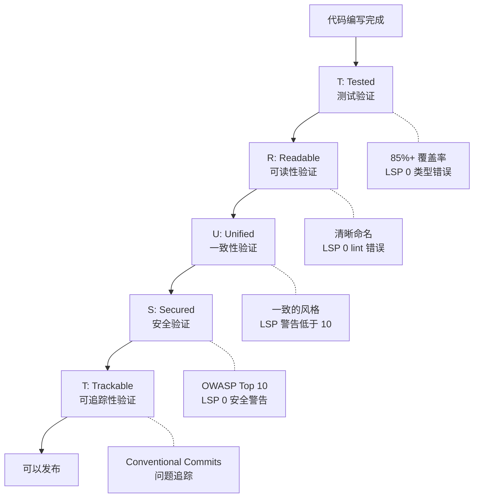
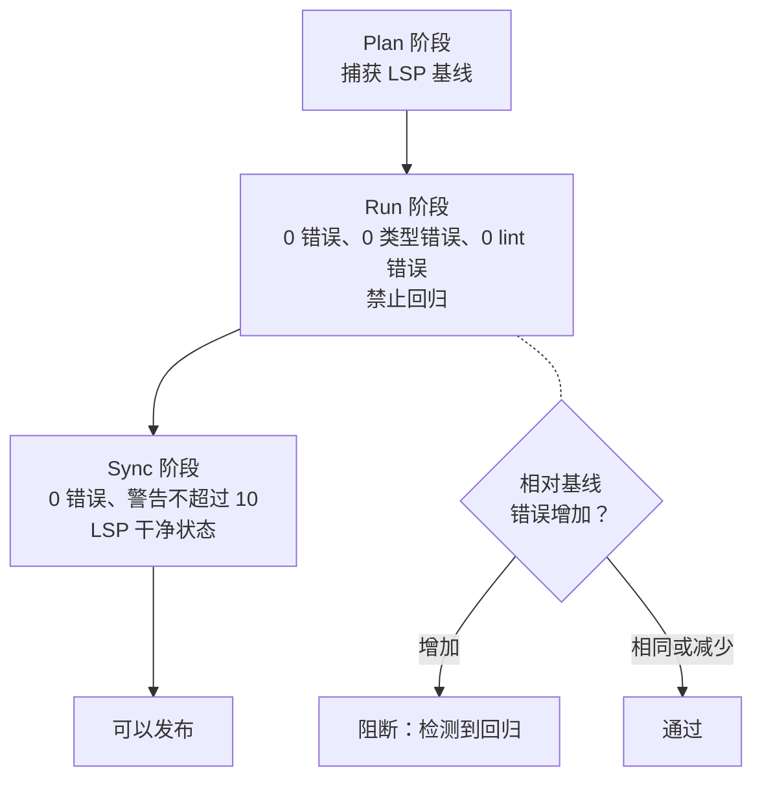
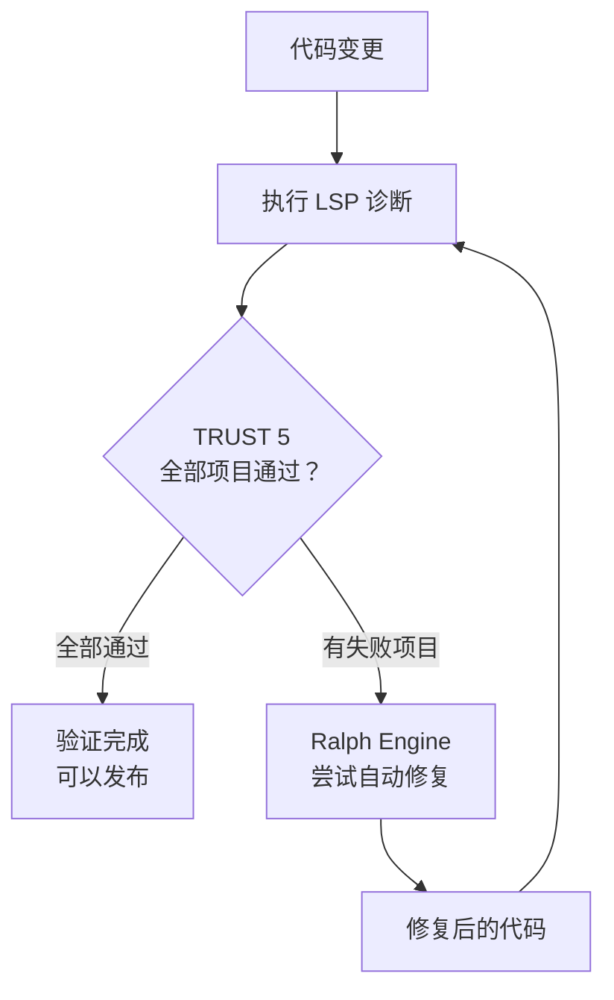

本文详细介绍 MoAI-ADK 所有代码都必须通过的 5 项质量原则。TRUST 5 是智能体挽具的质量门禁 — 无论智能体产出代码有多快，不通过这道门禁就不算完成。


  **一句话总结：** TRUST 5 是验证"代码是否被测试、是否易读、是否一致、是否安全、是否可追踪"的自动化质量门禁。


## 什么是 TRUST 5？

TRUST 5 是 MoAI-ADK 对所有代码应用的 **5 项质量原则**。无论是 AI 生成的代码，还是人写的代码，都必须通过这一标准。

用日常比喻来说，就像盖楼后的竣工验收。结构安全、电气布线、给排水管道、消防设施、建筑许可文件全部核验通过才能入住。代码也是一样。

| 建筑验收 | TRUST 5 | 核验内容 |
| ---------------- | ----------------- | -------------------------------------- |
| 结构安全 | **T** (Tested) | 用测试验证代码是否正常工作 |
| 电气/水路图纸 | **R** (Readable) | 其他开发者能否理解代码 |
| 符合建筑规范 | **U** (Unified) | 是否符合项目的编码规则 |
| 消防/安保设施 | **S** (Secured) | 是否没有安全漏洞 |
| 许可文件 | **T** (Trackable) | 变更历史是否被清晰记录 |


```mermaid
flowchart TD
    Code["代码编写完成"] --> T1["T: Tested\n测试验证"]
    T1 --> R["R: Readable\n可读性验证"]
    R --> U["U: Unified\n一致性验证"]
    U --> S["S: Secured\n安全验证"]
    S --> T2["T: Trackable\n可追踪性验证"]
    T2 --> Deploy["可以发布"]

    T1 -.- T1D["85%+ 覆盖率\nLSP 0 类型错误"]
    R -.- RD["清晰命名\nLSP 0 lint 错误"]
    U -.- UD["一致的风格\nLSP 警告低于 10"]
    S -.- SD["OWASP Top 10\nLSP 0 安全警告"]
    T2 -.- T2D["Conventional Commits\n问题追踪"]
```

## T - Tested（已测试）

**核心：** 所有代码都必须经过测试验证。

### 检查什么

| 验证项目 | 标准 | 说明 |
| --------------- | -------------- | ------------------------------------------------------- |
| 测试覆盖率 | 85% 以上 | 全部代码的 85% 以上必须经过测试验证 |
| 特性测试 | 保护现有代码 | 重构时必须有保存既有行为的测试 |
| LSP 类型错误 | 0 个 | 类型检查中不能有错误 |
| LSP 诊断错误 | 0 个 | 语言服务器的诊断中不能有错误 |

### 为什么是 85%？

不要求 100% 是有原因的。

| 覆盖率 | 现实含义 |
| ---------- | ----------------------------------------------------------- |
| 低于 60% | 主要功能也可能未被测试 |
| 60-84% | 基本功能被测试，但边界情况可能遗漏 |
| **85-95%** | **核心逻辑与大部分边界情况得到验证（推荐）** |
| 95-100% | 测试维护成本开始超过收益 |

### 最佳实践

```python
def calculate_discount(price: float, discount_rate: float) -> float:
    """할인가를 계산합니다.

    Args:
        price: 원래 가격 (0 이상)
        discount_rate: 할인율 (0.0 ~ 1.0)

    Returns:
        할인된 가격

    Raises:
        ValueError: 유효하지 않은 입력값
    """
    if price < 0:
        raise ValueError("가격은 0보다 작을 수 없습니다")
    if not 0 <= discount_rate <= 1:
        raise ValueError("할인율은 0.0에서 1.0 사이여야 합니다")
    return price * (1 - discount_rate)

# 테스트: 정상 케이스와 예외 케이스 모두 검증
def test_calculate_discount_normal():
    assert calculate_discount(10000, 0.1) == 9000
    assert calculate_discount(5000, 0.5) == 2500
    assert calculate_discount(0, 0.5) == 0

def test_calculate_discount_invalid_price():
    with pytest.raises(ValueError, match="가격은 0보다"):
        calculate_discount(-1000, 0.1)

def test_calculate_discount_invalid_rate():
    with pytest.raises(ValueError, match="할인율은"):
        calculate_discount(10000, 1.5)
```

---

## R - Readable（易读）

**核心：** 代码必须清晰、易于理解。

### 检查什么

| 验证项目 | 标准 | 说明 |
| ------------- | -------------------- | -------------------------------------------------- |
| 命名规范 | 表达意图的名字 | 变量、函数、类的名字必须清晰 |
| 代码注释 | 为复杂逻辑加说明 | 必须有解释"为什么"这么做的注释 |
| LSP lint 错误 | 0 个 | 必须通过全部 lint 规则 |
| 函数长度 | 恰当的大小 | 单个函数不能过长 |

### 最佳实践

```python
# 나쁜 예: 이름만으로는 무엇을 하는지 알 수 없습니다
def calc(d, r):
    return d * (1 - r)

# 좋은 예: 이름만 읽어도 역할을 알 수 있습니다
def calculate_discounted_price(original_price: float, discount_rate: float) -> float:
    """원래 가격에서 할인율만큼 할인된 가격을 계산합니다."""
    return original_price * (1 - discount_rate)
```


  **可读性技巧：** 问问自己，"6 个月后的自己"读到这段代码能不能立刻理解。理解不了就改名字或加注释。


---

## U - Unified（统一）

**核心：** 在整个项目中保持一致的代码风格。

### 检查什么

| 验证项目 | 标准 | 说明 |
| --------- | ------------------ | ----------------------------------------- |
| 代码格式 | 应用自动格式化工具 | Python 用 ruff/black，JS 用 prettier 统一 |
| 命名规范 | 遵循项目标准 | 禁止混用 snake_case、camelCase 等 |
| 错误处理 | 统一的模式 | 所有地方使用同样的错误处理方式 |
| LSP 警告 | 低于 10 个 | 语言服务器警告低于阈值 |

### 最佳实践

```python
# 통일된 에러 처리 패턴
class AppError(Exception):
    """애플리케이션 기본 에러"""
    def __init__(self, message: str, code: int = 500):
        self.message = message
        self.code = code

class NotFoundError(AppError):
    """리소스를 찾을 수 없음"""
    def __init__(self, resource: str, id: str):
        super().__init__(f"{resource} '{id}'을(를) 찾을 수 없습니다", code=404)

class ValidationError(AppError):
    """입력값 검증 실패"""
    def __init__(self, field: str, reason: str):
        super().__init__(f"'{field}' 검증 실패: {reason}", code=400)

# 모든 서비스에서 동일한 패턴 사용
def get_user(user_id: str) -> User:
    user = user_repository.find_by_id(user_id)
    if not user:
        raise NotFoundError("사용자", user_id)
    return user
```

---

## S - Secured（安全）

**核心：** 所有代码都必须通过安全验证。

### 检查什么

| 验证项目 | 标准 | 说明 |
| ------------- | ------------------ | ----------------------------------------- |
| OWASP Top 10 | 全面遵循 | 防范最常见的 10 种 Web 安全漏洞 |
| 依赖扫描 | 无脆弱包 | 禁止使用存在已知漏洞的库 |
| 加密策略 | 保护敏感数据 | 密码、令牌等必须加密 |
| LSP 安全警告 | 0 个 | 不能有安全相关警告 |

### 主要安全验证项目

| 漏洞 | 防范方法 | 示例 |
| --------------------- | ----------------- | -------------------------------------------------------- |
| **SQL Injection** | 参数化查询 | `db.execute("SELECT * FROM users WHERE id = %s", (id,))` |
| **XSS** | 输出转义 | HTML 输出时自动转义 |
| **密码泄露** | bcrypt 哈希 | `bcrypt.hashpw(password, salt)` |
| **硬编码密钥** | 使用环境变量 | `os.environ["SECRET_KEY"]` |
| **CSRF** | 令牌验证 | 所有状态变更请求携带 CSRF 令牌 |

### 最佳实践

```python
# 나쁜 예: SQL Injection 취약점
def get_user(username: str) -> dict:
    query = f"SELECT * FROM users WHERE username = '{username}'"
    return db.execute(query)

# 좋은 예: 파라미터화된 쿼리로 안전하게
def get_user(username: str) -> dict:
    query = "SELECT * FROM users WHERE username = %s"
    return db.execute(query, (username,))
```

---

## T - Trackable（可追踪）

**核心：** 所有变更都必须能够清晰追踪。

### 检查什么

| 验证项目 | 标准 | 说明 |
| ------------- | -------------------- | ----------------------------------------- |
| 提交信息 | Conventional Commits | `feat:`、`fix:`、`refactor:` 等标准格式 |
| 关联 Issue | 引用 GitHub Issues | 提交中包含相关 issue 编号 |
| CHANGELOG | 维护变更日志 | 记录展示给用户的变更内容 |
| LSP 状态追踪 | 记录诊断历史 | 追踪 LSP 状态变化以检测回归 |

### Conventional Commits 格式

```bash
# 구조: <타입>(<범위>): <설명>
# 예시:

# 새 기능 추가
$ git commit -m "feat(auth): JWT 기반 로그인 API 추가"

# 버그 수정
$ git commit -m "fix(auth): 토큰 만료 시간 계산 오류 수정"

# 리팩토링
$ git commit -m "refactor(auth): 인증 로직을 AuthService로 분리"

# 보안 개선
$ git commit -m "security(db): 파라미터화된 쿼리로 SQL Injection 방지"
```

**提交类型：**

| 类型 | 说明 | 示例 |
| ---------- | -------------------------- | -------------------------------------------- |
| `feat` | 新功能 | `feat(api): 사용자 목록 API 추가` |
| `fix` | Bug 修复 | `fix(auth): 로그인 실패 시 에러 메시지 수정` |
| `refactor` | 代码改进（不改变行为） | `refactor(db): 쿼리 최적화` |
| `security` | 安全改进 | `security(auth): 비밀키 환경 변수화` |
| `docs` | 文档变更 | `docs(readme): 설치 가이드 업데이트` |
| `test` | 添加/修改测试 | `test(auth): 로그인 테스트 케이스 추가` |

---

## LSP 质量门禁

MoAI-ADK 利用 **LSP** (Language Server Protocol) 实时验证代码质量。LSP 就是在 IDE 中用红色下划线标出错误的那个系统。

### 各阶段 LSP 阈值

Plan、Run、Sync 各阶段应用不同的 LSP 标准。

| 阶段 | 允许错误 | 允许类型错误 | 允许 lint 错误 | 允许警告 | 允许回归 |
| -------- | --------------- | --------------- | --------------- | --------- | --------- |
| **Plan** | 捕获基线 | 捕获基线 | 捕获基线 | - | - |
| **Run** | 0 个 | 0 个 | 0 个 | - | 不可 |
| **Sync** | 0 个 | - | - | 最多 10 个 | 不可 |

**各阶段含义：**

- **Plan 阶段：** 把当前代码的 LSP 状态捕获为"基线"，作为参照。
- **Run 阶段：** 实现完成时 LSP 错误必须为 0。相对基线错误不能增加（禁止回归）。
- **Sync 阶段：** 文档化与创建 PR 之前 LSP 必须干净。警告最多允许 10 个。


```mermaid
flowchart TD
    P["Plan 阶段\n捕获 LSP 基线"] --> R["Run 阶段\n0 错误、0 类型错误、0 lint 错误\n禁止回归"]
    R --> S["Sync 阶段\n0 错误、警告不超过 10\nLSP 干净状态"]
    S --> Deploy["可以发布"]

    R -.- RCheck{"相对基线\n错误增加？"}
    RCheck -->|"增加"| Block["阻断：检测到回归"]
    RCheck -->|"相同或减少"| Pass["通过"]
```

## 与 Ralph Engine 的集成

**Ralph Engine** 是 MoAI-ADK 的自主质量验证循环。它基于 LSP 诊断结果自动检测代码问题并反复修复。


```mermaid
flowchart TD
    A["代码变更"] --> B["执行 LSP 诊断"]
    B --> C{"TRUST 5\n全部项目通过？"}
    C -->|"全部通过"| D["验证完成\n可以发布"]
    C -->|"有失败项目"| E["Ralph Engine\n尝试自动修复"]
    E --> F["修复后的代码"]
    F --> B
```

**工作方式：**

1. 代码变更后 LSP 执行诊断
2. 存在未达 TRUST 5 标准的项目时，Ralph Engine 尝试自动修复
3. 修复后再次执行 LSP 诊断，确认是否通过
4. 重复直到通过（最多重试 3 次）

**相关命令：**

```bash
# 자동 수정 실행
> /moai fix

# 완료될 때까지 자동 반복 수정
> /moai loop
```

## quality.yaml 设置

在 `.moai/config/sections/quality.yaml` 文件中管理 TRUST 5 相关设置。

### 主要设置项目

```yaml
constitution:
  # TRUST 5 품질 검증 활성화
  enforce_quality: true

  # 목표 테스트 커버리지
  test_coverage_target: 85

  # LSP 품질 게이트 설정
  lsp_quality_gates:
    enabled: true

    plan:
      require_baseline: true # Plan 시작 시 베이스라인 캡처

    run:
      max_errors: 0 # Run 단계 오류 허용: 0개
      max_type_errors: 0 # 타입 오류 허용: 0개
      max_lint_errors: 0 # 린트 오류 허용: 0개
      allow_regression: false # 베이스라인 대비 회귀 불가

    sync:
      max_errors: 0 # Sync 단계 오류 허용: 0개
      max_warnings: 10 # 경고 허용: 최대 10개
      require_clean_lsp: true # LSP 클린 상태 필요

    cache_ttl_seconds: 5 # LSP 진단 캐시 시간
    timeout_seconds: 3 # LSP 진단 타임아웃
```

### 设置自定义技巧

| 场景 | 调整方法 |
| -------------------------------------- | ---------------------------------------------------------- |
| 项目初期，几乎没有测试 | 把 `test_coverage_target` 降到 70，之后逐步提高 |
| 遗留代码很多 | 临时把 `allow_regression` 设为 true |
| 需要严格安全 | 把 `max_warnings` 设为 0 |

## 实战应用：通过质量门禁的场景

来看 TRUST 5 在实际开发中如何应用。

### 场景：实现用户搜索 API

```bash
# 1. Plan: SPEC 생성 (LSP 베이스라인 캡처)
> /moai plan "사용자 검색 API 구현"
```

```bash
# 2. Run: DDD로 구현 (TRUST 5 검증)
> /moai run SPEC-SEARCH-001
```

**Run 阶段的 TRUST 5 验证：**

| 项目 | 验证内容 | 结果 |
| ----------------- | ------------------------------------ | ---- |
| **T** (Tested) | 测试覆盖率 85%，类型错误 0 个 | 通过 |
| **R** (Readable) | lint 错误 0 个，使用清晰的函数名 | 通过 |
| **U** (Unified) | 应用 ruff/black 格式化，LSP 警告 3 个 | 通过 |
| **S** (Secured) | 防范 SQL Injection，验证输入值 | 通过 |
| **T** (Trackable) | Conventional Commit 格式，引用 SPEC | 通过 |

```bash
# 3. Sync: 문서 생성 및 PR (최종 LSP 클린 확인)
> /moai sync SPEC-SEARCH-001
```

**Sync 阶段最终确认：**

```
LSP 진단 결과:
- 오류: 0개
- 타입 오류: 0개
- 린트 오류: 0개
- 경고: 3개 (임계값 10 이하)
- 보안 경고: 0개

TRUST 5 전체 통과: 배포 가능
```

## TRUST 5 一览

| 原则 | 核心问题 | 自动验证工具 | 标准 |
| ----------------- | --------------------------- | ---------------------- | -------------------------- |
| **T** (Tested) | 是否经过测试验证？ | pytest、LSP 类型检查 | 85%+ 覆盖率、0 类型错误 |
| **R** (Readable) | 其他人能读懂吗？ | ruff、eslint、LSP lint | 0 lint 错误、清晰命名 |
| **U** (Unified) | 符合项目规则吗？ | black、prettier、LSP | 一致的格式、警告低于 10 |
| **S** (Secured) | 没有安全漏洞吗？ | bandit、semgrep、LSP | 遵循 OWASP、0 安全警告 |
| **T** (Trackable) | 变更历史可追踪吗？ | commitlint、git | Conventional Commits |

## 相关文档

- [什么是 MoAI-ADK？](/zh/core-concepts/what-is-moai-adk) -- 理解 MoAI-ADK 的整体结构
- [基于 SPEC 的开发](/zh/core-concepts/spec-based-dev) -- 学习应用 TRUST 5 的 Plan 阶段
- [领域驱动开发](/zh/core-concepts/ddd) -- 学习应用 TRUST 5 的 Run 阶段
