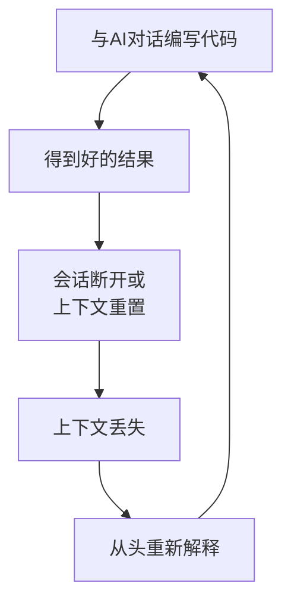
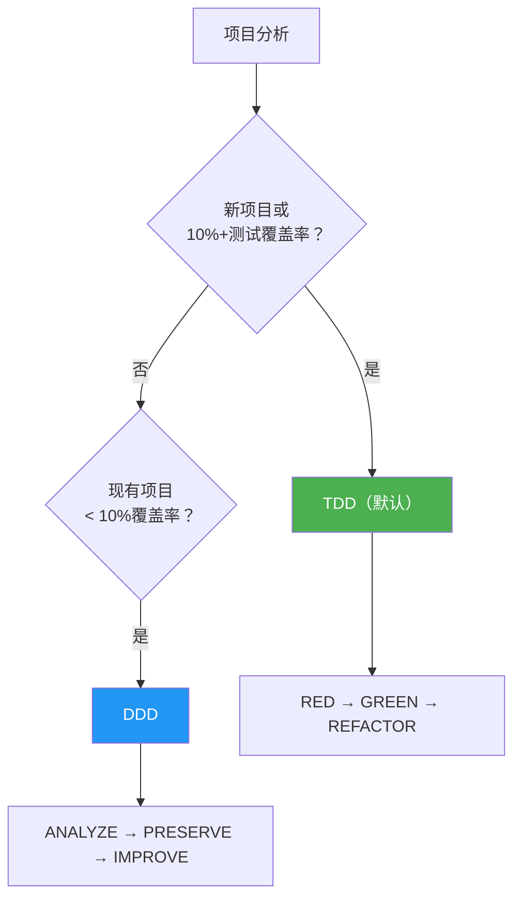
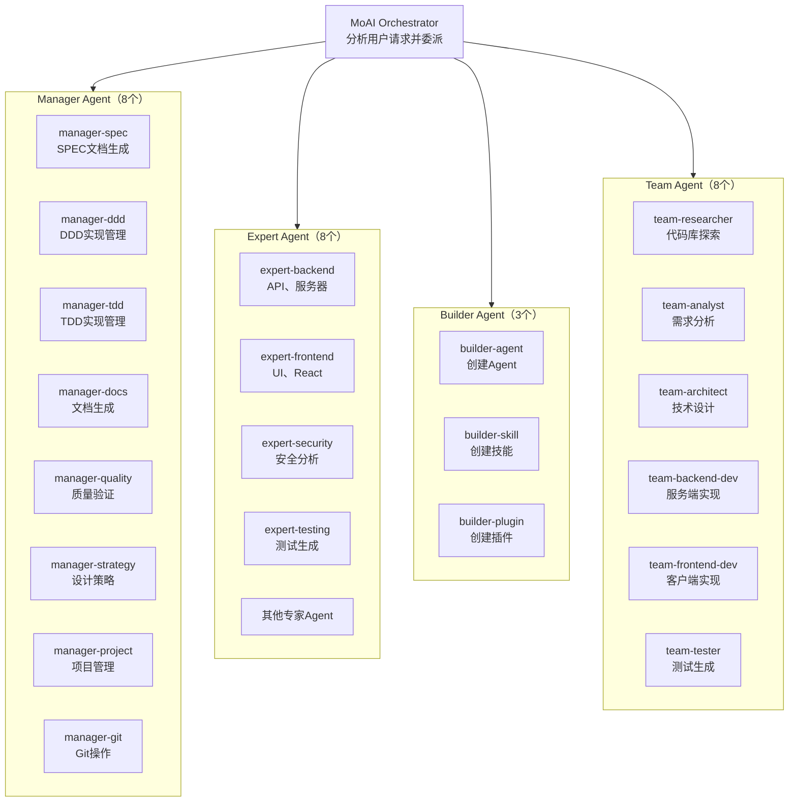
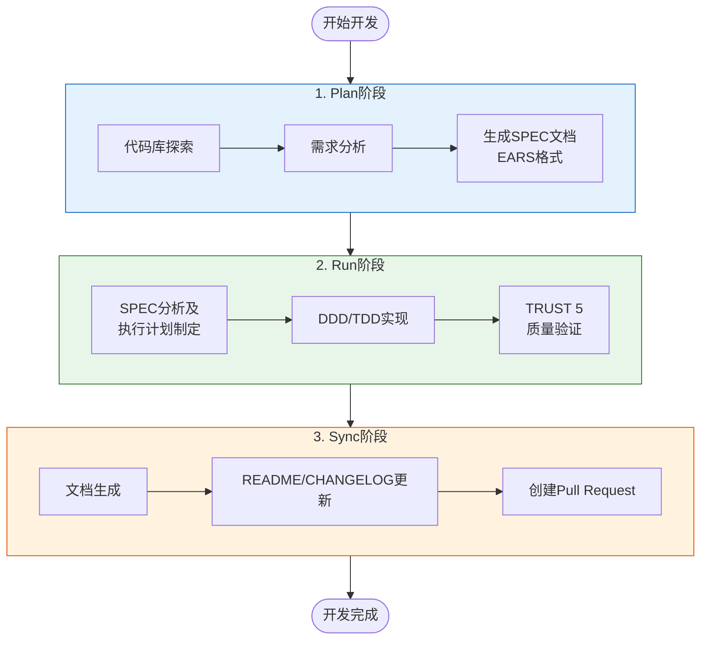
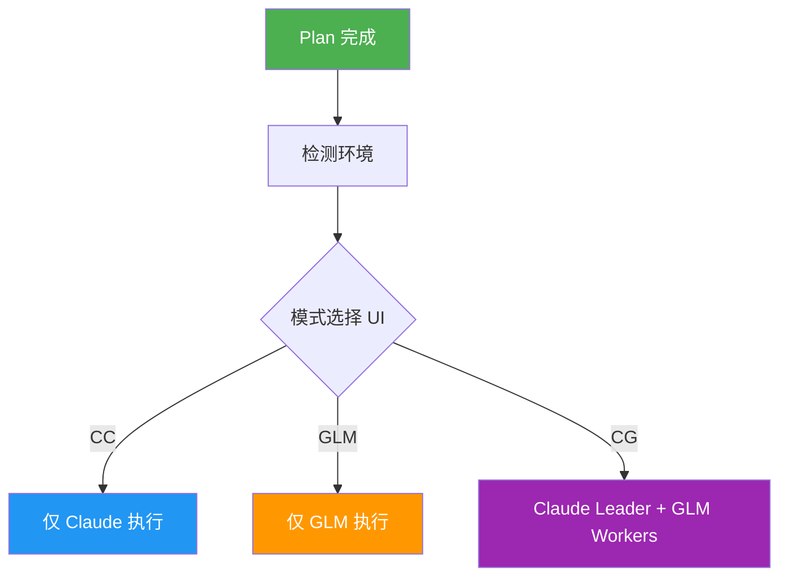
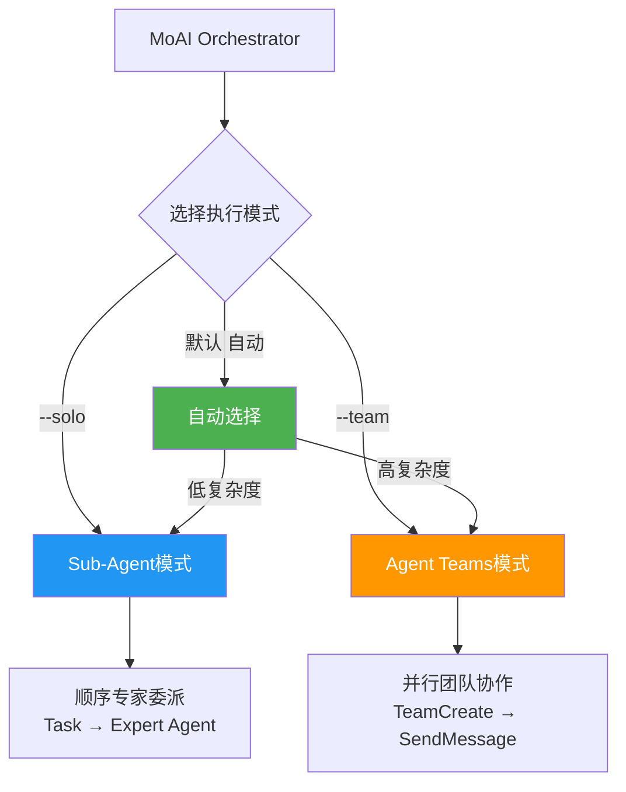

# MoAI-ADK是什么？

MoAI-ADK是为Claude Code打造的 **高性能AI开发环境**。28个专业AI Agent和52个技能协同工作，生产高质量代码。新项目和功能开发默认采用TDD，测试覆盖率低的现有项目自动采用DDD，同时支持Sub-Agent和Agent Teams双重执行模式。

使用Go语言编写的单一二进制文件 -- 无依赖，在所有平台上即可运行。


**一句话总结:** MoAI-ADK是一个"将与AI的对话记录为文档 (SPEC)，安全改进代码 (DDD/TDD)，并自动验证质量 (TRUST 5) 的"AI开发框架。


## MoAI-ADK简介

**MoAI** 意为"所有人的AI" (MoAI - Everybody's AI)。**ADK** 是Agentic Development Kit的缩写，指AI Agent主导开发过程的工具集。

MoAI-ADK是一个 **使Agent能够在Claude Code内通过交互进行Agent编码的Agentic Development Kit**。就像AI开发团队协作完成项目一样，MoAI-ADK的AI Agent在各自的专业领域执行开发工作并相互协作。

| AI开发团队 | MoAI-ADK | 职责 |
|----------|----------|------|
| 产品负责人 | 用户（开发者） | 决定构建什么 |
| 团队负责人 / Tech Lead | MoAI Orchestrator | 协调整体工作并委派给团队成员 |
| 规划师 / Spec Writer | manager-spec | 将需求整理为文档 |
| 开发者 / Engineers | expert-backend, expert-frontend | 实现实际代码 |
| QA / 代码审查员 | manager-quality | 验证质量标准 |

## 为什么选择MoAI-ADK？

### 从Python到Go的完全重写

将基于Python的MoAI-ADK (~73,000行) 用Go语言完全重写。

| 项目 | Python版 | Go版 |
|------|-------------|----------|
| 部署 | pip + venv + 依赖 | **单一二进制文件**，零依赖 |
| 启动时间 | ~800ms 解释器启动 | **~5ms** 原生执行 |
| 并发 | asyncio / threading | **原生goroutine** |
| 类型安全 | 运行时 (mypy可选) | **编译时强制** |
| 跨平台 | 需要Python运行时 | **预编译二进制文件** (macOS, Linux, Windows) |
| Hook执行 | Shell封装 + Python | **编译二进制文件**，JSON协议 |

### 核心数据

- **34,220行** Go代码，**32个** 包
- **85-100%** 测试覆盖率
- **28个** 专业AI Agent + **52个** 技能
- **18种** 编程语言支持
- **16个** Claude Code Hook事件

### Vibe Coding的问题

**Vibe Coding** 是一种与AI自然对话来编写代码的方式。你说"帮我做这个功能"，AI就生成代码。这种方式直观且快速，但在实际工作中会产生严重问题。



**实际工作中遇到的具体问题:**

| 问题 | 场景示例 | 结果 |
|------|----------|------|
| **上下文丢失** | 昨天讨论了1小时的认证方案，今天要重新解释 | 浪费时间，一致性下降 |
| **质量不一致** | AI有时生成好代码，有时生成差代码 | 代码质量不可预测 |
| **破坏现有代码** | 说"修复这部分"结果其他功能出了问题 | 产生Bug，需要回滚 |
| **重复说明** | 项目结构、编码规范每次都要重新告知 | 生产力下降 |
| **缺乏验证** | 无法确认AI生成的代码是否安全 | 安全漏洞，测试不足 |

### MoAI-ADK的解决方案

| 问题 | MoAI-ADK的解决方案 |
|------|------------------|
| 上下文丢失 | 用 **SPEC文档** 将需求永久保存为文件 |
| 质量不一致 | 用 **TRUST 5** 框架应用一致的质量标准 |
| 破坏现有代码 | 用 **DDD/TDD** 先编写测试保护现有功能 |
| 重复说明 | 用 **CLAUDE.md和技能系统** 自动加载项目上下文 |
| 缺乏验证 | 用 **LSP质量门** 自动验证代码质量 |

## 系统要求

| 平台 | 支持环境 | 备注 |
|--------|---------|------|
| macOS | Terminal, iTerm2 | 完全支持 |
| Linux | Bash, Zsh | 完全支持 |
| Windows | **WSL（推荐）**，PowerShell 7.x+ | 不支持原生cmd.exe |

**前提条件:**
- 所有平台需要安装 **Git**
- **Windows用户**: 必须安装 [Git for Windows](https://gitforwindows.org/) （包含Git Bash）
  - 推荐使用 **WSL** (Windows Subsystem for Linux) 获得最佳体验
  - PowerShell 7.x以上作为备选方案支持
  - 旧版Windows PowerShell 5.x和cmd.exe **不支持**

## 快速开始

### 1. 安装

#### macOS / Linux / WSL

```bash
curl -fsSL https://raw.githubusercontent.com/modu-ai/moai-adk/main/install.sh | bash
```

#### Windows (PowerShell 7.x+)

> **推荐**: 使用上述Linux安装命令配合WSL可获得最佳体验。

```powershell
irm https://raw.githubusercontent.com/modu-ai/moai-adk/main/install.ps1 | iex
```

> 需要先安装 [Git for Windows](https://gitforwindows.org/)。

#### 从源码构建 (Go 1.26+)

```bash
git clone https://github.com/modu-ai/moai-adk.git
cd moai-adk && make build
```

> 预编译二进制文件可从 [Releases](https://github.com/modu-ai/moai-adk/releases) 页面下载。

### 2. 项目初始化

```bash
moai init my-project
```

交互式向导会自动检测语言、框架和方法论，然后生成Claude Code集成文件。

### 3. 在Claude Code中开始开发

```bash
# 启动Claude Code后
/moai project                            # 生成项目文档 (product.md, structure.md, tech.md)
/moai plan "添加用户认证"                  # 生成SPEC文档
/moai run SPEC-AUTH-001                   # DDD/TDD实现
/moai sync SPEC-AUTH-001                  # 文档同步及PR创建
```

## 核心理念


**"Vibe Coding的目的不是快速生产力，而是代码质量。"**

MoAI-ADK不是快速生成代码的工具。目标是利用AI产出比人工编写 **更高质量** 的代码。快速只是在保证质量前提下自然而来的附带效果。


这一理念体现为三个原则:

1. **规范优先** (SPEC-First): 在编写代码之前，先用文档明确定义要构建什么
2. **安全改进** (DDD/TDD): 在保留现有代码行为的同时逐步改进
3. **自动质量验证** (TRUST 5): 用5个质量原则自动验证所有代码

## MoAI开发方法论

MoAI-ADK根据项目状态自动选择最优的开发方法论。



### TDD方法论（默认）

新项目和功能开发的默认方法论。先编写测试，然后再实现。

| 阶段 | 说明 |
|------|------|
| **RED** | 编写定义期望行为的失败测试 |
| **GREEN** | 编写通过测试的最少代码 |
| **REFACTOR** | 在保持测试通过的同时改善代码质量。REFACTOR 完成后 `/simplify` 自动运行。 |

对于棕地项目 (现有代码库)，TDD会增加一个 **pre-RED分析阶段**: 在编写测试前先阅读现有代码以理解当前行为。

### DDD方法论（现有项目，覆盖率低于10%）

用于安全重构测试覆盖率低的现有项目的方法论。

```
ANALYZE   → 分析现有代码和依赖，识别领域边界
PRESERVE  → 编写特征化测试，捕获当前行为快照
IMPROVE   → 在测试保护下逐步改进。IMPROVE 完成后 /simplify 自动运行。
```


方法论在 `moai init` 时自动选择（`--mode <ddd|tdd>`，默认: tdd），可在 `.moai/config/sections/quality.yaml` 的 `development_mode` 中修改。

**注意**: MoAI-ADK v2.5.0+使用二元方法论选择 (仅TDD或DDD)。混合模式已为了清晰性和一致性而移除。


## Harness Engineering 架构

MoAI-ADK 实现了 **Harness Engineering** 范式 — 不是直接编写代码，而是设计 AI 代理工作的环境。

| 组件 | 描述 | 命令 |
|------|------|------|
| **Self-Verify Loop** | 代理自主执行编写代码 → 测试 → 失败 → 修复 → 通过的循环 | `/moai loop` |
| **Context Map** | 代码库架构图和文档始终对代理可用 | `/moai codemaps` |
| **Session Persistence** | `progress.md` 跨会话跟踪已完成阶段；中断的运行自动恢复 | `/moai run SPEC-XXX` |
| **Failing Checklist** | 所有验收标准在运行开始时注册为待处理任务；实现完成时标记为完成 | `/moai run SPEC-XXX` |
| **Language-Agnostic** | 支持 18 种语言：自动检测语言，选择正确的 LSP/linter/测试/覆盖率工具 | 所有工作流 |
| **Garbage Collection** | 定期扫描和删除死代码、AI Slop 和未使用的 import | `/moai clean` |
| **Scaffolding First** | 实现前创建空文件存根以防止熵增 | `/moai run SPEC-XXX` |


"人类掌舵，代理执行。" — 工程师的角色从编写代码转变为设计工具链：SPEC、质量门控和反馈循环。


## 自动质量和横向扩展层

MoAI-ADK v2.6.0+ 集成了两个 MoAI **自主**调用的 Claude Code 原生技能 — 无需标志或手动命令。

| 技能 | 角色 | 触发条件 |
|------|------|---------|
| `/simplify` | 质量保证 | TDD REFACTOR 和 DDD IMPROVE 阶段完成后**始终**运行 |
| `/batch` | 横向扩展执行 | 任务复杂度超过阈值时自动触发 |

**`/simplify` — 自动质量检查**

使用并行代理审查修改后的代码，检查复用机会、质量问题、效率和 CLAUDE.md 合规性，然后自动修复发现的问题。MoAI 在每个实现周期后直接调用。

**`/batch` — 并行横向扩展**

在隔离的 git worktree 中生成数十个代理进行大规模并行工作。每个代理运行测试并报告结果；MoAI 负责合并。按工作流自动触发：

| 工作流 | 触发条件 |
|--------|---------|
| `run` | 任务 >= 5，或预计文件变更 >= 10，或独立任务 >= 3 |
| `mx` | 源文件 >= 50 |
| `coverage` | P1+P2 覆盖率缺口 >= 10 |
| `clean` | 已确认的死代码项 >= 20 |

## AI Agent编排

MoAI是 **战略编排器**。它不直接编写代码，而是将任务委派给28个专业Agent。

### Agent分类

| 分类 | 数量 | Agent | 职责 |
|------|------|---------|------|
| **Manager** | 8个 | spec, ddd, tdd, docs, quality, project, strategy, git | 工作流协调、SPEC生成、质量管理 |
| **Expert** | 8个 | backend, frontend, security, devops, performance, debug, testing, refactoring | 领域级实现、分析、优化 |
| **Builder** | 3个 | agent, skill, plugin | 创建新的MoAI组件 |
| **Team** | 8个 | researcher, analyst, architect, designer, backend-dev, frontend-dev, tester, quality | 并行团队协作开发 |



### 52个技能 (Progressive Disclosure)

通过3级Progressive Disclosure系统实现token高效管理:

| 分类 | 数量 | 示例 |
|----------|------|------|
| **Foundation** | 5 | core, claude, philosopher, quality, context |
| **Workflow** | 11 | spec, project, ddd, tdd, testing, worktree, thinking... |
| **Domain** | 5 | backend, frontend, database, uiux, data-formats |
| **Language** | 18 | Go, Python, TypeScript, Rust, Java, Kotlin, Swift, C++... |
| **Platform** | 9 | Vercel, Supabase, Firebase, Auth0, Clerk, Railway... |
| **Library** | 3 | shadcn, nextra, mermaid |
| **Tool** | 2 | ast-grep, svg |
| **Specialist** | 10 | Figma, Flutter, Pencil... |

## MoAI工作流

### Plan → Run → Sync流水线

MoAI的核心工作流由3个阶段组成:



**实际使用示例:**

```bash
# 1. Plan: 定义需求
> /moai plan "实现基于JWT的用户认证功能"

# 2. Run: 以DDD/TDD方式实现
> /moai run SPEC-AUTH-001

# 3. Sync: 生成文档及PR
> /moai sync SPEC-AUTH-001
```

### /moai子命令

所有子命令在Claude Code内以 `/moai <子命令>` 方式执行。

#### 核心工作流

| 子命令 | 别名 | 用途 | 主要标志 |
|-----------|------|------|-----------|
| `plan` | `spec` | 生成SPEC文档 (EARS格式) | `--worktree`, `--branch`, `--resume SPEC-XXX`, `--team` |
| `run` | `impl` | SPEC的DDD/TDD实现 | `--resume SPEC-XXX`, `--team` |
| `sync` | `docs`, `pr` | 文档同步、代码映射、PR创建 | `--merge`, `--skip-mx` |

#### 质量与测试

| 子命令 | 别名 | 用途 | 主要标志 |
|-----------|------|------|-----------|
| `fix` | -- | LSP错误、lint、类型错误自动修复（单次） | `--dry`, `--seq`, `--level N`, `--resume`, `--team` |
| `loop` | -- | 反复自动修复直至完成（最多100次） | `--max N`, `--auto-fix`, `--seq` |
| `review` | `code-review` | 安全性及@MX标签合规代码审查 | `--staged`, `--branch`, `--security` |
| `coverage` | `test-coverage` | 测试覆盖率分析及缺口填补（16种语言） | `--target N`, `--file PATH`, `--report` |
| `e2e` | -- | E2E测试 (Chrome, Playwright, Agent Browser) | `--record`, `--url URL`, `--journey NAME` |
| `clean` | `refactor-clean` | 死代码识别及安全移除 | `--dry`, `--safe-only`, `--file PATH` |

#### 文档与代码库

| 子命令 | 别名 | 用途 | 主要标志 |
|-----------|------|------|-----------|
| `project` | `init` | 生成项目文档 (product.md, structure.md, tech.md, codemaps/) | -- |
| `mx` | -- | 扫描代码库并添加@MX代码级注释 | `--all`, `--dry`, `--priority P1-P4`, `--force`, `--team` |
| `codemaps` | `update-codemaps` | 生成架构文档 | `--force`, `--area AREA` |
| `feedback` | `fb`, `bug`, `issue` | 收集反馈并创建GitHub Issue | -- |

#### 默认工作流

| 子命令 | 用途 | 主要标志 |
|-----------|------|-----------|
| *（无）* | 完整自律plan → run → sync流水线。复杂度评分 >= 5时自动生成SPEC。 | `--loop`, `--max N`, `--branch`, `--pr`, `--resume SPEC-XXX`, `--team`, `--solo` |

### 执行模式标志

控制Agent在工作流执行中如何分配:

| 标志 | 模式 | 说明 |
|-------|------|------|
| `--team` | Agent Teams | 并行团队协作执行。多个Agent同时工作。 |
| `--solo` | Sub-Agent | 按阶段单Agent顺序委派。 |
| *（默认）* | 自动 | 基于复杂度自动选择（域 >= 3，文件 >= 10，评分 >= 7）。 |

**`--team` 支持3种执行环境:**

| 环境 | 命令 | Leader | Workers | 适用场景 |
|------|--------|--------|---------|-----------|
| 纯Claude | `moai cc` | Claude | Claude | 最高质量 |
| 纯GLM | `moai glm` | GLM | GLM | 最大成本节省 |
| CG (Claude+GLM) | `moai cg` | Claude | GLM | 质量+成本平衡 |


**注意**: `moai cg` 使用tmux会话级环境变量隔离来分离Claude Leader和GLM Workers。从 `moai glm` 切换时，`moai cg` 会自动初始化GLM设置。


### 执行模式选择门控

从 Plan 阶段过渡到 Run 阶段时，MoAI 自动检测当前执行环境 (cc/glm/cg) 并显示选择 UI，供用户在实现开始前确认或更改模式。



此门控确保无论环境状态如何，都使用正确的执行模式，防止实现过程中出现模式不匹配。

### 自律开发循环 (Ralph Engine)

结合LSP诊断和AST-grep的自律错误修复引擎:

```bash
/moai fix       # 单次: 扫描 → 分类 → 修复 → 验证
/moai loop      # 反复修复: 循环直到检测到完成标记（最多100次）
```

**Ralph Engine工作方式:**
1. **并行扫描**: 同时运行LSP诊断 + AST-grep + linter
2. **自动分类**: 从级别1（自动修复）到级别4（用户介入）对错误分类
3. **收敛检测**: 相同错误反复出现时应用替代策略
4. **完成标准**: 0错误，0类型错误，85%+覆盖率

### 推荐工作流链

**新功能开发:**
```
/moai plan → /moai run SPEC-XXX → /moai sync SPEC-XXX
```

**Bug修复:**
```
/moai fix（或 /moai loop）→ /moai review → /moai sync
```

**重构:**
```
/moai plan → /moai clean → /moai run SPEC-XXX → /moai review → /moai coverage → /moai codemaps
```

**文档更新:**
```
/moai codemaps → /moai sync
```

## TRUST 5质量框架

所有代码变更都通过5个质量标准进行验证:

| 标准 | 含义 | 验证内容 |
|------|------|----------|
| **T**ested | 已测试 | 85%+覆盖率，特征化测试，单元测试通过 |
| **R**eadable | 易读 | 清晰的命名规范，一致的代码风格，0 lint错误 |
| **U**nified | 统一 | 一致的格式化，import排序，遵循项目结构 |
| **S**ecured | 安全 | OWASP合规，输入验证，0安全警告 |
| **T**rackable | 可追踪 | Conventional Commits，Issue引用，结构化日志 |

## @MX标签系统

MoAI-ADK使用 **@MX代码级注释系统** 在AI Agent之间传递上下文、不变量和危险区域。

| 标签类型 | 用途 | 添加时机 |
|----------|------|----------|
| `@MX:ANCHOR` | 重要契约 | fan_in >= 3的函数，变更时影响范围广 |
| `@MX:WARN` | 危险区域 | goroutine，复杂度 >= 15，全局状态变更 |
| `@MX:NOTE` | 上下文传递 | 魔法常量，缺少文档，业务规则 |
| `@MX:TODO` | 未完成工作 | 缺少测试，未实现功能 |

@MX标签系统的设计目标是 **只标记最危险和最重要的代码**。大部分代码不需要标签，这是正常的设计。

```bash
# 扫描整个代码库
/moai mx --all

# 预览（不修改文件）
/moai mx --dry

# 按优先级扫描
/moai mx --priority P1
```

## 模型策略 (Token优化)

MoAI-ADK根据Claude Code订阅套餐为28个Agent分配最优AI模型。在套餐的使用限制内最大化质量。

| 策略 | 套餐 | 🟣 Opus | 🔵 Sonnet | 🟡 Haiku | 用途 |
|------|--------|------|--------|-------|------|
| **High** | Max $200/月 | 23 | 1 | 4 | 最高质量，最大吞吐量 |
| **Medium** | Max $100/月 | 4 | 19 | 5 | 质量与成本平衡 |
| **Low** | Plus $20/月 | 0 | 12 | 16 | 经济型，不含Opus |

### 配置方法

```bash
# 项目初始化时
moai init my-project          # 在交互式向导中选择模型策略

# 重新配置现有项目
moai update                   # 各设置步骤的交互式提示
```


默认策略为 `High`。GLM设置隔离在 `settings.local.json` 中（不会提交到Git）。


## 双重执行模式

MoAI-ADK提供Claude Code支持的 **Sub-Agent** 和 **Agent Teams** 两种执行模式。



### Agent Teams模式（默认）

MoAI-ADK自动分析项目复杂度来选择最优执行模式:

| 条件 | 选择模式 | 原因 |
|------|-----------|------|
| 域 >= 3个 | Agent Teams | 多域协调 |
| 影响文件 >= 10个 | Agent Teams | 大规模变更 |
| 复杂度评分 >= 7 | Agent Teams | 高复杂度 |
| 其他 | Sub-Agent | 简单可预测的工作流 |

**Agent Teams模式** 使用并行团队协作开发:

- 多个Agent同时工作，通过共享任务列表协作
- 通过 `TeamCreate`、`SendMessage`、`TaskList` 进行实时协调
- 适用于大规模功能开发、多域任务

```bash
/moai plan "大规模功能"          # 自动: researcher + analyst + architect并行
/moai run SPEC-XXX                # 自动: backend-dev + frontend-dev + tester并行
/moai run SPEC-XXX --team         # 强制Agent Teams模式
```


**Agent Teams质量Hook:**

- **TeammateIdle Hook**: 团队成员进入待机状态前验证LSP质量门（错误、类型错误、lint错误）
- **TaskCompleted Hook**: 任务引用SPEC-XXX模式时确认SPEC文档存在
- 所有验证使用优雅降级 - 警告会记录日志但工作继续进行


### CG模式 (Claude + GLM混合)

CG模式是Leader使用 **Claude API**、Workers使用 **GLM API** 的混合模式。通过tmux会话级环境变量隔离实现。

```
┌─────────────────────────────────────────────────────────────┐
│  LEADER（当前tmux窗格，Claude API）                           │
│  - /moai --team 执行时进行工作流编排                          │
│  - 处理plan、quality、sync阶段                               │
│  - 无GLM环境 → 使用Claude API                                │
└──────────────────────┬──────────────────────────────────────┘
                       │ Agent Teams（新tmux窗格）
                       ▼
┌─────────────────────────────────────────────────────────────┐
│  TEAMMATES（新tmux窗格，GLM API）                             │
│  - 继承tmux会话环境 → 使用GLM API                             │
│  - 在run阶段执行实现任务                                      │
│  - 通过SendMessage与Leader通信                                │
└─────────────────────────────────────────────────────────────┘
```

```bash
# 1. 保存GLM API密钥（只需一次）
moai glm sk-your-glm-api-key

# 2. 激活CG模式
moai cg

# 3. 在同一窗格中启动Claude Code（重要！）
claude

# 4. 执行团队工作流
/moai --team "任务描述"
```


**v2.7.1 变更**: CG 模式现在是**默认**团队模式。使用 `--team` 时，除非通过 `moai cc` 或 `moai glm` 明确更改，否则以 CG 模式运行。

`moai cg` 使用 tmux 会话级环境变量隔离来分离 Claude Leader 和 GLM Workers。从 `moai glm` 切换时，`moai cg` 会自动重置 GLM 设置。


| 命令 | Leader | Workers | 需要tmux | 成本节省 | 使用场景 |
|--------|--------|---------|----------|----------|----------|
| `moai cc` | Claude | Claude | 否 | - | 复杂任务，最高质量 |
| `moai glm` | GLM | GLM | 推荐 | ~70% | 成本优化 |
| `moai cg` | Claude | GLM | **必须** | **~60%** | 质量+成本平衡 |

### Sub-Agent模式 (`--solo`)

使用现有Claude Code的 `Task()` API进行顺序Agent委派。

- 将任务委派给一个专业Agent并接收结果
- 按Manager → Expert → Quality顺序逐步推进
- 适用于简单可预测的工作流

```bash
/moai run SPEC-AUTH-001 --solo    # 强制Sub-Agent模式
```

## CLI命令

| 命令 | 说明 |
|--------|------|
| `moai init` | 交互式项目设置（自动检测语言/框架/方法论） |
| `moai doctor` | 系统状态诊断及环境确认 |
| `moai status` | Git分支、质量指标等项目状态摘要 |
| `moai update` | 更新到最新版本（支持自动回滚） |
| `moai update --check` | 不安装仅检查更新 |
| `moai update --project` | 仅同步项目模板 |
| `moai worktree new <name>` | 创建新Git worktree（并行分支开发） |
| `moai worktree list` | 活跃worktree列表 |
| `moai worktree switch <name>` | 切换worktree |
| `moai worktree sync` | 与上游同步 |
| `moai worktree remove <name>` | 移除worktree |
| `moai worktree clean` | 清理过期worktree |
| `moai worktree go <name>` | 在当前shell中跳转到worktree目录 |
| `moai hook <event>` | Claude Code Hook调度器 |
| `moai glm` | 使用GLM API启动Claude Code（低成本替代方案） |
| `moai cc` | 不使用GLM设置启动Claude Code（纯Claude模式） |
| `moai cg` | 激活CG模式 -- Claude Leader + GLM Workers（tmux窗格级隔离） |
| `moai version` | 显示版本号、commit hash、构建日期 |

## Task指标日志

MoAI-ADK在开发会话期间自动捕获Task工具指标:

- **位置**: `.moai/logs/task-metrics.jsonl`
- **捕获指标**: Token使用量、工具调用、耗时、Agent类型
- **目的**: 会话分析、性能优化、成本追踪

Task工具完成时，PostToolUse Hook会记录指标。利用这些数据来分析Agent效率并优化Token消耗。

## 项目结构

安装MoAI-ADK后，项目中将生成以下结构。

```
my-project/
├── CLAUDE.md                  # MoAI的执行指令书
├── .claude/
│   ├── agents/moai/           # 28个AI Agent定义
│   ├── skills/moai-*/         # 52个技能模块
│   ├── hooks/moai/            # 自动化Hook脚本
│   └── rules/moai/            # 编码规则和标准
└── .moai/
    ├── config/                # MoAI配置文件
    │   └── sections/
    │       └── quality.yaml   # TRUST 5质量设置
    ├── specs/                 # SPEC文档存储
    │   └── SPEC-XXX/
    │       └── spec.md
    └── memory/                # 跨会话上下文保持
```

**主要文件说明:**

| 文件/目录 | 作用 |
|--------------|------|
| `CLAUDE.md` | MoAI读取的执行指令书。包含项目规则、Agent目录、工作流定义 |
| `.claude/agents/` | 定义每个Agent的专业领域和工具权限 |
| `.claude/skills/` | 包含编程语言、平台最佳实践的知识模块 |
| `.moai/specs/` | SPEC文档存储位置。每个功能有独立目录 |
| `.moai/config/` | 管理TRUST 5质量标准、DDD/TDD设置等项目配置 |

## 多语言支持

MoAI-ADK支持4种语言。用户用中文请求时用中文回复，用英文请求时用英文回复。

| 语言 | 代码 | 支持范围 |
|------|------|----------|
| 韩语 | ko | 对话、文档、命令、错误消息 |
| 英语 | en | 对话、文档、命令、错误消息 |
| 日语 | ja | 对话、文档、命令、错误消息 |
| 中文 | zh | 对话、文档、命令、错误消息 |


**语言设置:** 在 `.moai/config/sections/language.yaml` 中可以分别设置对话语言、代码注释语言和提交消息语言。例如，可以用中文对话，同时用英文编写代码注释和提交消息。


## 下一步

如果您已经了解了MoAI-ADK的全貌，现在可以深入了解各个核心概念了。

- [基于SPEC的开发](/core-concepts/spec-based-dev) -- 了解如何将需求定义为文档
- [领域驱动开发](/core-concepts/ddd) -- 了解如何安全改进现有代码
- [TRUST 5质量](/core-concepts/trust-5) -- 了解如何自动验证代码质量
- [MoAI Memory](/core-concepts/moai-memory) -- 了解跨会话上下文如何保留
